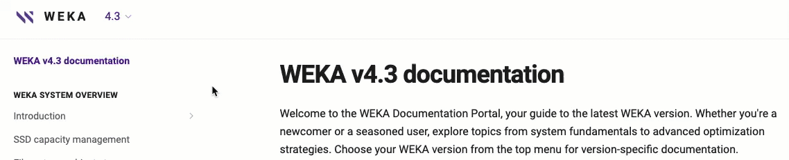

# WEKA v4.3 documentation

Welcome to the WEKA Documentation Portal, your guide to the latest WEKA version. Whether you're a newcomer or a seasoned user, explore topics from system fundamentals to advanced optimization strategies. Choose your WEKA version from the top menu for version-specific documentation.

<figure><figcaption>
WEKA version selector
</figcaption></figure>


**Important:** This documentation applies to the WEKA system's **latest minor version** (4.3.**X**). For information on new features and supported prerequisites released with each minor version, refer to the relevant release notes available at [get.weka.io](https://get.weka.io/).

Check the release notes for details about any updates or changes accompanying the latest releases.


### Meet Sevii, your AI chat companion!

Navigating through extensive documentation can sometimes feel like a maze, right? Well, not anymore! We’re thrilled to introduce Sevii, your AI-powered chat companion, designed to help you explore the WEKA documentation easily.

Sevii is always at your service, just a click away. Type your question and click  to embark on your knowledge journey.

To ensure you have a seamless experience with Sevii, here are some handy tips:

* **Clarity is key**: The more specific your question is, the better Sevii can assist you with the most relevant answer.
* **Concept power**: Need help figuring out how to frame your question? Start with concepts related to your query, and let Sevii guide you in refining your search.
* **Explore and discover**: Sevii may suggest multiple answers or ask follow-up questions during your chat. Using information from previous Sevii responses, more accurate follow-up questions can be made.



## About WEKA documentation

This portal encompasses all documentation essential for comprehending and operating the WEKA system. It covers a range of topics:

**WEKA system overview:** Delve into the fundamental components, principles, and entities constituting the WEKA system.

**Planning and installation:** Discover prerequisites, compatibility details, and installation procedures for WEKA clusters on bare metal, AWS, GCP, and Azure environments.

**Getting started with WEKA:** Initiate your WEKA journey by learning the basics of managing a WEKA filesystem through the GUI and CLI, executing initial IOs, and exploring the WEKA REST API.

**Performance:** Explore the results of FIO performance tests on the WEKA filesystem, ensuring optimal system performance.

**WEKA filesystems & object stores:** Understand the role and management of filesystems, object stores, filesystem groups, and key-management systems within WEKA configurations.

**Additional protocols:** Learn about the supported protocols—NFS, SMB, and S3—for accessing data stored in a WEKA filesystem.

**Operation guide:** Navigate through various WEKA system operations, including events, statistics, user management, upgrades, expansion, and more.

**Licensing:** Gain insights into WEKA system licensing options. How to obtain a classic WEKA license and apply it to the WEKA cluster.

**Monitor the WEKA cluster:** Deploy the WEKA Management Server (WMS) alongside tools like Local WEKA Home, WEKAmon, and SnapTool to effectively monitor your WEKA cluster.

**WEKA support:** Find guidance on obtaining support for the WEKA system and effectively managing diagnostics.

**Best practice guides:** Explore our carefully selected guides, starting with WEKA and Slurm integration, to discover expert-recommended strategies and insights for optimizing your WEKA system and achieving peak performance in various scenarios.

**WEKApod:** Explore the WEKApod Data Platform Appliance Guide for step-by-step instructions on setting up and configuring the WEKApod™. This turnkey solution, designed for NVIDIA DGX SuperPOD, features pre-configured storage and software for quick deployment and faster value.

**Appendices:** Explore the Appendices for various topics, including the WEKA CSI Plugin, which connects Kubernetes worker nodes to the WEKA data platform, and other tools and procedures that can enhance your work with WEKA.


For maintenance and troubleshooting articles, search the WEKA Knowledge Base in the [WEKA support portal](https://support.weka.io/s/) or contact the [Customer Success Team](support/getting-support-for-your-weka-system.md#contacting-weka-technical-support-team).


## Conventions

* The documentation marks the CLI mandatory parameters with an asterisk (\*).
* New additions in V4.3 are marked with two asterisks (\*\*) in the [weka-rest-api-and-equivalent-cli-commands.md](getting-started-with-weka/weka-rest-api-and-equivalent-cli-commands.md "mention") and  [weka-cli-hierarchy.md](getting-started-with-weka/manage-the-system-using-weka-cli/weka-cli-hierarchy.md "mention") topics.

## Documentation feedback

We are committed to delivering top-notch documentation and value your feedback. If you have comments or suggestions, email us at [documentation@weka.io](mailto:documentation@weka.io). When providing feedback, include the document version, topic title, and your suggestions for improvement. For technical questions, contact our [Customer Success Team](support/getting-support-for-your-weka-system.md).
