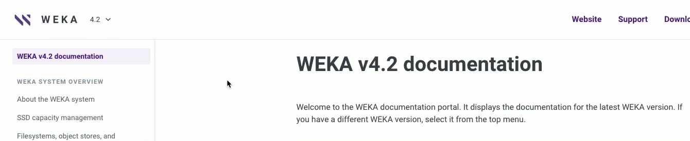

# WEKA v4.2 documentation

Welcome to the WEKA documentation portal. It displays the documentation for the latest WEKA version. If you have a different WEKA version, select it from the top menu.

<figure><figcaption>
WEKA version selector
</figcaption></figure>

## About WEKA documentation

This portal contains all the documentation necessary for understanding and working with the WEKA system. It covers the following topics:

**WEKA system overview:** Introduction of the primary components, principles, and entities that form the WEKA system.

**Planning and installation:** Prerequisites and compatibility details, WEKA cluster installation on bare metal, AWS, GCP, and Azure environments.

**Getting started with WEKA:** The first steps to managing a WEKA filesystem using the GUI and CLI, running the first IOs with the WEKA filesystem, and getting started with the WEKA REST API.

**Performance:** Results of the FIO performance tests on the WEKA filesystem.

**WEKA filesystems & object stores:** Role and management of filesystems, object stores, filesystem groups, and key-management systems in Weka system configurations.

**Additional protocols:** The supported protocols NFS, SMB, and S3 for accessing data stored in a WEKA filesystem.

**Operation guide:** WEKA system's various operations, such as events, statistics, user management, upgrades, expansion, and more.

**Billing & licensing:** WEKA system licensing and billing alternatives.

**Monitor the WEKA cluster:** Deploy the WEKA Management Server (WMS) with Local WEKA Home, WEKAmon, and SnapTool monitoring tools.

**WEKA support:** Getting support for the WEKA system and diagnostics management.


For maintenance and troubleshooting articles, search the WEKA Knowledge Base in the [WEKA support portal](https://support.weka.io/s/) or contact the [Customer Success Team](support/getting-support-for-your-weka-system.md#contacting-weka-technical-support-team).


## Conventions

The CLI mandatory parameters are marked with an asterisk (\*) throughout the documentation.

## Documentation feedback

We strive to produce the highest-quality documentation products and welcome your feedback. If you have comments or suggestions about our documentation, email us.

With your feedback, include the following information:

* Document version and title of the topic
* Your suggestion for correcting or improving the documentation

Send your messages to [documentation@weka.io](mailto:documentation@weka.io).

The email address is only for documentation feedback. If you have a technical question, contact the [Customer Success Team](support/getting-support-for-your-weka-system.md).
