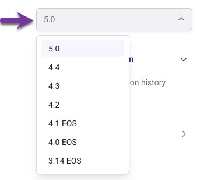

# NeuralMesh™ by WEKA documentation

Welcome to the NeuralMesh documentation portal, your comprehensive guide to the latest version of NeuralMesh by WEKA. Whether you're a newcomer or a seasoned user, explore topics from system fundamentals to advanced optimization strategies for AI and data-intensive workloads.


**Important:** This documentation applies to the **latest minor version** (5.1.**X**). For information on new features and supported prerequisites released with each minor version, refer to the relevant release notes available at [get.weka.io](https://get.weka.io/).

Check the release notes for details about any updates or changes accompanying the latest releases.


Select your version from the dropdown menu located at the top of the left-hand navigation bar.&#x20;

<figure><figcaption></figcaption></figure>

## **Get answers from NeuralMesh documentation with Sevii AI**

Sevii AI quickly delivers answers from NeuralMesh documentation. Type your question and click .\
For the best results, ask clear, context-rich questions.




Sevii AI-powered assistant, is built into the documentation to support your search experience. However, it might provide inaccurate information. Always use the **Ask or search** options at the top right to find and verify answers directly from the source.


## About NeuralMesh documentation

This portal encompasses all documentation essential for comprehending and operating NeuralMesh, the software-only, high-performance, container-native storage system built for AI and data-intensive workloads at scale. It covers a range of topics:

**System overview:** Delve into the fundamental components, principles, and architectural elements constituting NeuralMesh, including the Core, Accelerate, Deploy, Enterprise Services, and Observe components that work in unison to power demanding AI pipelines.

**Planning and installation:** Discover prerequisites, compatibility details, and installation procedures for NeuralMesh clusters on bare metal, AWS, GCP, Azure, and Oracle Cloud environments.

**NeuralMesh Axon:** Learn about NeuralMesh Axon converged deployment and maintenance.

**Getting started with NeuralMesh:** Initiate your NeuralMesh journey by learning the basics of managing file systems through the GUI and CLI, executing initial IOs, and exploring the REST API.

**Performance:** Explore the results of FIO performance tests on the NeuralMesh filesystem, ensuring optimal system performance for AI training, inference, and data-intensive workloads.

**Filesystems & object stores:** Understand the role and management of file systems, object stores, file system groups, and key-management systems within NeuralMesh configurations. Learn about integrated tiering and the single namespace architecture.

**Additional protocols:** Learn about the supported protocols—NFS, SMB, and S3—for accessing data stored in a WEKA filesystem.

**Operation guide:** Navigate through various system operations, including events, statistics, user management, upgrades, expansion, and more.

**Licensing:** Gain insights into the system licensing options.

**Monitor the cluster:** Deploy the WEKA Management Server (WMS) alongside tools like Local WEKA Home, WEKAmon, and SnapTool to effectively monitor your WEKA cluster.

**Kubernetes**: The Kubernetes guides cover deploying and managing the WEKA Data Platform. Learn how to use the WEKA Operator for high-performance storage deployment and handle day-2 operations including scaling, hardware management, and performance optimization.

**WEKApod:** Explore the WEKApod Data Platform Appliance Guide for step-by-step instructions on setting up and configuring the WEKApod™. This turnkey solution, designed for NVIDIA DGX SuperPOD, features pre-configured storage and software for quick deployment and faster value.

**AWS solutions**: Learn how to integrate the system with Amazon SageMaker HyperPod to enable high-performance distributed training of large language and foundation models. Explore best practices for configuring storage, optimizing performance, and scaling machine learning workloads in AWS environments.

**Azure solutions**: Learn how to integrate the system with Azure CycleCloud and SLURM scheduler for streamlined HPC cluster management. Learn configuration steps, performance optimization, and architectural patterns for running AI, machine learning, and analytics workloads at scale in Azure environments.

**Best practice guides:** Explore our carefully selected guides, starting with WEKA and Slurm integration, to discover expert-recommended strategies and insights for optimizing your system and achieving peak performance in various scenarios.

**Support:** Find guidance on obtaining support for the system and effectively managing diagnostics.

**Appendices:** Explore the Appendices for various topics, including the CSI Plugin, which connects Kubernetes worker nodes to NeuralMesh, and other tools and procedures that can enhance your work with the system.


For maintenance and troubleshooting articles, search the WEKA Knowledge Base in the [WEKA support portal](https://support.weka.io/s/) or contact the [Customer Success Team](support/getting-support-for-your-weka-system.md#contacting-weka-technical-support-team).


### Conventions

* The documentation marks the CLI mandatory parameters with an asterisk (\*).
* New additions are marked with two asterisks (\*\*) in the relevant topics.

### Documentation feedback

We welcome your feedback to improve our documentation. Include the document version and topic title with your suggestions and email them to [documentation@weka.io](mailto:documentation@weka.io). For technical inquiries, contact our [Customer Success Team](support/getting-support-for-your-weka-system.md). Thank you for helping us maintain high-quality resources.
