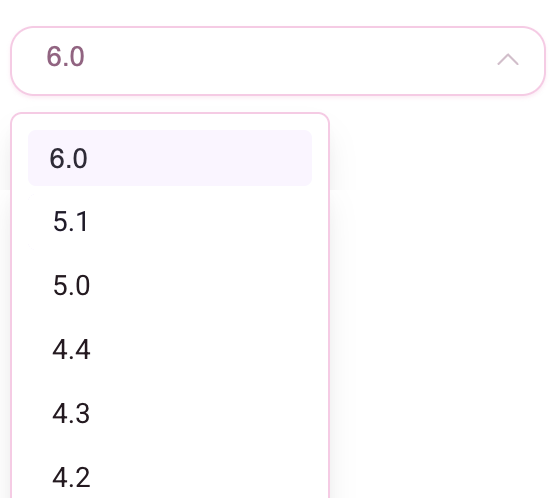

# NeuralMesh™ by WEKA documentation

Welcome to the NeuralMesh documentation portal, your guide to the latest version of NeuralMesh by WEKA. Whether you are new to the product or an experienced user, explore topics from system fundamentals to advanced optimization for AI and data-intensive workloads. NeuralMesh introduces a deployment approach built on the WEKA data platform, so references to WEKA in this documentation denote the underlying software components and interfaces. Core functionality, APIs, and packages remain consistent.

This documentation covers the latest revision, 6.0.**X**. For the features and supported prerequisites released with each minor version, see the release notes at [get.weka.io](https://get.weka.io/). To read the documentation for another version, select it from the dropdown at the top of the left navigation bar.

<figure><figcaption></figcaption></figure>

## Get answers from Ask AI

Use the built-in **Ask AI** feature to get answers directly from the documentation. Select **Ask or search** at the top right of any page, type your question, and Ask AI returns a detailed answer based on the documentation content.

Each answer includes:

* **Follow-up questions** to help you explore related topics.
* **Source links** at the bottom of the answer panel, pointing to the documentation pages used to generate the response.

Ask clear, specific questions for the best results. Ask AI can return inaccurate information, so follow the source links to verify each answer.

See how it works



## About NeuralMesh documentation

NeuralMesh is a software-only, container-native storage system built for AI and data-intensive workloads at scale. This portal covers everything you need to understand and operate it.

**System overview:** Learn the components, principles, and architecture behind NeuralMesh, including the Core, Accelerate, Deploy, Enterprise Services, and Observe components that power AI pipelines.

**Planning and installation:** Review the prerequisites and compatibility, then follow the installation procedures for clusters on bare metal, AWS, Azure, GCP, and Oracle Cloud.

**NeuralMesh Axon:** Deploy and maintain NeuralMesh Axon in a converged configuration.

**WEKA App Store:** Install the App Store and the WEKA AI Data Platform.

**Getting started with NeuralMesh:** Manage the cluster with the new `weka` CLI, the GUI, and the REST API, and run a first IO sanity check. The CLI reference guide documents every command group.

**Performance:** Review the FIO and MDTest results for the filesystem, and the procedures used to produce them.

**Filesystems & object stores:** Manage filesystems, object stores, filesystem groups, and key management systems. Learn about integrated tiering, the single namespace, Snap-to-Object, asynchronous replication between clusters, and the data catalog for indexing and querying filesystem metadata at scale.

**Additional protocols:** Access stored data through the supported protocols: NFS, SMB, and S3.

**Security:** Configure the supported security features to protect sensitive data, meet regulatory requirements, and reduce the risk of unauthorized access.

**Licensing:** Understand the licensing options and how to apply them.

**Operation guide:** Run day-to-day operations, including events, statistics, user management, multi-tenancy, quotas, background tasks, upgrades, and expansion.

**Monitor the cluster:** Use NeuralMesh Observe to validate performance, monitor health, plan capacity, and troubleshoot across your clusters. Local WEKA Home collects telemetry from clusters and clients to support troubleshooting.

**Kubernetes:** Deploy and manage the cluster on Kubernetes with the WEKA Operator, including day-2 operations such as scaling, hardware maintenance, and performance tuning.

**WEKApod:** Set up and configure the WEKApod™ Data Platform Appliance, a turnkey solution for NVIDIA DGX SuperPOD with pre-configured storage and software.

**AWS solutions:** Integrate with Amazon SageMaker HyperPod for distributed training of large language and foundation models, with guidance on storage configuration, performance, and scaling.

**Azure solutions:** Integrate with Azure CycleCloud and the Slurm scheduler for HPC cluster management, including configuration, performance tuning, and architectural patterns.

**Best practice guides:** Apply expert-recommended strategies for specific scenarios, starting with Slurm integration.

**Support:** Get support and manage diagnostics, traces, and protocol debug levels.

**Appendices:** Find additional topics, including the CSI Plugin that connects Kubernetes worker nodes to NeuralMesh.

### Where to get help

* For maintenance and troubleshooting articles, search the WEKA Knowledge Base in the [WEKA support portal](https://support.weka.io/s/).
* For technical assistance, contact the [Customer Success Team](support/getting-support-for-your-weka-system.md#contacting-weka-technical-support-team).
* For product training and certification, see [Register for WEKAdemy](support/register-for-wekademy.md).

### Conventions

* The documentation marks the CLI mandatory parameters with an asterisk (\*).
* New additions are marked with two asterisks (\*\*) in the relevant topics.

### Documentation feedback

We welcome your feedback to improve our documentation. Include the document version and topic title with your suggestions and email them to [documentation@weka.io](mailto:documentation@weka.io). For technical inquiries, contact our [Customer Success Team](support/getting-support-for-your-weka-system.md). Thank you for helping us maintain high-quality resources.
