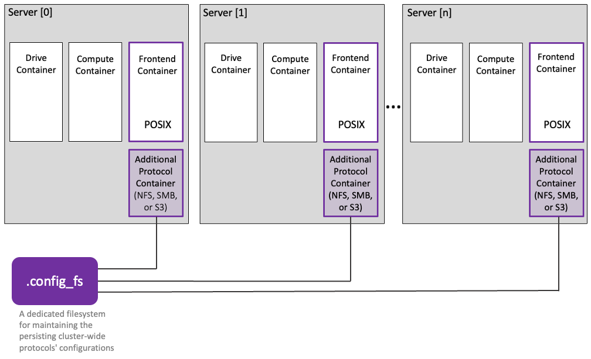

# Additional protocols overview

A WEKA cluster provides, by default, the POSIX protocol (Portable Operating System Interface) by the frontend container. You can create one additional protocol container, NFS, SMB, or S3, for each server in the cluster beside the existing frontend container with the POSIX protocol. &#x20;

<figure><figcaption>
Additional protocols to POSIX
</figcaption></figure>

To learn about the additional protocols, refer to the following sections.
