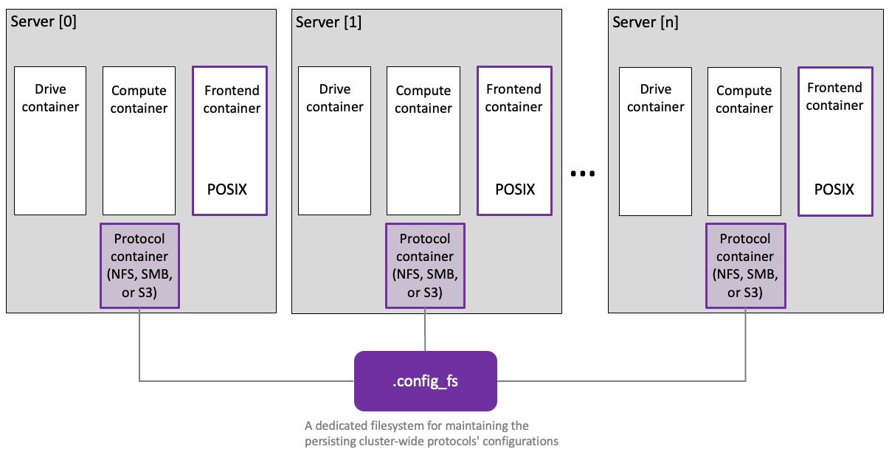
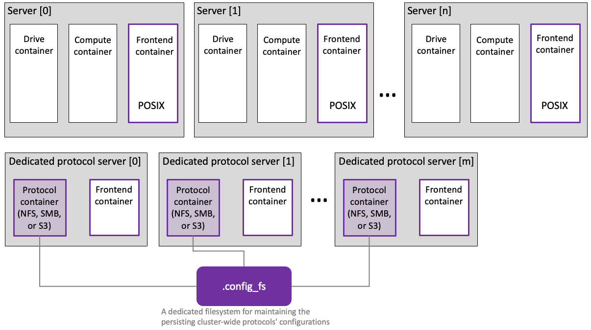

# Additional protocol containers

In a WEKA cluster, the frontend container provides the default POSIX protocol, serving as the primary access point for the distributed filesystem. You can also define protocol containers for NFS, SMB, and S3 clients.

To configure protocol containers, you have two options for creating a cluster for the specified protocol:

1. Set up protocol services on existing backend servers.
2. Prepare additional dedicated servers for the protocol containers.


In cloud environments, setting up protocol services on existing backend servers (option 1) is not supported. Instead, use option 2 and prepare additional dedicated servers (protocol gateways) when creating the `main.tf` file.

For more details, refer to the relevant deployment section:

* [deployment-on-aws-using-terraform.md](../install/aws/weka-installation-on-aws-using-terraform/deployment-on-aws-using-terraform.md "mention")
* [deployment-on-azure-using-terraform.md](../install/weka-installation-on-azure/deployment-on-azure-using-terraform.md "mention")
* [deployment-on-gcp-using-terraform.md](../install/weka-installation-on-gcp/deployment-on-gcp-using-terraform.md "mention")


### Dedicated filesystem requirement for cluster-wide persistent protocol configurations

It is required to have a dedicated filesystem that stores persistent protocol configurations. This filesystem is essential for coordinating coherent simultaneous access to files from multiple servers. It is advisable to assign a meaningful name to this configuration filesystem, such as `.config_fs`. Set the total capacity to 100 GB and avoid additional options like tiering and thin-provisioning.

<details>

<summary>.config_fs setting example</summary>


**Related topic**

[#create-a-filesystem](../fs/managing-filesystems/managing-filesystems.md#create-a-filesystem "mention") (using the GUI)

[#create-a-filesystem](../fs/managing-filesystems/managing-filesystems-1.md#create-a-filesystem "mention") (using the CLI)

</details>

## **Set up protocol containers** on existing backend servers

With this option, you configure the existing cluster to provide the required protocol containers. The following topics guide you through the configuration for each protocol:

* [nfs-support](nfs-support/ "mention")
* [s3](s3/ "mention")
* [smb-support](smb-support/ "mention")

<figure><figcaption><p>Protocol containers using existing backend servers</p></figcaption></figure>

## **Prepare dedicated protocol servers**

Using dedicated protocol servers enhances the cluster's capabilities and addresses diverse use cases. Each dedicated protocol server in the cluster can host one of these additional protocol containers alongside the existing frontend container.

These dedicated protocol servers function as complete and permanent members of the WEKA cluster. They run essential processes to access WEKA filesystems and incorporate switches supporting the protocols.

Dedicated protocol servers offer the following advantages:

* **Optimized performance:** Leverage dedicated CPU resources for tailored and efficient performance, optimizing overall resource usage.
* **Independent protocol scaling:** Scale specific protocols independently, mitigating resource contention and ensuring consistent performance across the cluster.

<figure><figcaption><p>Protocol containers in dedicated servers</p></figcaption></figure>

**Procedure**

1. **Install the WEKA software on the dedicated protocol servers:** Do one of the following:
   * Follow the default method as specified in [manually-install-os-and-weka-on-servers.md](../install/bare-metal/manually-install-os-and-weka-on-servers.md "mention").
   *   Use the WEKA agent to install from a working backend. The following commands  demonstrate this method:

       ```bash
       curl http://<EXISTING-BACKEND-IP>:14000/dist/v1/install | sudo sh   # Install the agent
       sudo weka version get 4.2.7.64                                      # Get the full software
       sudo weka version set 4.2.7.64                                      # Set a default version
       ```
2.  **Create the WEKA container for running protocols:** The dedicated protocol servers must be flagged as permanent members of the WEKA cluster that can execute protocols. Although a backend typically fulfills this role, you can create containers on protocol servers with specified options using the following command example:\


    
    ```bash
    sudo weka local setup container --name frontend0 --only-frontend-cores --cores 1 --join-ips <EXISTING-BACKEND-IP> --allow-protocols true
    ```
    

<details>

<summary><strong>Configure dedicated protocol</strong> servers <strong>for optimal performance</strong></summary>

The execution of the `setup` command results in the creation of a local container named `frontend0`, providing access to the WEKA filesystems. Similar to setting up a backend container, this command necessitates specifying parameters such as `cores` and `net` options.

While the example above illustrates using in-kernel UDP networking for simplicity, dedicated networking (DPDK) is strongly recommended for enhanced performance.

Specify the DPDK networking using a flag similar to `--net=eth1/192.168.114.XXX/24`. As with other DPDK interfaces in WEKA, an interface specified here is claimed by WEKA's DPDK implementation, making it unavailable to the Linux kernel for communication.

Ensure adequate network interfaces are available on your dedicated protocol servers, particularly if you intend to dedicate NICs to WEKA. This precaution ensures a smooth and optimized configuration aligning with WEKA's performance recommendations.

</details>

3.  **Check the dedicated protocol servers:** The servers join the cluster and can be verified using the command:

    ```bash
    weka cluster containers
    #Expected response example
    CONTAINER ID  HOSTNAME        CONTAINER  IPS              STATUS  RELEASE  FAILURE DOMAIN  CORES  MEMORY   LAST FAILURE  UPTIME
    42            protocol-node1  frontend0  192.168.114.31   UP      4.2.7.64 AUTO            1      1.47 GB                0:09:54h
    43            protocol-node2  frontend0  192.168.114.115  UP      4.2.7.64 AUTO            1      1.47 GB                0:09:08h
    44            protocol-node3  frontend0  192.168.114.13   UP      4.2.7.64 AUTO            1      1.47 GB                0:04:46h
    ```

With dedicated protocol servers in place, the next step is to manage individual protocols.

**Related topics**

* [nfs-support](nfs-support/ "mention")
* [s3](s3/ "mention")
* [smb-support](smb-support/ "mention")
