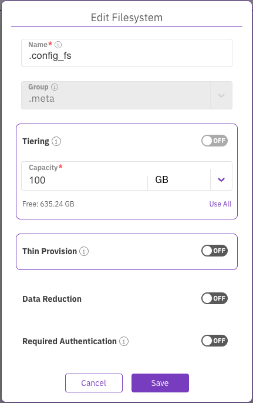
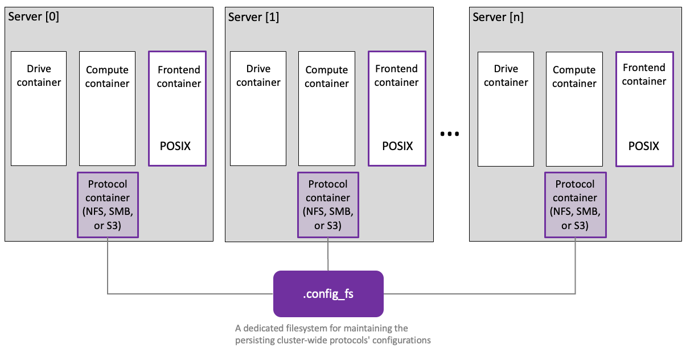
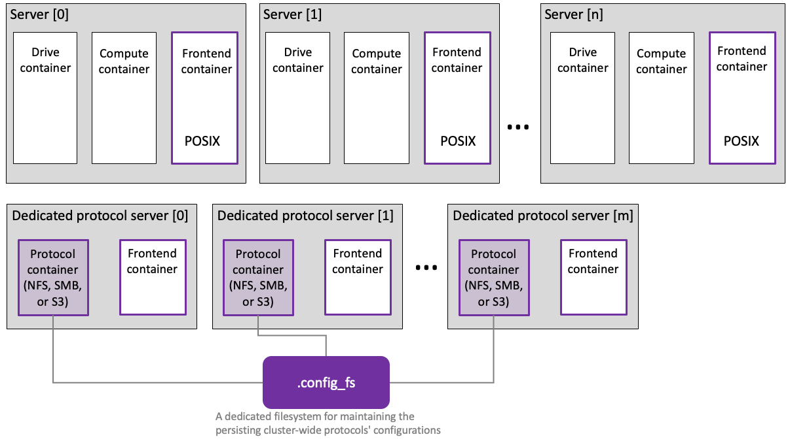

# Additional protocol containers

In a WEKA cluster, the frontend container provides the default POSIX protocol, serving as the primary access point for the distributed filesystem. You can also define protocol containers for NFS, SMB, and S3 clients.

To configure protocol containers, you have two options for creating a cluster for the specified protocol:

1. Set up protocol services on existing backend servers.
2. Prepare additional dedicated servers for the protocol containers.


In cloud environments, setting up protocol services on existing backend servers (option 1) is not supported. Instead, use option 2 and prepare additional dedicated servers (protocol gateways) when creating the `main.tf` file.

For more details, refer to the relevant deployment section:

* [deployment-on-aws-using-terraform.md](../planning-and-installation/aws/weka-installation-on-aws-using-terraform/deployment-on-aws-using-terraform.md "mention")
* [deployment-on-azure-using-terraform.md](../planning-and-installation/weka-installation-on-azure/deployment-on-azure-using-terraform.md "mention")
* [deployment-on-gcp-using-terraform.md](../planning-and-installation/weka-installation-on-gcp/deployment-on-gcp-using-terraform.md "mention")


### Dedicated filesystem requirement for cluster-wide persistent protocol configurations

A dedicated filesystem is required to maintain persistent protocol configurations across a cluster. This filesystem is pivotal in orchestrating coherent, synchronized access to files from multiple servers. It is recommended that this configuration filesystem be named with a significant name, for instance, `.config_fs`. The total capacity must be **100 GB** while refraining from employing additional features such as tiering and thin-provisioning.

When establishing a Data Services container for background tasks, it is recommended to increase the `.config_fs` size to **122 GB** (an additional 22 GB on top of the initial 100 GB). For further details, see [set-up-a-data-services-container-for-background-tasks.md](../operation-guide/set-up-a-data-services-container-for-background-tasks.md "mention").

<details>

<summary>.config_fs setting example</summary>



**Related topics**

[#add-a-filesystem-group](../weka-filesystems-and-object-stores/managing-filesystem-groups/managing-filesystem-groups.md#add-a-filesystem-group "mention") (a prerequisite for creating a filesystem using the GUI)

[#create-a-filesystem](../weka-filesystems-and-object-stores/managing-filesystems/managing-filesystems.md#create-a-filesystem "mention") (using the GUI)

[#create-a-filesystem](../weka-filesystems-and-object-stores/managing-filesystems/managing-filesystems-1.md#create-a-filesystem "mention") (using the CLI)

</details>

## **Set up protocol containers** on existing backend servers

With this option, you configure the existing cluster to provide the required protocol containers. The following topics guide you through the configuration for each protocol:

* [nfs-support](nfs-support/ "mention")
* [s3](s3/ "mention")
* [smb-support](smb-support/ "mention")

<figure><figcaption><p>Protocol containers using existing backend servers</p></figcaption></figure>

## **Prepare dedicated protocol servers**

Dedicated protocol servers enhance the cluster's capabilities and address diverse use cases. Each dedicated protocol server in the cluster can host one of these additional protocol containers alongside the existing frontend container.

These dedicated protocol servers function as complete and permanent members of the WEKA cluster. They run essential processes to access WEKA filesystems and incorporate switches supporting the protocols.

#### Benefits

Dedicated protocol servers offer the following advantages:

* **Optimized performance:** Leverage dedicated CPU resources for tailored and efficient performance, optimizing overall resource usage.
* **Independent protocol scaling:** Scale specific protocols independently, mitigating resource contention and ensuring consistent performance across the cluster.

<figure><figcaption><p>Protocol containers in dedicated servers</p></figcaption></figure>

**Procedure**

1. **Install the WEKA software on the dedicated protocol servers:** Do one of the following:
   * Follow the default method as specified in [manually-install-os-and-weka-on-servers.md](../planning-and-installation/bare-metal/manually-install-os-and-weka-on-servers.md "mention").
   *   Use the WEKA agent to install from a working backend. The following commands  demonstrate this method:

       ```bash
       curl http://<EXISTING-BACKEND-IP>:14000/dist/v1/install | sudo sh   # Install the agent
       sudo weka version get 4.2.7.64                                      # Get the full software
       sudo weka version set 4.2.7.64                                      # Set a default version
       ```
2. **Configure the WEKA container for running protocols:**

* To configure the protocol containers with **DPDK** networking for optimal performance, run the following command:


```bash
sudo weka local setup container --name frontend0 --only-frontend-cores --cores 1 --join-ips <EXISTING-BACKEND-IP> --allow-protocols true --net=<NETWORK_INTERFACE>/<IP_ADDRESS>/<SUBNET_MASK>
```



Replace the network configuration parameters with values appropriate for your environment. For example: `--net=eth1/192.168.114.50/24`.


* To configure the protocol containers with **UDP** networking, run the following command:


```
sudo weka local setup container --name frontend0 --only-frontend-cores --cores 1 --join-ips <EXISTING-BACKEND-IP> --allow-protocols true --net=UDP
```


3. **Verify protocol server configuration:** Confirm the dedicated protocol servers have joined the cluster:

```
weka cluster containers
```

Expected response example:

```bash
CONTAINER ID  HOSTNAME        CONTAINER  IPS              STATUS  RELEASE  FAILURE DOMAIN  CORES  MEMORY   LAST FAILURE  UPTIME
42            protocol-node1  frontend0  192.168.114.31   UP      4.2.7.64 AUTO            1      1.47 GB                0:09:54h
43            protocol-node2  frontend0  192.168.114.115  UP      4.2.7.64 AUTO            1      1.47 GB                0:09:08h
44            protocol-node3  frontend0  192.168.114.13   UP      4.2.7.64 AUTO            1      1.47 GB                0:04:46h
```

With dedicated protocol servers in place, proceed to manage individual protocols.

**Related topics**

* [nfs-support](nfs-support/ "mention")
* [s3](s3/ "mention")
* [smb-support](smb-support/ "mention")
