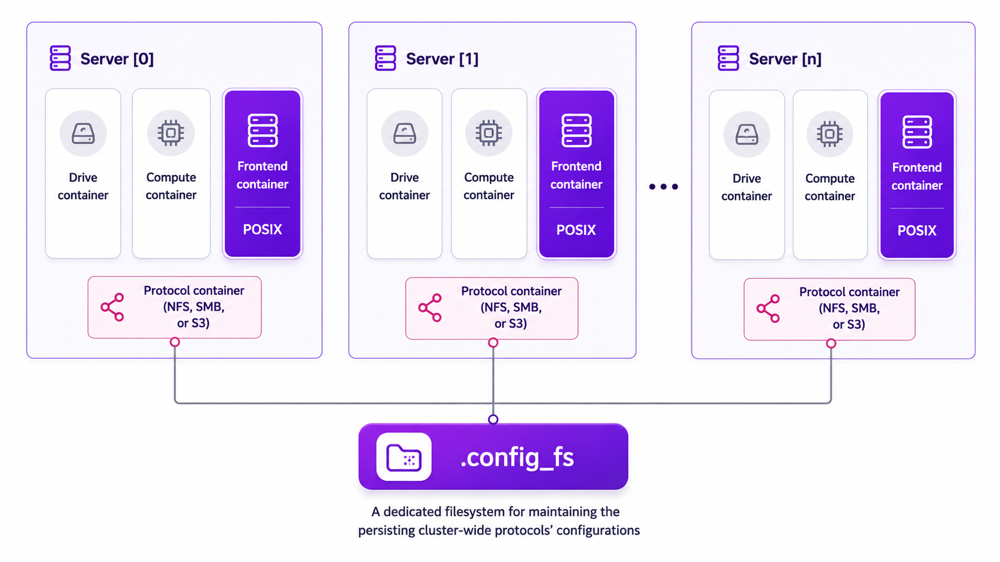
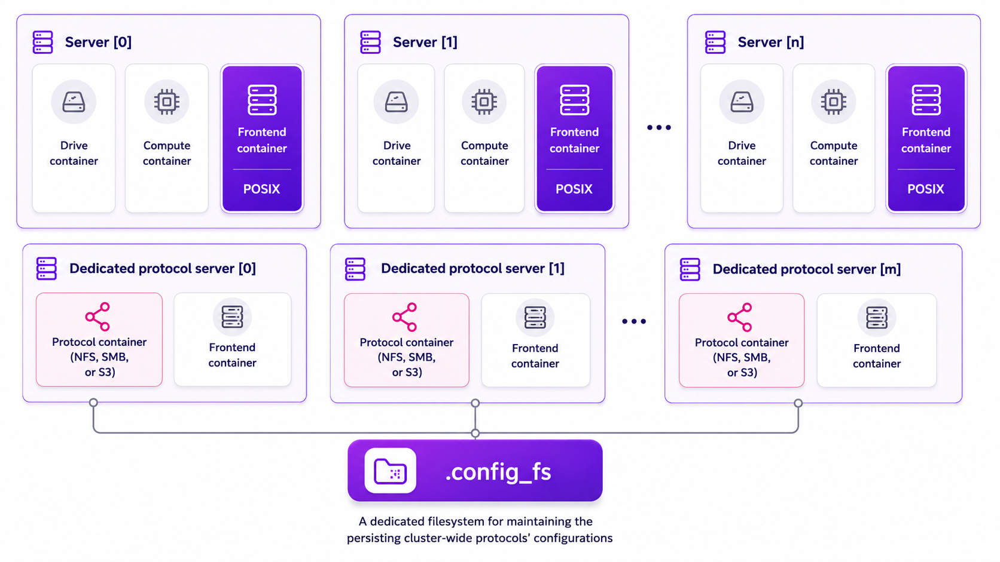

# Additional protocol containers

## Introduction

In a WEKA cluster, the frontend container provides the default POSIX protocol, serving as the primary access point for the distributed filesystem. You can also define protocol containers for NFS, SMB, and S3 clients.

To configure protocol containers, you have two options for creating a cluster for the specified protocol:

1. Set up protocol services on existing backend servers.
2. Prepare additional dedicated servers for the protocol containers.


In cloud environments, setting up protocol services on existing backend servers (option 1) is not supported. Instead, use option 2 and prepare additional dedicated servers (protocol gateways) when creating the `main.tf` file.

For more details, refer to the relevant deployment section:

* [deployment-on-aws-using-terraform.md](../planning-and-installation/aws/deployment-on-aws-using-terraform.md "mention")
* [deployment-on-azure-using-terraform.md](../planning-and-installation/weka-installation-on-azure/deployment-on-azure-using-terraform.md "mention")
* [deployment-on-gcp-using-terraform.md](../planning-and-installation/weka-installation-on-gcp/deployment-on-gcp-using-terraform.md "mention")


## Dedicated filesystem requirement for cluster-wide persistent protocol configurations

A dedicated filesystem is required to maintain persistent protocol configurations across a cluster. This filesystem is pivotal in orchestrating coherent, synchronized access to files from multiple servers. It is recommended that this configuration filesystem be named with a significant name, for instance, `.config_fs`. The total capacity must be **100 GB** while refraining from employing additional features such as tiering and thin-provisioning.

When establishing a Data Services container for background tasks, it is recommended to increase the `.config_fs` size to **122 GB** (an additional 22 GB on top of the initial 100 GB). For further details, see [set-up-a-data-services-container-for-background-tasks.md](../operation-guide/background-tasks/set-up-a-data-services-container-for-background-tasks.md "mention").

<details>

<summary>.config_fs setting example</summary>


**Related topics**

[#add-a-filesystem-group](../weka-filesystems-and-object-stores/managing-filesystem-groups/managing-filesystem-groups.md#add-a-filesystem-group "mention") (a prerequisite for creating a filesystem using the GUI)

[#create-a-filesystem](../weka-filesystems-and-object-stores/managing-filesystems/managing-filesystems.md#create-a-filesystem "mention") (using the GUI)

[#create-a-filesystem](../weka-filesystems-and-object-stores/managing-filesystems/managing-filesystems-1.md#create-a-filesystem "mention") (using the CLI)

</details>

## **Set up protocol containers** on existing backend servers

With this option, you configure the existing cluster to provide the required protocol containers. The following topics guide you through the configuration for each protocol:

* [nfs-support](nfs-support/ "mention")
* [s3](s3/ "mention")
* [smb-support](smb-support/ "mention")

<div data-with-frame="true"><figure><figcaption><p>Protocol containers using existing backend servers</p></figcaption></figure></div>

## **Prepare dedicated protocol servers**

Dedicated protocol servers enhance the cluster's capabilities and address diverse use cases. Each dedicated protocol server in the cluster can host one of these additional protocol containers alongside the existing frontend container.

These dedicated protocol servers function as complete and permanent members of the WEKA cluster. They run essential processes to access WEKA filesystems and incorporate switches supporting the protocols.

#### Benefits

Dedicated protocol servers offer the following advantages:

* **Optimized performance:** Leverage dedicated CPU resources for tailored and efficient performance, optimizing overall resource usage.
* **Independent protocol scaling:** Scale specific protocols independently, mitigating resource contention and ensuring consistent performance across the cluster.

<div data-with-frame="true"><figure><figcaption><p>Protocol containers in dedicated servers</p></figcaption></figure></div>

**Procedure**

1. **Install the WEKA software on the dedicated protocol servers:** Do one of the following:
   * Follow the default method as specified in [manually-install-os-and-weka-on-servers](../planning-and-installation/bare-metal/manually-install-os-and-weka-on-servers/ "mention").
   *   Use the WEKA agent to install from a working backend. The following commands demonstrate this method:

       ```bash
       curl http://<EXISTING-BACKEND-IP>:14000/dist/v1/install | sudo sh   # Install the agent
       sudo weka version get 4.2.7.64                                      # Get the full software
       sudo weka version set 4.2.7.64                                      # Set a default version
       ```
2. **Configure the WEKA container for running protocols:**

* To configure the protocol containers with **DPDK** networking for optimal performance, run the following command:


```bash
sudo weka local setup container --name frontend0 --only-frontend-cores --cores 1 --join-ips <EXISTING-BACKEND-IP> --allow-protocols true --net=<NETWORK_INTERFACE>/<IP_ADDRESS>/<SUBNET_MASK>
```



Replace the network configuration parameters with values appropriate for your environment. For example: `--net=eth1/192.168.114.50/24`.


* To configure the protocol containers with **UDP** networking, run the following command:


```bash
sudo weka local setup container --name frontend0 --only-frontend-cores --cores 1 --join-ips <EXISTING-BACKEND-IP> --allow-protocols true --net udp
```


3. **Verify protocol server configuration:** Confirm the dedicated protocol servers have joined the cluster:

```
weka cluster containers
```

Expected response example:

```bash
CONTAINER ID  HOSTNAME        CONTAINER  IPS              STATUS  RELEASE  FAILURE DOMAIN  CORES  MEMORY   LAST FAILURE  UPTIME
42            protocol-node1  frontend0  192.168.114.31   UP      4.2.7.64 AUTO            1      1.47 GB                0:09:54h
43            protocol-node2  frontend0  192.168.114.115  UP      4.2.7.64 AUTO            1      1.47 GB                0:09:08h
44            protocol-node3  frontend0  192.168.114.13   UP      4.2.7.64 AUTO            1      1.47 GB                0:04:46h
```

With dedicated protocol servers in place, proceed to manage individual protocols.

## Multi-protocol access considerations

Learn about the considerations for accessing the same WEKA filesystem data through multiple protocols, including POSIX, NFS, SMB, and S3.

While the WEKA system provides unified data access, each protocol enforces different rules for filenames, permissions, and file locking. Understanding these differences is crucial to prevent access issues or unexpected behavior when data is written by one protocol and read by another.

### File naming conventions

A primary source of conflict is the different character sets and case-sensitivity rules protocols use for filenames.

* **SMB:** Prohibits the use of specific characters, including `\`, `/`, `:`, `*`, `?`, `"`, `<`, `>`, and `|`. SMB is typically case-insensitive.
* **POSIX and NFS:** Are case-sensitive and highly flexible, disallowing only the `NULL` character and the forward slash (`/`) path separator.
* **S3:** Is case-sensitive. Object keys (filenames) can contain any UTF-8 character, and the forward slash (`/`) is treated as part of the key, not a directory separator. For details, see [#directory-structure](additional-protocols-overview.md#directory-structure "mention").


**Potential issues:**

* A POSIX or NFS user creates a file named `report:final.pdf`. SMB clients cannot access or see this file because the colon (`:`) is illegal in SMB.
* A POSIX client creates two separate files: `data.log` and `DATA.LOG`. An SMB client may only see one of these files or experience unpredictable behavior due to case-insensitivity.


### Permissions and access control

Each protocol uses a distinct permission model, which the WEKA system must translate.

* **NFS and POSIX:** Use POSIX mode bits (read, write, execute) for owner, group, and other. NFS can also use NFSv4 ACLs, which provide more granular control. The system can be set to enforce POSIX ACLs, NFSv4 ACLs, or a hybrid model.
* **SMB:** Uses Windows-style NTFS ACLs, which are fundamentally different from POSIX permissions.
* **S3:** Uses AWS-style IAM policies and S3 bucket policies for access control, which are based on users and actions, not file-level permissions.


**Potential issues:**

* Complex NFSv4 or SMB permissions may not translate perfectly to POSIX ACLs.
* Access decisions for S3 are managed separately from the filesystem's POSIX or SMB permissions.


### Locking

Protocols handle file locking differently, which is critical in multi-user environments.

* **NFS:** The system supports NFS byte range advisory locks for versions 3, 4, and 4.1. These locks are interoperable with the system's POSIX byte range advisory locks.
* **S3:** Does not require traditional file locking because its operations are atomic. A PUT operation, for example, replaces an object entirely in a single step, ensuring consistency. Additionally, S3 does not natively support file append operations, which are a primary reason for locking in file-based systems.


**Potential issue:** A file lock acquired by an SMB client is not honored by an NFS client (or vice-versa). This can lead to data corruption if applications on different protocols attempt to write to the same file simultaneously.


### Directory structure

POSIX, NFS, and SMB clients interact with a traditional hierarchical filesystem of directories and files.

S3 clients interact with a flat object store structure (buckets and keys). The WEKA system presents the filesystem hierarchy to S3 clients by using the forward slash (`/`) as a delimiter in object keys. This simulation allows S3 clients to "browse" the directory structure, but the underlying concept is different.

### Interoperability guidelines

To ensure the best compatibility when accessing the same data from different protocols:

* **Use SMB-compatible filenames:** For all new files, avoid characters that are illegal in SMB (`\ / : * ? " < > |`) and do not rely on case-sensitivity.
* **Manage permissions carefully:** Choose a primary protocol (like SMB or NFS) for managing permissions and understand how those permissions translate to other protocols. For details, see [#access-control-lists-acls](../security/security.md#access-control-lists-acls "mention").
* **Avoid simultaneous writes:** Do not allow applications using different protocols (for example, an NFS client and an SMB client) to write to the same file at the same time, as locks are not shared between them.

**Related topics**

* [nfs-support](nfs-support/ "mention")
* [s3](s3/ "mention")
* [smb-support](smb-support/ "mention")
