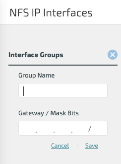
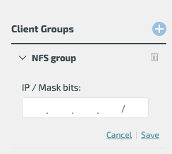
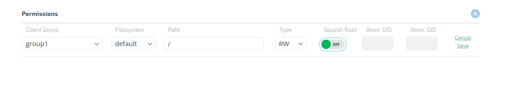

# NFS

## Overview

The NFS protocol allows client hosts to access the Weka filesystem without installing Weka’s client software using the standard NFS implementation of the client host operating system. While this implementation is easier to deploy, it does not compare in performance to the Weka client.

In order to implement NFS service from a Weka cluster, the following steps must be implemented:

| **Step** | **Method of Implementation** |
| :--- | :--- |
| Define a set of hosts that will provide the NFS service, which can be the whole cluster or a subset of the cluster. | By defining an interface group. |
| Define Ethernet ports on each of the defined hosts that will be used to provide the NFS service. | By defining an interface group. |
| Allocate a pool of IP addresses that will be used by the Weka software to provide the NFS service. | By defining an interface group. |
| Define a Round-robin DNS name that will resolve to the floating IPs. | On the local DNS service configuration; does not involve Weka management. |
| Define the list of client hosts that will be permitted to access file systems via NFS. | By creating a client permission group. |
| Configure which client hosts can access which file system. | By creating a client permission group. |
| Mount the file systems on the client hosts using the NFS mount operating system support. | On the client operating system; does not involve Weka management. |

### Defining the NFS Networking Configuration \(Interface Groups\)


**Note:** Since only a single port can be added to an interface group, for HA support in NFS, two interface groups must be created, with each of the host ports assigned to a different interface group. Additionally, the network topology \(switches\) must be considered when assigning the other host ports to these interface groups, to ensure that a single point of failure is not created in the switch.


## Implementing NFS Service from a Weka Cluster

In order to define the NFS service, one or more interface groups must be defined. An interface group consists of the following:

* A collection of Weka hosts with an Ethernet port for each host, where all the ports must belong to the same layer 2 subnets.
* A collection of floating IPs that serve the NFS protocol on the hosts and ports. All IP addresses must belong to the layer 2 subnet above.
* A routing configuration for the IPs which must comply with the IP network configuration.

Up to 10 different Interface groups can be defined, where multiple interface groups can be used if the cluster needs to connect to multiple layer 2 subnets. Up to 50 hosts can be defined in each interface group.

The Weka system will automatically distribute the IP addresses evenly on each host and port. On failure of the host, the Weka system will reasonably redistribute the IP addresses associated with the failed host on other hosts. To minimize the effect of any host failures, it is recommended to define sufficient floating IPs so that the Weka system can assign 4 floating IPs per host.


**Note:** The Weka system will configure the host IP networking for the NFS service on the host operating system. It should not be defined by the user.


### Configuring the Round-Robin DNS Server

To ensure that the various NFS clients will balance the load on the various Weka hosts serving NFS, it is recommended to define a [Round-robin DNS](https://en.wikipedia.org/wiki/Round-robin_DNS) entry which will resolve to the list of floating IPs, ensuring that client loads will be equally distributed across all hosts.


**Note:** Make sure to set the TTL \(Time to Live\) for all A records assigned to the NFS servers to 0 \(Zero\), this ensures that the IP won't be cached by the client or the DNS server.


### Defining NFS Access Control \(Client Access Groups\)

In order to control which host can access which file system, NFS client permission groups must be defined. Each NFS client permission group contains:

* A list of filters for IP addresses or DNS names of clients that can be connected to the Weka system via NFS.
* A collection of rules that control access to specific filesystems.

### Configuring NFS on the Client

The NFS mount should be configured on the client host via the standard NFS stack operating system. The NFS server IP address should point to the Round-robin DNS name defined above.

## Load Balancing and Resiliency of the NFS Service

The Weka NFS service is a scalable, fully load-balanced, and resilient service that provides continuous service through failures of any kind.

Scalability is implemented by defining many hosts that serve the NFS protocol, thereby enabling the scaling of performance by adding more hosts to the interface group.

Load balancing is implemented via floating IPs. By default, the floating IPs are evenly distributed over all the interface group hosts/ports. When different clients resolve the DNS name into an IP service, each of them receives a different IP address, thereby ensuring that different clients will access different hosts. This allows the Weka system to scale and service thousands of clients.

The same mechanism ensures the resiliency of the service. On a host failure, all IP addresses associated with the failed host will be reassigned to other hosts \(using the GARP network messages\) and the clients will reconnect to the new hosts without any reconfiguration or service interruption.

## User Groups Resolution

The NFS protocol, using AUTH\_SYS protocol, has a limitation of 16 security groups users can be part of. The protocol truncates the group list to 16 if a user is part of more than 16 groups, and a permissions check can fail for authorized users.

As in many cases, a user can be part of more than 16 security groups. It is possible to configure the Weka system to ignore the groups passed by the NFS protocol and resolve the user's groups external to the protocol. For that, several steps should be taken:

1. Define an interface group that supports external group-IDs resolution \(`allow-manage-gids` option\).
2. Define the NFS client permissions to use external group-IDs resolution \(`manage-gids` option\).
3. Set-up the relevant hosts to retrieve user's group-IDs information.

### Setting up the Hosts to Retrieve User's Group-IDs Information

The hosts, which are part of the interface group, can be set to retrieve the user's group-IDs information in any method that is used in the environment. Group resolution can be set by joining to an AD domain, joining a Kerberos domain, using LDAP with a read-only user, etc.

`sssd` should be configured on the host to serve as a group IDs provider. It can be configured directly, using LDAP, for example, or as a proxy to a different `nss` group IDs provider.

Below is an example of how to set `sssd` directly for `nss` services using LDAP with a read-only user. For more options and information, refer to this [link](https://tylersguides.com/guides/configure-sssd-for-ldap-on-centos-7/).

```text
[sssd]
services = nss
config_file_version = 2
domains = LDAP

[domain/LDAP]
id_provider = ldap
ldap_uri = ldap://ldap.example.com
ldap_search_base = dc=example,dc=com

# The DN used to search the ldap directory with. 
ldap_default_bind_dn = cn=ro_admin,ou=groups,dc=example,dc=com

# The password of the bind DN.
ldap_default_authtok = password

```

If the method used is not via `sssd`, but a different provider, an `sssd proxy` should be configured on each relevant host. The proxy is used for the Weka container to be able to resolve the groups by whatever method defined on the host. Use the following to configure `sssd proxy` on a host:

```text
# install sssd
yum install sssd

# set up a proxy for weka in /etc/sssd/sssd.conf
[sssd]
services = nss
config_file_version = 2
domains = proxy_for_weka

[nss]
[domain/proxy_for_weka]
id_provider = proxy
auth_provider = none
 
# the name of the nss lib to be proxied, e.g. ldap, nis, winbind, vas4, etc.
proxy_lib_name = ldap
```


**Note:** All users must be present and resolved in the method used in `sssd` for groups resolution. For example, in the above example, using LDAP only provider, local users \(e.g., a local root\) that are not present in LDAP will not get their groups resolved and will be denied. An LDAP user will need to be added for such users/applications.


## Managing NFS Networking Configuration \(Interface Groups\)

### Defining Interface Groups

#### Defining Interface Groups Using the GUI <a id="uploading-a-snapshot-using-the-ui"></a>

Access the NFS IP Interfaces screen.


To define an interface group, click the '+' button at the top left-hand side of the screen. The add Interface Groups dialog box will be displayed.



Enter the Group Name \(this has to be unique\) and the Gateway / Mask Bits. Then click Save.

#### Defining Interface Groups Using the CLI <a id="uploading-a-snapshot-using-the-cli"></a>

**Command:** `weka nfs interface-group add`

Use the following command line to add an interface group:

`weka nfs interface-group add <name> <type> [--subnet subnet] [--gateway gateway] [--allow-manage-gids allow-manage-gids]`

**Parameters in Command Line**

<table>
  <thead>
    <tr>
      <th style="text-align:left"><b>Name</b>
      </th>
      <th style="text-align:left"><b>Type</b>
      </th>
      <th style="text-align:left"><b>Value</b>
      </th>
      <th style="text-align:left"><b>Limitations</b>
      </th>
      <th style="text-align:left"><b>Mandatory</b>
      </th>
      <th style="text-align:left"><b>Default</b>
      </th>
    </tr>
  </thead>
  <tbody>
    <tr>
      <td style="text-align:left"><code>name</code>
      </td>
      <td style="text-align:left">String</td>
      <td style="text-align:left">Unique interface group name</td>
      <td style="text-align:left">Up to 11 characters length</td>
      <td style="text-align:left">Yes</td>
      <td style="text-align:left"></td>
    </tr>
    <tr>
      <td style="text-align:left"><code>type</code>
      </td>
      <td style="text-align:left">String</td>
      <td style="text-align:left">Group type</td>
      <td style="text-align:left">Can only be <code>NFS</code>
      </td>
      <td style="text-align:left">Yes</td>
      <td style="text-align:left"></td>
    </tr>
    <tr>
      <td style="text-align:left"><code>subnet</code>
      </td>
      <td style="text-align:left">String</td>
      <td style="text-align:left">The subnet mask in the 255.255.0.0 format</td>
      <td style="text-align:left">Valid netmask</td>
      <td style="text-align:left">No</td>
      <td style="text-align:left">255.255.255.255</td>
    </tr>
    <tr>
      <td style="text-align:left"><code>gateway</code>
      </td>
      <td style="text-align:left">String</td>
      <td style="text-align:left">Gateway IP</td>
      <td style="text-align:left">Valid IP</td>
      <td style="text-align:left">No</td>
      <td style="text-align:left">255.255.255.255</td>
    </tr>
    <tr>
      <td style="text-align:left"><code>allow-manage-gids</code>
      </td>
      <td style="text-align:left">String</td>
      <td style="text-align:left">
        <p>Allows the hosts within this interface group to use <code>manage-gids</code> when
          set in exports.</p>
        <p>With <code>manage-gids</code>, the list of group IDs received from the
          client will be replaced by a list of group IDs determined by an appropriate
          lookup on the server.</p>
      </td>
      <td style="text-align:left">
        <p><code>on</code> or <code>off</code>.</p>
        <p>Cannot be set if one of the hosts belongs to an interface group which
          does not have the <code>allow-manage-gids</code> flag set.</p>
      </td>
      <td style="text-align:left">No</td>
      <td style="text-align:left"><code>off</code>
      </td>
    </tr>
  </tbody>
</table>


**Note:** Each host can be set to be part on interface groups with the same value of `allow-manage-gids.` In addition, you must not mount the same filesystem via hosts resides in interface groups with different values of `allow-manage-gids.`


### Setting Interface Group Ports

**Setting Interface Group Ports using the GUI**

Access the Group Ports table.


To set interface group ports, click the '+' button on the top right-hand side of the Group Ports table. Then select the relevant hosts and ports and click Save.

To remove an interface group port, click the trash symbol displayed next to the host's status.

**Setting Interface Group Ports using the CLI**

**Commands:** `weka nfs interface-group port add`and `weka nfs interface-group port delete`

Use the following command lines to add/delete an interface group port:`weka nfs interface-group port add <name> <host-id> <port>    
weka nfs interface-group port delete <name> <host-id> <port>`

**Parameters in Command Line**

| **Name** | **Type** | **Value** | **Limitations** | **Mandatory** | **Default** |
| :--- | :--- | :--- | :--- | :--- | :--- |
| `name` | String | Interface group name | None | Yes |  |
| `host-id` | String | Host ID on which the port resides \(can be obtained by running the `weka cluster host` command\) | Valid host ID | Yes |  |
| `port` | String | Port's device, e.g., eth1 | Valid device | Yes |  |

### **Setting Interface Group IPs**

**Setting Interface Group IPs using the GUI**

Access the Group IPs table.


To set IPs for the selected group, click the '+' button on the top right-hand side of the Group IPs table. Then enter the relevant IP range and click Save.

To remove an IP, click the trash symbol displayed next to the IP in the table.

**Setting Interface Group IPs using the CLI**

**Commands:** `weka nfs interface-group ip-range add`and `weka nfs interface-group ip-range delete`

Use the following command lines to add/delete an interface group IP:  
`weka nfs interface-group ip-range add <name> <ips>    
weka nfs interface-group ip-range delete <name> <ips>`

**Parameters in Command Line**

| **Name** | **Type** | **Value** | **Limitations** | **Mandatory** | **Default** |
| :--- | :--- | :--- | :--- | :--- | :--- |
| `name` | String | Interface group name | None | Yes |  |
| `ips` | String | IP range | Valid IP range | Yes |  |

## **Managing NFS Access Control \(Client Access Groups\)**

### Defining Client Access Groups

#### Defining Client Access Groups Using the GUI <a id="uploading-a-snapshot-using-the-ui"></a>

Access the NFS Client Permissions screen.


To define a client access group, click the '+' button on the top left-hand side of the screen. Enter the client access-group name and click Save.

#### Defining Client Access Groups Using the CLI <a id="uploading-a-snapshot-using-the-ui"></a>

**Command:** `weka nfs client-group`

Use the following command lines to add/delete a client access group:  
`weka nfs client-group add <name>    
weka nfs client-group delete <name>`

**Parameters in Command Line**

| **Name** | **Type** | **Value** | **Limitations** | **Mandatory** | **Default** |
| :--- | :--- | :--- | :--- | :--- | :--- |
| `name` | String | Group name | Valid name | Yes |  |

### Managing Client Access Groups

#### **Managing Client Access Groups Using the GUI**

To add IPs or DNS rules to a group, access the relevant Client Groups dialog box.


Click +Add IP or +Add DNS. The appropriate dialog box will be displayed.




Enter the required values - DNS or IP and Mask, respectively, and click Save.

To remove an IP or DNS from a client group, click the trash symbol displayed next to IP or DNS.

#### **Managing Client Access Groups Using the CLI**

**Adding/Deleting DNS**

**Command:** `weka nfs rules`

Use the following command lines to add/delete a client group DNS:  
`weka nfs rules add dns <name> <dns>    
weka nfs rules delete dns <name> <dns>`

**Parameters in Command Line**

| **Name** | **Type** | **Value** | **Limitations** | **Mandatory** | **Default** |
| :--- | :--- | :--- | :--- | :--- | :--- |
| `name` | String | Group name | Valid name | Yes |  |
| `dns` | String | DNS rule with \*?\[\] wildcard rules |  | Yes |  |

**Adding/Deleting an IP**

**Command:** `weka nfs rules`

Use the following command lines to add/delete a client group IP:  
`weka nfs rules add ip <name> <ip>    
weka nfs rules delete ip <name> <ip>`

**Parameters in Command Line**

| **Name** | **Type** | **Value** | **Limitations** | **Mandatory** | **Default** |
| :--- | :--- | :--- | :--- | :--- | :--- |
| `name` | String | Group name | Valid name | Yes |  |
| `ip` | String | IP with netmask rule, in the 1.1.1.1/255.255.0.0 format | Valid IP | Yes |  |

### **Managing NFS Client Permissions**

#### **Managing NFS Client Permissions Using the GUI**

To add client permissions, click the top right-hand '+' icon in the Client Permissions table. The Permissions dialog box will be displayed.



Define the following parameters:

* Client Group: the client group to receive permissions.
* Filesystem: the filesystem to receive permissions.
* Path: The path that will be the root of the share.
* Type: The type of access to be provided - RO \(read-only\) or RW \(Read/Write\).
* Squash Root: Set to ON or OFF.
* Anon. UID: Anonymous user ID \(relevant only for root squashing\).
* Anon. GID: Anonymous user group ID \(relevant only for root squashing\)

Then click Save.

**Managing NFS Client Permissions Using the CLI**

**Command:** `weka nfs permission`

Use the following command lines to add/update/delete NFS permissions:  
`weka nfs permission add <filesystem> <group> [--path path] [--permission-type permission-type] [--root-squashing root-squashing] [--anon-uid anon-uid] [--anon-gid anon-gid] [--obs-direct obs-direct] [--manage-gids manage-gids] [--privileged-port privileged-port]`

`weka nfs permission update <filesystem> <group> [--path path] [--permission-type permission-type] [--root-squashing root-squashing] [--anon-uid anon-uid] [--anon-gid anon-gid] [--obs-direct obs-direct] [--manage-gids manage-gids] [--privileged-port privileged-port]`

`weka nfs permission delete <filesystem> <group> [--path path]`

**Parameters in Command Line**

<table>
  <thead>
    <tr>
      <th style="text-align:left"><b>Name</b>
      </th>
      <th style="text-align:left"><b>Type</b>
      </th>
      <th style="text-align:left"><b>Value</b>
      </th>
      <th style="text-align:left"><b>Limitations</b>
      </th>
      <th style="text-align:left"><b>Mandatory</b>
      </th>
      <th style="text-align:left"><b>Default</b>
      </th>
    </tr>
  </thead>
  <tbody>
    <tr>
      <td style="text-align:left"><code>filesystem</code>
      </td>
      <td style="text-align:left">String</td>
      <td style="text-align:left">Filesystem name</td>
      <td style="text-align:left">Existing filesystem</td>
      <td style="text-align:left">Yes</td>
      <td style="text-align:left"></td>
    </tr>
    <tr>
      <td style="text-align:left"> <code>group</code>
      </td>
      <td style="text-align:left">String</td>
      <td style="text-align:left">Client group name</td>
      <td style="text-align:left">Existing client group</td>
      <td style="text-align:left">Yes</td>
      <td style="text-align:left"></td>
    </tr>
    <tr>
      <td style="text-align:left"> <code>path</code>
      </td>
      <td style="text-align:left">String</td>
      <td style="text-align:left">The root of the share</td>
      <td style="text-align:left">Valid path</td>
      <td style="text-align:left">No</td>
      <td style="text-align:left">/</td>
    </tr>
    <tr>
      <td style="text-align:left"><code>permission-type</code>
      </td>
      <td style="text-align:left">String</td>
      <td style="text-align:left">Permission type</td>
      <td style="text-align:left">
        <p><code>ro</code> for read-only or</p>
        <p><code>rw</code> for read-write</p>
      </td>
      <td style="text-align:left">No</td>
      <td style="text-align:left"><code>rw</code>
      </td>
    </tr>
    <tr>
      <td style="text-align:left"><code>root-squashing</code>
      </td>
      <td style="text-align:left">String</td>
      <td style="text-align:left">Root squashing</td>
      <td style="text-align:left"><code>on</code> or <code>off</code>
      </td>
      <td style="text-align:left">No</td>
      <td style="text-align:left"><code>on</code>
      </td>
    </tr>
    <tr>
      <td style="text-align:left"><code>anon-uid</code>
      </td>
      <td style="text-align:left">Number</td>
      <td style="text-align:left">Anonymous user ID (relevant only for root squashing)</td>
      <td style="text-align:left">Valid UID (between 0 and 65535)</td>
      <td style="text-align:left">Yes (if root squashing is enabled)</td>
      <td style="text-align:left">65534</td>
    </tr>
    <tr>
      <td style="text-align:left"><code>anon-gid</code>
      </td>
      <td style="text-align:left">Number</td>
      <td style="text-align:left">Anonymous user group ID (relevant only for root squashing)</td>
      <td style="text-align:left">Valid GID (between 0 and 65535)</td>
      <td style="text-align:left">Yes (if root squashing is enabled)</td>
      <td style="text-align:left">65534</td>
    </tr>
    <tr>
      <td style="text-align:left"><code>obs-direct</code>
      </td>
      <td style="text-align:left">Boolean</td>
      <td style="text-align:left">See <a href="../fs/tiering/advanced-time-based-policies-for-data-storage-location.md#object-store-direct-mount-option">Object-store Direct Mount</a> section</td>
      <td
      style="text-align:left"><code>on</code> or <code>off</code>
        </td>
        <td style="text-align:left">No</td>
        <td style="text-align:left">No</td>
    </tr>
    <tr>
      <td style="text-align:left"><code>manage-gids</code>
      </td>
      <td style="text-align:left">String</td>
      <td style="text-align:left">
        <p>Sets external group IDs resolution.</p>
        <p>The list of group IDs received from the client will be replaced by a list
          of group IDs determined by an appropriate lookup on the server.</p>
      </td>
      <td style="text-align:left">
        <p> <code>on</code> or <code>off</code>.</p>
        <p>Relevant only when using<code>allow-manage-gids</code> interface groups.</p>
      </td>
      <td style="text-align:left">No</td>
      <td style="text-align:left"><code>off</code>
      </td>
    </tr>
    <tr>
      <td style="text-align:left"><code>privileged-port</code>
      </td>
      <td style="text-align:left">String</td>
      <td style="text-align:left">Sets the share to only be mounted via privileged ports (1-1024), usually
        only allowed by the root user.</td>
      <td style="text-align:left">
        <p><code>on</code> or <code>off</code>.</p>
        <p>Relevant only when using<code>allow-manage-gids</code> interface groups.</p>
      </td>
      <td style="text-align:left">No</td>
      <td style="text-align:left"><code>off</code>
      </td>
    </tr>
  </tbody>
</table>

### Supported Mount Options for NFS Clients

#### Non-Coherent Mount Options

* `ac`
* `async`
* `noatime`
* `lookupcache=all`

#### Coherent Mount Options

* `noac`
* `sync`
* `atime`
* `lookupcache=none`

#### Common Mount Options


**Note:** The following options can be changed. These values are commonly used with the Weka system:


* `rw`
* `hard`
* `rsize=524288`
* `wsize=524288`
* `namlen=255`
* `timeo=600`
* `retrans=2`

#### Fixed Mount options


**Note:** Please make sure to set these values on the mount command, as different values are not supported.


* `nolock`


**Note:** The following options should have fixed values, but usually are either the NFS mount defaults or will be negotiated to these values by the protocol.


* `sec=sys`
* `vers=3`
* `mountvers=3`
* `proto=tcp`
* `mountproto=tcp`

