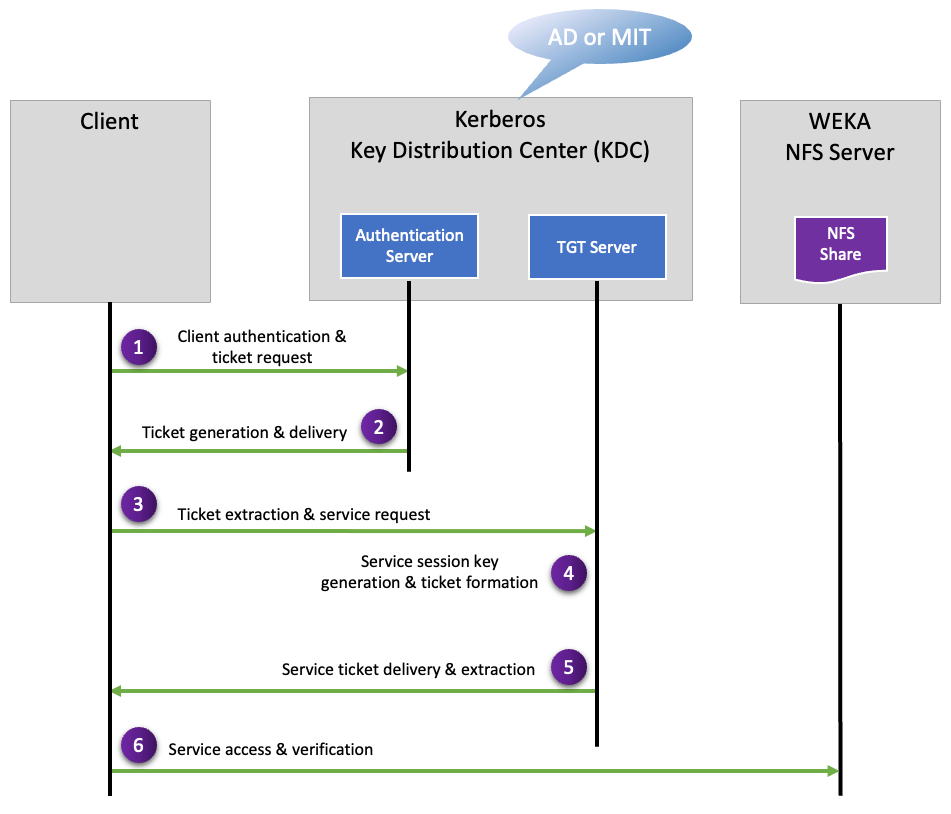

# Manage the NFS protocol

NFS (Network File System) is a protocol that enables clients to access the WEKA filesystem without requiring WEKA's client software. This leverages the standard NFS implementation of the client's operating system.

WEKA supports an advanced NFS implementation, NFS-W, designed to overcome inherent limitations in the NFS protocol. NFS-W is compatible with NFSv3 or NFSv4[^1] protocols, offering enhanced capabilities, including support for more than 16 user security groups.


The legacy NFS stack is no longer supported.


## NFS service deployment guidelines and requirements

Adhere to the following guidelines and requirements when deploying the NFS service.

### **Configuration filesystem**

A persistent cluster-wide configuration filesystem is required for the protocol's internal operations using NFSv4 or Kerberos integration. See [#dedicated-filesystem-for-persistent-protocol-configurations-requirement](../additional-protocols-overview.md#dedicated-filesystem-for-persistent-protocol-configurations-requirement "mention").

### **Interface groups**

An interface group is a configuration framework designed to optimize resiliency among NFS servers. It enables the seamless migration of IP addresses, known as floating IPs, from an unhealthy server to a healthy one, ensuring continuous and uninterrupted service availability.

An interface group consists of the following:

* A collection of WEKA servers with a network port for each server, where all the ports must be associated with the same subnets. For resiliency, a minimum of two NFS servers are required.
* A collection of floating IPs to support the NFS protocol on specified servers and NICs. All IP addresses are required to be within the same subnet, and the servers must already have static IP addresses on those NICs within that subnet.
* A routing configuration for the IPs. The IP addresses must comply with the IP network configuration.


Floating IPs are supported on AWS but not on Azure, GCP, and OCI cloud environments.


An interface group can have only a single port. Therefore, two interface groups are required to support High Availability (HA) in NFS. Consider the network topology when assigning the other server ports to these interface groups to ensure no single point of failure exists in the switch.

You can define up to 10 different Interface groups. Use multiple interface groups if the cluster connects to multiple subnets. You can set up to 50 servers in each interface group.

The WEKA system automatically distributes the IP addresses evenly on each server and port. If a server fails, the WEKA system redistributes the IP addresses associated with the failed server to other servers.


The WEKA system automatically configures the floating IP addresses used by the NFS service on the appropriate server. Refrain from manually configuring or using the floating IP.


### Round-robin DNS server configuration

To ensure load balancing between the NFS clients on the different WEKA servers serving NFS, it is recommended to configure a round-robin DNS entry that resolves to the list of floating IPs.


Set the TTL (Time to Live) for all records assigned to the NFS servers to 0 (Zero). This action ensures that the client or the DNS server does not cache the IP.


**Related information**

[Round-robin DNS](https://en.wikipedia.org/wiki/Round-robin\_DNS)

### NFS client mount&#x20;

The NFS client mount is configured using the standard NFS stack operating system. The NFS server IP address must point to the round-robin DNS name.

### NFS access control (client access groups)

The NFS client permission groups are defined to control the access mapping between the servers and the filesystems. Each NFS client permission group contains the following:

* A list of filters for IP addresses or DNS names of clients that can be connected to the WEKA system by NFS.
* A collection of rules that control access to specific filesystems.

### NFS integration with Kerberos service

WEKA facilitates the seamless integration of NFS with an existing Kerberos service. This integration enables clients' authentication, data integrity, and data privacy over the wire when interacting with the NFS server, ensuring robust security even across untrusted networks.

The Kerberos security levels are:

* **krb5:** Implements basic Kerberos authentication.
* **krb5i:** Incorporates Kerberos authentication with data integrity assurance.
* **krb5p:** Integrates Kerberos authentication with data integrity and privacy measures.


NFS exports created before configuring Kerberos are not updated automatically when using Kerberos. To leverage the Kerberos advantages, the Authenticator Type must be modified to one of the Kerberos types.


#### Kerberos LDAP configurations

WEKA supports Kerberos authentication for NFS using AD and Kerberos MIT:

* **Active Directory (AD):** NFS integrates with Active Directory (AD), which includes built-in Kerberos services. WEKA interacts with the AD using the Kerberos protocol to authenticate service requests among trusted devices.
* **Kerberos MIT:** NFS integrates with Kerberos MIT, implementing the Kerberos protocol using secret-key cryptography for authentication across insecure networks. This protocol is widely standardized and utilized.

#### Kerberos service interactions basic outline

The following Kerberos service interactions ensure secure communication between the client and the WEKA NFS server:

1. **Client authentication & ticket request:** The client sends a request, including encrypted credentials, to the Authentication Server for a Ticket Granting Ticket (TGT).
2. **Ticket generation & delivery:** The Authentication Server verifies the client’s identity, generates a session key, forms a TGT, and sends these to the client.
3. **Ticket extraction & service request:** The client decrypts the received message, extracts the session key and the TGT, and sends a service request to the Ticket Granting Server.
4. **Service session key generation & ticket formation:** The Ticket Granting Server verifies the TGT, generates a Service Session Key, and forms a Service Ticket.
5. **Service ticket delivery & extraction:** The Ticket Granting Server sends the Service Ticket and the Service Session Key to the client, who then decrypts the response and extracts these for later use.
6. **Service access & verification:** The client generates an authenticator for the network service and sends it along with the Service Ticket to the network service, which then verifies the Service Ticket and the authenticator.

<figure><figcaption>
Kerberos service interactions (simplified view)
</figcaption></figure>


This diagram illustrates the Kerberos service interactions in a simplified manner. It highlights how secure communication is established over insecure networks. Note that this is a broad representation, and actual implementations may differ.


### Scalability, load balancing, and resiliency&#x20;

Add as many servers as possible to the interface group to allow for performance scalability.

[Floating IPs](#user-content-fn-2)[^2] facilitate load balancing by evenly distributing them across all interface group servers and ports, given the system has 50 or fewer NFS interfaces. However, with the limitation of 50 floating IPs per cluster, systems with more than 50 NFS interfaces may not have a floating IP for each interface.

When different clients resolve the DNS name into an IP service, each receives a different IP address, ensuring that other clients access different servers. This allows the WEKA system to scale and service thousands of clients.

To ensure the resilience of the service if a server fails, the system reassigns all IP addresses associated with the failed server to other servers (using the GARP[^3] network messages), and the clients reconnect to the new servers without any reconfiguration or service interruption.

## NFS service deployment high-level workflow

<figure><figcaption>
NFS service deployment high-level workflow
</figcaption></figure>

For detailed procedures, see the related topics.

**Related topics**

[nfs-support.md](nfs-support.md "mention")

[nfs-support-1.md](nfs-support-1.md "mention")

[^1]: NFSv4.0 and NFSv4.1

[^2]: **Floating IPs**: Dynamic IP addresses that can be reassigned to manage network traffic.

[^3]: **GARP (Gratuitous Address Resolution Protocol)**: Network protocol used for IP address reassignment.
