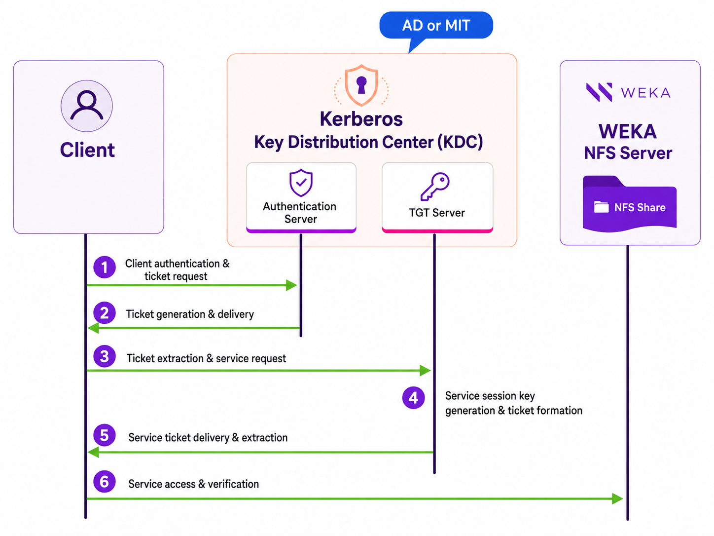
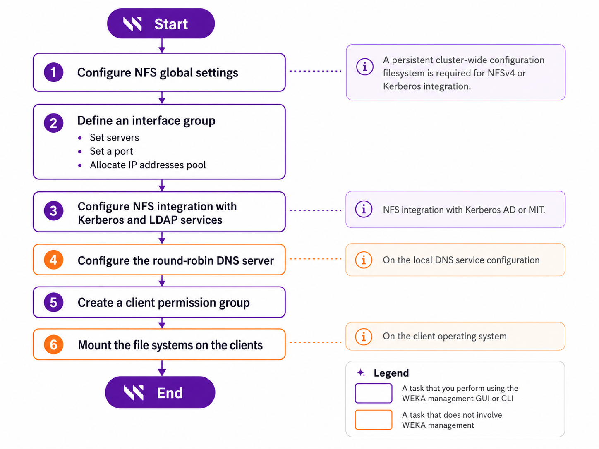

# Manage the NFS protocol

NFS (Network File System) is a protocol that enables clients to access the WEKA filesystem without requiring WEKA's client software. This leverages the standard NFS implementation of the client's operating system.

WEKA supports an advanced NFS implementation, NFS-W, designed to overcome inherent limitations in the NFS protocol. NFS-W is compatible with NFSv3 or NFSv4[^1] protocols and offers enhanced capabilities, including support for more than 16 user security groups and NFS file-locking.


The legacy NFS stack is no longer supported.


## NFS service deployment guidelines and requirements

Adhere to the following guidelines and requirements when deploying the NFS service.

### **Configuration filesystem**

A persistent cluster-wide configuration filesystem is required for the protocol's internal operations using NFSv4 or Kerberos integration. See [#dedicated-filesystem-for-persistent-protocol-configurations-requirement](../additional-protocols-overview.md#dedicated-filesystem-for-persistent-protocol-configurations-requirement "mention").

### **Interface groups**

An interface group provides resilience and high availability for NFS services by enabling transparent failover between NFS servers.

* **Resilience:** An interface group requires a minimum of two WEKA servers to ensure continuous NFS availability. If a server becomes unavailable, its floating IPs automatically migrate to a healthy server in the group.
* **Server membership:** An interface group consists of a set of WEKA servers, each with a designated network port. All ports must be associated with the same subnet.
* **Floating IP management:** The group includes one or more floating IP addresses used by the NFS service. All floating IPs must reside in the same subnet, and each server must already have a static IP configured on the corresponding network interface.
* **Routing configuration:** Floating IPs must comply with the network routing configuration to ensure proper reachability and failover behavior.


Floating IPs are supported on AWS but not on Azure, GCP, and OCI cloud environments.


An interface group can have only a single port. Therefore, two interface groups are required to support High Availability (HA) in NFS. When assigning the other server ports to these interface groups, consider the network topology to ensure no single point of failure exists in the switch.

You can define up to 10 different Interface groups. Use multiple interface groups if the cluster connects to multiple subnets. You can set up to 50 servers in each interface group.

The WEKA system automatically distributes the IP addresses evenly on each server and port. If a server fails, the WEKA system redistributes the IP addresses associated with the failed server to other servers.


The WEKA system automatically configures the floating IP addresses used by the NFS service on the appropriate server. Refrain from manually configuring or using the floating IP.


### Round-robin DNS server configuration

To ensure load balancing between the NFS clients on the different WEKA servers serving NFS, it is recommended that a round-robin DNS entry be resolved to the list of floating IPs.


Set the TTL (Time to Live) for all records assigned to the NFS servers to 0 (Zero). This action ensures that the client or the DNS server does not cache the IP.


**Related information**

[Round-robin DNS](https://en.wikipedia.org/wiki/Round-robin_DNS)

### NFS client mount

The NFS client mount is configured using the standard NFS stack operating system. The NFS server IP address must point to the round-robin DNS name.

### Access Control List (ACL) in NFS

Access Control List (ACL) in NFS (Network File System) provide fine-grained control over file permissions, offering more flexibility than traditional POSIX permissions. NFS supports multiple ACL flavors, each serving different use cases and interoperability needs.


To enable ACL functionality, you must configure LDAP to manage user and group information.


**ACL types in NFS**

NFS supports the following ACL types:

* **None**: No ACL enforcement or updates occur, even if POSIX ACLs exist on a file or directory. This flavor is used when ACL management is unnecessary.
* **POSIX**: NFS enforces POSIX ACLs, ensuring compatibility with other protocols. However, the finer granularity of NFSv4 ACLs is lost when mapped to POSIX ACLs. This option is suitable for environments requiring basic ACL management across multiple protocols.
* **NFSv4**: NFSv4 ACLs are enforced directly, without mapping to POSIX ACLs. This flavor preserves the full granularity of NFSv4 ACLs but does not support interoperability with other protocols. ACLs are stored as extended attributes and mapped to user and group IDs (UID/GID). Use NFSv4 when full NFSv4 ACL granularity is required, and interoperability with other protocols is not a concern.
* **Hybrid**: This flavor combines both POSIX and NFSv4 ACLs to support interoperability. NFS ensures consistency between the two ACL types, and if any inconsistency arises, POSIX ACL is used for enforcement. Hybrid is ideal for environments requiring both interoperability and full NFSv4 ACL functionality.


**NFSv3 and ACLs:** The NFSv3 implementation does not support ACLs. Access control for NFSv3 clients is enforced by the underlying filesystem using standard POSIX file permissions.


**Managing ACLs in NFS**

ACL configuration and management in NFS can be done through various interfaces:

* **CLI**: The `weka nfs permission` and `weka nfs global-config` commands allow users to configure ACLs at the permission and cluster level. NFS permissions exporting files from the same backend file system must share the same ACL flavor.
* **GUI**: The NFS settings in the user interface include options to enable ACLs and configure default ACL flavors (None, POSIX, NFSv4, Hybrid). Changes to ACL settings may require restarting the NFS containers.
* **Configuration filesystem**:\
  ACL flavors and related configurations are tracked in the global configuration filesystem, ensuring consistent management of permissions across the system.

**Upgrading and ACLs**

When upgrading, the default ACL flavor for all permissions sets to **POSIX**. ACLs are enabled by default. To ensure proper ACL functionality, both `.config_fs` and LDAP must be configured.

### NFS integration with Kerberos service

WEKA facilitates the seamless integration of NFS with an existing Kerberos service. This integration enables clients' authentication, data integrity, and data privacy over the wire when interacting with the NFS server, ensuring robust security even across untrusted networks.

The Kerberos security levels are:

* **krb5:** Implements basic Kerberos authentication.
* **krb5i:** Incorporates Kerberos authentication with data integrity assurance.
* **krb5p:** Integrates Kerberos authentication with data integrity and privacy measures.


NFS exports created before configuring Kerberos are not updated automatically when using Kerberos. The Authenticator Type must be modified to one of the Kerberos types to leverage the Kerberos advantages.


#### Kerberos LDAP configurations

WEKA supports Kerberos authentication for NFS using AD and Kerberos MIT:

* **Active Directory (AD):** NFS integrates with Active Directory (AD), which includes built-in Kerberos services. WEKA interacts with the AD using the Kerberos protocol to authenticate service requests among trusted devices.
* **Kerberos MIT:** NFS integrates with Kerberos MIT, implementing the Kerberos protocol, which uses secret-key cryptography for authentication across insecure networks. This protocol is widely standardized and utilized.


Realm consistency: To use Kerberos with the NFS service, the NFS service, the NFS clients, and the Key Distribution Center (KDC) must all reside within the same Kerberos realm.


#### Kerberos service interactions basic outline

The following Kerberos service interactions ensure secure communication between the client and the WEKA NFS server:

1. **Client authentication and ticket request:** The client sends a request, including encrypted credentials, to the Authentication Server for a Ticket Granting Ticket (TGT).
2. **Ticket generation and delivery:** The Authentication Server verifies the client’s identity, generates a session key, forms a TGT, and sends these to the client.
3. **Ticket extraction and service request:** The client decrypts the received message, extracts the session key and the TGT, and sends a service request to the Ticket Granting Server.
4. **Service session key generation & ticket formation:** The Ticket Granting Server verifies the TGT, generates a Service Session Key, and forms a Service Ticket.
5. **Service ticket delivery & extraction:** The Ticket Granting Server sends the Service Ticket and the Service Session Key to the client, who then decrypts the response and extracts these for later use.
6. **Service access & verification:** The client generates an authenticator for the network service and sends it along with the Service Ticket to the network service, which then verifies the Service Ticket and the authenticator.

<div data-with-frame="true"><figure><figcaption><p>Kerberos service interactions (simplified view)</p></figcaption></figure></div>


This diagram illustrates the Kerberos service interactions in a simplified manner. It highlights how secure communication is established over insecure networks. Note that this is a broad representation, and actual implementations may differ.


### Scalability, load balancing, and resiliency

For performance scalability, add as many servers as possible to the interface group.

The cluster supports a maximum of 200 floating IPs to facilitate load balancing by distributing them evenly across all interface group servers and ports. In systems with more NFS interfaces than this limit, not every interface will have a dedicated floating IP.

When different clients resolve the DNS name into an IP service, each receives a different IP address, ensuring that other clients access different servers. This design allows the WEKA system to scale and service thousands of clients.

To ensure service resilience, if a server fails, the system reassigns all IP addresses associated with the failed server to other servers using GARP[^2] network messages. The clients then reconnect to the new servers without any reconfiguration or service interruption.

### NFS file-locking support

WEKA supports NFS byte-range [advisory locking](#user-content-fn-3)[^3] for NFS versions 3, 4, and 4.1. This mechanism ensures synchronized access to files in a networked environment by allowing multiple processes to coordinate access to shared files. It helps maintain data integrity and consistency by preventing concurrent modifications that could lead to data corruption. WEKA’s implementation is interoperable with POSIX byte-range advisory locks, enabling compatibility and coordination between NFS clients and WEKA’s filesystem.

#### NFS file-locking prerequisites for NFSv3

* **Port prerequisites:** Ports used by the `nlockmgr` and `status` services must be open on the clients and WEKA servers. Use **one** of the following methods to meet this requirement:
  *   Disable and stop `firewalld` using the commands:

      ```
      systemctl stop firewalld.service
      systemctl disable firewalld.service
      ```
  *   Define the ports in `/etc/services` and restart the `rpc.statd` (ensure the port numbers are open). For example:

      ```
      status		46999/tcp		# rpc status
      status		46999/udp		# rpc status
      nlockmgr 	47000/tcp		# nlockmgr
      nlockmgr 	47000/udp		# nlockmgr
      ```
* **NFS client prerequisite:** To use NFSv3 with locking on an NFS client, ensure the `rpc.statd` service runs in the NFS client. This enables clients to mount NFSv3 shares.

#### View file locks

To inspect the active locks on a specific file, use the following command:

```bash
weka debug flock list <inode-id>
                      [--snap-view-id snap-view-id]
                      [--verbose]
```

* `<inode-id>`: The unique identifier of the file’s inode.
* `--snap-view-id snap-view-id`: (Optional) Specifies the snapshot view ID for listing locks on a file within a particular snapshot.
* `--verbose`: (Optional) Provides detailed lock information, including the lock owner and type.

This command outputs a list of all current locks on the specified file, enabling administrators to monitor and manage file access effectively.

## NFS service deployment high-level workflow

<div data-with-frame="true"><figure><figcaption><p>NFS service deployment high-level workflow</p></figcaption></figure></div>

For detailed procedures, see the related topics.

**Related topics**

[nfs-support.md](nfs-support.md "mention")

[nfs-support-1.md](nfs-support-1.md "mention")

[^1]: NFSv4.0 and NFSv4.1

[^2]: **GARP (Gratuitous Address Resolution Protocol)**: Network protocol used for IP address reassignment.

[^3]: **Advisory locking**

    A file locking mechanism where processes voluntarily check for and honor locks set by others. It requires all cooperating processes to follow the locking protocol, as the operating system does not enforce it automatically.
