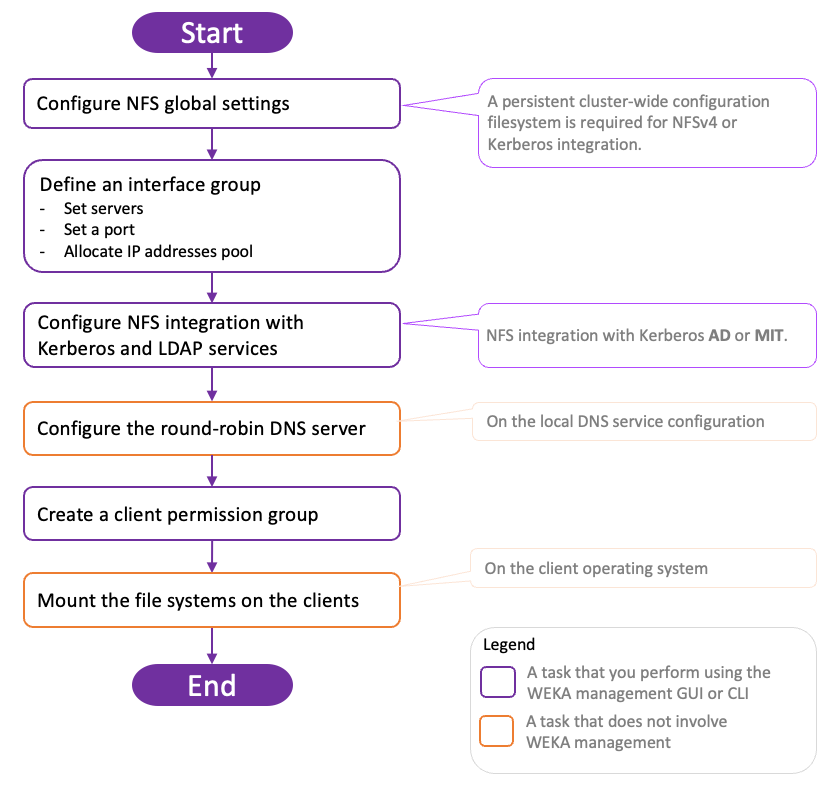

# Manage the NFS protocol

NFS (Network File System) is a protocol that enables clients to access the WEKA filesystem without requiring WEKA's client software. This leverages the standard NFS implementation of the client's operating system.

WEKA supports an advanced NFS implementation, NFS-W, designed to overcome inherent limitations in the NFS protocol. NFS-W is compatible with NFSv3 and NFSv4[^1] protocols, offering enhanced capabilities, including support for more than 16 user security groups.


The legacy NFS stack is no longer supported.


## NFS service deployment guidelines and requirements

Adhere to the following guidelines and requirements when deploying the NFS service.

### **Configuration filesystem**

NFSv4 requires a persistent cluster-wide configuration filesystem for the protocol's internal operations. See [#dedicated-filesystem-for-persistent-protocol-configurations-requirement](../additional-protocols-overview.md#dedicated-filesystem-for-persistent-protocol-configurations-requirement "mention").

### **Interface groups**

An interface group is a configuration framework designed to optimize resiliency among NFS servers. It enables the seamless migration of IP addresses, known as floating IPs, from an unhealthy server to a healthy one, ensuring continuous and uninterrupted service availability.

An interface group consists of the following:

* A collection of WEKA servers with a network port for each server, where all the ports must be associated with the same subnets. For resiliency, a minimum of two NFS servers are required.
* A collection of floating IPs to support the NFS protocol on specified servers and NICs. It's required that all IP addresses are within the same subnet, and the servers must already have static IP addresses on those NICs within that subnet.
* A routing configuration for the IPs. The IP addresses must comply with the IP network configuration.


Floating IPs are supported on AWS but not on Azure, GCP, and OCI cloud environments.


An interface group can have only a single port. Therefore, two interface groups are required to support High Availability (HA) in NFS. Consider the network topology when assigning the other server ports to these interface groups to ensure no single point of failure exists in the switch.

You can define up to 10 different Interface groups. Use multiple interface groups if the cluster connects to multiple subnets. You can set up to 50 servers in each interface group.

The WEKA system automatically distributes the IP addresses evenly on each server and port. If a  server fails, the WEKA system redistributes the IP addresses associated with the failed server to other servers.


The WEKA system automatically configures the floating IP addresses used by the NFS service on the appropriate server. Refrain from manually configuring or using the floating IP.


### Round-robin DNS server configuration

To ensure load balancing between the NFS clients on the different WEKA servers serving NFS, it is recommended to configure a round-robin DNS entry that resolves to the list of floating IPs.


Set the TTL (Time to Live) for all records assigned to the NFS servers to 0 (Zero). This action ensures that the client or the DNS server does not cache the IP.


**Related information**

[Round-robin DNS](https://en.wikipedia.org/wiki/Round-robin\_DNS)

### NFS client mount&#x20;

The NFS client mount is configured using the standard NFS stack operating system. The NFS server IP address must point to the round-robin DNS name.

### NFS access control (client access groups)

The NFS client permission groups are defined to control the access mapping between the servers and the filesystems. Each NFS client permission group contains the following:

* A list of filters for IP addresses or DNS names of clients that can be connected to the WEKA system by NFS.
* A collection of rules that control access to specific filesystems.

### Scalability, load balancing, and resiliency&#x20;

To allow for performance scalability, add as many servers as possible to the interface group.

To achieve load balancing, implement floating IPs, which are evenly distributed over all the interface group servers and ports by default. When different clients resolve the DNS name into an IP service, each receives a different IP address, ensuring that other clients access different servers. This allows the WEKA system to scale and service thousands of clients.

To ensure the resilience of the service if a server fails, all IP addresses associated with the failed server are reassigned to other servers (using the GARP network messages), and the clients reconnect to the new servers without any reconfiguration or service interruption.

## NFS service deployment high-level workflow

<figure><figcaption>
NFS service deployment workflow
</figcaption></figure>

For detailed procedures, see the related topics.

**Related topics**

[nfs-support.md](nfs-support.md "mention")

[nfs-support-1.md](nfs-support-1.md "mention")

[^1]: NFSv4.0 and NFSv4.1
