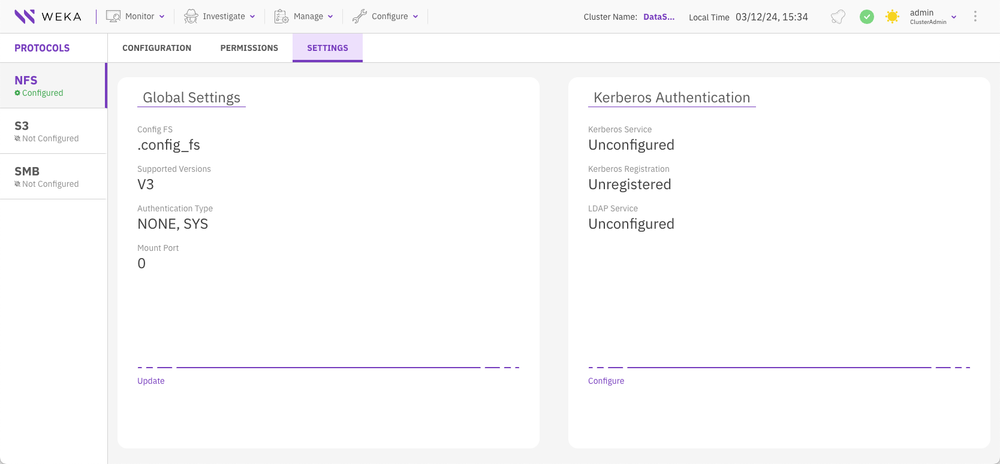
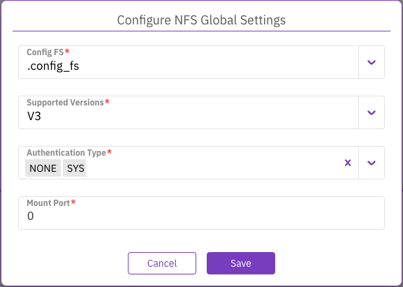
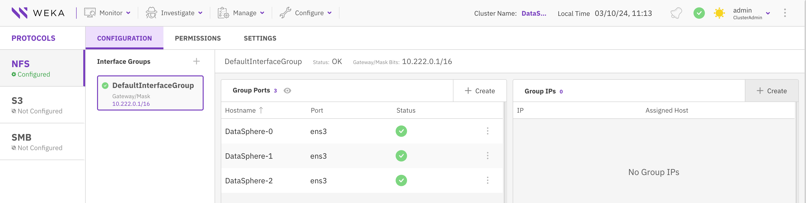
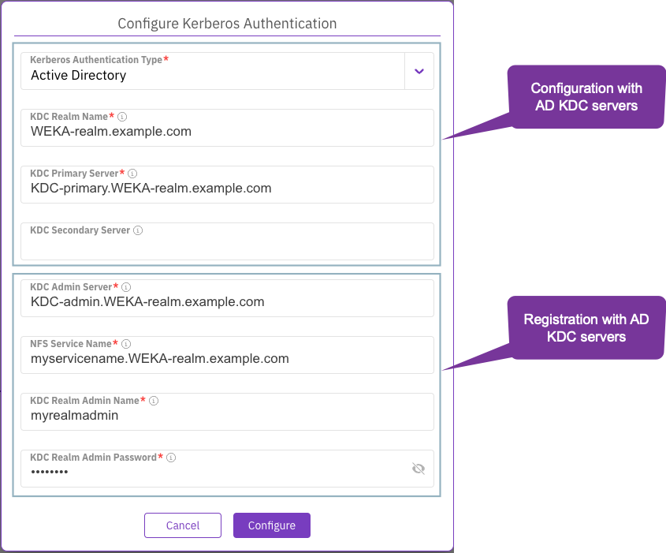
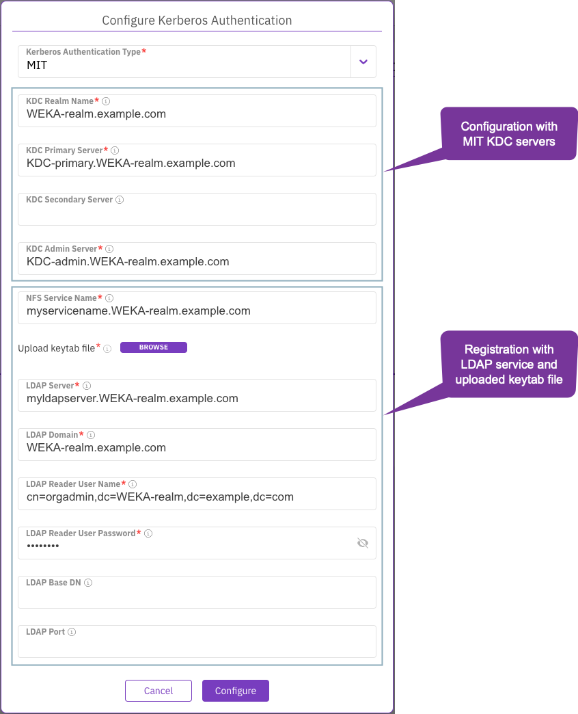

# Manage NFS networking using the GUI

Using the GUI, you can:

* [Configure the NFS global settings](nfs-support.md#configure-the-nfs-global-settings)
* [Configure the NFS cluster level](nfs-support.md#create-interface-groups)
* [Integrate the NFS and Kerberos service](nfs-support.md#integrate-the-nfs-and-kerberos-service)
* [Configure the NFS export level (permissions)](nfs-support.md#configure-the-nfs-export-level-permissions)

## Configure the NFS global settings

NFS global settings consist of parameters that enable you to customize various aspects of the NFS service, including the support of the NFS protocol versions, the types of Kerberos authentication to use, and the port for mount requests.

By tailoring these settings, you can ensure that the NFS service meets your needs and requirements, such as supporting NFS V3 and V4 for compatibility with different client systems.


The possible Kerberos authentication types are available only after configuring the Kerberos integration.&#x20;


**Procedure**

1. From the menu, select **Manage > Protocols**.
2. On the left pane, select **NFS**.
3. Select the **Settings** tab.

<figure><figcaption>
NFS Settings tab
</figcaption></figure>

4. In the Global Settings section, select **Update**, and do the following:
   * **Config FS**: Select the cluster-wide configuration filesystem that maintains the NFS and Kerberos configurations.
   * **Supported Versions**: Select the NFS versions you wish to support based on your needs. Options include V3, V4, or both.
   *   **Authentication Type**: Enable the authentication types that can be used when setting the NFS client permissions. \
       Possible values:

       * NONE: No authentication.
       * SYS: System authentication.
       * KRB5: Basic Kerberos authentication.
       * KRB5i: Kerberos authentication with data integrity.
       * KRB5p: Kerberos authentication with data integrity and privacy.

       The Kerberos authentication types are visible only if Kerberos is configured.\
       Example: KRB5  KRB5i  KRB5p.\
       The default values depend on Kerberos configuration:

       * If not configured: NONE SYS
       * If configured: KRB5
5. Select **Save** to apply the settings.

<figure><figcaption>
Configure global NFS settings dialog
</figcaption></figure>

## **Configure the NFS cluster level** 

Configuring the NFS cluster level involves creating an interface group and assigning at least one server with its corresponding port.

### Create an interface group 

**Procedure**

1. From the menu, select **Manage > Protocols**.
2. On the left pane, select **NFS**.
3. In the Configuration tab, select the **+** sign near the Interface Groups title.&#x20;

4. In the Create Interface Group dialog, set the following properties:
   * **Name**: A unique interface group name (maximum 11 characters).
   * **Gateway**: A valid IP address of the gateway.
   * **Subnet mask**: The subnet mask in CIDR (Classless Inter-Domain Routing) format. For example, a value of 16 equals 255.255.0.0.
5. Select **Save**.

### Set interface group ports

After creating an interface group, set the ports for this group to establish the NFS cluster. You can only set these ports on frontend containers. To ensure system resiliency, have at least two NFS servers in place.

Repeat this port setting process for each server participating in the NFS cluster.

**Procedure**

1. In the Configuration tab, select the interface group.
2. In the Group Ports table, select **+Create**.
3.  In the Add Port dialog, set the following properties:

    * **Hostname**: Select the server on which the port resides.
    * **Port:** Select the port from the list.

    Select **Save**.

#### Example

<figure><figcaption>
Example: Three servers participate in the NFS cluster
</figcaption></figure>

### Remove an interface group port

You might need to remove an interface group due to a change in network configuration, for efficiency, for troubleshooting, during network reorganization, or to replace it with a more suitable group. Always check that the group isn’t in use before you remove it to avoid disruptions.

**Procedure**

1. In the Configuration tab, select the interface group.
2. In the Group Ports table, select the three dots, and from the menu, select **Remove**.&#x20;

### **Set interface group IPs**


Floating IPs are not supported for cloud-based installation.


**Procedure**

1. In the Configuration tab, select the interface group.
2. In the Group IPs table, select **+Create**.
3. In the Add Range IP dialog, set the relevant IP range.
4. Select **Save**.

### Remove an interface group IP range

**Procedure**

1. In the Configuration tab, select the interface group.
2. In the Group IPs table, select the three dots, and from the menu, select **Remove**.

## Integrate the NFS and Kerberos service

Integrating the NFS and Kerberos service is critical to setting up a secure network communication process. This procedure involves defining the Key Distribution Center (KDC) details, administrative credentials, and other parameters to ensure a robust and secure authentication process.

**Before you begin**

* Ensure a configuration filesystem is set. See [#configure-nfs-global-settings](nfs-support.md#configure-nfs-global-settings "mention").
* Ensure the NFS cluster is configured and running. See [#create-interface-groups](nfs-support.md#create-interface-groups "mention").
* For Active Directory (AD) integration, obtain the required information from the AD administrator. (WEKA handles the generation of the keytab file.)
* For MIT integration, obtain the required information from the MIT KDC and OpenLDAP administrators, and a pre-generated keytab file stored in an accessible location is required.


In all KDC and LDAP parameters, use the FQDN format. The hostname part of the FQDN is restricted to a maximum of 20 characters.


**Procedure**

1. From the menu, select **Manage > Protocols**.
2. On the left pane, select **NFS**.
3. Select the **Settings** tab.
4. In the Kerberos Authentication section, select **Configure**.


Configuring the NFS-Kerberos service integration automatically restarts the NFS containers, leading to a temporary disruption in the IO service for connected NFS clients.


5. Choose the tab that matches your authentication method and follow its instructions.



1. From the Kerberos Authentication Type, select Active Directory (AD).
2. Set the following parameters to configure the Kerberos with AD KDC servers:
   * **KDC Realm Name**: Specifies the realm (domain) used by Kerberos.
   * **KDC Primary Server**: Identifies the server hosting the primary Key Distribution Center service.
   * **KDC Secondary Server**: Identifies the server hosting the secondary Key Distribution Center service.
   * **KDC Admin Server**: Identifies the server hosting the administrative Key Distribution Center service.
3. Set the following parameters to register the Kerberos service:
   * **NFS Service Name**: This refers to the complete domain name for a specific NFS server.
   * **KDC Realm Admin Name**: The username of an administrator who has access to the LDAP directory. This user manages the KDC within a realm.
   * **KDC Realm Admin Password**: The password of the administrative user who manages the KDC within a realm.
4. Select **Save** to apply the changes.

<figure><figcaption>
Configure Kerberos authentication over AD dialog
</figcaption></figure>



1. In From the Kerberos Authentication Type, select MIT.&#x20;
2. Set the following parameters to the MIT KDC servers:
   1. **KDC Realm Name**: Specifies the realm (domain) used by Kerberos.
   2. **KDC Primary Server**: Identifies the server hosting the primary Key Distribution Center service.
   3. **KDC Secondary Server**: Identifies the server hosting the secondary Key Distribution Center service.
   4. **KDC Admin Server**: Identifies the server hosting the administrative Key Distribution Center service.
3. Set the following parameters to register the Kerberos with LDAP service and uploaded keytab file:
   * **NFS Service Name**: This refers to the complete domain name for a specific NFS server.
   * **Upload keytab file**: Use the **Browse** option to upload the pre-generated keytab file. This file contains the keys for the NFS service’s unique identity, known as a principal, in Kerberos.
   * **LDAP Server**: Specifies the server hosting the Lightweight Directory Access Protocol service.
   * **LDAP Domain**: Defines the domain that the Lightweight Directory Access Protocol service will access.
   * **LDAP Reader User Name**: The username of an administrative user, used to generate the keytab file.
   * **LDAP Reader User Password**: The password of the administrative user.
   * **LDAP Base DN**: The base Distinguished Name (DN) for the Lightweight Directory Access Protocol directory tree.
   * **LDAP Port**: The port number on which the Lightweight Directory Access Protocol server listens.
4. Select **Save** to apply the changes.

<figure><figcaption>
Configure Kerberos authentication over MIT dialog
</figcaption></figure>




After completing the kerberos integration settings, the enabled authentication type is **KRB5**. If you want to modify the enabled authentication types, in the Configure NFS Global Settings, select **Update**, and set the authentication types. See [#configure-the-nfs-global-settings](nfs-support.md#configure-the-nfs-global-settings "mention").


### **Reset the** Kerberos configuration 

Resetting the Kerberos configuration is necessary when you need to completely remove the Kerberos service configuration data. Once the data is removed, you can set up a new Kerberos service integration.

Upon resetting the Kerberos configuration, it triggers the following two actions:

* The NFS containers are restarted, leading to a temporary disruption in the I/O service for connected NFS clients.
* The authentication types in the NFS Global Settings are reset to their default values.


These actions may impact your system’s performance and functionality. Proceed with caution.


## Configure the NFS export level (permissions)

### Create client access groups 

Creating additional client groups helps in better organization, customization of settings, and enhanced security by segregating access levels.

**Procedure**

1. In the Permissions tab, select the **+** sign near the Client Groups title.

3. In the Create Client Group dialog, set the client group name.
4. Select **Save**.&#x20;

### Assign a DNS and IP to a client group

Assigning a DNS and IP to a client group facilitates network communication and resource access. This step is crucial for the group’s operational functionality.

**Procedure**

1. In the NFS configuration, select the **Permissions** tab.
2. In the Permissions tab, select **Add DNS** for the relevant Client Group.

2. In the Create Client Group DNS Rule dialog, set the DNS server name. Then, select **Save**.

3. In the Permissions tab, select **Add IP** for the relevant Client Group.
4. In the Create Client Group IP Rule dialog, set the IP address and bitmask. Then, select **Save**.

### Remove the DNS or IP of a client group

**Procedure**

1. In the Permissions tab, select the **trash** symbol displayed next to the DNS or IP for the relevant Client Group.

### Create NFS client permission 

Creating NFS permissions for a client group enhances access control and efficiency. It allows system administrators to manage access to files, protecting sensitive data and simplifying permission management.

NFS permissions also provide flexibility and foster collaboration. They can be adjusted as needed, especially when a team needs to work on the same files. However, they work best in trusted environments.

**Before you begin**

If you create an NFS v4 client permission, verify that a global configuration filesystem is already set in the system. See [#configure-the-nfs-global-settings](nfs-support.md#configure-the-nfs-global-settings "mention").

**Procedure**

1. In the Permissions table, select **+Create**.

2. In the Create NFS Permission dialog, set the following properties:
   * **Client Group**: The client group to which the permissions are applied.
   * **Filesystem**: The filesystem to which the permissions are applied. A filesystem with Required Authentication set to ON cannot be used for NFS client permissions.
   * **Path**: The shared directory path (root share).
   * **Type**: The access type: RO (read-only) or RW (read/write).
   * **Priority:** Permissions are processed in ascending priority order during access evaluation, beginning with the lowest number. If a client matches multiple permission entries, the entry with the highest priority number determines the effective permission. Using a numbering system in tens (10, 20, 100) is advisable to facilitate the addition of priorities between existing ones.
   * **Supported Versions:** The supported NFS versions (V3, V4, or both).
   * **User Squash**: The system enforces squash mode with the client's permission.
   * **Authentication Types:** The method of authentication. The enabled authentication types in the NFS global settings determine the possible options and the default.\
     Examples:
     * Enabled types: NONE, SYS, KRB5, KRB5i, KRB5p. Default: KRB5.
     * Enabled types: NONE, SYS. Default: NONE, SYS.
     * Enabled types: NONE, SYS, KRB5i, KRB5p. Default: KRB5i.
   * **Anon. UID**: Anonymous user ID. Only relevant for Root and All user squashing.
   * **Anon. GID:** Anonymous group ID. Only relevant for Root and All user squashing.
3. Select **Save**.

### Edit NFS client permission 

You can edit the existing NFS permission settings for a client group.  You can also move the priority to the top or bottom priority (related to other client group priorities). If the client group permission setting is no longer required, you can remove it.

**Procedure**

1. In the Permissions table, select the three dots of the client group to edit, and select **Edit**.

<figure><figcaption>
Edit a client group permissions
</figcaption></figure>

2. Set the relevant properties: Type, Priority, Supported Versions, Squash Root, Authentication Type, Anon. UID, and Anon. GID. Then, select **Save**.
3. To move the priority of a client group setting to the top or bottom priority, select **Move to top priority** or **Move to bottom priority**.
4. To remove the client group permission setting, select **Remove**.

**Related topics**

[supported-nfs-client-mount-options.md](supported-nfs-client-mount-options.md "mention")
