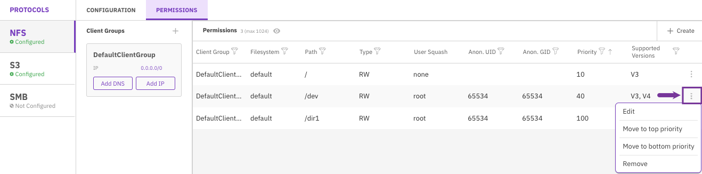

# Manage NFS networking using the GUI

Using the GUI, you can:

* **Configure the NFS cluster level**
  * [Create interface groups](nfs-support.md#create-interface-groups)
  * [Set interface group ports](nfs-support.md#set-interface-group-ports)
  * [Set interface group IPs](nfs-support.md#set-interface-group-ips)
* **Configure the NFS export level (permissions)**
  * [Define client access groups](nfs-support.md#define-client-access-groups)
  * [Manage client access groups](nfs-support.md#manage-client-access-groups)
  * [Create NFS client permission](nfs-support.md#create-nfs-client-permission)
  * [Edit NFS client permission](nfs-support.md#edit-nfs-client-permission)

## Create interface groups 

Interface Groups define the servers and ports that provide the NFS service.


If you need to create the interface group in the legacy NFS stack, use the CLI. See [Create interface groups](nfs-support-1.md#create-interface-groups) and set the `allow-manage-gids` parameter to `off.`


**Procedure**

1. From the menu, select **Manage > Protocols**.
2. On the left pane, select **NFS**.
3. In the Configuration tab, select the **+** sign near the Interface Groups title.&#x20;

4. In the Create Interface Group dialog, set the following properties:
   * **Name**: A unique interface group name (maximum 11 characters).
   * **Gateway**: A valid IP address of the gateway.
   * **Subnet mask**: The subnet mask in CIDR (Classless Inter-Domain Routing) format. For example, a value of 16 equals 255.255.0.0.
5. Select **Save**.

**Related topic**

[#implement-nfs-service-from-a-weka-cluster](./#implement-nfs-service-from-a-weka-cluster "mention")

## Set interface group ports

Once you create an interface group, set its ports. You can set the ports only on frontend containers.

**Procedure**

1. In the Configuration tab, select the interface group.
2. In the Group Ports table, select **+Create**.

3. In the Add Port dialog, set the following properties:
   * **Hostname**: Select the server on which the port resides.
   * **Port:** Select the port from the list.

### Remove an interface group port

**Procedure**

1. In the Configuration tab, select the interface group.
2. In the Group Ports table, select the three dots, and from the menu, select **Remove**.&#x20;

## **Set interface group IPs**

**Procedure**

1. In the Configuration tab, select the interface group.
2. In the Group IPs table, select **+Create**.

3. In the Add Range IP dialog, set the relevant IP range.
4. Select **Save**.

### Remove an interface group port

**Procedure**

1. In the Configuration tab, select the interface group.
2. In the Group IPs table, select the three dots, and from the menu select **Remove**.&#x20;

.png>)

## Define client access groups 

**Procedure**

1. In the Permissions tab, select the **+** sign near the Client Groups title.

3. In the Create Client Group dialog, set the client group name (DNS server name).
4. Select **Save**.&#x20;

**Related topics**

[#configure-the-round-robin-dns-server](./#configure-the-round-robin-dns-server "mention")

## Manage client access groups 

**Procedure**

1. In the Permissions tab, select **ADD DNS** for the relevant Client Group.

2. In the Create Client Group DNS Rule dialog, set the DNS server name. Then, select **Save**.

3. In the Permissions tab, select **ADD IP** for the relevant Client Group.
4. In the Create Client Group IP Rule dialog, set the IP address and bitmask. Then, select **Save**.

### Remove DNS or IP of a client group

**Procedure**

1. In the Permissions tab, select the **trash** symbol displayed next to the DNS or IP for the relevant Client Group.

## Create NFS client permission 

You can create NFS permission for a client group.

**Before you begin**

If you create an NFS v4 client permission, verify that a global configuration filesystem is already set in the system. If not, set it using the CLI. See [Set the global configuration filesystem](nfs-support-1.md#configure-the-nfs-configuration-filesystem).&#x20;

**Procedure**

1. In the Permissions table, select **+Create**.

2. In the Create NFS Permission dialog, set the following properties:
   * **Client Group**: The client group to which the permissions are applied.
   * **Filesystem**: The filesystem to which the permissions are applied. A filesystem with Required Authentication set to ON cannot be used for NFS client permissions.
   * **Path**: The exported directory path (root share).
   * **Type**: The access type: RO (read-only) or RW (read/write).
   * **Priority:** Permissions are processed in ascending priority order during access evaluation, beginning with the lowest number. If a client matches multiple permission entries, the entry with the highest priority number determines the effective permission. Using a numbering system in tens (10, 20, 100) is advisable to facilitate the addition of priorities between existing ones.
   * **Supported Versions:** The supported NFS versions (V3, V4, or both).
   * **Squash Root**: The system enforces squash mode with the client's permission.
   * **Anon. UID**: Anonymous user ID. Only relevant for Root and All user squashing.
   * **Anon. GID:** Anonymous group ID. Only relevant for Root and All user squashing.
3. Select **Save**.

## Edit NFS client permission 

You can edit the existing NFS permission settings for a client group.  You can also move the priority to the top or bottom priority (related to other client group priorities). If the client group permission setting is no longer required, you can remove it.

**Procedure**

1. In the Permissions table, select the three dots of the client group to edit, and select **Edit**.

<figure><figcaption>
Edit a client group permissions
</figcaption></figure>

2. Set the relevant properties: Type, Priority, Supported Versions, Squash Root, Anon. UID, and Anon. GID. Then, select **Save**.
3. To move the priority of a client group setting to the top or bottom priority, select **Move to top priority** or **Move to bottom priority**.
4. To remove the client group permission setting, select **Remove**.

**Related topics**

[#supported-nfs-client-mount-options](./#supported-nfs-client-mount-options "mention")
