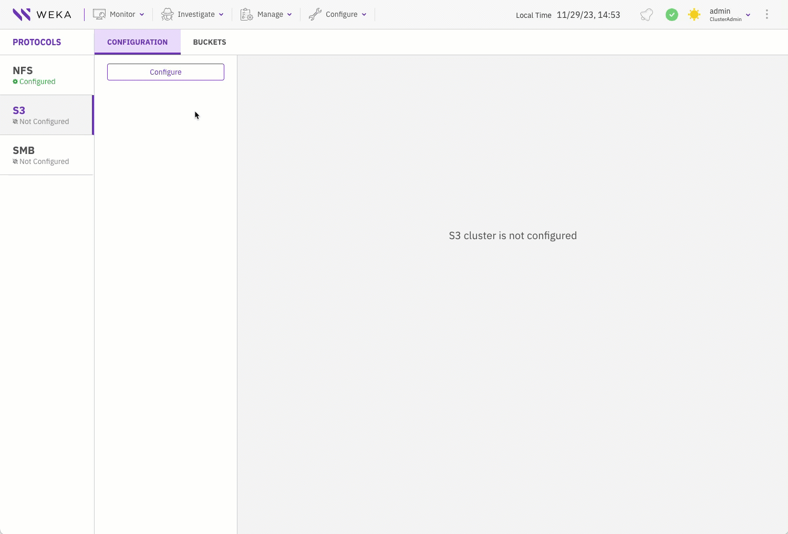
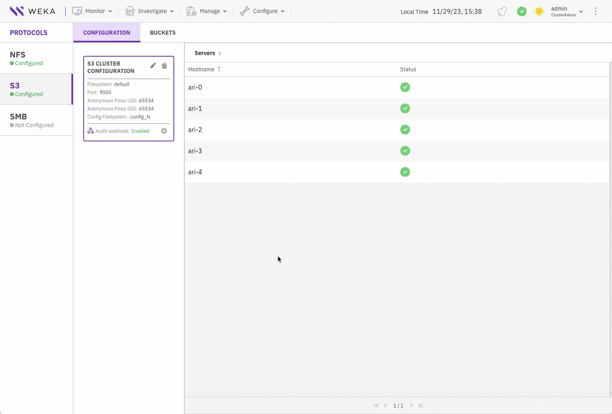

# Manage the S3 protocol

The S3 protocol is integral to numerous cloud-native applications, and within the WEKA system, it offers a range of technical capabilities:

* **Data management:**
  * Ingest data using the S3 protocol.
  * Access ingested data using S3 or other supported protocols.
* **Data exposure to S3:**
  * Enable seamless migration of applications within the WEKA data platform by making existing data accessible through the S3 protocol. This integration ensures a smooth transition without the need for data relocation.
* **Cloud integration:**
  * Enable cloud bursting to use new applications without relocating data.
* **Multi-protocol access with WEKA:**
  * Leverage WEKA's scale, performance, and resiliency advantages.
  * Gradually transition applications to S3, maintaining data access through multiple protocols: POSIX, S3, SMB, NFS, and GPUDirect Storage.

The WEKA S3 service is designed for scalability and resilience. Implementation involves specifying WEKA servers running the S3 protocol and creating a logical S3 cluster to expose the service. Scalability is achieved through multiple servers, and load balancing or round-robin DNS integration facilitates access by numerous clients.

The WEKA S3 service builds on the WEKA filesystem service, mapping buckets to top-level directories and objects to files, allowing data exposure through various WEKA-supported protocols.

## Guidelines for managing S3 access and security

### S3 access

Users can access S3 APIs with either authenticated or anonymous methods.

* **Authenticated S3 access:** To gain authenticated S3 access, follow these guidelines:
  * Create a local WEKA user with an assigned S3 user role.
  * Attach an IAM policy to the S3 user, specifying S3 operations and resource permissions.
  * S3 users can generate temporary security tokens (STS AssumeRole) or employ service accounts with restricted permissions.
* **Anonymous access:** You can use the following options:
  * [Bucket policies](#user-content-fn-1)[^1].
  * [Pre-signed URLs](#user-content-fn-2)[^2].

### S3 security

* **Encryption of data at rest:**
  * Data written through the S3 protocol can be encrypted at rest by configuring an encrypted filesystem.
* **Transport Layer Security (TLS):**
  * Clients access the service securely through HTTPS, using the same certificates as WEKA's other API access points.

### S3 audit

* **Auditing S3 API calls:**
  * S3 API calls are auditable using an HTTP webhook service, integrating into applications such as Splunk[^3].
* **Setting audit targets:**
  * Set an audit target using the `weka s3 cluster audit-webhook enable` CLI command.

## Workflow: Managing S3 resources in WEKA

This workflow guides you through the process of setting up and managing S3 resources within the WEKA system. It covers essential procedures, from creating an S3 cluster and bucket to uploading and downloading objects from S3 buckets. Each step demonstrates the seamless integration of WEKA's capabilities in handling data through the S3 protocol.

Select each tab in the specified order to explore the demonstrations.



Create an S3 cluster within the WEKA environment, specifying the servers to run the S3 protocol and establishing a logical cluster for exposing the S3 service.&#x20;

A predefined configuration filesystem (`.config_fs` in this demo) must exist to maintain the persisting cluster-wide protocol configurations.

<figure><figcaption><p>Create an S3 cluster</p></figcaption></figure>

**Alternative CLI command**

```
weka s3 cluster create default .config_fs --all-servers
```

**Related topics**

[#create-an-s3-cluster](s3-cluster-management/s3-cluster-management.md#create-an-s3-cluster "mention") (using the GUI)

[#create-an-s3-cluster](s3-cluster-management/s3-cluster-management-1.md#create-an-s3-cluster "mention") (using the CLI)



Create of an S3 bucket, a fundamental container for storing and organizing objects within the WEKA S3 service.

<figure><figcaption><p>Create an S3 bucket</p></figcaption></figure>

**Alternative CLI command**

```
weka s3 bucket create mybucket
```

**Related topics**

[#create-a-bucket](s3-buckets-management/s3-buckets-management.md#create-a-bucket "mention") (using the GUI)

[#create-a-bucket](s3-buckets-management/s3-buckets-management-1.md#create-a-bucket "mention") (using the CLI)



Create a dedicated local user with S3 role and assign it with an S3 policy to facilitate secure access to S3 resources.

The S3 local user name and password serve as the S3 access key and secret key, respectively for uploading and downloading objects from S3 buckets.

<figure><figcaption><p>Create a local S3 user</p></figcaption></figure>

**Alternative CLI commands**

```
weka user add S3_user S3
weka s3 policy attach readwrite
```

**Related topics**

[#create-a-local-user](../../operation-guide/user-management/user-management.md#create-a-local-user "mention") (using the GUI)

[#create-a-local-user](../../operation-guide/user-management/user-management-1.md#create-a-local-user "mention") (using the CLI)



You can implement either the self-signed certificate or a custom certificate. The cluster TLS certificate is enabled using an auto-generated self-signed certificate, providing access to the GUI, CLI, and API through HTTPS. If a custom TLS certificate is preferred, you can set in place of the auto-generated self-signed certificate.

To apply your chosen certificate, download it to your client and place it in the designated folder for seamless integration. For example, in RHEL OS, the designated folder is `/etc/pki/tls/certs`.

<figure><figcaption></figcaption></figure>

**Alternative CLI command**

```
weka security tls download
```

**Related topics**

&#x20;[manage-the-tls-certificate-using-the-gui.md](../../operation-guide/security/tls-certificate-management/manage-the-tls-certificate-using-the-gui.md "mention")

[manage-the-tls-certificate-using-the-cli.md](../../operation-guide/security/tls-certificate-management/manage-the-tls-certificate-using-the-cli.md "mention")



Once we have created an S3 cluster that can be accessed through a certain port (default: 9000),  a bucket, and an S3 user assigned with a policy, let's see how the client can upload and download objects from the S3 bucket.

Users can use any client application that can access the bucket through the WEKA cluster URL and port.

This example demonstrates using Boto3[^4], the official Python client of AWS.

In the code snippet named `s3.py`, we set the following parameters in the `S3 = boto3 resource` section:

* `endpoint_url and port`: The URL and port of the WEKA S3 cluster.
* `aws_access_key_id`: The S3 local user name.
* `aws_secret_access_key`:  The S3 local user password.


```python
#!/usr/bin/env/python
import boto3
import logging
from botocore.exceptions import ClientError
from botocore.client import Config

config = Config(
   signature_version = 's3v4'
)

s3 = boto3.resource('s3',
                    endpoint_url='https://ari:9000',
                    aws_access_key_id='S3_user1',
                    aws_secret_access_key='S3_user1',
                    config=config)

try:
  # upload a file from the local filesystem 'myfile' to bucket 'mybucket1' with 'my_uploaded_object' as the object name.
  s3.Bucket('mybucket1').upload_file('myfile','my_uploaded_object')

  # download the object 'myfile' from the bucket 'mybucket1' and save it to the local filesystem as my_downloaded_object.
  s3.Bucket('mybucket1').download_file('my_uploaded_object', 'my_downloaded_object')

except ClientError as e:
        logging.error(e)

print("Downloaded 'my_downloaded_object' as 'my_uploaded_object'. a")
```


**Upload and download**

Test the upload and download using the Python script.

```python
❯ python3 s3.py
Downloaded 'my_downloaded_object' as 'my_uploaded_object'. a
❯ cat my_downloaded_object
Hello World!
```

**Related topic**

[s3-examples-using-boto3.md](s3-examples-using-boto3.md "mention")



As a quick workflow guide, here is a summary of the CLI commands for configuring your S3 cluster and implementing the desired settings:

```
weka s3 cluster create default .config_fs --all-servers
weka s3 bucket create mybucket
weka user add S3_user S3
weka s3 policy attach readwrite
weka security tls download
python3 s3.py
```

[^1]: A bucket policy is a set of rules, defined in JSON format, that you can apply to the bucket. A bucket policy specifies what actions are allowed or denied on the objects within the bucket.

[^2]: A pre-signed URL is a URL that grants temporary access to a specific S3 object. This URL contains authentication information, allowing a user or system to access the object without having to provide their own credentials.

[^3]: Splunk is a real-time data analytics platform that enables organizations to search, monitor, and analyze machine-generated data. It offers insights into diverse data sources, including logs and events, facilitating enhanced operational efficiency, security monitoring, and informed decision-making.

[^4]: Boto is a Python library and a set of tools that simplify interactions with Amazon Web Services (AWS), providing an interface for developers to programmatically access AWS services, including Amazon Simple Storage Service (S3). It streamlines tasks such as object storage, retrieval, and management within AWS environments through Python scripts and applications.\
    For details, see [Boto3 documentation](https://boto3.amazonaws.com/v1/documentation/api/latest/index.html).
