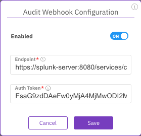

# Configure audit webhook using the GUI

The audit webhook sends S3 APIs audit events to a remote system (for example, Splunk). These events provide a better understanding of the traffic nature.

When creating an S3 cluster, the audit webhook is default enabled but not configured.

**Before you begin**

[#create-an-s3-cluster](../s3-cluster-management/s3-cluster-management.md#create-an-s3-cluster "mention")

**Procedure**

1. From the menu, select **Manage > Protocols**.
2. From the Protocols pane, select **S3**.
3. On the S3 Cluster Configuration, select the **Configure audit webhook** icon.

<figure><figcaption>
<strong>Configure audit webhook</strong>
</figcaption></figure>

4\. On the Audit Webhook Configuration dialog, set the following:

* **Endpoint:** The webhook endpoint URL that receives the events stream.
* **Auth Token:** The webhook authentication token.

5\. Select **Save**.

<figure><figcaption>
Audit Webhook Configuration
</figcaption></figure>
