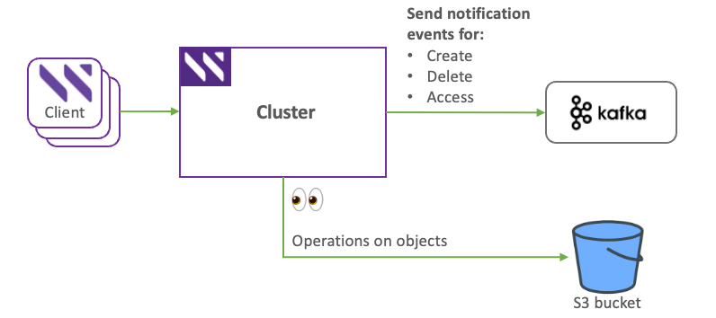

# S3 bucket notifications

## Overview

The S3 bucket notifications feature sends real-time alerts when specific events occur in an S3 bucket. Supported events include object creation, deletion, and access. Notifications are delivered to a user-defined Kafka targets to automate workflows like data processing, backups, and alerts. This reduces manual effort and improves responsiveness.

The system also triggers internal events to indicate operational status, such as queue overflow, queue thresholds reached or recovered, and target unavailability. It provides metrics, including notification rate, queue length, and dropped events, updated every minute for performance monitoring.

<div data-with-frame="true"><figure><figcaption><p>S3 bucket notifications</p></figcaption></figure></div>

### Multi-tenant behavior

In multi-tenant deployments, notification rules are tenant-scoped and notification targets are cluster-wide.

* TenantAdmin can create, update, and remove rules for buckets in the tenant.
* ClusterAdmin manages notification targets for the cluster.
* Tenants can view only their own bucket rules.

| Operation                                              | Who can perform it                   |
| ------------------------------------------------------ | ------------------------------------ |
| Add, update, or remove a notification target           | ClusterAdmin only                    |
| View notification targets                              | ClusterAdmin only                    |
| Add, update, or remove a notification rule on a bucket | TenantAdmin within the tenant        |
| View notification rules                                | TenantAdmin for the tenant's buckets |


Notification targets are shared cluster resources. Multiple tenants can attach rules to the same target. Events from different tenants can flow through the same Kafka topic or webhook endpoint. Per-target tenant isolation is not available in this release.


### How it works

* The system monitors S3 bucket events and sends them to configured targets.
* Events are processed in First-In, First-Out (FIFO) order and sent asynchronously.
* If the notification queue exceeds its configured limit, events are dropped.
* Targets must be reachable to receive notifications; unreachable targets trigger alerts.

### Supported event types

| Category               | Events                                                            |
| ---------------------- | ----------------------------------------------------------------- |
| Object created events  | `Put`, `Post`, `Copy`, `CompleteMultipartUpload`                  |
| Object removed events  | `Delete`                                                          |
| Object accessed events | `Head`, `Get`                                                     |
| Wildcard support       | `s3:ObjectCreated:*`, `s3:ObjectAccessed:*`, `s3:ObjectRemoved:*` |

### Operational considerations and best practices

* Use filtering to reduce unnecessary events.
* Monitor queue high and low watermarks to prevent event loss.
* Ensure targets are available to avoid dropped events.
* Adjust queue limits according to workload and infrastructure capabilities.

## Manage notification targets

You can configure notification targets to receive S3 bucket event notifications. This includes adding, viewing, updating, and removing targets. For secure connections, you can also manage TLS certificates for these targets.

### Before you begin

* Ensure the S3 bucket exists.
* Confirm the Kafka target is reachable and configured to receive messages.
* If using TLS, prepare the certificate and key files.

### Add a Kafka notification target

Create a Kafka target to receive bucket notifications.

**Command**

```bash
weka s3 cluster notification-target add \
  --type kafka \
  --name <target-name> \
  --topic <topic-name> \
  --brokers <broker-addresses> \
  --queue-limit <limit>
```

**Parameters**

|               |                                                                                |
| ------------- | ------------------------------------------------------------------------------ |
| `type`        | Specifies the target type. Supported value: `kafka`.                           |
| `name`        | Name for the target.                                                           |
| `topic`       | Kafka topic name.                                                              |
| `brokers`     | Comma-separated list of `&#x3C;IP or hostname>:&#x3C;port>` for Kafka brokers. |
| `queue-limit` | Maximum queued notifications before dropping events.                           |

**Example**

```bash
weka s3 cluster notification-target add \
  --type kafka \
  --name tgt1 \
  --topic weka-s3 \
  --brokers 10.108.108.28:9092 \
  --queue-limit 10000
```

### View notification targets

**List all targets**

```
weka s3 cluster notification-target list
```

**View details for a specific target**

```bash
weka s3 cluster notification-target show --type kafka --name <target-name>
```

### Update a notification target

Modify parameters of an existing Kafka target.

**Command**

```bash
weka s3 cluster notification-target update \
  --type kafka \
  --name <target-name> \
  [parameters to change]
```

**Example**

```bash
weka s3 cluster notification-target update \
  --type kafka \
  --name tgt1 \
  --topic weka-s3 \
  --queue-limit 20000 \
  --tls-skip-verify true
```

### Remove a notification target

Delete an existing target.

**Command**

```bash
weka s3 cluster notification-target remove --type kafka --name <target-name>
```

**Example**

```bash
weka s3 cluster notification-target remove --type kafka --name tgt1
```

### Manage TLS certificates for notification targets

**Add a certificate**

```bash
weka s3 cluster notification-target cert add <cert-name> \
  --target-type kafka \
  --client-tls-cert <cert-file> \
  --client-tls-key <key-file>
```

**List certificates**

```bash
weka s3 cluster notification-target cert list --target-type kafka
```

**Remove a certificate**

```bash
weka s3 cluster notification-target cert remove <cert-name> --target-type kafka
```

## Manage bucket notification rules

### Add a bucket notification rule

Define when and how events from a specific bucket are sent to a target.

**Command**

```bash
weka s3 bucket notification add <bucket-name> \
  --target-type kafka \
  --target-name <target-name> \
  --events "<event-types>" \
  [--filter-prefix <prefix>] \
  [--filter-suffix <suffix>]
```

**Example**

```bash
weka s3 bucket notification add my-s3-bucket \
  --target-type kafka \
  --target-name tgt1 \
  --events "s3:ObjectCreated:*" \
  --filter-prefix Save \
  --filter-suffix .dat
```

### View bucket notification rules

```bash
weka s3 bucket notification list <bucket-name>
```

### Remove bucket notification rules

**Remove all rules for a target**

```bash
weka s3 bucket notification remove <bucket-name> \
  --target-type kafka \
  --target-name <target-name>
```

**Remove a specific rule**

```bash
weka s3 bucket notification remove <bucket-name> \
  --target-type kafka \
  --target-name <target-name> \
  --events "<event-types>" \
  --filter-suffix "<suffix>"
```


**Important:** The notification queue must be drained before upgrading the system.


### System specifications <a href="#system-specifications" id="system-specifications"></a>

| Parameter                          | Maximum value   |
| ---------------------------------- | --------------- |
| Number of targets per cluster      | 3               |
| Number of rules per bucket         | 10              |
| Total number of rules per cluster  | 1000            |
| Certificate name length            | 32 characters   |
| Target name length                 | 64 characters   |
| SASL username length               | 256 characters  |
| SASL password length               | 256 characters  |
| Number of brokers                  | 8               |
| Broker address length              | 261 characters  |
| Topic name length                  | 255 characters  |
| Bucket notification rule ID length | 255 characters  |
| Filter prefix/suffix length        | 1024 characters |
| Default queue length               | 10,000          |
| Queue high watermark               | 50%             |
