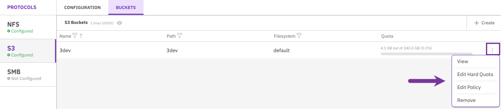
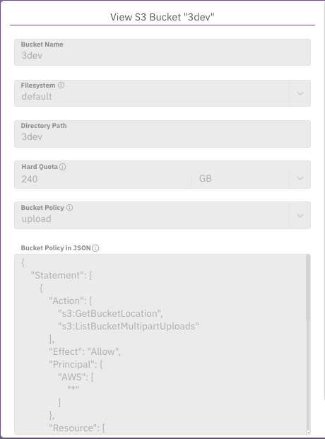
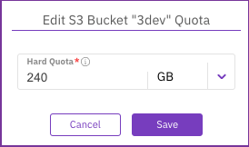
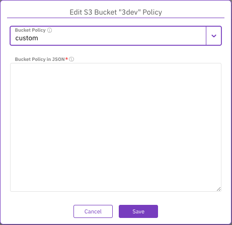
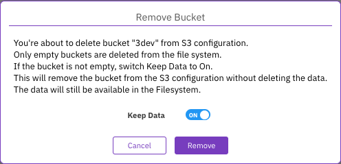

# Manage S3 buckets using the GUI

Using the GUI, you can:

* [Create a bucket](s3-buckets-management.md#create-a-bucket)
* [View a bucket details](s3-buckets-management.md#view-a-bucket-details)
* [Edit a bucket hard quota](s3-buckets-management.md#edit-a-bucket-hard-quota)
* [Edit a bucket policy](s3-buckets-management.md#edit-a-bucket-policy)
* [Remove a bucket](s3-buckets-management.md#remove-a-bucket)

## Create a bucket 

**Procedure**

1. From the menu, select **Manage > Protocols**.
2. From the Protocols pane, select **S3**.
3. Select the **Buckets** tab.
4. Select  **+Create**.

5\. In the Add S3 Bucket dialog, do the following:

* **Bucket Name:** Set a bucket name according to the naming conventions.
* **Filesystem:** Set the filesystem that will host the bucket.
* **Use Existing Directory:** If you want to expose an existing directory, set its path. Make sure that the directory is not below the hierarchy of the already configured S3 bucket.
* **Hard Quota:** Set the maximum capacity for the bucket. If you want to remove the hard quota setting, enter 0.
* **Bucket Policy:** Select the policy to attach to the bucket: none, download, upload, public, or custom. If you select a custom policy, add it in JSON format.

6\. Select **Save**.

## View a bucket details 

You can view the details of the bucket.

**Procedure**

1. From the menu, select **Manage > Protocols**.
2. From the Protocols pane, select **S3**.
3. Select the **Buckets** tab.
4. Select the three dots of the bucket and select **View**.

<figure><figcaption>
Manage a bucket menu
</figcaption></figure>

<figure><figcaption>
View S3 Bucket
</figcaption></figure>

## Edit a bucket hard quota 

The hard quota determines the maximum capacity of the bucket. Initially, you can only set the hard quota for an empty bucket. If the hard quota of the bucket is already set, you can modify it or remove it.

**Procedure**

1. From the menu, select **Manage > Protocols**.
2. From the Protocols pane, select **S3**.
3. Select the **Buckets** tab.
4. Select the three dots of the bucket and select **Edit Hard Quota**.
5. Set the maximum capacity for the bucket. If you want to remove the hard quota setting, enter 0.

<figure><figcaption>
Edit S3 Bucket Quota
</figcaption></figure>

## Edit a bucket policy 

You can edit the bucket policy according to your needs.

**Procedure**

1. From the menu, select **Manage > Protocols**.
2. From the Protocols pane, select **S3**.
3. Select the **Buckets** tab.
4. Select the three dots of the bucket you want to delete, and select **Edit Bucket Policy**.
5. Select the policy to attach to the bucket: none, download, upload, public, or custom. If you select a custom policy, add it in JSON format.

<figure><figcaption>
Edit S3 Bucket
</figcaption></figure>

## Remove a bucket 

When removing a bucket, it is deleted from the filesystem only if it is empty. If the bucket is not empty, you can keep the data on the filesystem and remove the bucket from the S3 configuration.

**Procedure**

1. From the menu, select **Manage > Protocols**.
2. From the Protocols pane, select **S3**.
3. Select the **Buckets** tab.
4. Select the three dots of the bucket you want to delete, and select **Remove**.

<figure><figcaption>
Remove Bucket
</figcaption></figure>

5\. In the confirmation message, if the bucket is not empty, switch Keep Data to On.\
&#x20;   Then, select **Remove**.
