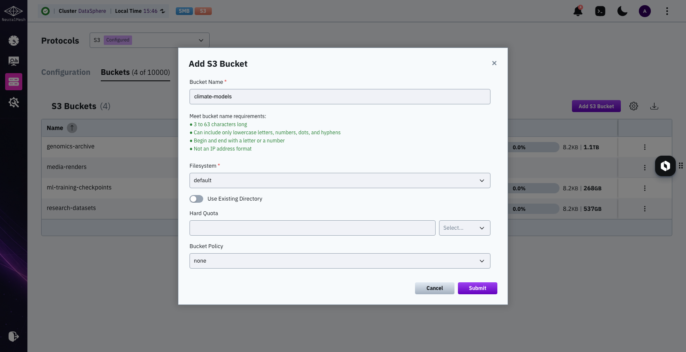
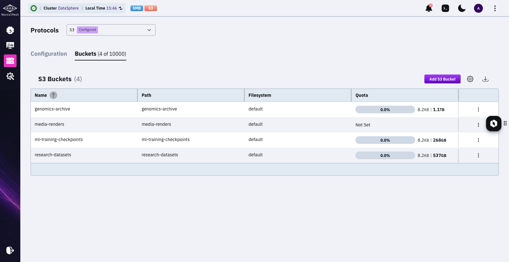
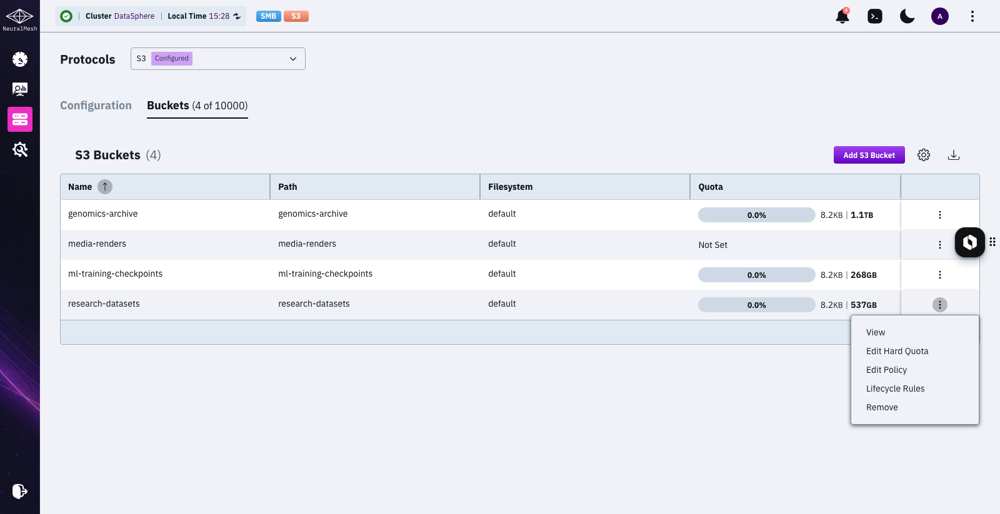
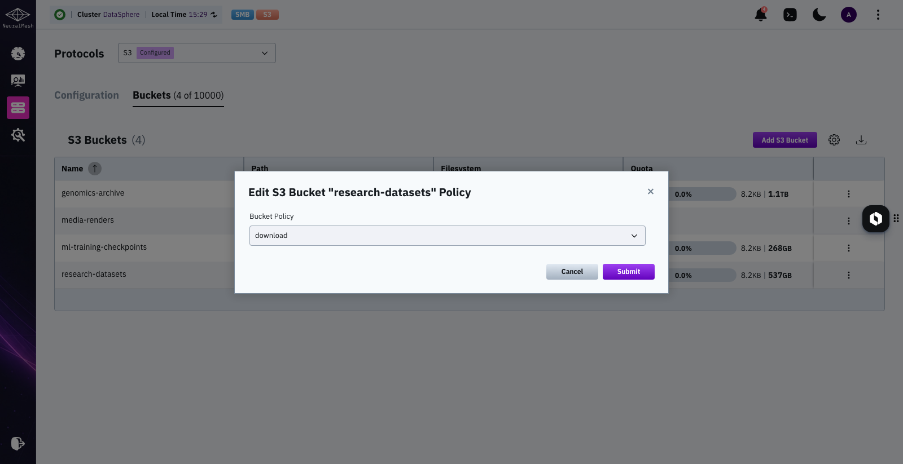
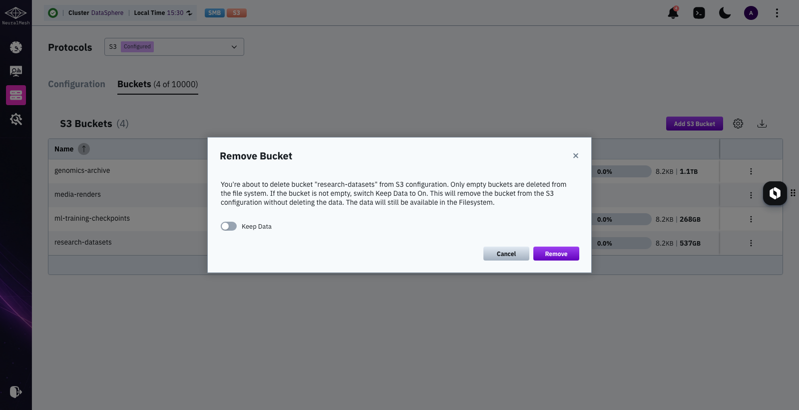

# Manage S3 buckets using the GUI

## Create a bucket <a href="#create-a-bucket" id="create-a-bucket"></a>

**Before you begin**

S3 does not support creating buckets on filesystems with names containing the characters ' ', '`(`', '`)`', or '`&`'. Verify that the filesystem name excludes these characters. Rename the filesystem if needed before creating the S3 bucket.

In multi-tenant deployments, the **Buckets** tab shows only buckets in the current tenant. Buckets from other tenants are not visible, regardless of admin role.

Bucket names must be unique across the entire cluster. If the name is already in use, the GUI returns the following error:

```
This name cannot be used, please choose another name.
```

**Procedure**

1. From the menu, select **Manage > Protocols**.
2. From the Protocols pane, select **S3**.
3. Select the **Buckets** tab.
4. Select **+Create**.
5. In the Add S3 Bucket dialog, do the following:
   * **Bucket Name:** Set a bucket name according to the naming conventions.
   * **Filesystem:** Set the filesystem to host the bucket. If the tenant has a default filesystem, the system uses it first. If not, the system uses the cluster default filesystem. If neither default is configured, select a filesystem explicitly or the operation fails.
   * **Use Existing Directory:** If you want to expose an existing directory, set its path. Make sure that the directory is not below the hierarchy of the already configured S3 bucket.
   * **Hard Quota:** Set the maximum capacity for the bucket. If you want to remove the hard quota setting, enter 0.
   * **Bucket Policy:** Select the policy to attach to the bucket: none, download, upload, public, or custom. If you select a custom policy, add it in JSON format.
6. Select **Save**.


Tenant 0, also called the root tenant, follows the same tenant-scoped bucket visibility behavior.


<div data-with-frame="true"><figure><figcaption><p>Enter the bucket name and select the filesystem</p></figcaption></figure></div>

<div data-with-frame="true"><figure><figcaption><p>The new bucket appears in the bucket list</p></figcaption></figure></div>

## View a bucket details <a href="#view-a-bucket-details" id="view-a-bucket-details"></a>

You can view the details of the bucket.

**Procedure**

1. From the menu, select **Manage > Protocols**.
2. From the Protocols pane, select **S3**.
3. Select the **Buckets** tab.
4. Select the three dots of the bucket and select **View**.

<div data-with-frame="true"><figure><figcaption><p>Manage a bucket menu</p></figcaption></figure></div>

<div data-with-frame="true"><figure><figcaption><p>View S3 Bucket</p></figcaption></figure></div>

## Edit a bucket hard quota <a href="#edit-a-bucket-hard-quota" id="edit-a-bucket-hard-quota"></a>

The hard quota determines the maximum capacity of the bucket. Initially, you can only set the hard quota for an empty bucket. If the hard quota of the bucket is already set, you can modify it or remove it.

**Procedure**

1. From the menu, select **Manage > Protocols**.
2. From the Protocols pane, select **S3**.
3. Select the **Buckets** tab.
4. Select the three dots of the bucket and select **Edit Hard Quota**.
5. Set the maximum capacity for the bucket. If you want to remove the hard quota setting, enter 0.

<div data-with-frame="true"><figure><figcaption><p>Edit S3 Bucket Quota</p></figcaption></figure></div>

## Edit a bucket policy <a href="#edit-a-bucket-policy" id="edit-a-bucket-policy"></a>

You can edit the bucket policy according to your needs.

**Procedure**

1. From the menu, select **Manage > Protocols**.
2. From the Protocols pane, select **S3**.
3. Select the **Buckets** tab.
4. Select the three dots of the bucket you want to delete, and select **Edit Bucket Policy**.
5. Select the policy to attach to the bucket: none, download, upload, public, or custom. If you select a custom policy, add it in JSON format.

<div data-with-frame="true"><figure><figcaption><p>Edit S3 Bucket</p></figcaption></figure></div>

## Delete a bucket <a href="#remove-a-bucket" id="remove-a-bucket"></a>

You can delete an existing bucket from the filesystem only if the bucket is empty. If the bucket is not empty, you can detach the bucket from the S3 configuration and keep the data and metadata in place. Consequently, you can recreate the bucket while preserving the data and metadata (see [Create a bucket](s3-buckets-management.md#create-a-bucket) using the Use Existing Directory switch.


If the intent is to keep the data files for use outside of the S3 configuration and delete only the S3 metadata, contact the Customer Success Team for assistance.


**Procedure**

1. From the menu, select **Manage > Protocols**.
2. From the Protocols pane, select **S3**.
3. Select the **Buckets** tab.
4. Select the three dots of the bucket you want to delete and select **Remove**.

<div data-with-frame="true"><figure><figcaption><p>Remove Bucket</p></figcaption></figure></div>

5. In the confirmation message, if the bucket is not empty, switch **Keep Data** to **ON**.\
   Then, select **Remove**.
