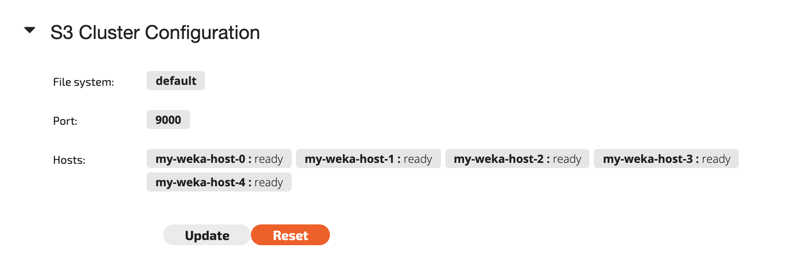

# S3 Cluster Management

## Considerations

The S3 service can be exposed from the cluster hosts, ranging from one host to the entire cluster. The service performance scales linearly as the S3 cluster scales.


**Note:** Depending on the workload, you may need to use several FE cores to gain maximum performance.


## Round Robin DNS / Load Balancer

To ensure that the various S3 clients will balance the load on the different Weka hosts serving S3, it is recommended to define a [Round-robin DNS](https://en.wikipedia.org/wiki/Round-robin_DNS) entry that will resolve to the list of hosts' IPs, ensuring that the clients load will be equally distributed across all hosts. A DNS server that supports health checks can help with resiliency if any of the hosts serving S3 become unresponsive for whatever reason.

With extreme load, even a robust DNS server / load-balancer may become overloaded. You can also use a client-side load balancer, where each client checks the health of each S3 host in the cluster. One such load balancer is the open-source [Sidekick Load Balancer](https://github.com/minio/sidekick).

## S3 Service Management using the GUI

### Creating an S3 Cluster

To configure an S3 cluster, first access the S3 Service view.

To configure the S3 cluster, click the Configure button. The following Configure S3 Cluster window will be displayed:

Select which filesystem to use for the S3 service, select the Weka backend hosts to form the S3 cluster, and optionally change the port for exposing the S3 service through. Then click the Configure button.

The following S3 Cluster Configuration window will be displayed:


**Note:** The status of the hosts will change from not ready to ready.


### Updating an S3 Cluster Configuration

To update the S3 cluster, click the Update button. A Update S3 Cluster window will be displayed:

Update the list of Weka hosts or S3 service port. Then click the Update button.

### Deleting an S3 Cluster

To delete a configured S3 cluster, click the Reset button in the S3 Cluster Configuration window. The following window will be displayed:

Confirm the deletion by clicking the Reset button.

## S3 Service Management using the CLI

### Creating an S3 Cluster 

**Command:** `weka s3 cluster create`

Use the following command line to create an S3 cluster:

`weka s3 cluster create <filesystem> [--all-hosts] [--host hosts] [--port port]` 

**Parameters in Command Line**

| **Name** | **Type** | **Value** | **Limitations** | **Mandatory** | **Default** |
| :--- | :--- | :--- | :--- | :--- | :--- |
| `filesystem` | String | The filesystem name to be used for the S3 service | None | Yes |  |
| `all-hosts` | Boolean | Use all backend hosts to serve S3 commands | None | Either `host` list or `all-hosts` must be provided | Off |
| `host` | Comma-separated list of Numbers | Host IDs to serve the S3 service | None | Either `host` list or `all-hosts` must be provided |  |
| `port` | Number | The port where the S3 service is exposed | None | No | 9000 |

### Checking the Status of the S3 Cluster and Hosts Readiness

**Command:** `weka s3 cluster` / `weka s3 cluster status`

Use these commands to check the status and configuration of the S3 cluster. Once all hosts are prepared and ready, it is possible to use the S3 service.

### Updating an S3 Cluster Configuration 

**Command:** `weka s3 cluster update`

Use the following command line to update an S3 cluster configuration:

`weka s3 cluster update [--all-hosts] [--host hosts] [--port port]` 

**Parameters in Command Line**

| **Name** | **Type** | **Value** | **Limitations** | **Mandatory** | **Default** |
| :--- | :--- | :--- | :--- | :--- | :--- |
| `all-hosts` | Boolean | Use all backend hosts to serve S3 commands | None | No |  |
| `host` | Comma-separated list of Numbers | Host IDs to serve the S3 service | None | No |  |
| `port` | Number | The port where the S3 service is exposed | None | No |  |

## Deleting an S3 Cluster

**Command:** `weka s3 cluster destroy`

Use this command to destroy an S3 cluster managed by the Weka system.

Deleting an existing S3 cluster managed by the Weka system does not delete the backend Weka filesystem but removes the S3 bucket exposures of these filesystems.

