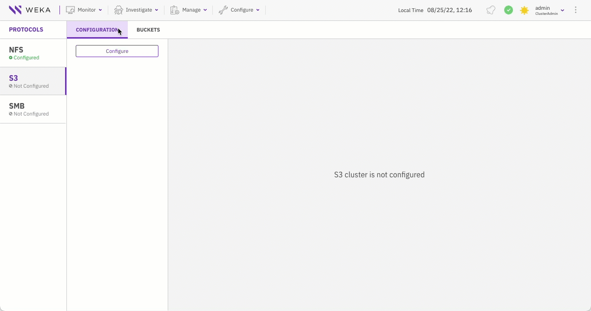

# Manage the S3 service using the GUI

Using the GUI, you can:

* [Create an S3 cluster](s3-cluster-management.md#create-an-s3-cluster)
* [Update an S3 cluster configuration](s3-cluster-management.md#update-an-s3-cluster-configuration)
* [Delete an S3 cluster configuration](s3-cluster-management.md#delete-an-s3-cluster)

## Create an S3 cluster

An S3 cluster configuration includes a filesystem, port, and list of hosts.

**Procedure**

1. From the menu, select **Manage > Protocols**.
2. From the Protocols pane, select **S3**.
3. On the Configuration tab, select **Configure**.
4. In the S3 Cluster Configuration dialog, set the following properties:
   * **Filesystem**: The filesystem to use for the S3 service. By default, when adding a bucket, it will be created in this filesystem.
   * **Port**: Default 9000. If required, modify the port through which the cluster exposes the S3 service. Do not set port 9001.
   * **Anonymous Posix UID:** If required, modify the Posix UID assigned to anonymous users.
   * **Anonymous Posix GID:** If required, modify the Posix GID assigned to anonymous users.
   * **Hosts**: To use all available hosts for the S3 configuration, switch on **All Hosts**. If new hosts are deployed later, they do not participate in the S3 cluster automatically.\
     To use specific hosts, switch off **All Hosts**, and select the available hosts from the list to participate in the S3 cluster, based on the host IDs in Weka.&#x20;
5. Select **Save**.

Once the system completes the configuration process, the host statuses change from not ready (red X icon) to ready (green V icon).

<figure><figcaption>
S3 Cluster Configuration
</figcaption></figure>

## Update an S3 cluster configuration

You can update the port and the hosts to participate in the S3 cluster.

**Procedure**

1. From the menu, select **Manage > Protocols**.
2. From the Protocols pane, select **S3**.
3. On the Configuration tab, select the pencil icon next to the S3 cluster configuration.

4\. Update the properties as required.

5\. Select **Save**.

## Delete an S3 cluster configuration

Deleting an existing S3 cluster managed by the Weka system does not delete the backend Weka filesystem but removes the S3 bucket exposures of these filesystems.

**Procedure**

1. From the menu, select **Manage > Protocols**.
2. From the Protocols pane, select **S3**.
3. On the Configuration tab, select the trash icon next to the S3 cluster configuration.

4\. In the S3 Configuration Reset message, select **Reset**.&#x20;
