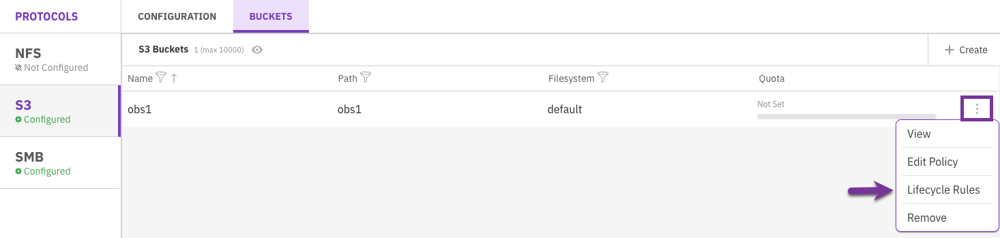
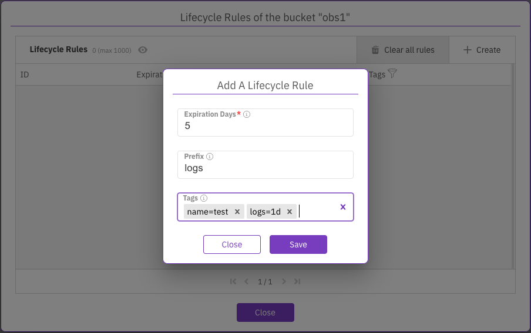
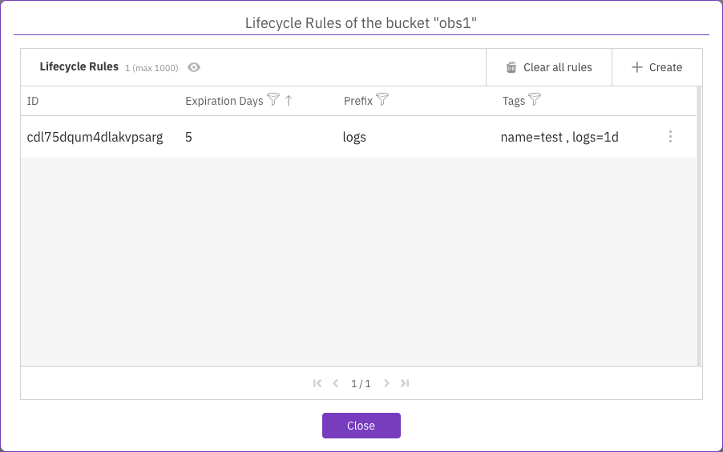
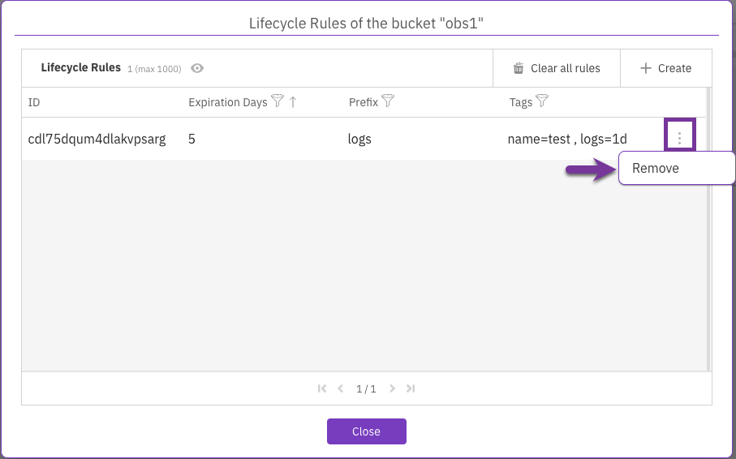
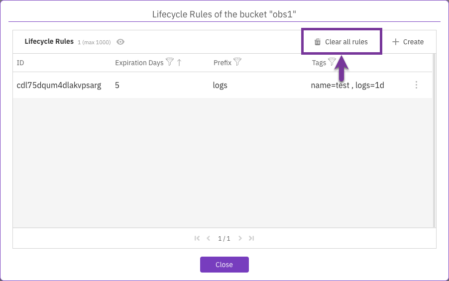

# Manage S3 lifecycle rules using the GUI

Using the GUI, you can:

* [Add a lifecycle rule](s3-information-lifecycle-management.md#add-a-lifecycle-rule)
* [View lifecycle rules](s3-information-lifecycle-management.md#viewing-ilm-rules)
* [Remove a lifecycle rule](s3-information-lifecycle-management.md#remove-a-lifecycle-rule)
* [Remove all lifecycle rules](s3-information-lifecycle-management.md#or-all-rules)

## **Add** a lifecycle rule

You can add a lifecycle rule to an object (bucket) that defines an expiration duration per object prefix and tags.&#x20;

**Procedure**

1. From the S3 buckets page, select the three dots of the required bucket, and select **Lifecycle Rules**.

<figure><figcaption>
Lifecycle Rules menu
</figcaption></figure>

2\. In the Add a Lifecycle Rule dialog set the following:&#x20;

* **Expiration days:** The minimum number of days before expiring the object.
* **Prefix:** The prefix of objects to apply the rule to.
* **Tags:** One or more object tags to apply the ILM policy rule. The tags are key-value pairs. Example: \<k1>=\<v1>.

3\. Select **Save**.

<figure><figcaption>
Add a Lifecycle Rule
</figcaption></figure>

## View lifecycle rules 

You can view the lifecycle rules defined for a bucket and filter according to expiration days, prefixes, or tags.&#x20;

**Procedure**

1. From the S3 buckets page, select the three dots of the required bucket, and select **Lifecycle Rules**.

<figure><figcaption>
View Lifecycle Rules
</figcaption></figure>

## Remove a lifecycle rule

You can remove a specific lifecycle rule of a specified bucket if it is no longer required.

**Procedure**

1. From the S3 buckets page, select the three dots of the required bucket, and select **Lifecycle Rules**.
2. In the Lifecycle Rules dialog, select the three dots of the required rule and select **Remove**.

<figure><figcaption>
Remove a lifecycle rule
</figcaption></figure>

## Remove all lifecycle rules

You can remove all the lifecycle rules of a specified bucket if they are no longer required.

**Procedure**

1. From the S3 buckets page, select the three dots of the required bucket, and select **Lifecycle Rules**.
2. In the Lifecycle Rules dialog, select **Clear all rules**.

<figure><figcaption>
Clear all lifecycle rules
</figcaption></figure>
