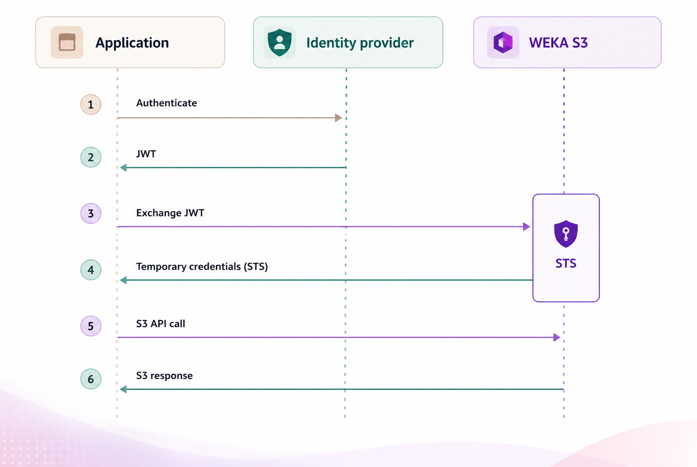

# Configure S3 OIDC authentication

## Overview

OIDC (OpenID Connect) for WEKA S3 lets users and applications exchange identity provider (IdP) tokens for temporary S3 credentials. Instead of managing static S3 access keys, clients authenticate with their existing IdP, such as Microsoft Entra ID, Keycloak, or any OIDC-compliant provider, and receive short-lived credentials scoped to the permissions their identity carries.

### OIDC authentication flow

OIDC authentication flow involves three participants: the application, the identity provider, and the WEKA S3 gateway. WEKA S3 includes an STS endpoint that handles credential exchange. The S3 gateway handles data access.

<div data-with-frame="true"><figure><figcaption><p>OIDC authentication flow</p></figcaption></figure></div>

1. The application authenticates to the identity provider using any supported flow, such as client credentials, browser-based sign-in, or device flow, and receives a JWT.
2. The identity provider returns the JWT, which contains the identity's claims or role assignments.
3. The application calls the STS endpoint in WEKA S3 with the JWT using the `AssumeRoleWithWebIdentity` operation. The STS validates the JWT signature and expiry, reads the claims, and matches them against configured IAM policies.
4. The STS returns a set of temporary credentials: an access key, a secret key, a session token, and an expiry time.
5. The application uses those credentials to make standard S3 API calls directly to the WEKA S3 gateway.
6. WEKA S3 enforces the IAM policy bound to the credentials and returns the S3 response.

The application holds only short-lived credentials. No static S3 keys are distributed or stored. When credentials expire, the application repeats from step 1.

### Authentication patterns

WEKA supports two authentication patterns through the same STS endpoint.

* **Human users:** Users authenticate interactively through their IdP and receive a JWT that contains identity claims. The application exchanges this token for temporary S3 credentials.
* **Service principals:** Automation pipelines, application services, and other non-human identities authenticate using the client credentials flow without user interaction. The IdP issues a JWT containing one or more role values in the configured claim, typically `roles`. WEKA maps each role value to an IAM policy with the same name.

Both patterns use the same `AssumeRoleWithWebIdentity` STS call. When a token includes both identity claims and role values, WEKA merges the resulting policies.

### Key concepts

**OIDC provider configuration.** Configure WEKA with the discovery URL of the IdP. WEKA uses the provider metadata to validate tokens.

**IAM policies.** Policies define which S3 actions are permitted on which resources. They follow the same JSON structure used by AWS IAM. You create policies in WEKA and associate them with identities or roles.

**Role-to-policy mapping.** WEKA reads the configured roles claim in the JWT and looks for a WEKA IAM policy whose name exactly matches each role value. Matching is case-sensitive. No additional mapping is required. Create the policy in WEKA with the same name as the role value in the IdP.

**Temporary credentials and expiry.** WEKA automatically removes expired STS-issued temporary users in a background cleanup routine. No manual cleanup is required.

## Configure WEKA S3 with OIDC

Configure WEKA S3 to accept federated identities from an OIDC-compliant identity provider (IdP). Once configured, users and applications can exchange IdP tokens for temporary S3 credentials using the WEKA STS endpoint.

**Before you begin**

* Obtain the following values from your IdP administrator:
  * OIDC discovery URL (the `.well-known/openid-configuration` endpoint for your tenant).
  * Roles claim name: the JWT field that contains the role values (default: `roles`).
* Determine the IAM policy names you need and the S3 permissions each should grant.
* Confirm you have a WEKA user with the **Cluster Admin** role.

**Procedure**

1. **Configure the OIDC provider in WEKA:** Run the following command on any WEKA management process. Replace the placeholder values with the values from your IdP.

```bash
weka s3 cluster oidc add \
  --config-url "https://<idp-discovery-url>/.well-known/openid-configuration" \
  --claim-name <claim-name>
```

**Parameters:**

<table><thead><tr><th width="176">Parameter</th><th>Description</th></tr></thead><tbody><tr><td><code>--config-url</code>*</td><td>OIDC discovery URL for your IdP tenant.</td></tr><tr><td><code>--claim-name</code></td><td><p>Name of the JWT claim that contains role values. Set this parameter only if your IdP uses a claim name other than the default.<br>(This parameter is hidden in the CLI.)</p><p>Default: <code>roles</code></p></td></tr></tbody></table>

Verify provider discovery:

```bash
weka s3 cluster oidc show
```

Confirm that `config-url` and `claim-name` are set correctly.

2. **Create IAM policies:** Create a JSON file that defines the S3 permissions for each access level you need. Then add each policy to WEKA.

**Example: s3admin policy**


```json
{
      "Version": "2012-10-17",
      "Statement": [
        {
          "Effect": "Allow",
          "Action": [
            "s3:GetObject",
            "s3:PutObject",
            "s3:DeleteObject",
            "s3:ListBucket"
          ],
          "Resource": [
            "arn:aws:s3:::my-bucket",
            "arn:aws:s3:::my-bucket/*"
          ]
        }
      ]
}
```


Add the IAM policy to WEKA. In this example, `s3admin` is both the role value in the IdP and the IAM policy name in WEKA.

```bash
weka s3 policy add s3admin s3admin.json
```

3. **Validate role-to-policy mapping:** List the S3 IAM policies in WEKA:

```bash
weka s3 policy list
```

4. **Show the OIDC configuration:** Confirm that `Claim Name: roles` appears in the output, or the custom claim name you configured. Then verify that each role value from the IdP has a matching IAM policy name in WEKA. Matching is case-sensitive.

```bash
weka s3 cluster oidc show
```

**Example output**

```bash
weka s3 cluster oidc show
OIDC Configuration:
  Config URL:   https://login.microsoftonline.com/<tenant-id>/v2.0/.well-known/openid-configuration
  Claim Name:   roles
```

5. **Run a simple S3 operation to confirm access:** Use an IdP-issued token to request temporary credentials from the STS endpoint, then run a basic S3 operation to confirm that the credentials and IAM policy are working correctly.

<details>

<summary>Example</summary>

The following example uses the AWS CLI for both the STS exchange and the S3 check.

**Prerequisites:** AWS CLI installed and configured with `--endpoint-url` support.

**Procedure:**

1. Set the endpoint values and save an IdP-issued JWT to a local file:

```bash
export WEKA_STS_ENDPOINT="https://<weka-sts-endpoint>"
export WEKA_S3_ENDPOINT="https://<weka-s3-endpoint>"

cat > idp-token.jwt <<'EOF'
<paste-your-idp-jwt-here>
EOF
```

2. Exchange the JWT for temporary credentials:

```bash
aws sts assume-role-with-web-identity \
  --role-arn "arn:aws:iam::000000000000:role/weka-oidc" \
  --role-session-name "oidc-test" \
  --web-identity-token file://idp-token.jwt \
  --endpoint-url "${WEKA_STS_ENDPOINT}"
```

3. Export the returned credentials and run an S3 operation:

```bash
export AWS_ACCESS_KEY_ID="<AccessKeyId>"
export AWS_SECRET_ACCESS_KEY="<SecretAccessKey>"
export AWS_SESSION_TOKEN="<SessionToken>"

aws s3 ls --endpoint-url "${WEKA_S3_ENDPOINT}"
```

A successful response lists the buckets your IAM policy permits. If the command returns an access error, verify that the role value in the JWT exactly matches the IAM policy name in WEKA.

</details>
