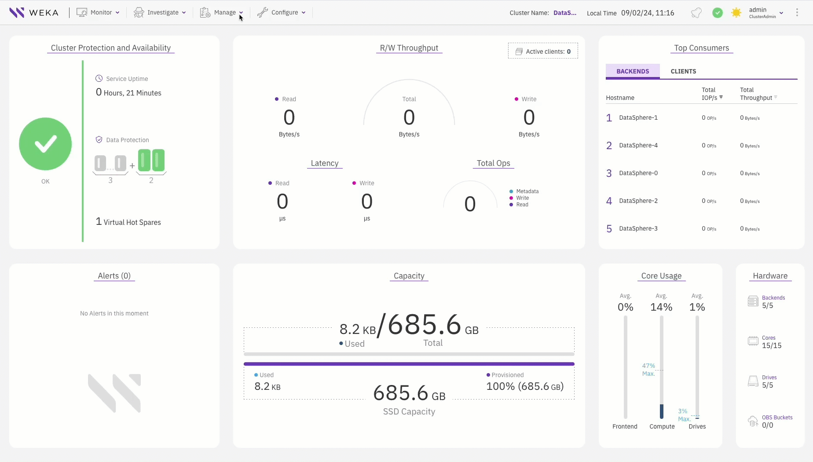
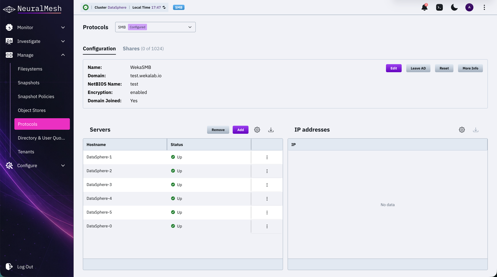
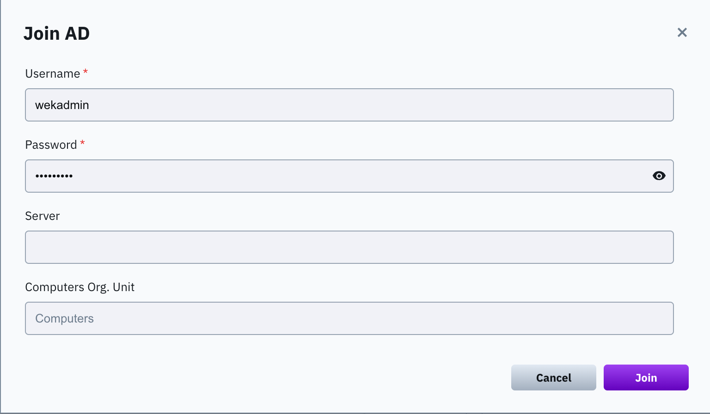
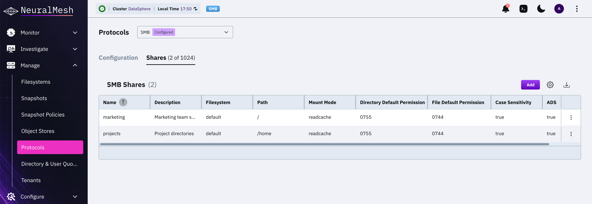
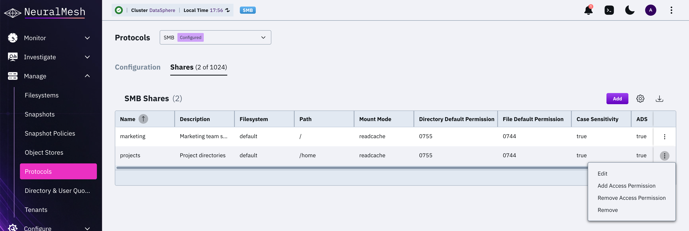
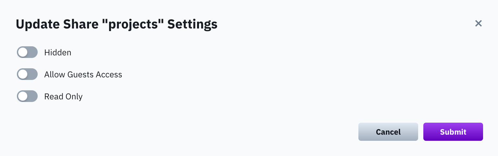
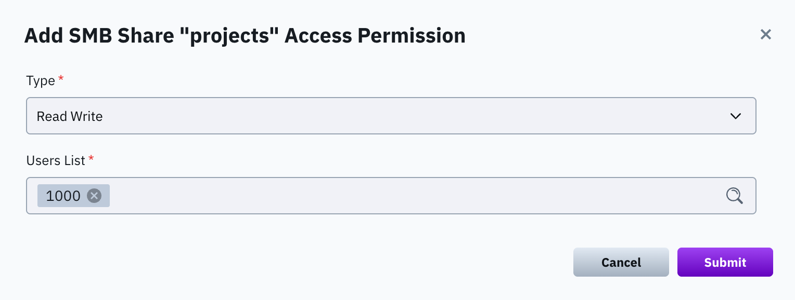
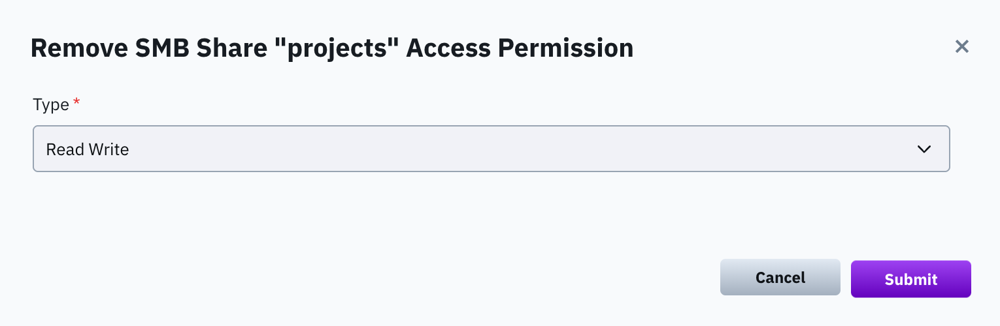

# Manage SMB using the GUI


The GUI refers to the feature as SMB, but it applies to SMB-W only. Support for the legacy SMB implementation has been removed.


## **Configure the SMB cluster** <a href="#configure-the-smb-cluster" id="configure-the-smb-cluster"></a>

An SMB cluster comprises at least three WEKA servers running the SMB-W stack.

**Before you begin**

Verify that the dedicated filesystem for persistent protocol configurations is created. If not, create it. For details, see [#dedicated-filesystem-requirement-for-cluster-wide-persistent-protocol-configurations](../additional-protocols-overview.md#dedicated-filesystem-requirement-for-cluster-wide-persistent-protocol-configurations "mention")

**Procedure**

1. From the menu, select **Manage > Protocols**.
2. From the Protocols pane, select **SMB**.
3. On the Configuration tab, select **Configure**.
4. In the SMB Cluster Configuration dialog, set the following properties:
   * **Name**: NetBIOS name for the SMB cluster must be 1-15 characters long, using only alphanumeric characters (A-Z, 0-9) and hyphens (-). Names are case-insensitive, cannot start with a hyphen, and must be unique within the network. Spaces and special characters are not allowed.\
     This will be the name of the Active Directory computer object and the hostname part of the FQDN.
   * **Domain**: The Active Directory domain to join the SMB cluster.
   * **Domain NetBIOS Name**: (Optional) The domain NetBIOS name.
   * **Encryption:** Select the in-transit encryption mode to use in the SMB cluster:
     * **enabled:** Enables encryption negotiation but doesn't turn it on automatically for supported sessions and shared connections.
     * **desired**: Enables encryption negotiation and turns on data encryption for supported sessions and shared connections.
     * **required**: Enforces data encryption on sessions and shared connections. Clients that do not support encryption will be denied access to the server.
   * **Servers**: List 3-8 WEKA system servers to participate in the SMB cluster based on the server IDs in WEKA.
   * **IPs**: (Optional) List of virtual IPs (comma-separated) used as floating IPs for the SMB cluster to provide HA to clients. These IPs must be unique; do not assign these IPs to any host on the network.\
     For an IP range, use the following format: **a.b.c.x-y**.
   * **Config Filesystem:** select the filesystem used for persisting cluster-wide protocol configurations.
   * **Symbolic Link:** Determines if symbolic links are allowed in the SMB cluster:
     * **ON:** Enables symbolic links. Use with caution, as it can introduce security risks by exposing data across shares.
     * **OFF:** Disables symbolic links, enhancing security by preventing link-based vulnerabilities.


**Important**: If a symbolic link in one share points to a file system in another share, users in the first share can access the data in the second share. Ensure you understand the security implications before enabling this option.



Due to cloud provider network limitations, setting a list of SMB floating IPs in all cloud installations is impossible. In this case, the SMB service must be accessed using the cluster nodes' primary addresses.


5. Select **Submit**.

<div data-with-frame="true"><figure><figcaption><p>SMB cluster configuration</p></figcaption></figure></div>

Once the system completes configuration, the server statuses change from  (not ready) to  (ready).

<div data-with-frame="true"><figure><figcaption><p>Configured SMB cluster</p></figcaption></figure></div>

## Edit the SMB cluster <a href="#edit-the-smb-cluster" id="edit-the-smb-cluster"></a>

You can modify the encryption and IP settings according to your needs.

**Procedure**

1. In the SMB Cluster Configuration, select the **pencil** icon.
2. In the Edit SMB Configuration dialog, do the following:
   * **Encryption:** Select one of the in-transit encryption enforcements: enabled, desired, or required.
   * **IPs:** List of virtual IPs (comma-separated) used as floating IPs for the SMB cluster. (Floating IPs are not supported for cloud installations.)

3\. Select **Save**.

## Join the SMB cluster to Active Directory <a href="#join-the-smb-cluster-in-the-active-directory" id="join-the-smb-cluster-in-the-active-directory"></a>

To enable the SMB cluster to use Active Directory to resolve the access of users and user groups, join the SMB cluster to Active Directory (AD).

**Before you begin**

<details>

<summary>Resolve the AD domain controllers</summary>

Add the AD DNS configuration to every SMB protocol backend.

Follow these steps:

1. Access the CLI.
2. Edit the `/etc/resolv.conf` file to include the DNS settings specific to your domain.

For example, your configuration might look like this:

```bash
nameserver 8.8.8.8
nameserver 8.8.4.4
search example.com
```

Replace `8.8.8.8` and `8.8.4.4` with the appropriate nameserver IP addresses for your domain and `example.com` with your actual domain name.

</details>

**Procedure**

1. In the SMB Cluster Configuration, select **Join**.
2. In the **Join AD** dialog, set the following properties:
   * **Username** and **Password**: A username and password of an account that has join privileges to the Active Directory domain. WEKA does not save these credentials. Instead, the SMB cluster creates a computer account for use.
   * **Server**: (Optional) WEKA automatically identifies an AD Domain Controller server (from `/etc/resolv.conf`) based on the AD domain name. You do not need to set the server name. In some cases, specify the AD server if required.
   * **Computers Org. Unit**: The default AD organizational unit (OU) for the computer account is the Computers directory. You can define any OU to create the computer account that the joining account has permission to, such as SMB servers or corporate computers.

<div data-with-frame="true"></div>

Once the SMB cluster joins the Active Directory domain, the join status next to the domain changes to **Joined**.


To join an existing SMB cluster to a different Active Directory domain, select **Leave**. To confirm the action, enter the username and password used to join the Active Directory domain.


### Post-configuration in the DNS Manager and Active Directory


The following procedures are provided for reference purposes. For specific steps related to your environment, contact your IT administrator.


<details>

<summary>Add an <strong>A</strong> record for SMB protocol backends</summary>

1. **Open DNS Manager:** Navigate to **Start > Programs > Administrative Tools > DNS**.
2. **Access DNS zones:** In the DNS Manager console, double-click the DNS server name to display the list of zones.
3. Open **Forward Lookup Zones.**
4. **Create a new A record:** Right-click on the relevant domain and select **New Record**.
5. **Enter record details:**
   * Specify the name (for example, TAZ) and the IP address of the backend server.
   * Select the record type as **A**.
6. **Configure record options:**
   * Select the **Create Associated PTR record** option.
   * Select the **Allow any authenticated user to update DNS record with the same owner name** option.
7. **Finalize the Record:** Select **OK** to add the new A record.

</details>

<details>

<summary>Set UID and GID for SMB protocol backends</summary>

Repeat the following steps for every backend participating in the SMB protocol.

1. Navigate to **Start > Programs > Administrative Tools > Active Directory Users and Computers**.
2. From the **View** menu, select **Advanced Features**.
3. In the **Computers** section, right-click on an SMB protocol backend and select **Properties**.
4. Select the **Attribute Editor** tab and modify the following:
   * Locate the **gidNumber** attribute and set its value to **0**.
   * Locate the **uidNumber** attribute and set its value to **0**.
5. Select **OK** to save the changes.

</details>

<details>

<summary>Set UID and GID for SMB users</summary>

Repeat the following steps for every user consuming WEKA services over the SMB protocol.

1. Navigate to **Start > Programs > Administrative Tools > Active Directory Users and Computers**.
2. From the **View** menu, select **Advanced Features**.
3. In the **Users** section, right-click on a user consuming WEKA services over the SMB protocol, and select **Properties**.
4. Select the **Attribute Editor** tab and modify the following:
   * Locate the **gidNumber** attribute and set its value to an appropriate number or, if unknown, any numeric value between 0 and 4290000000.
   * Locate the **uidNumber** attribute and set its value to an appropriate number or, if unknown, any numeric value between 0 and 4290000000.
5. Select **OK** to save the changes.

</details>

## Add servers to the SMB cluster <a href="#add-or-remove-smb-cluster-hosts" id="add-or-remove-smb-cluster-hosts"></a>

Adding servers to the SMB cluster can provide several benefits and address various requirements, such as scalability, load balancing, high availability, and improved fault tolerance.

**Before you begin**

* Ensure the SMB cluster is joined to an Active Directory domain.\
  See [#join-the-smb-cluster-in-the-active-directory](smb-management-using-the-gui.md#join-the-smb-cluster-in-the-active-directory "mention").

**Procedure**

1. On the Servers pane, select **Add**.
2. In the Add SMB Cluster Servers dialog, select one or more available servers (a maximum of eight servers) from the list.
3. Select **Save**.

## Remove servers from the SMB cluster <a href="#delete-the-smb-cluster" id="delete-the-smb-cluster"></a>

If the SMB cluster has more servers than you need, you can remove the server.

The minimum required number of servers in an SMB cluster is three.

**Procedure**

1. To remove one server, select the three dots next to the server to remove and select **Remove**.
2. To remove more than one server, select the servers to remove from the Remove SMB Cluster Servers dialog (click the **X**), and select **Save**.

## Delete the SMB cluster <a href="#delete-the-smb-cluster" id="delete-the-smb-cluster"></a>

Deleting the SMB cluster resets its configuration data. Deleting an SMB cluster only applies to SMB-W.

**Procedure**

1. In the SMB Cluster Configuration, select **X**.
2. In the SMB Configuration Reset message, select **Reset**.

## **Display the SMB shares list** <a href="#display-the-smb-shares-list" id="display-the-smb-shares-list"></a>

The Shares tab displays the SMB shares created in the system. You can also customize the table columns of the SMB shares.

**Procedure**

1. From the menu, select **Manage > Protocols**.
2. From the Protocols pane, select **SMB**.
3. Select the **Shares** tab.\
   You can filter the list using any column in the table.

<div data-with-frame="true"></div>

## Add an SMB share <a href="#add-an-smb-share" id="add-an-smb-share"></a>

Once the SMB cluster is created, you can create SMB shares (maximum of 1024). Each share must have a name and a shared path to the filesystem, which can be the root of the filesystem or a subdirectory

**Before you begin**

* Ensure the SMB cluster is joined to the Active Directory. For details, see [#join-the-smb-cluster-in-the-active-directory](smb-management-using-the-gui.md#join-the-smb-cluster-in-the-active-directory "mention").
* Ensure the filesystem is already mounted and the directory you want to share is created in the filesystem. For details, see [mounting-filesystems](../../weka-filesystems-and-object-stores/mounting-filesystems/ "mention");

**Procedure**

1. In the Shares tab, select **Add**.
2.  In the Add SMB Share dialog, set the following properties:

    * **Name**: A meaningful name for the SMB share.
    * **Filesystem**: The filesystem name that includes the directory to share. Select one from the list. A filesystem with Required Authentication set to ON cannot be used for SMB share.
    * **Description**: A description or purpose of the SMB share.
    * **Path**: A valid internal path, relative to the root, within the filesystem to expose the SMB share.

    If required, select **Advanced** and set the following:

    * **ACLs Enabled**: Enables or disables Windows Access-Control Lists (ACLs) for the share. When enabled, WEKA applies the selected Access Control Model. Only applicable for SMB-W.
    * **Access Control Model:** Specifies the type of access control to use for the share. Options include POSIX, Windows, or Hybrid (default: POSIX). Hybrid ACL allows seamless interoperability between POSIX and Windows systems by exchanging permissions based on timestamps. The most recent permission, regardless of the system it originated from, takes precedence. Only applicable for SMB-W.
    * **File Default Permission:** The new default file permissions for the POSIX mode mask in a numeric (octal) format created through the share. Default 0744.
    * **Directory Default Permission:** The new default directory permissions for the POSIX mode mask in a numeric (octal) format created through the share. Default 0755.
    * **Read Only:** Select to set the share as read-only.
    * **Hidden:** Select if you want to hide the share so it is not visible when viewing the list of system shares.
    * **Allow Guests Access:** Select if you want guests to access without authentication.
    * **Case Sensitivity**: Enables or disables case sensitivity for the specified SMB share (default: ON). When enabled, the share distinguishes between files with the same name but different capitalization. This option applies exclusively to the SMB-W cluster.
    * **ADS:** Enables using Alternate Data Streams (ADS) on a specified SMB share.\
      Possible values: ON, OFF (default: ON). For **macOS clients**, if ACLs are disabled (`acl=off`), set `enable-ADS` to `off`. For **Windows clients**, when enabled, ADS data is stored in the file’s extended attributes (XAttr), which consumes XAttr space.
    * **Encryption:** Select in-transit encryption enforcement of the share. The global cluster encryption settings can affect the actual encryption.
    * **Direct Object Store Sync:** Enables immediate synchronization of files to the object store, bypassing time-based file retention policies. When enabled, newly created or modified files in the share are prioritized for release without delay.
3. Select **Submit**.

<div data-with-frame="true"><figure><figcaption><p>Add an SMB share</p></figcaption></figure></div>


Access permissions are not set in this dialog. After the share is created, define them from the share's three-dot menu. See [#add-a-share-access-permission](smb-management-using-the-gui.md#add-a-share-access-permission "mention").


<details>

<summary>Access the share from Windows</summary>

1. Right-click on **This PC**.
2. Select **Map network drive**.
3. In the **Folder** field, enter the path to the share, for example, `\\smbshare\mynewshare`.
4. If prompted, enter the required credentials.

</details>

## Edit an SMB share <a href="#edit-an-smb-share" id="edit-an-smb-share"></a>

You can update some of the SMB share settings. These include encryption, hiding the share, allowing guest access, and setting the share as read-only.

**Procedure**

1. In the Shares tab, select the three dots of the share and select **Edit**.

<div data-with-frame="true"><figure><figcaption><p>SMB share actions</p></figcaption></figure></div>

2. In the **Update Share Settings** dialog, update the relevant properties and select **Submit**.

<div data-with-frame="true"><figure><figcaption><p>Update the SMB share settings</p></figcaption></figure></div>

## Add a share access permission <a href="#add-a-share-access-permission" id="add-a-share-access-permission"></a>

Define which users or groups can access a share, and with which access type. Access permissions are set per share, after the share is created.

**Procedure**

1. In the Shares tab, select the three dots of the share and select **Add Access Permission**.
2. In the **Add SMB Share "<share>" Access Permission** dialog, set the following:
   * **Type:** The access type granted to the listed users or groups.
   * **Users List:** The users and groups allowed to access the share. Add `@` as a group prefix. Do not use the following characters: / \\ [ ] : ; | = + \* ? < > ".
3. Select **Submit**.

<div data-with-frame="true"><figure><figcaption><p>Add a share access permission</p></figcaption></figure></div>

## Remove a share access permission <a href="#remove-a-share-access-permission" id="remove-a-share-access-permission"></a>

Remove a previously defined access permission from a share.

**Procedure**

1. In the Shares tab, select the three dots of the share and select **Remove Access Permission**.
2. In the **Remove SMB Share "<share>" Access Permission** dialog, select the **Type** of the access permission to remove.
3. Select **Submit**.

<div data-with-frame="true"><figure><figcaption><p>Remove a share access permission</p></figcaption></figure></div>

## Remove an SMB share <a href="#remove-an-smb-share" id="remove-an-smb-share"></a>

**Procedure**

1. In the Shares tab, select the three dots of the share and select **Remove**.

<div data-with-frame="true"></div>

2. In the confirmation message that appears, select **Confirm**.\
   The removed share no longer appears in the SMB Shares list.
