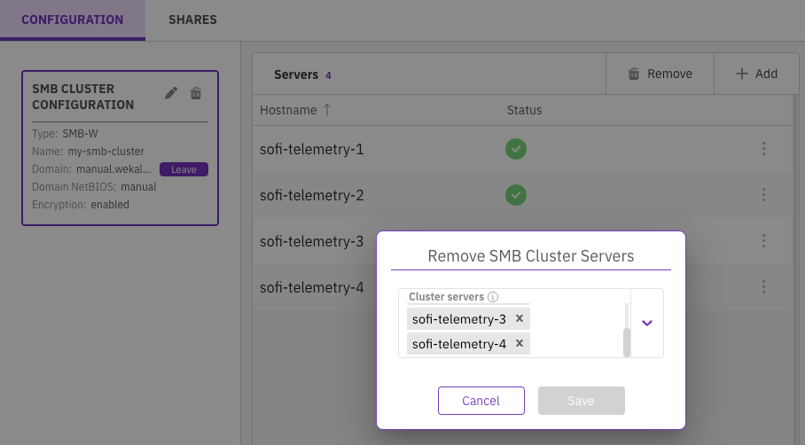

# Manage SMB using the GUI

Using the GUI, you can:

* [Configure the SMB cluster](smb-management-using-the-gui.md#configure-the-smb-cluster) (not applicable for legacy SMB)
* [Edit the SMB cluster](smb-management-using-the-gui.md#edit-the-smb-cluster)
* [Join the SMB cluster to Active Directory](smb-management-using-the-gui.md#join-the-smb-cluster-in-the-active-directory)
* [Add servers to the SMB cluster](smb-management-using-the-gui.md#add-or-remove-smb-cluster-hosts)
* [Remove servers from the SMB cluster](smb-management-using-the-gui.md#delete-the-smb-cluster)
* [Delete the SMB cluster](smb-management-using-the-gui.md#delete-the-smb-cluster)
* [Display the SMB shares list](smb-management-using-the-gui.md#display-the-smb-shares-list)
* [Add an SMB share](smb-management-using-the-gui.md#add-an-smb-share)
* [Edit an SMB share](smb-management-using-the-gui.md#edit-an-smb-share)
* [Remove an SMB share](smb-management-using-the-gui.md#remove-an-smb-share)

**Considerations:**

* The default SMB cluster configuration is SMB-W. Contact the Customer Success Team to create a legacy SMB cluster.
* When managing an SMB-W cluster using the GUI, the limitations related to SMB-W in the CLI commands also apply.
* You can manage the legacy SMB cluster using the GUI but not configure or delete it. See [Manage SMB using the CLI](smb-management-using-the-cli.md).


Use ASCII format when configuring name fields, such as domain and shares.


## **Configure the SMB cluster** <a href="#configure-the-smb-cluster" id="configure-the-smb-cluster"></a>

An SMB cluster comprises at least three WEKA servers running the SMB-W stack.

**Before you begin**

Verify that the dedicated filesystem for persistent protocol configurations is created. If not, create it. For details, see [#dedicated-filesystem-requirement-for-persistent-protocol-configurations](../additional-protocols-overview.md#dedicated-filesystem-requirement-for-persistent-protocol-configurations "mention")

**Procedure**

1. From the menu, select **Manage > Protocols**.
2. From the Protocols pane, select **SMB**.
3. On the Configuration tab, select **Configure**.


4\. In the SMB Cluster Configuration dialog, set the following properties:

* **Name**: A name for the SMB cluster. This will be the name of the Active Directory computer object and the hostname part of the FQDN.
* **Domain**: The Active Directory domain to join the SMB cluster.
* **Domain NetBIOS Name**: (Optional) The domain NetBIOS name.
* **Encryption:** Select the in-transit encryption mode to use in the SMB cluster:
  * **enabled:** Enables encryption negotiation but doesn't turn it on automatically for supported sessions and shared connections.
  * **desired**: Enables encryption negotiation and turns on data encryption for supported sessions and shared connections.
  * **required**: Enforces data encryption on sessions and shared connections. Clients that do not support encryption will be denied access to the server.
* **Servers**: List 3-8 WEKA system servers to participate in the SMB cluster based on the server IDs in WEKA.
* **IPs**: (Optional) List of virtual IPs (comma-separated) used as floating IPs for the SMB cluster to provide HA to clients. These IPs must be unique; do not assign these IPs to any host on the network.\
  For an IP range, use the following format: **a.b.c.x-y**.
* **Config Filesystem:** select the filesystem used for persisting cluster-wide protocol configurations.


Due to cloud provider network limitations, setting a list of SMB floating IPs in all cloud installations is impossible. In this case, the SMB service must be accessed using the cluster nodes' primary addresses.


5. Select **Save**.

<figure><figcaption><p>SMB cluster configuration</p></figcaption></figure>

Once the system completes configuration, the server statuses change from not ready (❌) to ready (✅).


## Edit the SMB cluster <a href="#edit-the-smb-cluster" id="edit-the-smb-cluster"></a>

You can modify the encryption and IP settings according to your needs.

**Procedure**

1. In the SMB Cluster Configuration, select the **pencil** icon.

<figure><figcaption><p>Edit the SMB cluster</p></figcaption></figure>

2. In the Edit SMB Configuration dialog, do the following:
   * **Encryption:** Select one of the in-transit encryption enforcements: enabled, desired, or required.
   * &#x20;**IPs:** List of virtual IPs (comma-separated) used as floating IPs for the SMB cluster. (Floating IPs are not supported for cloud installations.)

<figure><figcaption><p>Edit SMB configuration</p></figcaption></figure>

3\. Select **Save**.

## Join the SMB cluster to Active Directory <a href="#join-the-smb-cluster-in-the-active-directory" id="join-the-smb-cluster-in-the-active-directory"></a>

To enable the SMB cluster to use Active Directory to resolve the access of users and user groups, join the SMB cluster to Active Directory (AD).

**Before you begin**

<details>

<summary>Resolve the AD domain controllers</summary>

Add the AD DNS configuration to every SMB protocol backend.&#x20;

Follow these steps:

1. Access the CLI.
2. Edit the `/etc/resolv.conf` file to include the DNS settings specific to your domain.

For example, your configuration might look like this:

```bash
nameserver 8.8.8.8
nameserver 8.8.4.4
search example.com
```

Replace `8.8.8.8` and `8.8.4.4` with the appropriate nameserver IP addresses for your domain and `example.com` with your actual domain name.

</details>

**Procedure**

1. In the SMB Cluster Configuration, select **Join**.

<figure><figcaption><p>Join the SMB cluster in the Active Directory</p></figcaption></figure>

2. In the Join to Active Directory dialog, set the following properties:
   * **Username** and **Password**: A username and password of an account that has join privileges to the Active Directory domain. WEKA does not save these credentials. Instead, the SMB cluster creates a computer account for use.
   * **Server**: (Optional) WEKA automatically identifies an AD Domain Controller server based on the AD domain name. You do not need to set the server name. In some cases, specify the AD server if required. (This is not applicable for SMB-W yet.)
   * **Computers Org. Unit**: The default AD organizational unit (OU) for the computer account is the Computers directory. You can define any OU to create the computer account that the joining account has permission to, such as SMB servers or corporate computers. (This is not applicable for SMB-W yet.)


Once the SMB cluster joins the Active Directory domain, the join status next to the domain changes to **Joined**.


To join an existing SMB cluster to a different Active Directory domain, select **Leave**. To confirm the action, enter the username and password used to join the Active Directory domain.


### Post-configuration in the DNS Manager and Active Directory


The following procedures are provided for reference purposes. For specific steps related to your environment, contact your IT administrator.


<details>

<summary>Add an <strong>A</strong> record for SMB protocol backends</summary>

1. **Open DNS Manager:** Navigate to **Start > Programs > Administrative Tools > DNS**.
2. **Access DNS zones:** In the DNS Manager console, double-click the DNS server name to display the list of zones.
3. Open **Forward Lookup Zones.**
4. **Create a new A record:** Right-click on the relevant domain and select **New Record**.
5. **Enter record details:**
   * Specify the name (for example, TAZ) and the IP address of the backend server.
   * Select the record type as **A**.
6. **Configure record options:**
   * Select the **Create Associated PTR record** option.
   * Select the **Allow any authenticated user to update DNS record with the same owner name** option.
7. **Finalize the Record:** Select **OK** to add the new A record.

</details>

<details>

<summary>Set UID and GID for SMB protocol backends</summary>

Repeat the following steps for every backend participating in the SMB protocol.

1. Navigate to **Start > Programs > Administrative Tools > Active Directory Users and Computers**.
2. In the **Computers** section, right-click on an SMB protocol backend and select **Properties**.
3. Go to the **Attribute Editor** tab and modify the following:
   * Locate the **uidNumber** attribute and set its value to **0**.
   * Locate the **gidNumber** attribute and set its value to **0**.
4. Select **OK** to save the changes.

</details>

<details>

<summary>Set UID and GID for SMB users</summary>

Repeat the following steps for every user consuming WEKA services over the SMB protocol.

1. Navigate to **Start > Programs > Administrative Tools > Active Directory Users and Computers**.
2. In the **Users** section, right-click on a user consuming WEKA services over the SMB protocol and select **Properties**.
3. Go to the **Attribute Editor** tab and modify the following:
   * Locate the **uidNumber** attribute and set its value to an appropriate number or, if unknown, any numeric value between 0 and 4290000000.
   * Locate the **gidNumber** attribute and set its value to an appropriate number or, if unknown, any numeric value between 0 and 4290000000.
4. Select **OK** to save the changes.

</details>

## Add servers to the SMB cluster <a href="#add-or-remove-smb-cluster-hosts" id="add-or-remove-smb-cluster-hosts"></a>

Adding servers to the SMB cluster can provide several benefits and address various requirements, such as scalability, load balancing, high availability, and improved fault tolerance.

**Before you begin**

* Ensure the SMB cluster is joined to an Active Directory domain.\
  See [#join-the-smb-cluster-in-the-active-directory](smb-management-using-the-gui.md#join-the-smb-cluster-in-the-active-directory "mention").

#### Procedure

1. On the Servers pane, select **Add**.
2. In the Add SMB Cluster Servers dialog, select one or more available servers (a maximum of eight servers) from the list.
3. Select **Save**.

<figure><figcaption><p>Add servers to the SMB cluster</p></figcaption></figure>

## Remove servers from the SMB cluster <a href="#delete-the-smb-cluster" id="delete-the-smb-cluster"></a>

&#x20;If the SMB cluster has more servers than you need, you can remove the server.

The minimum required number of servers in an SMB cluster is three.&#x20;

#### Procedure

1. To remove one server, select the three dots next to the server to remove and select **Remove**.

<figure><figcaption><p>Remove one server from the SMB cluster</p></figcaption></figure>

2. To remove more than one server, select the servers to remove from the Remove SMB Cluster Servers dialog (click the **X**), and select **Save**.

<figure><figcaption><p>Remove more than one server from the SMB cluster</p></figcaption></figure>

## Delete the SMB cluster <a href="#delete-the-smb-cluster" id="delete-the-smb-cluster"></a>

Deleting the SMB cluster resets its configuration data. Deleting an SMB cluster only applies to SMB-W.

#### **Procedure**

1. In the SMB Cluster Configuration, select the **trash** icon.


2. In the SMB Configuration Reset message, select **Reset**.

## **Display the SMB shares list** <a href="#display-the-smb-shares-list" id="display-the-smb-shares-list"></a>

The Shares tab displays the SMB shares created in the system. You can also customize the table columns of the SMB shares.

**Procedure**

1. From the menu, select **Manage > Protocols**.
2. From the Protocols pane, select **SMB**.
3. Select the **Shares** tab.\
   You can filter the list using any column in the table.


## Add an SMB share <a href="#add-an-smb-share" id="add-an-smb-share"></a>

Once the SMB cluster is created, you can create SMB shares (maximum of 1024). Each share must have a name and a shared path to the filesystem, which can be the root of the filesystem or a subdirectory

**Before you begin**

* Ensure the SMB cluster is joined to the Active Directory. For details, see [#join-the-smb-cluster-in-the-active-directory](smb-management-using-the-gui.md#join-the-smb-cluster-in-the-active-directory "mention").
* Ensure the filesystem is already mounted and the directory you want to share is created in the filesystem. For details, see [mounting-filesystems](../../weka-filesystems-and-object-stores/mounting-filesystems/ "mention"); &#x20;

**Procedure**

1. In the Shares tab, select **+Create**.
2. In the Add SMB Share dialog, set the following properties:
   * **Name**: A meaningful name for the SMB share.
   * **Filesystem**: The filesystem name that includes the directory to share. Select one from the list. A filesystem with Required Authentication set to ON cannot be used for SMB share.
   * **Description**: A description or purpose of the SMB share.
   * **Path**: A valid internal path, relative to the root, within the filesystem to expose the SMB share.
   * **Encryption:** Select in-transit encryption enforcement of the share. The global cluster encryption settings can affect the actual encryption.
   * **Read Only:** Select to set the share as read-only.
   * **Hidden:** Select if you want to hide the share so it is not visible when viewing the list of system shares.
   * **Allow Guest Access:** Select if you want guests to access without authentication.
   * **Access Permissions:** Define the share access permissions. If you select ON, select the access type and the users or groups allowed to access the share (comma-separated users and groups list, add '@' as a group prefix).
   * **Files/Directories POSIX Mode Mask**: Set the new default file and directory permissions in a numeric (octal) format created through the share.
   * **ACLs Enabled**: Determines whether to enable the Windows Access-Control Lists (ACLs) on the share. Weka translates the ACLs to POSIX.
3. Select **Save**.

.png>)

<details>

<summary>Access the share from Windows</summary>

1. Right-click on **This PC**.
2. Select **Map network drive**.
3. In the **Folder** field, enter the path to the share, for example, `\\wekasmb\mynewshare`.
4. If prompted, enter the required credentials.

</details>

## Edit an SMB share <a href="#edit-an-smb-share" id="edit-an-smb-share"></a>

You can update some of the SMB share settings. These include encryption, hiding the share, allowing guest access, and setting the share as read-only.


SMB-W does not yet support share updates.


**Procedure**

1. In the Shares tab, select the three dots of the share and select **Edit**.

<figure><figcaption><p>Edit an SMB share</p></figcaption></figure>

2. In the Update Share Settings dialog, update the relevant properties and select **Save**.

<figure><figcaption><p>Update the SMB share settings</p></figcaption></figure>

## Remove an SMB share <a href="#remove-an-smb-share" id="remove-an-smb-share"></a>

**Procedure**

1. In the Shares tab, select the three dots of the share and select **Remove**.


2. In the confirmation message that appears, select **Confirm**.\
   The removed share no longer appears in the SMB Shares list.
