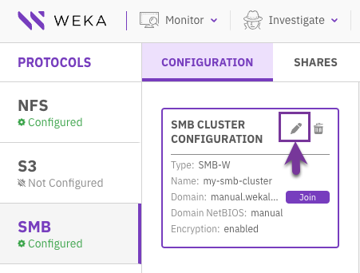

# Manage SMB using the GUI

WEKAWEKAUsing the GUI, you can:

* [Configure the SMB cluster](smb-management-using-the-gui.md#configure-the-smb-cluster) (not applicable for SMB-W)
* [Edit the SMB cluster](smb-management-using-the-gui.md#edit-the-smb-cluster)
* [Join the SMB cluster in the Active Directory](smb-management-using-the-gui.md#join-the-smb-cluster-in-the-active-directory)
* [Delete the SMB cluster](smb-management-using-the-gui.md#delete-the-smb-cluster)
* [Display the SMB shares list](smb-management-using-the-gui.md#display-the-smb-shares-list)
* [Add an SMB share](smb-management-using-the-gui.md#add-an-smb-share)
* [Edit an SMB share](smb-management-using-the-gui.md#undefined)
* [Remove an SMB share](smb-management-using-the-gui.md#remove-an-smb-share)


Using the GUI, you can manage the SMB-W cluster, but not configure and delete it. See [Manage SMB using the CLI](smb-management-using-the-cli.md).\
When managing an SMB-W cluster using the GUI, the limitations related to SMB-W in the CLI commands also apply.



**Note:** Use ASCII format when configuring name fields, such as domain and shares.


## **Configure the SMB cluster** 

Define the WEKA system servers that participate in the SMB cluster (with legacy SMB only)**.**

**Procedure**

1. From the menu, select **Manage > Protocols**.
2. From the Protocols pane, select **SMB**.
3. On the Configuration tab, select **Configure**.

4\. In the SMB Cluster Configuration dialog, set the following properties:

* **Name**: A NetBIOS name for the SMB cluster.
* **Domain**: The domain the SMB cluster joins.
* **Domain NetBIOS Name**: (Optional) The domain NetBIOS name.
* **Servers**: List of 3-8 WEKA system servers to participate in the SMB cluster, based on the server IDs in WEKA.
* **Encryption:** Select the in-transit encryption to use in the SMB cluster:\
  \- enabled: enables encryption negotiation but doesn't turn it on automatically for supported\
  sessions and share connections.\
  \- disabled: doesn't support encrypted connections.\
  \- desired: enables encryption negotiation and turns on data encryption on supported sessions\
  and share connections.\
  \- required: enforces data encryption on sessions and share connections. Clients that do not\
  support encryption will be denied access to the server.
* **IPs**: (Optional) List of public IPs (comma-separated) used as floating IPs for the SMB cluster to serve the SMB over and thereby provide HA (do not assign these IPs to any server on the network). For IP range, use the following format: **a.b.c.x-y**.


In all cloud installations, it is not possible to set a list of SMB service addresses. The SMB service must be accessed using the primary addresses of the cluster nodes.


5\. Select **Save**.

<figure><figcaption>
SMB cluster configuration
</figcaption></figure>

Once the system completes the configuration process, the server statuses change from not ready (red X icon) to ready (green V icon).

## Edit the SMB cluster 

You can modify the encryption and IPs settings according to your needs.

**Procedure**

1. In the SMB Cluster Configuration, select the **pencil** icon.

<figure><figcaption>
Edit the SMB cluster
</figcaption></figure>

2\. In the Edit SMB Configuration dialog, update the encryption and IPs settings.

<figure><figcaption>
Edit SMB configuration
</figcaption></figure>

3\. Select **Save**.

## Join the SMB cluster in the Active Directory 

To enable the organizational Active Directory to resolve the access of users and user groups to the SMB cluster, join the SMB cluster in the Active Directory (AD).

**Before you begin**

Enable the WEKA storage nodes to join the AD domain. On all backend servers used for SMB, set the AD servers as DNS servers in the  /`etc/resolv.conf` file.

**Procedure**

1. In the SMB Cluster Configuration, select **Join**.

.png>)

2\. In the Join to Active Directory dialog, set the following properties:

* **Username** and **Password**: A username and password of an account that has access privileges to the Active Directory. WEKA does not save the user password. A computer account is created on behalf of the user for the SMB cluster.
* **Server**: (Optional) WEKA identifies the AD server automatically based on the AD name. You do not need to set the server name. In some cases, if required, specify the AD server.
* **Computers Org. Unit**: The default organization unit is the Computers directory. You can define any other directory to connect to in Active Directory, such as SMB servers or Corporate computers.

Once the SMB cluster joins in the Active Directory, the join status next to the domain changes to **Joined**.


To join a different Active Directory to the existing SMB cluster configuration, select **Leave**. To confirm the action, enter the username and password used to connect to the Active Directory.


## Delete the SMB cluster 

Deleting the SMB cluster resets its configuration data.

**Procedure**

1. In the SMB Cluster Configuration, select the **trash** icon.

2\. In the SMB Configuration Reset message, select **Reset**.

## **Display the SMB shares list** 

The Shares tab displays the list of SMB shares that are already created in the system. You can also customize the table columns of the SMB shares list.

**Procedure**

1. From the menu, select **Manage > Protocols**.
2. From the Protocols pane, select **SMB**.
3. Select the **Shares** tab.\
   You can filter the list using any column in the table.

## Add an SMB share 

**Procedure**

1. In the Shares tab, select **+Create**.

3. In the Add SMB Share dialog, set the following properties:
   * **Name**: A meaningful name for the SMB share.
   * **Filesystem**: The filesystem name that includes the directory to share. Select one from the list.
   * **Description**: A description or purpose of the SMB share.
   * **Path**: A valid internal path, relative to the root, within the filesystem to expose the SMB share.
   * **Encryption:** Select in-transit encryption enforcement of the share. The global cluster encryption settings can affect the actual encryption.
   * **Read Only:** Select to set the share as read-only.
   * **Hidden:** Select if you want to hide the share so it is not visible when viewing the list of system shares.
   * **Allow Guest Access:** Select if you want guests to access without authentication.
   * **Access Permissions:** Define the share access permissions. If you select ON, select the access type and the users or groups allowed to access the share (comma-separated users and groups list, add '@' as a group prefix).
   * **Files/Directories POSIX Mode Mask**: Set the new default file and directory permissions in a numeric (octal) format created through the share.
   * **ACLs Enabled**: Determines whether to enable the Windows Access-Control Lists (ACLs) on the share. Weka translates the ACLs to POSIX.
4. Select **Save**.

## Edit an SMB share 

You can update some of the SMB share settings. These include encryption, hiding the share, allowing guest access, and setting the share as read only or not.

**Procedure**

1. In the Shares tab, select the three dots of the share and select **Edit**.

<figure><figcaption></figcaption></figure>

2. In the Update Share Settings dialog, update the relevant properties and select **Save**.

<figure><figcaption>
Update the SMB share settings
</figcaption></figure>

## Remove an SMB share 

**Procedure**

1. In the Shares tab, select the three dots of the share and select **Remove**.

2. In the confirmation message that appears, select **Confirm**.\
   The removed share no longer appears in the SMB Shares list.
