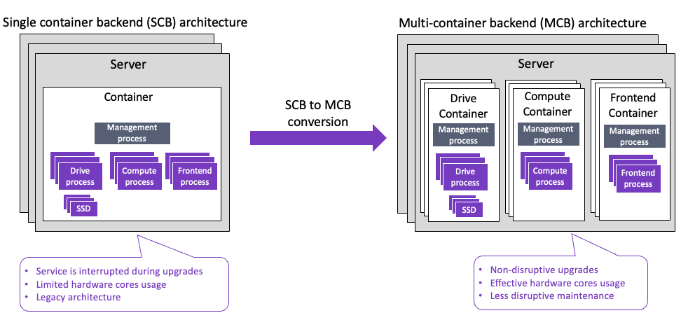

# Convert cluster to multi-container backend

Since WEKA introduced the multi-container backend (MCB or MBC) architecture, it is required to convert existing single-container backend (SCB) architecture to MCB.

In SCB, the drive, compute, and frontend processes are in the same container. In MCB, a server includes multiple containers, each running a specific process type. The MCB offers benefits such as:

* Non-disruptive upgrades
* Effective hardware cores usage
* Less disruptive maintenance

Conversion to MCB is supported from version 4.0.2 and above.

<figure><figcaption><p>SCB vs. MCB</p></figcaption></figure>

For more details about MCB, see the [weka-containers-architecture-overview.md](../weka-system-overview/weka-containers-architecture-overview.md "mention").


This workflow is intended for experienced professionals in the field of professional services who are familiar with WEKA concepts and maintenance procedures.


## SCB to MCB conversion workflow

The conversion runs on one server at a time (rolling). It takes about 4.5 minutes per server, so the cluster performance hit is minimal. Therefore, it is recommended (not mandatory) to perform this workflow during the corporate maintenance window.

1. [Prepare the source cluster for conversion](convert-the-cluster-architecture-from-a-single-container-backend-to-a-multi-container-backend.md#2.-prepare-the-source-cluster-for-conversion)
2. [Remove the protocol cluster configurations (if exist)](convert-the-cluster-architecture-from-a-single-container-backend-to-a-multi-container-backend.md#2.-remove-the-protocol-cluster-configurations-if-exist)
3. [Ensure failure domains are named](convert-the-cluster-architecture-from-a-single-container-backend-to-a-multi-container-backend.md#3.-ensure-failure-domains-are-named)
4. [Convert the cluster from SCB to MCB](convert-the-cluster-architecture-from-a-single-container-backend-to-a-multi-container-backend.md#4.-convert-the-cluster-to-mbc)
5. [Restore the protocol cluster configurations (if required)](convert-the-cluster-architecture-from-a-single-container-backend-to-a-multi-container-backend.md#5.-restore-the-protocol-cluster-configurations-if-required)

### 1. Prepare the source cluster for conversion

1. Ensure the source cluster meets the following requirements:
   * The source cluster is version 4.0.2 or higher.
   * The cluster must not download a snapshot during the conversion (snapshot upload is allowed).
   * You must have passwordless SSH access to all backend servers. This access can be granted to either the root user or a regular user. If you opt for a non-root user, it must also have passwordless sudo privileges.
2. Download the latest [Tools Repository](https://github.com/weka/tools/tree/master). It is recommended to pull the latest version before starting the migration.
3. Copy the following scripts from the downloaded tools repository to the **/tmp** directory on the server from which you plan to run it:
   * **All** the following conversion scripts:
     * [MBC cluster conversion](https://github.com/weka/tools/tree/master/topics/MBC\_cluster\_conversion)
     * [Change failure domains to manual](https://github.com/weka/tools/blob/master/postinstall/change\_failure\_domains\_to\_manual.py)
     * [Protocols](https://github.com/weka/tools/blob/master/postinstall/protocols)
   * [Resources generator](https://github.com/weka/tools/blob/master/install/resources\_generator.py) &#x20;
4. Verify that all backends are up and with no rebuilds in progress.
5. Ensure no WEKA filesystem mounts exist on the backends.\
   If required, run `umount -a -t wekafs`.
6. The backend container must not have converged processes (nodes) in the same core. Each process must be either frontend, compute, or drive. You cannot share these on the same core. Some clusters may share the frontend and compute processes, especially in AWS. If you have one of these clusters, you must first use the `core_allocation` script to change to core allocations.
7. Ensure the root user is logged into the WEKA cluster on all backends. Otherwise, copy the `/root/.weka/auth-token.json` to all backend servers. The script runs the `weka` commands. Without this file, the commands do not complete, and the message is “error: Authentication Failed”.
8. The conversion script starts running on three containers on ports 14000, 14200, and 14300. Ensure no other processes use ports in the range 14000 to 14299.
9. Changing the `/opt/weka/logs` loop device to 2 GB is recommended. After the MCB conversion, each container has its own set of logs, so the space required is tripled. Visit the Support Portal and search for the KB: _How-to-increase-the-size-of-opt-weka-logs_.
10. If the cluster has network device names in the old schema, convert these names to real NIC names. To identify the network devices, run `weka cluster host net -b`. If the result shows network device names such as `host0net0`, it is the old schema.

### 2.  Remove the protocol cluster configurations (if exist)

If protocol cluster configurations are set, remove them if possible. Otherwise, once you convert some containers (later in this workflow), you can move the protocol containers to the converted containers.

Using the `protocols` script (from the tools repository), perform the following:

1. Back up the configuration of the protocol clusters.&#x20;
2. Destroy the configuration of the protocol clusters.&#x20;


During the conversion process, the HostIDs are changed. After the conversion, manually change the HostIDs in the configuration backup file.


### 3. Ensure failure domains are named

Only clusters with named failure domains can be converted. The conversion script does not support automatic or invalid failure domains.

1. Check the failure domain names. Run the following command line:

```sh
weka cluster host -b -v --output hostname,fd,fdName,fdType,fdId
```

<details>

<summary>Example: Named failure domains</summary>

```
$ weka cluster host -b -v --output hostname,fd,fdName,fdType,fdId
HOSTNAME                       FAILURE DOMAIN  FAILURE DOMAIN NAME  FAILURE DOMAIN TYPE  FAILURE DOMAIN ID
ip-172-31-39-174.ec2.internal  FD_16           FD_16                USER                 16
ip-172-31-36-151.ec2.internal  FD_25           FD_25                USER                 25
ip-172-31-33-66.ec2.internal   FD_63           FD_63                USER                 63
ip-172-31-39-101.ec2.internal  FD_0            FD_0                 USER                 0
ip-172-31-34-33.ec2.internal   FD_23           FD_23                USER                 23
ip-172-31-46-217.ec2.internal  FD_20           FD_20                USER                 20
ip-172-31-45-42.ec2.internal   FD_31           FD_31                USER                 31
ip-172-31-36-77.ec2.internal   FD_30           FD_30                USER                 30
```

</details>

<details>

<summary>Example: Automatic failure domains</summary>

```
# weka cluster host -b -v --output hostname,fd,fdName,fdType,fdId
HOSTNAME  FAILURE DOMAIN  FAILURE DOMAIN NAME  FAILURE DOMAIN TYPE  FAILURE DOMAIN ID
cst1      AUTO                                 AUTO                 0
cst2      AUTO                                 AUTO                 4
cst5      AUTO                                 AUTO                 2
cst6      AUTO                                 AUTO                 3
cst7      AUTO                                 AUTO                 6sh
```

</details>

<details>

<summary>Example: Invalid failure domains</summary>

Invalid failure domains may appear in clusters started on older WEKA versions.

```sh
HOST ID  HOSTNAME         CONTAINER NAME  STATUS  VERSION  MODE     FAILURE DOMAIN  FAILURE DOMAIN NAME  FAILURE DOMAIN TYPE  FAILURE DOMAIN ID
0        drp-srcf-ffb001  default         UP      3.13.6   backend                                       INVALID              10
1        drp-srcf-ffb002  default         UP      3.13.6   backend                                       INVALID              2
2        drp-srcf-ffb003  default         UP      3.13.6   backend                                       INVALID              0
3        drp-srcf-ffb004  default         UP      3.13.6   backend                                       INVALID              3
4        drp-srcf-ffb005  default         UP      3.13.6   backend                                       INVALID              13
5        drp-srcf-ffb006  default         UP      3.13.6   backend                                       INVALID              11
6        drp-srcf-ffb007  default         UP      3.13.6   backend                                       INVALID              8she
```

</details>

If the cluster has automatic or invalid failure domains, do the following:

* Ensure there are no filesystem mounts on the backends.
* Run the `change_failure_domains_to_manual.py` script from the **/tmp** directory.

This script converts each backend to a named failure domain and restarts it (rolling conversion). This operation causes a short rebuild.

<details>

<summary>Example: Change failure domains to manual (named failure domains)</summary>

```
[ec2-user@ip-172-31-34-33 postinstall]$ ./change_failure_domains_to_manual.py                                                                                                      |
2023-01-19 15:09:31 LOG: Queried ip-172-31-39-174.ec2.internal: currently running with failure domain type AUTO (id: 16, name=)
No rebuild is currently in progress

Data in each protection level:

2 Protections [■■■■■■■■■■■■■■■■■■■■■■■■■■■■■■■■■■■■■■■■] 32.33 TiB / 32.33 TiB
1 Protections [                                        ] 0 B / 32.33 TiB
0 Protections [                                        ] 0 B / 32.33 TiB
2023-01-19 15:09:31 LOG: Cluster is fully protected (status OK)
2023-01-19 15:09:31 LOG: Change ip-172-31-39-174.ec2.internal:default failure domain to manual? [y]es / [s]kip / all>
y
2023-01-19 15:09:42 LOG: Failure domain ID of ip-172-31-39-174.ec2.internal:default is currently 16 (type=AUTO)
2023-01-19 15:09:42 LOG: New failure domain selected for ip-172-31-39-174.ec2.internal:default is FD_16 (based on ID 16)
2023-01-19 15:09:42 LOG: Changing of failure-domain on ip-172-31-39-174.ec2.internal to FD_16
2023-01-19 15:09:42 LOG: Running 'weka local resources failure-domain --name FD_16' on ip-172-31-39-174.ec2.internal (172.31.39.174) via ssh
Set failure_domain of default to FD_16
2023-01-19 15:09:43 LOG: Applying resources ip-172-31-39-174.ec2.internal
2023-01-19 15:09:43 LOG: Running 'weka local resources apply -f' on ip-172-31-39-174.ec2.internal (172.31.39.174) via ssh
default: Allocated network device "eth1" (with identifier "0000:00:06.0") to slots [1] on "ip-172-31-39-174.ec2.internal":"default" (1/7)
default: Allocated network device "eth2" (with identifier "0000:00:07.0") to slots [2] on "ip-172-31-39-174.ec2.internal":"default" (2/7)
default: Allocated network device "eth3" (with identifier "0000:00:08.0") to slots [3] on "ip-172-31-39-174.ec2.internal":"default" (3/7)
default: Allocated network device "eth4" (with identifier "0000:00:09.0") to slots [4] on "ip-172-31-39-174.ec2.internal":"default" (4/7)
default: Allocated network device "eth5" (with identifier "0000:00:0a.0") to slots [5] on "ip-172-31-39-174.ec2.internal":"default" (5/7)
default: Allocated network device "eth6" (with identifier "0000:00:0b.0") to slots [6] on "ip-172-31-39-174.ec2.internal":"default" (6/7)
default: Allocated network device "eth7" (with identifier "0000:00:0c.0") to slots [7] on "ip-172-31-39-174.ec2.internal":"default" (7/7)
default: Allocated core 6 to slot 6 on "ip-172-31-39-174.ec2.internal":"default" (1/7)
default: Allocated core 7 to slot 7 on "ip-172-31-39-174.ec2.internal":"default" (2/7)
default: Allocated core 1 to slot 1 on "ip-172-31-39-174.ec2.internal":"default" (3/7)
default: Allocated core 3 to slot 3 on "ip-172-31-39-174.ec2.internal":"default" (4/7)
default: Allocated core 2 to slot 2 on "ip-172-31-39-174.ec2.internal":"default" (5/7)
default: Allocated core 5 to slot 5 on "ip-172-31-39-174.ec2.internal":"default" (6/7)
default: Allocated core 4 to slot 4 on "ip-172-31-39-174.ec2.internal":"default" (7/7)
default: Starting hugepages allocation for "ip-172-31-39-174.ec2.internal":"default"
default: Allocated 139456MB hugepages memory from 1 NUMA nodes for "ip-172-31-39-174.ec2.internal":"default"
default: Bandwidth of "ip-172-31-39-174.ec2.internal":"default" set to unlimited
Container "default" is ready (pid = 8497)
Container "default" is RUNNING (pid = 8497)
2023-01-19 15:09:57 LOG: Waiting for container to become ready on ip-172-31-39-174.ec2.internal
2023-01-19 15:09:57 LOG: Running 'weka local status -J' on ip-172-31-39-174.ec2.internal (172.31.39.174) via ssh, capturing output
2023-01-19 15:10:01 LOG: Container on ip-172-31-39-174.ec2.internal is now ready
2023-01-19 15:10:01 LOG: Getting host-id from the current container on ip-172-31-39-174.ec2.internal
2023-01-19 15:10:01 LOG: Running 'weka debug manhole -s 0 getServerInfo' on ip-172-31-39-174.ec2.internal (172.31.39.174) via ssh, capturing output
2023-01-19 15:10:02 LOG: Waiting for host with ip-172-31-39-174.ec2.internal to become UP in 'weka cluster host'
2023-01-19 15:10:02 LOG: Running 'weka cluster host -J -F id=0' on ip-172-31-39-174.ec2.internal (172.31.39.174) via ssh, capturing output
2023-01-19 15:10:02 LOG: Validate the failure domain in the stable resources failure domain is FD_16, which means the container loaded properly with the right resources
2023-01-19 15:10:02 LOG: Running 'weka local resources --stable -J' on ip-172-31-39-174.ec2.internal (172.31.39.174) via ssh, capturing output
2023-01-19 15:10:03 LOG: Timed out waiting for the cluster to become unhealthy - Assuming it's healthy
Rebuild about to start...

Data in each protection level:

2 Protections [■■■■■■■■■■■■■■■■■■■■■■■■■■■■■■■■■■■■■■■■] 32.85 TiB / 32.87 TiB
1 Protections [■                                       ] 18 GiB / 32.87 TiB
0 Protections [                                        ] 0 B / 32.87 TiB
2023-01-19 15:10:08 LOG: Rebuilding at rate of 128MiB/sec (scrubber rate)
2023-01-19 15:10:08 LOG: Still has failures (status REBUILDING)
```

</details>

### 4. Convert the cluster to MCB

Before running the conversion script: `./convert_cluster_to_mbc.sh -<flag>`, adhere to the following:

* The script includes flags that change the allocated cores for each process type. It is helpful if you want to increase the number of cores allocated for the compute, frontend (for protocols), and drive processes. Leave at least two cores for the OS and protocols.\
  If you run the script without any options, it preserves the existing core settings.
* Do not use the `-s` flag without development approval.
* If the cluster configuration uses IB PKEY, running the conversion script with the `-p` flag is mandatory.
* It is recommended to convert a single backend first. If the conversion is successful, convert the rest of the cluster. Do not continue converting the cluster until you know it works fine for a single backend. Use the `-b` flag to do this single host. Ensure all the WEKA buckets are available after the conversion and the default container is removed.
* If a previous conversion fails, remove the file `/root/resources.json.backup` from **all** backends. Otherwise, use the `-f` flag in the following conversion attempt.

#### SCB to MCB conversion flags

```sh
# ./convert_cluster_to_mbc.sh -v -h
  -v force resources generator to use nics as VFs.
  -f force override of backup resources file if exist.
  -a run with active alerts.
  -s skip failed hosts (this is a dangerous flag, use with caution!).
  -d override drain grace period for s3 in seconds.
  -b to perform conversion on a single host.
  -p use only the nic identifier and don't resolve the PCI address.
  -l log file will be saved to this location instead of the current dir
  -D assign drive dedicated cores (use only for on-prem deployment, this flag overrides pinned cores).
  -F assign frontend dedicated cores (use only for on-prem deployment, this flag overrides pinned cores).
  -C assign compute dedicated cores (use only for on-prem deployment, this flag overrides pinned cores).
  -m override max memory assignment after conversion. Specify the value in GiB.
  -i path to the ssh identity file.
  -h show this help.
  
```


Successful SCB to MCB conversion example


### 5. Restore the protocol cluster configurations (if required)

If you have destroyed the protocol clusters configuration before the conversion, restore them as follows:

1. Open the backup file of the protocol cluster configurations created before the conversion. Search for the `HostId` lines and replace these to match the `frontend0` container HostIDs.\
   To retrieve the new HostIDs, run the following command line: \
   `weka cluster container -b | grep frontend0`.
2. Run the `protocols` script from the `/tmp` directory.

## Troubleshooting

### MCB script fails

*   No pause between host deactivation and removal:

    During the conversion, it failed to remove the old host/container because it deactivated the host and then didn’t wait for the host/container to be INACTIVE.
* During the conversion of SMB hosts, it failed.

**Corrective action**

1. Clean up the host state using the following commands:

```sh
# Clean up the cluster (change XXX to host-id of OLD host, which must be DOWN)
weka cluster host deactivate XXX
weka cluster host remove XXX --no-unimprint

# Clean up the host (remove the old container)
weka local ps
sudo weka local rm default
sudo weka local enable
```

2. Continue with the conversion process.

### Clients in a bad state cause new backends to get stuck in SYNCING state

On a large cluster with about 2000 clients and above, the rebuild between each MCB conversion hangs. The reason is that the baseline configuration failed to sync to all the clients at the end of the rebuild.

**Corrective action**

1. Deactivate and remove the clients that were down or degraded.
2. Wait for the sync to finish.
3. If the issue persists, look at the WEKA cluster events and search for `NoConnectivityToLivingNode` events where the event is a `peer`.
4. Translate the node ID to a HostID and add the host to the denylist.

### Drives are not activated correctly during phase-out

When two drives or four phase out, the conversion script goes on a loop with the error message:

`“ 2023-09-04 14:55:38 mbc divider - ERROR: Error querying container status and invoking scan: The following drives did not move to the new container, ['4a7d4250-179e-42b4-ab3f-90cfcb968f64'] retrying “`&#x20;

This symptom occurs because the script assumes the drives belonged to the default cluster, already deleted from the host.

**Corrective action**

1. Deactivate the phased-out drives and immediately activate them.\
   The drives automatically move to the correct container. The default container is automatically removed from the cluster.
2. If the default container is not moved as expected, manually remove the default container from the cluster configuration. Run the command: `weka cluster container remove`, with the `--no-unimprint` flag.
3. Check the host with the error.
4. If the containers do not start at boot, run the command: `weka local enable`.

### Too much memory on the Compute container

The compute container takes too long to start due to RAM allocation.

**Corrective action**

Do one of the following:

* Before starting the conversion again, reduce the memory size of each container. When the conversion completes, change the memory size back.
* Change the memory at the MCB conversion using the flag `-m 150`. This flag sets the RAM to 150 GiB. When the conversion completes, change the memory size back.

To change the RAM  to the previous size, run the command `weka local resources` for the compute container. The drive and frontend containers do not need more memory.


When this error occurs, the drive container is still active, with all the drives, and the default container is stopped.

To reverse, create the other containers manually or remove the drives container and restart the default container.\
If the drives are phased out or unavailable, deactivate the phased-out drives and immediately activate them. Alternatively, remove the drives and re-add them.\
See [Drives are not activated correctly during phase-out](convert-the-cluster-architecture-from-a-single-container-backend-to-a-multi-container-backend.md#drives-are-not-activated-correctly-during-phase-out).


### Compute0 conversion failed on VMware hosts

On a Weka cluster deployed on _vsphere_, where each container is a VM, running the conversion script succeeds with `drives0` but fails on `compute0` with the following error:

```
error: Container "compute0" has run into an error: Cannot resolve PCI 0000:0c:00.0 to a valid network device

```

**Corrective action**

Run the conversion script with the `-v` flag: `./convert_cluster_to_mbc.sh -a -v`

### Missing NICs were passed issue

The conversion failed due to network interface names that contained uppercase letters. For example, `bond4-100G`.

The `resources_generator.py` script contains the following line that converts the incoming values to lowercase:

`402 parser.add_argument("--net", nargs="+", type=str.lower, metavar="net-devices"`

**Corrective action**

Do one of the following:

* Change the network interface names to lowercase. For example, from `bond4-100G` to `bond4-100g.` Add the adapter resource to the host and re-run the conversion script.
* Edit the `resources_generator.py` script line 402, replace `type=str.lower` with `type=str`, and re-run the conversion script.

```sh
2023-05-02 10:57:13 mbc divider - INFO: Running resources-generator with cmd: /bin/sh -c "/tmp/resources_generator.py --net  bond4-100G/10.18.4.1/24/255.255.255.255  --compute-dedicated-cores 11 --drive-dedicated-cores 6 --frontend-dedicated-cores 2 -f"
ERROR:resources generator:Detected net devices: {'enp1s0f1': {'mac': '1a:75:4d:14:bf:2c', 'master': 'bond4-100G'}, 'usb0': {'mac': '42:06:bf:33:9e:b5'}, 'bond4-100G': {'mac': '1a:75:4d:14:bf:2c'}, 'enp129s0f1': {'mac': '5a:e4:39:5f:be:b3', 'master': 'bond4-1G'}, 'enp1s0f0': {'mac': '1a:75:4d:14:bf:2c', 'master': 'bond4-100G'}, 'bond4-1G': {'mac': '5a:e4:39:5f:be:b3'}, 'enp129s0f0': {'mac': '5a:e4:39:5f:be:b3', 'master': 'bond4-1G'}}
ERROR:resources generator:Missing NICs were passed: {'bond4-100g'}
2023-05-02 10:57:14 mbc divider - WARNING: Something went wrong running: /bin/sh -c "/tmp/resources_generator.py --net  bond4-100G/10.18.4.1/24/255.255.255.255  --compute-dedicated-cores 11 --drive-dedicated-cores 6 --frontend-dedicated-cores 2 -f"
2023-05-02 10:57:14 mbc divider - WARNING: Return Code: 1
2023-05-02 10:57:14 mbc divider - WARNING: Output: b''
2023-05-02 10:57:14 mbc divider - WARNING: Stderr: None
Traceback (most recent call last):
  File "/tmp/mbc_divider_script.py", line 787, in <module>
    main()
  File "/tmp/mbc_divider_script.py", line 625, in main
    run_shell_command(resource_generator_command)
  File "/tmp/mbc_divider_script.py", line 44, in run_shell_command
    raise Exception("Error running command (exit code {}): {}".format(process.returncode, command))
Exception: Error running command (exit code 1): /bin/sh -c "/tmp/resources_generator.py --net  bond4-100G/10.18.4.1/24/255.255.255.255  --compute-dedicated-cores 11 --drive-dedicated-cores 6 --frontend-dedicated-cores 2 -f"
```
