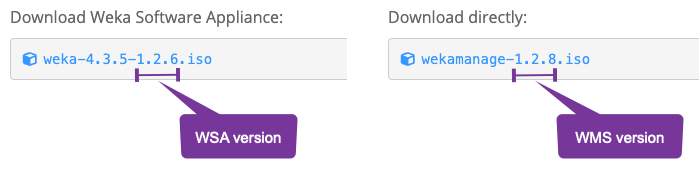

# Update WMS and WSA

Maintaining system security and functionality requires regular updates to the WEKA Management Station (WMS) and WEKA Software Appliance (WSA). The primary updates needed are security patches, and the update process differs for sites with Internet access and dark sites.

## Update WMS and WSA for sites with Internet access

1. **Access the system:** Log in to each system that needs to be updated.
2.  **Run the update command:** Run the following command to install the latest security patches:

    ```bash
    dnf update
    ```
3. **Reboot the servers for major OS upgrades** (for example, Rocky Linux 8.6 to 8.10):
   * To prevent downtime, use rolling reboots across the servers. Alternatively, you can take the system offline to complete the update with a single reboot.
4. **Verify the update:** Once the update is complete, confirm that all relevant patches have been applied by reviewing the update log.
5. **Repeat periodically:** To maintain system security, repeat this process regularly on all systems.

## Update WMS and WSA in dark sites

In dark sites—environments without Internet access—updating requires a manual process. Administrators must download the necessary update packages from a system with Internet access, transfer them to the isolated environment, and configure the WSA/WMS to use a local repository. This method allows dark sites to manage updates securely without relying on external connectivity.

**Prerequisites**

* A basic understanding of Linux and `dnf` package management.
* Access to a Linux system with Internet connectivity.
* Access to WEKA Customer Success Team if assistance is needed.
* The WMS and WSA ISO versions is below `2.0.0` (the last three digits of the ISO file name).

<figure><figcaption><p>WSA iso file version example </p></figcaption></figure>

* **Check the existing version:**&#x20;
  * **WMS:** Log into the WMS station and run `cat /.wms-version`
  * **WSA:**  Log into the WSA station and run `cat /.version`&#x20;


You can also check the version from the login message. For example:

```
$ ssh weka64
Welcome to the Weka Software Appliance!
Version 1.2.6
Web console: https://weka64:9090/ or https://172.29.0.64:9090/
Last login: Tue Sep 10 23:43:40 2024 from 10.41.226.0
```


**Procedure**

1. **Copy the repository file:**
   * On a WMS/WSA system, copy the `/etc/yum.repos.d/ciq.repo` file.
   * Transfer this file to a Linux system that has Internet access.
   * Place the file in a dedicated directory (referred to as `reposdir`).
2.  **Download repository contents:**

    * Use the `reposync` command to download the contents of the patch repository.
    * Run the following command, specifying the `reposdir` directory and download path:

    
    ```bash
    reposync --setopt=reposdir=./reposdir --download-metadata --repo=lts-8.6-hashed-ciq_lts_86 --download-path ./weka-patches --norepopath --newest-only
    ```
    

    Example output:

    ```
    LTS for Rocky Linux 8.6                                                                                                          13 kB/s | 3.4 kB     00:00
    LTS for Rocky Linux 8.6                                                                                                         1.8 MB/s |  14 MB     00:07
    (1/1986): ciq-lts86-rocky-release-8.6-6.el8.noarch.rpm                                                                           84 kB/s |  22 kB     00:00
    (2/1986): rocky-gpg-keys-8.6-6.el8.noarch.rpm                                                                                    45 kB/s |  12 kB     00:00
    (3/1986): ciq-rocky86-repos-8.6-6.el8.noarch.rpm                                                                                 53 kB/s |  15 kB     00:00
    (4/1986): stalld-1.17.1-2.el8.ciqlts.x86_64.rpm
    ...
    ```
3. **Transfer repository to dark site:**
   * Copy the `weka-patches` directory to a location accessible to the WSA systems in the dark site. This can be a local repository server or a directory on the WSA image.
   * Use `tar` to archive the directory for transfer, then unpack it on the target system.
4.  **Modify WMS/WSA repository configuration:**

    * Update the `/etc/yum.repos.d/ciq.repo` file on the WMS/WSA to point to the local repository you just created.
    * Modify the `baseurl` setting to reference the local path or repository server. For example:

    ```
    baseurl=file:///root/weka-patches
    ```
5.  **Run the update:**

    * On the WMS/WSA system, run the following `dnf` command to update from the local repository:

    ```
    dnf --disablerepo=* --enablerepo=lts-8.6-hashed-ciq_lts_86 update
    ```
6. **Reboot the servers for major OS upgrades** (for example, Rocky Linux 8.6 to 8.10):
   * To prevent downtime, use rolling reboots across the servers. Alternatively, you can take the system offline to complete the update with a single reboot.
