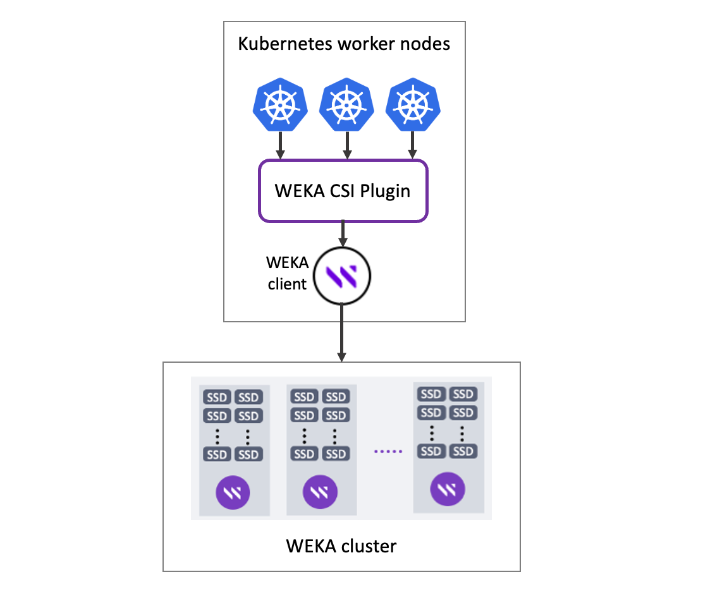

# WEKA CSI Plugin

The WEKA CSI Plugin interfaces Kubernetes worker nodes and control plane with the WEKA clients. It enables the creation and configuration of persistent storage external to Kubernetes. It is based on the CSI Plugin standard.

What is the CSI Plugin standard?

The CSI (Container Storage Interface) Plugin is a standardized interface that enables container orchestration platforms, such as Kubernetes, to interact with different storage systems in a vendor-agnostic manner. CSI was introduced to address the challenges of integrating and managing storage in containerized environments.

For more details, see the [CSI standard specifications](https://github.com/container-storage-interface/spec/blob/master/spec.md).

The WEKA CSI Plugin provides the following features:

* Static and dynamic volumes provisioning.
* Mount a volume as a WEKA filesystem directory, a writable snapshot of an existing filesystem, or a whole filesystem.
* Support all volume access modes: ReadWriteMany, ReadWriteOnce, and ReadOnlyMany.
* Volume expansion.
* Snapshots and volume cloning.
* Quota enforcement on:
  * Snapshot-backed persistent volumes in WEKA version 4.2 and up.
  * Filesystem-backed persistent volumes in WEKA version 4.2 and up.
  * Directory-backed persistent volumes in WEKA version 3.14 and up. See [Upgrade legacy persistent volumes for capacity enforcement](upgrade-legacy-persistent-volumes-for-capacity-enforcement.md).

<figure><figcaption>
WEKA CSI Plugin implementation
</figcaption></figure>

## Interoperability

* CSI protocol: 1.0 - 1.2.
* Kubernetes: 1.18 - 1.2x.
* WEKA: V3.14 and up. WEKA V4.2 and up and WEKA CSI Plugin V2.0 are required to get all features.
* SELinux is supported (AppArmor for Ubuntu is not supported).


The WEKA CSI Plugin replaces plugins developed earlier in the Kubernetes evolution. It replaces the `hostPath` method to expose WEKA mounts as Kubernetes volumes.

