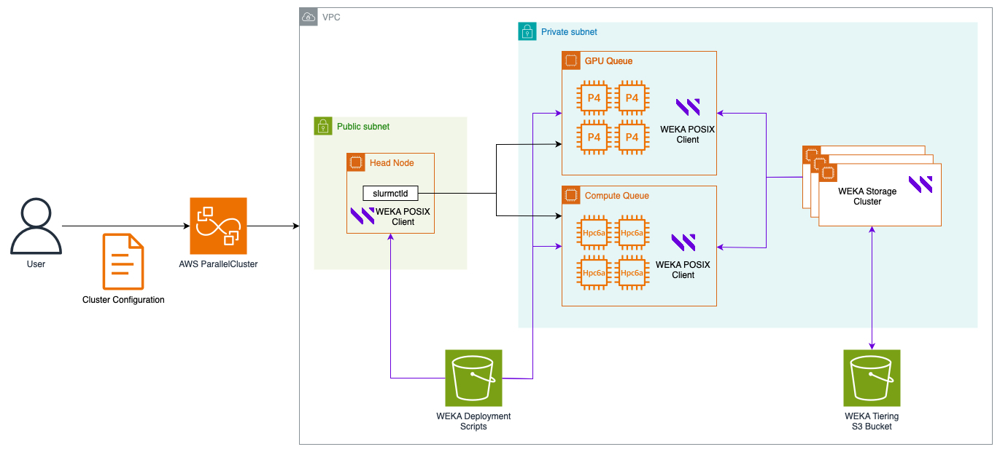

# AWS ParallelCluster and WEKA Integration

## Overview

AWS ParallelCluster is an open-source tool for managing clusters, simplifying the deployment and administration of HPC clusters on AWS. By integrating with WEKA, organizations can create a high-performance data platform that significantly reduces epoch time from months to days without requiring additional infrastructure investment.

The infrastructure performance and efficiency gains made possible with WEKA for AWS ParallelCluster, organizations can accelerate their own pace of innovation, maximize their utilization of GPU-accelerated infrastructure, and control costs.

## Slurm based architecture with AWS ParallelCluster

The integration of WEKA with AWS ParallelCluster using Slurm comprises two primary components: a compute cluster and a standalone WEKA cluster. Refer to the numbered elements in the accompanying illustration for details:

The integration of WEKA with AWS ParallelCluster using Slurm consists of two main components: a compute cluster and a standalone WEKA cluster. Refer to the numbered elements in the accompanying illustration for details:

1. **WEKA cluster deployment**\
   The WEKA cluster backends are deployed within the same Virtual Private Cloud (VPC) and subnet as the AWS ParallelCluster cluster. These backends use the i3en instance family, which is optimized for high-performance storage and compute workloads.
2. **WEKA client integration**\
   The WEKA client software is installed across the AWS ParallelCluster components, including the controller node, login nodes, and worker nodes. This software facilitates seamless access to the WEKA cluster by presenting a mount point within the file system, enabling efficient data sharing and processing.
3. **Data management and tiering**\
   To optimize data handling, WEKA employs an Amazon S3 bucket for data tiering. This system ensures that data is automatically allocated to the appropriate storage tier based on access patterns and cost-efficiency considerations. Furthermore, WEKA leverages S3 for storing snapshots, providing an additional layer of data resilience and enabling robust disaster recovery.

<div data-with-frame="true"><figure><figcaption><p>Slurm based architecture with AWS ParallelCluster</p></figcaption></figure></div>

## Deployment workflow for AWS ParallelCluster cluster

1. [Deploy WEKA Cluster using Terraform](aws-parallelcluster-and-weka-integration.md#deploy-weka-cluster-using-terraform).
2. [Prepare for AWS ParallelCluster deployment](aws-parallelcluster-and-weka-integration.md#prepare-for-aws-parallelcluster-deployment).
3. [Verify security group configuration](aws-parallelcluster-and-weka-integration.md#verify-security-group-configurations).
4. [Deploy AWS ParallelCluster cluster](aws-parallelcluster-and-weka-integration.md#deploy-aws-parallelcluster-cluster).

### Deploy WEKA Cluster using Terraform



### Prepare for AWS ParallelCluster deployment

**Step 1: AWS ParallelCluster CLI installation**

If you already have the AWS ParallelCluster CLI installed you can skip to the next step. Otherwise, follow the procedure [Installing the AWS ParallelCluster command line interface (CLI)](https://docs.aws.amazon.com/parallelcluster/latest/ug/install-v3-parallelcluster.html) in AWS documentation.

**Step 2: Create S3 bucket to store AWS ParallelCluster integration scripts**

1. Create an S3 bucket in the same region AWS ParallelCluster will be deployed.

```
aws s3 mb s3://<bucket name> --region <region>
```

2. Verify bucket creation

```
aws s3 ls | grep <bucket name>
```

**Step 3: Clone WEKA Cloud-Solutions repository and copy integrations scripts to S3**

1. Clone this repository and `cd` to the `aws/parallelcluster/` directory:

```
git clone https://github.com/weka/cloud-solutions.git
cd cloud-solutions/aws/parallelcluster
```

2. Upload integration scripts to S3

```
aws s3 cp ./scripts/weka-install.py s3://<bucket name>/scripts/weka-install.py 
aws s3 cp ./scripts/virtualenv-setup.sh s3://<bucket name>/scripts/virtualenv-setup.sh 
```

3. Create IAM policy for WEKA clients using provided template

```
aws iam create-policy --policy-name weka-client-pcluster --policy-document file://./iam/example-pcluster-policy.json
```

**Step 4: Modify AWS ParallelCluster template**

This repository includes an example cluster template file. Follow the steps below to modify the template for your AWS environment. If you already have a cluster template, combine it with the example one provided.

1. Create a copy of the example template file.

```
cp example-pcluster-template.yaml pcluster.yaml
```

2. Update Region.

```
sed -i '' -e 's/Region: us-east-2/Region: <region>/' pcluster.yaml
```

3. Update Networking settings.

```
sed -i '' -e 's/subnet-123456789abcdefg/<your subnet>/g' pcluster.yaml
sed -i '' -e' s/sg-123456789abcdefg/<your security group>/g' pcluster.yaml
```

4. Update SSH KeyName.

```
sed -i '' -e s/support_key/<your SSH KeyPair Name>/g' pcluster.yaml
```

5. Update S3 bucket name.

```
sed -i '' -e 's/MY-S3-BUCKET/<s3 bucket name>/g' pcluster.yaml
```

6. Update ALB DNS Name.

```
sed -i '' -e 's/internal-weka-lb-12345689.us-east-2.elb.amazonaws.com/<WEKA ALB DNS NAME>/g' pcluster.yaml
```

7. Update WEKA filesystem name (optional).

```
sed -i '' -e 's/--filesystem-name=default/--filesystem-name=<filesystem name>/g' pcluster.yaml
```

8. Update WEKA mount point (optional). (Escape the forward slash in the AWS ARN with a backslash.)

```
sed -i '' -e 's/--mount-point=\/mnt\/weka/--mount-point=<mount point>/g' pcluster.yaml
```

9. Update IAM Policy ARN. (Escape the forward slash in the AWS ARN with a backslash.)

```
sed -i '' -e 's/arn:aws:iam::123456789:policy\/weka-pcluster-client-policy/<IAM policy ARN>/g' pcluster.yaml
```

10. Update SlurmQueues.

While the example template shows two queues to demonstrate a common customer setup, you can configure as few as one queue. If you do implement multiple queues, update each queue's configuration.

Review and update the following parameters as necessary:

* **Name**
* **ComputeResources > Name**
* **InstanceType**
* **MinCount**
* **MaxCount**
* **CustomSlurmSettings > RealMemory**
  * This value is specific to the instance type. Refer to the table below for the correct value.
* **CustomSlurmSettings > CpuSpecList**
  * This value is specific to the instance type. Refer to the table below for the correct value.
* **OnNodeConfigured > Sequence > Script > Args > --cores**
  * This value is specific to the instance type. Refer to the table below for the correct value.

If the `--cores` argument is defined, the WEKA mount is created using a **DPDK mount** for optimal performance. If the argument is not defined, the WEKA mount defaults to **UDP mode**. **DPDK is preferred** for all instances to achieve higher storage performance. However, certain instances, such as HeadNodes, can use a UDP mount if necessary.

Additional instance types:\
If your instance type is not listed in the table below, contact the [Customer Success Team](https://app.gitbook.com/o/-L7Tp-Uy9BMSCSCx0MlK/s/uOB5D2WMRjXBnChPFTrk/) for assistance.

| Instance Type  | CpuSpecList | RealMemory |
| -------------- | ----------- | ---------- |
| hpc7a.96xlarge | 95,191      | 742110     |

### Verify security group configurations

Ensure that the AWS ParallelCluster nodes can connect with the WEKA backends on port 14000 for both TCP and UDP. Review your security group settings to confirm that the WEKA clients can communicate with the WEKA backends effectively.

### Deploy AWS ParallelCluster cluster

1. Run create-cluster


```
pcluster create-cluster -c pcluster.yaml --cluster-name your-cluster-name --rollback-on-failure FALSE
```


2. To assist with debugging, disable `rollback-on-failure` if errors occur.
