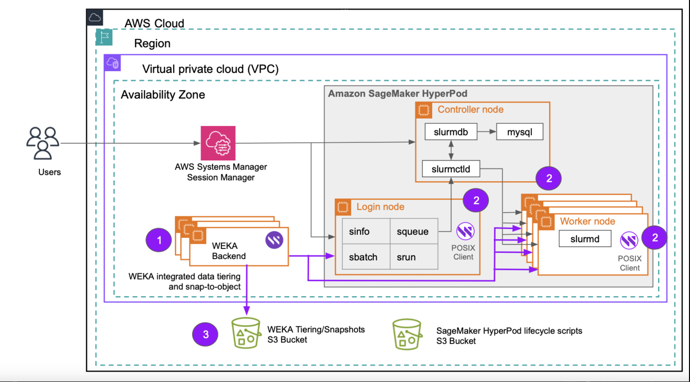

# SageMaker HyperPod and WEKA Integrations

## Overview

Amazon SageMaker HyperPod provides purpose-built infrastructure for large-scale model training. It supports distributed machine learning (ML), large language models (LLMs), and foundation models (FMs).

HyperPod simplifies GPU cluster creation and management. It integrates natively with Slurm and Amazon EKS for advanced orchestration. This enhances resilience and reduces training times for foundation models.

With WEKA support for Amazon SageMaker HyperPod, customers can use WEKA’s zero-copy, zero-tuning architecture to optimize performance across key workflows. These include data loading, model training, checkpointing, verification, tuning, and dataset archiving.

Using WEKA as the storage layer for SageMaker HyperPod improves GPU utilization and accelerates training workflows. This reduces the wall-clock time required to complete tasks, enabling faster and more efficient large-scale model training.

SageMaker HyperPod supports Slurm and Amazon EKS as orchestration engines. The following guide focuses on integrating SageMaker HyperPod with WEKA using Slurm as the orchestration engine.

## Slurm based architecture

The integration of WEKA with SageMaker HyperPod using Slurm comprises two primary components: a compute cluster and a standalone WEKA cluster. Refer to the numbered elements in the accompanying illustration for details:

1. **WEKA cluster deployment**\
   The WEKA cluster backends are deployed within the same Virtual Private Cloud (VPC) and subnet as the SageMaker HyperPod cluster. These backends use the i3en instance family, which is optimized for high-performance storage and compute workloads.
2. **WEKA client integration**\
   The WEKA client software is installed across the SageMaker HyperPod components, including the controller node, login nodes, and worker nodes. This software facilitates seamless access to the WEKA cluster by presenting a mount point within the file system, enabling efficient data sharing and processing.
3. **Data management and tiering**\
   To optimize data handling, WEKA employs an Amazon S3 bucket for data tiering. This system ensures that data is automatically allocated to the appropriate storage tier based on access patterns and cost-efficiency considerations. Furthermore, WEKA leverages S3 for storing snapshots, providing an additional layer of data resilience and enabling robust disaster recovery.

<figure><figcaption>
Slurm based architecture
</figcaption></figure>
