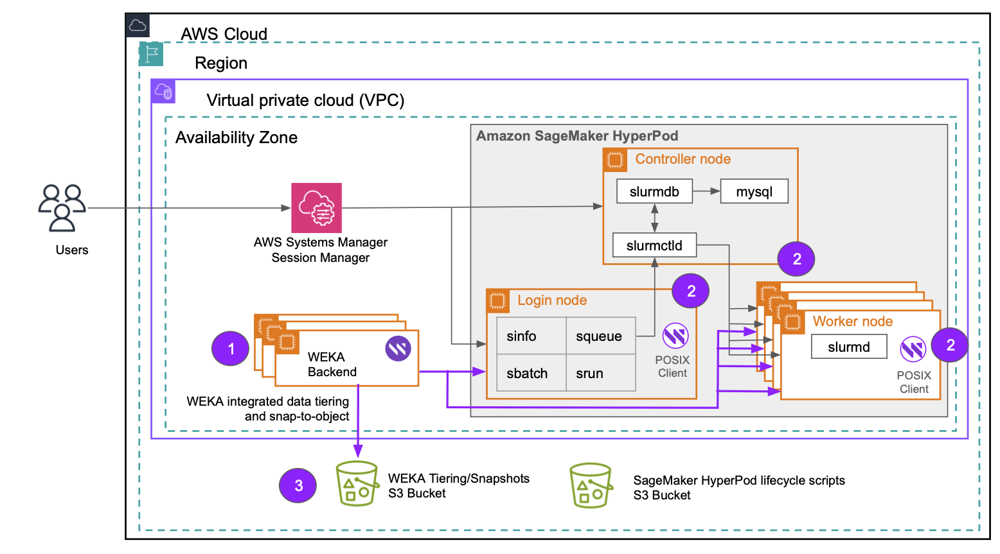

# Integrate SageMaker HyperPod with WEKA using Slurm

## Architecture

The integration of WEKA with SageMaker HyperPod using Slurm comprises two primary components: a compute cluster and a standalone WEKA cluster. Refer to the numbered elements in the accompanying illustration for details:

1. **WEKA cluster deployment**\
   The WEKA cluster backends are deployed within the same Virtual Private Cloud (VPC) and subnet as the SageMaker HyperPod cluster. These backends use the i3en instance family, which is optimized for high-performance storage and compute workloads.
2. **WEKA client integration**\
   The WEKA client software is installed across the SageMaker HyperPod components, including the controller node, login nodes, and worker nodes. This software facilitates seamless access to the WEKA cluster by presenting a mount point within the file system, enabling efficient data sharing and processing.
3. **Data management and tiering**\
   To optimize data handling, WEKA employs an Amazon S3 bucket for data tiering. This system ensures that data is automatically allocated to the appropriate storage tier based on access patterns and cost-efficiency considerations. Furthermore, WEKA leverages S3 for storing snapshots, providing an additional layer of data resilience and enabling robust disaster recovery.

<figure><figcaption><p>SageMaker HyperPod with WEKA using Slurm integration</p></figcaption></figure>

## Deployment workflow

1. [Prepare the environment for deployment](integrate-sagemaker-hyperpod-with-weka-using-slurm.md#prepare-the-environment-for-deployment).
2. [Deploy WEKA Cluster using Terraform](integrate-sagemaker-hyperpod-with-weka-using-slurm.md#deploy-weka-cluster-using-terraform).&#x20;
3. [Create SageMaker HyperPod cluster](integrate-sagemaker-hyperpod-with-weka-using-slurm.md#create-sagemaker-hyperpod-cluster).&#x20;

### Prepare the environment for deployment

1. Deploy CloudFormation template (or an equivalent) to create the prerequisites for the SageMaker HyperPod cluster.
   1. The CloudFormation template can be found at: [Amazon SageMaker HyperPod > 0. Prerequisites > 2. Own Account](https://catalog.workshops.aws/sagemaker-hyperpod/en-US/00-setup/02-own-account#in-your-own-account).
   2. Ensure the optional parameter **"Availability zone ID to deploy the backup private subnet"** is configured with a valid entry.
2. Retrieve the token[^1] required for the WEKA package installation by accessing the WEKA download command at: [https://get.weka.io/](https://get.weka.io/).

### Deploy WEKA Cluster using Terraform

**Step 1: Set up the Terraform working directory**

1. Create a directory to use as your Terraform working directory.
2. Inside this directory, create a file named `main.tf` and paste the following configuration:

```hcl
provider "aws" {
}

module "deploy_weka" {
  source                        = "weka/weka/aws"
  weka_version                  = "<WEKA SW Version>"
  get_weka_io_token             = "<get weka token>"
  key_pair_name                 = "<key pair>"
  prefix                        = "<cluster prefix>"
  cluster_name                  = "<cluster name>"
  cluster_size                  = 6
  instance_type                 = "i3en.6xlarge"
  sg_ids                        = ["sg-xxxxxxxxxxxxxxxxx"]
  subnet_ids                    = ["subnet-xxxxxxxxxxxxxxxxx"]
  vpc_id                        = "vpc-xxxxxxxxxxxxxxxxx"
  alb_additional_subnet_id      = "subnet-yyyyyyyyyyyyyyyyyy"
  use_placement_group           = false
  assign_public_ip              = false
  set_dedicated_fe_container    = false
  secretmanager_create_vpc_endpoint = true
  tiering_enable_obs_integration = true
}

output "deploy_weka_output" {
  value = module.deploy_weka
}
```

**Step 2: Update the Terraform configuration file**

Update the following variables in the `main.tf` file with the required values:

| Variable                   | Description                                                                                                                                                                                                                                         | Example/Options                                                                               |
| -------------------------- | --------------------------------------------------------------------------------------------------------------------------------------------------------------------------------------------------------------------------------------------------- | --------------------------------------------------------------------------------------------- |
| `weka_version`             | WEKA software version to deploy. Must be version `4.2.15` or later. Available at [https://get.weka.io/](https://get.weka.io/).                                                                                                                      | Example: `4.4.2`                                                                              |
| `get_weka_io_token`        | Token retrieved from [https://get.weka.io/](https://get.weka.io/).                                                                                                                                                                                  | Example: `H5BPF1ssQrstCVz@get.weka.io`                                                        |
| `key_pair_name`            | Name of an existing EC2 key pair for SSH access.                                                                                                                                                                                                    |                                                                                               |
| `prefix`                   | <p>A prefix used for naming cluster resources.</p><p>The prefix and <code>cluster_name</code> are concatenated with a hyphen (<code>-</code>) to form the names of resources created by the WEKA Terraform module.</p>                              | Example: `weka`                                                                               |
| `cluster_name`             | Suffix for cluster resource names.                                                                                                                                                                                                                  | Example: `cluster`                                                                            |
| `cluster_size`             | <p>Number of instances for the WEKA cluster backends.</p><p>Minimum: <code>6</code>.</p>                                                                                                                                                            | Example: `6`                                                                                  |
| `instance_type`            | Instance type for WEKA cluster backends.                                                                                                                                                                                                            | Options: `i3en.2xlarge`, `i3en.3xlarge`, `i3en.6xlarge`, `i3en.12xlarge`, or `i3en.24xlarge`. |
| `sg_ids`                   | <p>A list of security group IDs for the cluster. These IDs are typically generated based on the CloudFormation stack name.<br>By default, the naming convention follows the format: <code>sagemaker-hyperpod-SecurityGroup-xxxxxxxxxxxxx</code></p> | Example: `["sg-1d2esy4uf63ps5", "sg-5s2fsgyhug3tps9"]`                                        |
| `subnet_ids`               | <p>A list of private subnet IDs where the SageMaker HyperPod cluster will be deployed.</p><p>These subnets must exist within the same VPC as the cluster and be configured for private communication.</p>                                           | Example: `["subnet-0a1b2c3d4e5f6g7h8", "subnet-1a2b3c4d5e6f7g8h9"]`                           |
| `vpc_id`                   | <p>The ID of the Virtual Private Cloud (VPC) where the SageMaker HyperPod cluster will be deployed.</p><p>The VPC must accommodate subnets, security groups, and other related resources.</p>                                                       | Example: `vpc-123abc456def`                                                                   |
| `alb_additional_subnet_id` | Private subnet ID in a different availability zone for load balancing.                                                                                                                                                                              | Example: `[subnet-9a8b7c6d5e4f3g2h1]`                                                         |

**Step 3: Deploy the WEKA Cluster**

1.  Initialize Terraform:

    ```bash
    terraform init
    ```
2.  Plan the deployment:

    ```bash
    terraform plan
    ```
3.  Apply the configuration to deploy the WEKA cluster:

    <pre class="language-bash"><code class="lang-bash"><strong>terraform apply
    </strong></code></pre>

    Confirm the deployment when prompted.

**Step 4: Verify deployment**

Ensure the WEKA cluster is fully deployed before proceeding. It may take several minutes for the configuration to complete after Terraform finishes executing.

**Related topic**

[weka-installation-on-aws-using-terraform](../../planning-and-installation/aws/weka-installation-on-aws-using-terraform/ "mention")

### Create SageMaker HyperPod cluster

1.  **Clone the WEKA cloud solutions repository**\
    Download the repository from GitHub:

    ```bash
    git clone https://github.com/weka/cloud-solutions/
    ```
2.  **Navigate to the SageMaker HyperPod directory**\
    Change to the relevant directory:

    ```bash
    cd cloud-solutions/aws/sagemaker-hyperpod
    ```
3.  **Set environment variables**\
    Run the script to set environment variables based on the CloudFormation stack:

    ```bash
    ./set_env_vars.sh <CF stack name>  # Default stack name: sagemaker-hyperpod
    ```
4.  **Create cluster script**\
    Copy the example script to `create_cluster.sh`:

    ```bash
    cp example.sh create_cluster.sh
    ```
5.  **Modify `create_cluster.sh`**\
    Edit `create_cluster.sh` to customize the cluster configuration, updating environment variables as needed:

    ```bash
    export INSTANCE_TYPE=<instance type>  # Exclude 'ml-' in type; Default: p5.48xlarge
    export AWS_REGION=<region>            # Default: us-west-1
    export CONTROLLER_INSTANCE_TYPE=<instance type>  # Exclude 'ml-' in type; Default: m5.xlarge
    export LOGIN_GROUP_INSTANCE_TYPE=<instance type>  # Exclude 'ml-' in type; Default: m5.xlarge
    ```
6.  **Source environment variables**\
    Load the environment variables:

    ```bash
    source env_vars
    ```
7. **Update `set_weka.sh` configuration**\
   Navigate to the `LifecycleScripts` directory and adjust settings in `set_weka.sh` as needed:
   *   Verify network cards and cores if using `p5.48xlarge`. For other instance types with multiple EFA cards, modify the script accordingly:

       ```bash
       if [[ "$INSTANCE_TYPE" == "p5.48xlarge" ]]; then
         declare -a NICS=(enp75s0 enp91s0 enp105s0 enp122s0)
         declare -a CORES=(40 41 42 43)
       fi
       ```
8.  **Update filesystem and mount point**\
    Modify `FILESYSTEM_NAME` and `MOUNT_POINT` if a different filesystem or mount point is required:

    ```bash
    FILESYSTEM_NAME=default  # Change as needed
    MOUNT_POINT="/mnt/weka"  # Change as needed
    ```
9.  **Create the cluster**\
    Run the cluster creation script:

    ```bash
    ./create_cluster.sh <ALB_NAME> <CLUSTER_NAME>
    ```

    * `CLUSTER_NAME`: Typically set to `ml-cluster` in workshop documentation.
    * `ALB_NAME`: Obtain this from the AWS Console or Terraform output. It will be a DNS name.
10. **Monitor cluster creation**\
    Track the cluster creation process:

    ```bash
    aws sagemaker list-clusters --output table
    ```
11. **Continue setup**\
    Proceed with the setup by following Section 1, Step D of the [AWS SageMaker HyperPod workshop](https://catalog.workshops.aws/sagemaker-hyperpod/en-US/01-cluster/04-console).
    * The WEKA file system will be mounted at `/mnt/weka` on all SageMaker HyperPod nodes.

[^1]: **Token structure**\
    `<access key>@get.weka.io`
