# Azure CycleCloud for SLURM and WEKA Integration

## Introduction

The integration of **Azure CycleCloud** with the **WEKA Data Platform** delivers a robust, high-performance solution tailored for data-intensive workloads in High-Performance Computing (HPC) environments.

Azure CycleCloud simplifies the orchestration and management of HPC clusters on Azure, providing features such as dynamic autoscaling and streamlined configuration management for complex deployments. Paired with WEKA, users benefit from a high-performance, scalable file system designed to handle low-latency, high-throughput workloads, making it ideal for applications in AI, analytics, machine learning, and other HPC domains.

This document provides a step-by-step guide to integrating WEKA with your CycleCloud environment using the **SLURM scheduler**, enabling seamless data access and management for HPC workloads.

### What is Azure CycleCloud?

Azure CycleCloud is a comprehensive solution for orchestrating and managing **High-Performance Computing (HPC)** environments in Azure. It enables users to:

* **Provision infrastructure**: Quickly set up the compute and storage resources required for HPC workloads.
* **Deploy familiar HPC schedulers**: Integrate with widely used schedulers like SLURM, Grid Engine, or HPC Pack.
* **Scale efficiently**: Automatically scale infrastructure to handle jobs of varying sizes, optimizing resource utilization and cost.
* **Simplify file system integration**: Create and mount different types of file systems onto compute cluster nodes to support demanding HPC applications.

CycleCloud also enhances HPC environments by deploying **autoscaling plugins** on supported schedulers. This eliminates the need for users to develop and manage complex autoscaling logic, allowing them to focus on scheduler-level configurations they already know.

For more details, refer to the official Azure CycleCloud documentation: [Azure CycleCloud Overview](https://learn.microsoft.com/en-us/azure/cyclecloud/overview?view=cyclecloud-8).

### What is SLURM?

SLURM (Simple Linux Utility for Resource Management) is a widely adopted open-source workload manager designed for High-Performance Computing (HPC), Artificial Intelligence (AI), and cloud computing environments. It enables users to efficiently run large-scale parallel and distributed applications across clusters of compute nodes.

Key features of SLURM include:

* **Job scheduling**: Manages and prioritizes job execution based on resource availability and user-defined policies.
* **Resource management**: Allocates and tracks compute resources such as CPUs, GPUs, and memory.
* **Fault tolerance**: Supports mechanisms for recovering jobs and managing failures.
* **Power management**: Optimizes energy use by powering nodes up or down based on workload demands.

SLURM is trusted by many of the world’s top supercomputers, research institutes, universities, and enterprises due to its scalability and flexibility.

In the context of **Azure CycleCloud** and **WEKA**, SLURM is currently the only scheduler supported for integration. However, support for additional schedulers is planned for future releases.

### Solution overview

This architecture demonstrates how **Azure CycleCloud** integrates with the **WEKA Data Platform** and **SLURM** to deliver a scalable, high-performance solution for High-Performance Computing (HPC) and High-Throughput Computing (HTC) workloads. The process includes four key steps:

1. **Job submission**: Users submit HPC jobs through the SLURM scheduler, specifying the number of Azure Virtual Machines (VMs) to deploy. Azure CycleCloud provisions the required compute nodes using Virtual Machine Scale Sets (VMSS), ensuring resources match workload demands.
2. **Automatic WEKA mounting**: During the initialization of the VMs, a **cluster-init module** automatically mounts each compute node to the WEKA storage cluster, enabling seamless access to high-performance storage.
3. **Job execution**: Jobs are executed using the WEKA Data Platform, which provides a unified, high-speed storage layer. The platform combines NVMe performance with Azure Blob Storage scalability and cost efficiency, ensuring optimal performance for HPC/HTC workloads.
4. **Data persistence**: After job completion, data remains stored on the WEKA platform. This ensures continuity, allowing users to retain data for future analysis, migrate it to Azure Blob Storage for long-term archiving, or redeploy nodes for further computation.

By combining CycleCloud’s dynamic compute provisioning and scaling with WEKA’s advanced storage capabilities, this solution offers a robust and efficient framework for HPC and HTC applications.

<figure>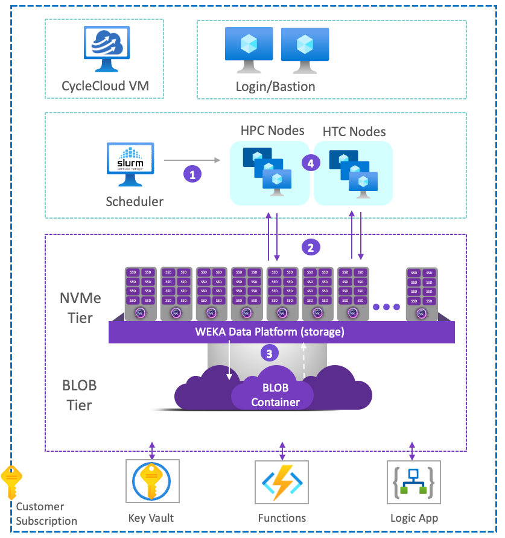<figcaption><p>WEKA and Azure CycleCloud integration architecture</p></figcaption></figure>

## Prerequisites

Before proceeding, ensure that both **Azure CycleCloud** and **WEKA** are installed and configured in your Azure environment. This document focuses on integrating these two solutions.

If either solution is not yet installed, refer to the following resources to complete the installation:

* **Azure CycleCloud**: [Azure CycleCloud Installation Guide](https://learn.microsoft.com/en-us/azure/cyclecloud/?view=cyclecloud-8)
* **WEKA on Azure**: [WEKA Installation on Azure](../planning-and-installation/weka-installation-on-azure/)

Once both solutions are installed, you can proceed with the integration workflow.

## Workflow: Integrate Azure CycleCloud with WEKA

The integration of **Azure CycleCloud** with the **WEKA Data Platform** involves four key steps:

1. **Download the Azure CycleCloud/WEKA integration template** [>>>](azure-cyclecloud-for-slurm-and-weka-integration.md#step-1-download-the-azure-cyclecloud-weka-integration-template)\
   Obtain the pre-built template that simplifies the integration process.
2. **Configure network parameters for DPDK** [>>>](azure-cyclecloud-for-slurm-and-weka-integration.md#step-2-configure-network-parameters-for-dpdk)\
   Adjust the network settings on the Azure CycleCloud nodes to enable Data Plane Development Kit (DPDK), ensuring optimal data transfer performance.
3. **Deploy the cluster initialization module** [>>>](azure-cyclecloud-for-slurm-and-weka-integration.md#step-3-deploy-the-cluster-initialization-module)\
   Create and deploy the cluster-init module on the Azure CycleCloud nodes to automatically configure WEKA integration.
4. **Set up the WEKA blade** [>>>](azure-cyclecloud-for-slurm-and-weka-integration.md#step-4-configure-the-weka-blade-on-the-cyclecloud-weka-template)\
   Configure the WEKA blade using the CycleCloud/WEKA template installed in step 1 to finalize the integration.
5. **Test the integration** [>>>](azure-cyclecloud-for-slurm-and-weka-integration.md#step-5-test-the-integration)\
   Verify the integration of Azure CycleCloud, SLURM, and the WEKA Data Platform.

### Step 1: Download the Azure CycleCloud/WEKA integration template

Create and deploy the cluster-init module on the Azure CycleCloud nodes to automatically configure WEKA integration.

**Procedure**

1.  **Log in to the Azure CycleCloud Virtual Machine (VM)**\
    Access the VM where Azure CycleCloud is installed.<br>

    <figure><figcaption><p><strong>Log in to the Azure CycleCloud VM</strong></p></figcaption></figure>
2.  **Retrieve the official template**\
    Browse to [https://github.com/themorey/cyclecloud-weka](https://github.com/themorey/cyclecloud-weka) and copy the URL to the clipboard.<br>

    <figure><figcaption><p>Copy the URL from the cyclecloud-weka repository</p></figcaption></figure>
3. Clone the CycleCloud/WEKA integration template repository from GitHub to your CycleCloud instance using the previously copied URL:

```bash
git clone https://github.com/themorey/cyclecloud-weka.git
```

<figure>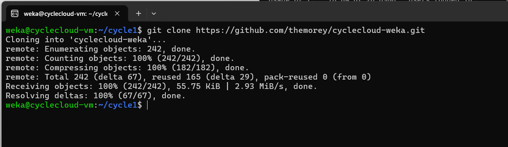<figcaption><p>Clone the CycleCloud/WEKA integration template repository</p></figcaption></figure>

3. **Import the template**\
   Navigate to the cloned repository directory and import the `slurm-weka` template into Azure CycleCloud:

```bash
cyclecloud import_template -f /home/weka/cyclecloud-weka/templates/slurm-weka.txt  
```

4.  **Verify the template in the CycleCloud GUI**\
    Once the template is successfully imported, it appears in the CycleCloud GUI under the templates section.<br>

    <figure><figcaption><p>CycleCloud GUI</p></figcaption></figure>
5.  **Review the template configuration**\
    Click on the newly imported template. It includes a section labeled **Weka Cluster Info.** You will  configure this section in a later step of this guide.<br>

    <figure><figcaption><p>WEKA Cluster Info</p></figcaption></figure>

    <br>

### Step 2: **Configure network parameters for DPDK**

The WEKA data platform leverages the Data Plane Development Kit (DPDK) to achieve high performance and low latency across all hosts. By using DPDK, WEKA's filesystem (WekaFS) bypasses the host kernel's traditional networking stack. This enables direct communication with the Network Interface Card (NIC) in user space, reducing latency by eliminating context switches and data copying. The result is significantly improved throughput and efficiency.

To fully use DPDK, each host requires two NICs. These dual NICs allow load balancing and facilitate the segregation of network traffic types, such as data traffic and management traffic, ensuring optimal performance.

For step-by-step guidance on enabling DPDK and configuring dual NICs for high-performance scenarios, refer to [networking-in-wekaio.md](../weka-system-overview/networking-in-wekaio.md "mention") topic.

**Procedure**

1.  **Log in to the Azure CycleCloud VM**\
    Access the VM where Azure CycleCloud is installed. <br>

    <figure>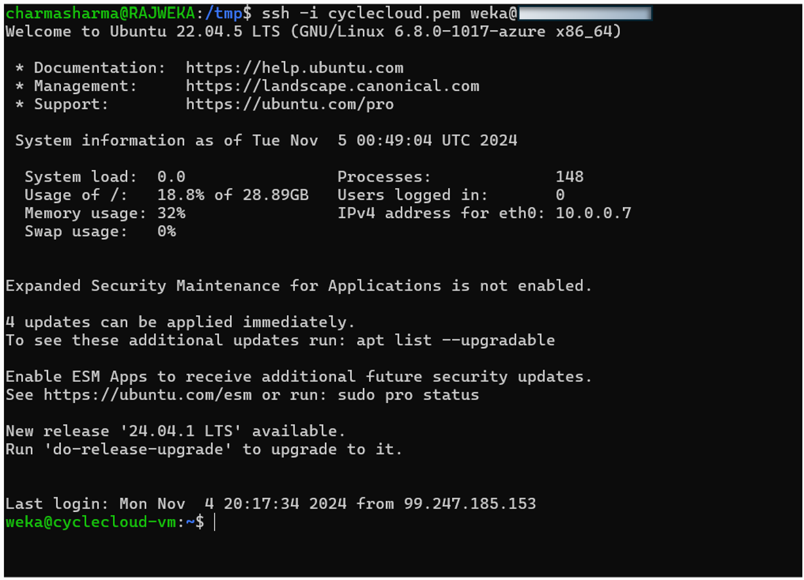<figcaption><p>Log in to the Azure CycleCloud VM</p></figcaption></figure>
2. **Open the CycleCloud/WEKA template**\
   Navigate to the template downloaded in [**Step 1**](azure-cyclecloud-for-slurm-and-weka-integration.md#step-1-download-the-azure-cyclecloud-weka-integration-template), and open it using a text editor.
3.  **Modify the template to support dual NICs**\
    Locate the section labeled `[[nodearraybase]]` and add the following configuration for dual network interfaces:

    ```javascript
    [[[network-interface eth0]]]  
    AssociatePublicIpAddress = $ExecuteNodesPublic  
    SubnetId = $SubnetId  
    AcceleratedNetworking = true  

    [[[network-interface eth1]]]  
    SubnetId = $SubnetId
    ```


* You can apply these network parameters to individual nodes (for example, HPC, HTC, dynamic) or add them to the `[[nodearraybase]]` configuration.
* If other nodes reference `[[nodearraybase]]` using `Extends = nodearraybase`, they inherit this configuration automatically.


<figure>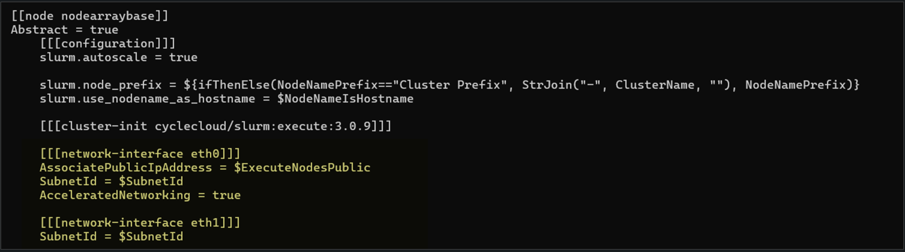<figcaption><p>Modify the template to support dual NICs</p></figcaption></figure>

4. **Save and Apply the Changes**\
   Save the modified template and ensure it is uploaded to your CycleCloud instance.

After completing these steps, your CycleCloud nodes is provisioned with two NICs, enabling DPDK to optimize performance for the WEKA Data Platform.

### Step 3: **Deploy the cluster initialization module**

The cluster initialization module ensures that each node in the Azure CycleCloud environment is configured to integrate seamlessly with the WEKA Data Platform.

**Procedure**

**1. Create the cluster Initialization script**

Copy the following shell script and save it to the `scripts` directory on your Azure CycleCloud VM:


```bash
#!/bin/bash  
set -ex  

# Add specific commands here to configure each node for WEKA  
# Example: mounting storage, installing dependencies, or setting environment variables

weka@cyclecloud-vm://home/weka/cyclecloud-weka/specs/htc/cluster-init/scripts$ ls
001-htc-cluster-init.sh  README.txt
```



Depending on your deployment, you may create separate CycleCloud specifications for each Node Array (for example, HPC and HTC nodes) and provide a distinct cloud-init script for each array.


**2. Add the script to the cluster configuration**

1. **Access the cluster configuration in the CycleCloud GUI**
   1. Log in to the CycleCloud GUI.
   2. Navigate to the cluster configuration you wish to edit.
   3.  Click **Edit** to modify the settings.<br>

       <figure><figcaption><p>Edit cluster configuration in the CycleCloud GUI</p></figcaption></figure>
2.  **Attach the cluster initialization script**

    1.  In the **Advanced Settings** section, scroll to the **Cluster Init** section near the bottom of the page.<br>

        <figure><figcaption><p>Edit WEKA: Advanced Settings</p></figcaption></figure>
    2. Click **Browse** and navigate to the saved script location on the CycleCloud VM.
    3.  Select the script to apply it to the desired node array.<br>

        <figure><figcaption><p>Navigate to the saved script location</p></figcaption></figure>

    **Example configuration:** You can deploy the same script for multiple node arrays (for example, both HTC and HPC nodes) or assign unique scripts to different arrays.<br>

    <figure><figcaption></figcaption></figure>
3. **Save changes**
   * Click **Save** and exit the **Edit Configuration** panel.

After completing these steps, the cluster initialization module is deployed to your CycleCloud nodes, ensuring they are properly configured during startup.

### Step 4: Configure the WEKA blade on the CycleCloud/WEKA template

The **cluster-init script** used in the previous step requires specific configuration parameters, including the IP addresses of the WEKA storage platform, the mount point for the nodes, and the WEKA filesystem name.

**Procedure**

1. **Retrieve WEKA configuration details**
   1.  **Log into the WEKA GUI**: Navigate to the **Cluster Servers** section and note the IP addresses of the WEKA backend servers.<br>

       <figure><figcaption></figcaption></figure>
   2.  **Select or create a filesystem**:

       1. In the WEKA GUI, go to the **Filesystems** section.
       2. Identify the filesystem you want to mount to the CycleCloud VMs. You can select an existing filesystem or create a new one for this purpose.

       <figure>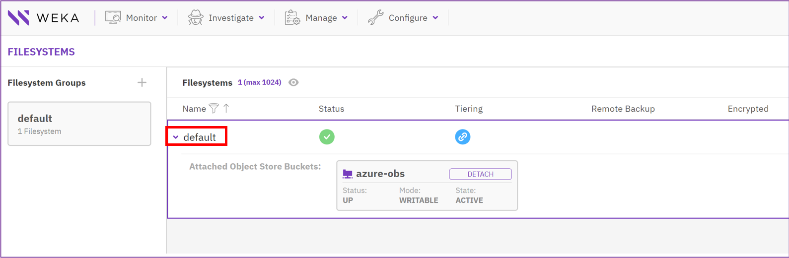<figcaption><p>Select a filesystem</p></figcaption></figure>
2. **Populate the WEKA Blade in CycleCloud**
   1.  **Open the WEKA Blade Configuration**: In the **CycleCloud GUI**, click **Edit** on the cluster configuration. Navigate to the **WEKA Cluster Info** section.<br>

       <figure>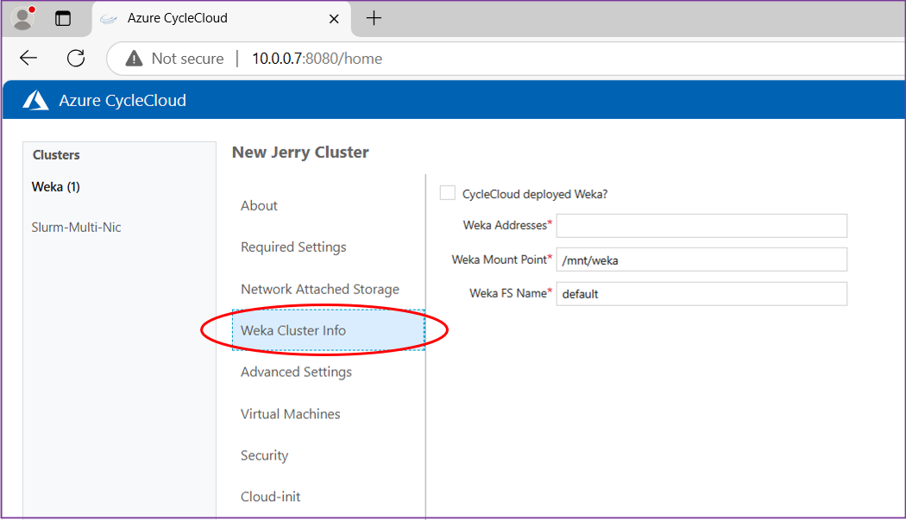<figcaption></figcaption></figure>
   2.  **Fill in the required parameters**:

       * **WEKA addresses**: Enter the IP addresses of the WEKA backend servers from [**Step 1**](azure-cyclecloud-for-slurm-and-weka-integration.md#step-1-download-the-azure-cyclecloud-weka-integration-template). Separate multiple IP addresses with commas.
       * **Mount point**: Specify the desired mount point for the nodes.
       * **WEKA filesystem**: Enter the name of the selected WEKA filesystem from [**Step 1**](azure-cyclecloud-for-slurm-and-weka-integration.md#workflow-integrate-azure-cyclecloud-with-weka).


       <figure>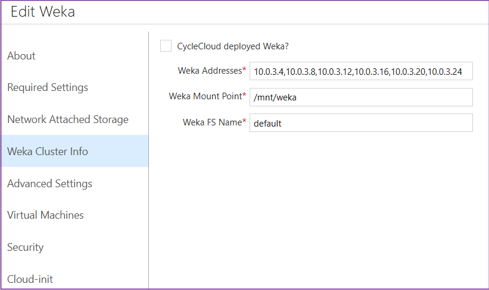<figcaption><p>Example configuration</p></figcaption></figure>
3. **Save the configuration**
   1. Click **Save** to apply the changes.
   2. Exit the **Edit Configuration** panel and return to the CycleCloud GUI.

Your CycleCloud nodes are now configured to automatically connect to the specified WEKA filesystem during initialization. This completes the integration process.

### Step 5: Test the integration

To validate the integration, run a SLURM job across multiple nodes and confirm that each node connects directly to the WEKA Data Platform through the specified mount point.

**Procedure**

1. **Run a SLURM job**:
   1.  Log into the **Scheduler VM**.<br>

       <figure>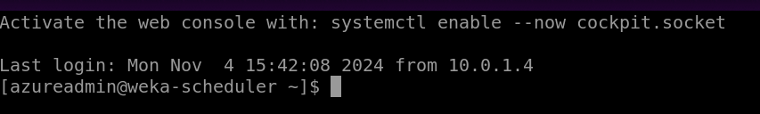<figcaption><p>Log into the Scheduler VM</p></figcaption></figure>
   2.  Submit a SLURM job. For example, run a batch HTC job using 3 nodes:

       ```bash
       batch <job-script>.sh  
       ```

       <figure>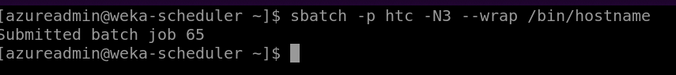<figcaption><p>Example: Submit a SLURM job</p></figcaption></figure>
   3.  Verify that **3 HTC nodes** are activated in CycleCloud.<br>

       <figure>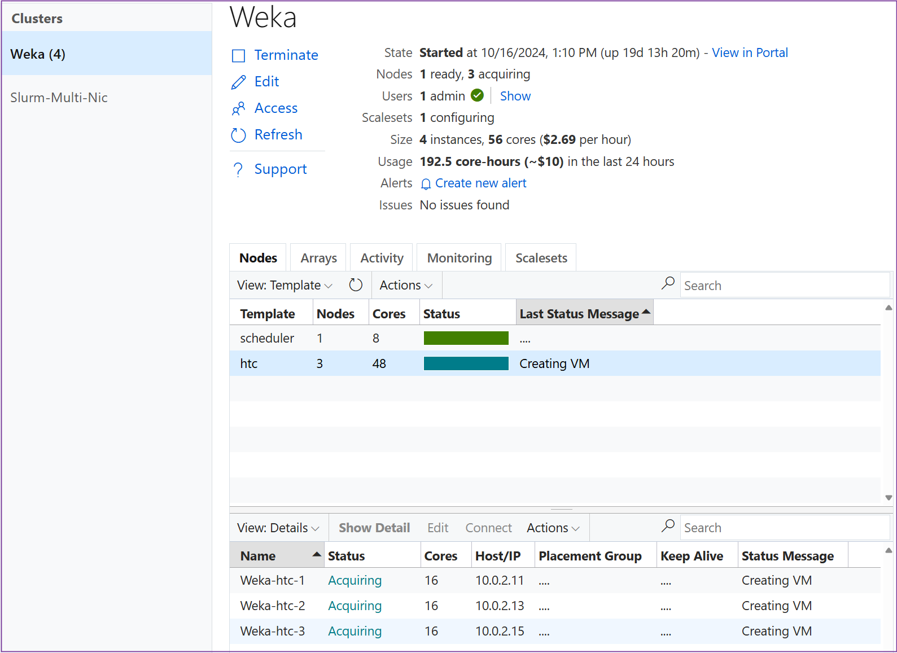<figcaption><p>Verify 3 HTC nodes are activated in CycleCloud</p></figcaption></figure>
2.  **Monitor cluster initialization (optional)**:

    1. Log into one of the HTC nodes.
    2.  Navigate to the cluster-init logs:

        ```bash
        cd /opt/cycle/jetpack/logs/cluster-init/<weka-template>/<spec>/scripts  
        ```
    3.  Use `tail` to monitor the script's progress and confirm mounting to WEKA:

        ```bash
        tail -f <script-name>  
        ```


    <figure>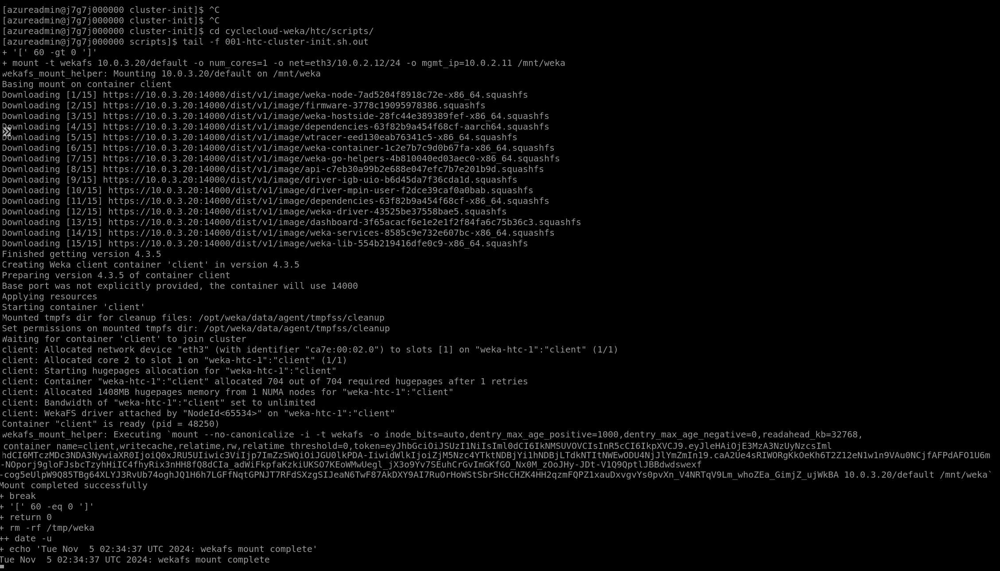<figcaption></figcaption></figure>
3.  **Verify on the WEKA GUI**:

    1. Access the **WEKA GUI**.
    2. Navigate to the **Clients** section to verify that all nodes are connected and mounted to the WEKA Data Platform.
    3. Ensure all nodes display a green status, indicating successful connectivity.

    <figure>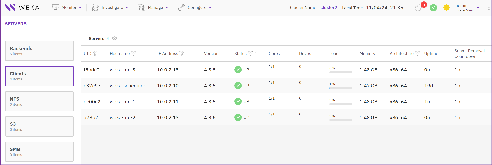<figcaption></figcaption></figure>
4. Once the nodes are mounted and operational, the integration is confirmed, and you can proceed with HPC analysis.
