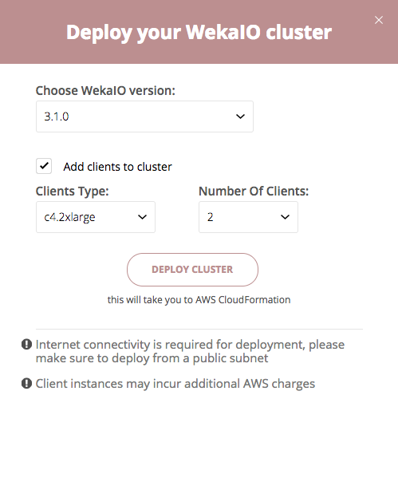
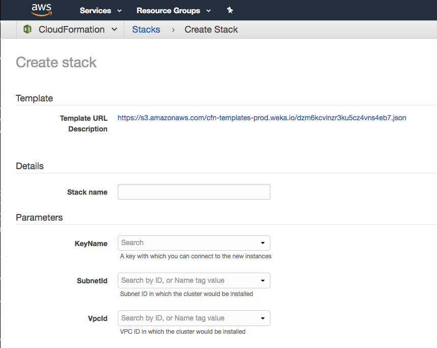
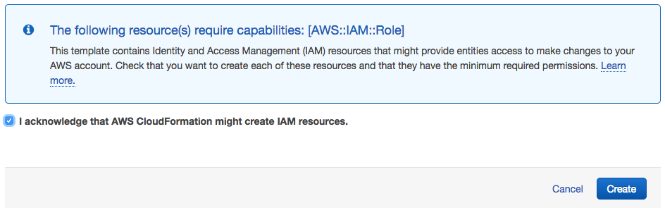

# Self-Service Portal

The WekaIO self-service portal is a planning tool for WekaIO clusters that can meet your storage requirements when installing in AWS.

You can start by just entering how much capacity you need, configure advanced parameters such as your required performance and even provision a multi-AZ cluster for added reliability.

Each configuration can be immediately deployed as a CloudFormation stack by redirecting you to the AWS console.

### Planning Your Cluster {#planning-your-cluster}

The self-service portal is available at [https://start.weka.io ](https://start.weka.io/). Its main screen is divided into two panes: the left where you input your requirements and the right where you can see possible configurations for those requirements:

As you can see, your configuration options include the total capacity, the desired deployment model, and additional performance requirements.

_You can read more about deployment models in the_ [_Deployment Types_](deployment-types.md) _page._

### Deploying Your Cluster {#deploying-your-cluster}

Once you found a configuration you want to deploy, click the “Deploy to AWS” button next to the desired configuration.

At this point, you can specify additional options for your deployment, such as adding client instances or choosing the WekaIO version you want to deploy.

Once you’re ready to deploy the cluster, click the “Deploy Cluster” button. This would take you to AWS CloudFormation with a template containing the cluster you’ve just configured. **Before You Deploy**Make sure to check that your AWS account limits allow for deployment of your selected configuration.You can check your limits under the Limits tab in your EC2 console.

### CloudFormation Screen {#cloudformation-screen}

After clicking the “Deploy Cluster” button you’ll be redirected to AWS CloudFormation where you’ll see a Create Stack screen similar to this:

In the Create Stack screen you have to specify some options which are specific to your AWS account:

* **Stack name** is how your stack will be named within CloudFormation. This name has to be unique in your account.
* **KeyName** is the SSH-key you’ll connect to the instances with.
* **VpcId** and **SubnetId** choose the VPC and subnet in which the WekaIO cluster will be deployed.

 **Important: Internet Connectivity**Only public subnets are currently supported. Please make sure to select a subnet that has the "Enable auto-assign public IPv4 address" setting turned on, or select a subnet that has Internet connectivity.

Once you have all parameters filled-in, make sure to check the “I acknowledge that AWS CloudFormation might create IAM resources” checkbox at the bottom and click the “Create” button:

### Cluster Deployment Process {#cluster-deployment-process}

It takes about 10 minutes to deploy your cluster.

During this time a few things happen:

1. The AWS resources required for the cluster are being provisioned.
2. WekaIO is installed on each of the instances provisioned for the cluster.
3. A cluster is created using all backend instances.
4. Once the cluster has been created, all client instances join the cluster.
5. A filesystem is created using all of the available capacity and is mounted on all backend and client instances.

### What’s Next? {#whats-next}

When the deployment is complete, the stack status will update to `CREATE_COMPLETE`.

At this point, you can access the WekaIO cluster UI by going to the Outputs tab of the CloudFormation stack and clicking the link named UI.

As mentioned above, during the deployment a filesystem is created and mounted on all instances. This shared filesystem is mounted on `/mnt/weka` in each of the cluster instances.

If deployment wasn’t successful, please see [Troubleshooting](troubleshooting.md) for how to resolve common deployment issues.

