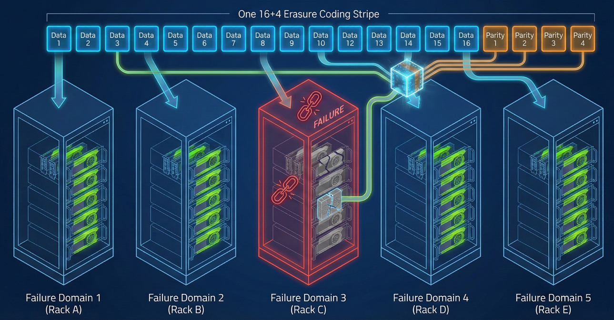

# Maximize GPU infrastructure resilience with NeuralMesh AXON

## Converged storage and compute with NeuralMesh AXON

NeuralMesh AXON enables the NeuralMesh process to run as a server directly on GPU-based systems. This design uses local NVMe devices, system memory, specific CPU cores, and network interfaces to instantiate a storage cluster within the same physical footprint as the GPU servers.

By eliminating the need for dedicated storage hardware, organizations reduce data center footprints and improve resource usage, while also removing network bottlenecks to customer data. However, this convergence introduces unique availability challenges.

#### Reliability in GPU environments

**System reset:** A hardware or software-triggered reboot required to recover a GPU from a fault state.

GPU servers may exhibit lower reliability than traditional storage servers. Intensive user applications can trigger GPU faults that necessitate a full system reboot. In a standard storage configuration, these frequent reboots increase the likelihood of transient failures that can impact data availability.

## Failure domain architecture

**Failure domain:** A set of servers that can fail together due to a shared dependency (power, ToR switch, cooling, and so on).

NeuralMesh AXON enhances the stability of GPU servers by implementing failure domains. This method allows treating multiple failures within a group as a single event. For instance, if all GPU servers in a rack form a failure domain, the entire rack is represented by a single slot in a 16+4 erasure coding stripe.

#### Strategic data distribution

In a 16+4 configuration, the system ensures that only one data block from any stripe is placed in a single failure domain, leading to several benefits:

* **Minimized impact:** In a rack with four servers, each having eight drives, a single drive failure affects only 1/32 of a failure domain. A server failure impacts 1/4 of the domain.
* **Persistent protection:** The system maintains at least three parity blocks even during a server or rack failure, ensuring data safety.
* **Efficient scaling:** In an 80-server cluster, a drive failure affects only about 1/640 of total data blocks. This proportion dwindles as the cluster grows, making hardware failures statistically negligible.

<figure><figcaption>
AXON resilience: Single stripe distributed across independent GPU failure domains
</figcaption></figure>

## Data protection and rebuild performance

The system ensures data integrity by utilizing automated restoration processes. It dynamically adjusts the priority of rebuild tasks according to the current redundancy level.

| Redundancy state | Rebuild priority | Operational impact |
| --- | --- | --- |
| 1 to 3 domains failed | Background | Minimal impact on application performance. |
| 4 domains failed | High | Elevated priority to restore single-additional-failure resiliency. |
| Single drive failure | Background | Negligible impact due to granular data distribution. |

### Performance and placement efficiency

Implementing failure domains enhances data placement by organizing resources into manageable logical units. Though it limits theoretical data stripe permutations compared to a flat topology, failure domains effectively reduce placement candidates. However, even in large clusters, numerous combinations remain unused. By prioritizing these domains, the system significantly improves network efficiency and resource availability without approaching the limits of throughput or capacity.

## Summary of resilience benefits

By organizing servers into failure domain sets, NeuralMesh AXON minimizes the operational risks associated with hardware instability. This allows GPU servers to efficiently serve as both storage providers and compute clients within the same cluster, optimizing infrastructure use while maintaining data safety.

**Related topics**

[neuralmesh-axon-overview.md](../neuralmesh-axon/neuralmesh-axon-overview.md "mention")

[cluster-capacity-and-redundancy-management.md](../weka-system-overview/cluster-capacity-and-redundancy-management.md "mention")
