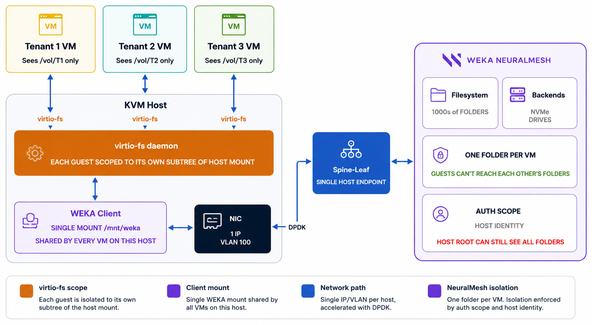
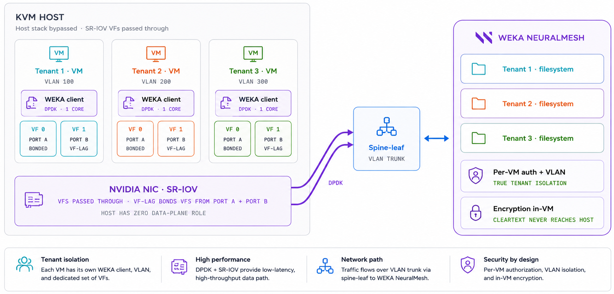

# WEKA and KVM integration

KVM (Kernel-based Virtual Machine) is an open-source hypervisor available across multiple Linux distributions. KVM can run multiple isolated virtual machines (VMs) on a single physical server, and KVM servers can cluster together to create highly available and scalable virtualization environments.

WEKA integrates with KVM environments through the WEKA client, a POSIX-compliant filesystem driver used to connect to WEKA filesystems.

You can use one of the following approaches:

* Run the WEKA client on the KVM server and expose storage with virtio-fs.
* Run the WEKA client inside each VM.

Each approach has different trade-offs in performance, isolation, and operational complexity.

## WEKA client on the KVM server

In this deployment, the WEKA client is installed once on the KVM server. The client mounts a single WEKA filesystem, and individual directories within that filesystem are exposed to guest VMs using [virtio-fs](https://virtio-fs.gitlab.io/), a shared filesystem that presents a host directory tree inside the VM. Each VM sees only its own directory subtree and cannot access directories belonging to other VMs. The KVM server uses a single network identity: one IP address on a single VLAN.

This model is simpler to deploy and keeps VMs completely unaware of WEKA. Day-2 operations such as pause, snapshot, and live migration do not affect the data path. Per-folder quotas are visible to VMs and can be adjusted without interruption.

The tradeoff is that all VM traffic passes through the virtio-fs daemon on the KVM server, adding latency and CPU overhead. Because data leaves the VM before encryption can be applied, this model does not support in-flight encryption. The KVM server's root user retains access to all tenant directories.

<figure><figcaption>
WEKA client on the KVM server
</figcaption></figure>

## WEKA client on KVM virtual machines

In this deployment, each VM installs the WEKA client independently within its own namespace. [SR-IOV](https://learn.microsoft.com/en-us/windows-hardware/drivers/network/overview-of-single-root-i-o-virtualization--sr-iov-) virtual functions (VFs) are passed through directly to the VMs using [VF-LAG](https://docs.nvidia.com/networking/), which bonds virtual functions across two NIC ports for redundancy and failover. This bypasses the KVM server's network stack entirely. Each VM runs [DPDK](https://www.dpdk.org/about/) on one dedicated core and connects to the WEKA cluster over its own VLAN.

Because the KVM server has no role in the data path, data encrypted inside a VM never reaches the server in cleartext. Each VM authenticates to WEKA independently and can be assigned its own credentials, access keys, and dedicated filesystem. This provides strong tenant isolation at both the network and storage layers.

The tradeoff is that SR-IOV passthrough pins VFs to a physical NIC port, so live migration is not supported. Tenants interact directly with the WEKA client and need to be familiar with its behavior and operations.

<figure><figcaption>
WEKA client on KVM virtual machines
</figcaption></figure>

## Choose an option

Select the WEKA-KVM integration model that best fits your environment.

### Choose WEKA client on the KVM server if

* You want the simplest deployment model.
* You want to keep tenants unaware of WEKA.
* You need pause, snapshot, or live migration without changing the data path.
* You need visibility into metrics for each guest VM.
* You want to manage quotas centrally by folder.

### Choose WEKA client on KVM virtual machines if

* You need stronger tenant isolation.
* You need encryption inside the VM before data leaves it.
* You want each VM to have its own VLAN, IP address, and WEKA credentials.
* You want to bypass the KVM server kernel in the data path with DPDK.

### Key trade-offs

* **Simplicity:** The KVM server model is easier to deploy and operate.
* **Isolation:** The VM model provides stronger network and storage isolation.
* **VM operations:** The KVM server model better supports common day-2 VM operations.
* **Hardware:** The VM model requires supported Mellanox or NVIDIA NICs in `switchdev` mode.
* **Guest requirements:** The VM model requires Linux kernel 6.3 or later and WEKA 4.4.30 or later, or 5.1.20 or later, for `num_cores` greater than 1.
* **Server access to data:** In the KVM server model, the server `root` user can access guest VM data. In the VM model, the KVM server cannot access guest VM data.

**Related topics**

[Deploy the WEKA client on a KVM server](deploy-the-weka-client-on-a-kvm-server.md)

[Deploy the WEKA client on KVM virtual machines](deploy-the-weka-client-on-kvm-virtual-machines.md)

[Add clients to a bare-metal cluster](../../planning-and-installation/bare-metal/adding-clients-bare-metal.md)
