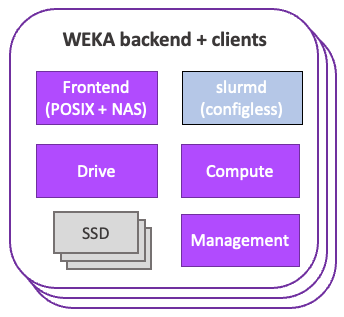
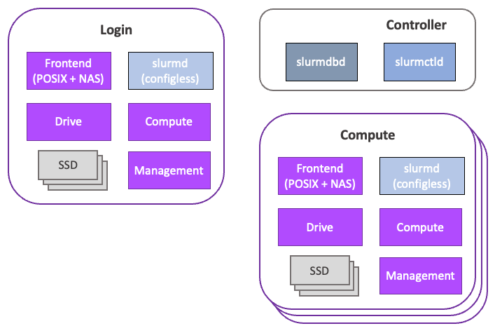
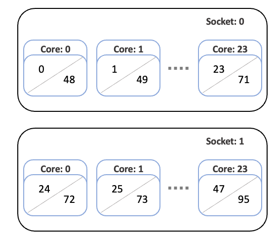

# WEKA and Slurm integration

## Overview <a href="#heading-h.30j0zll" id="heading-h.30j0zll"></a>

Traditional high-performance computing (HPC) clusters consist of login nodes, controllers, compute nodes, and file servers.

* The login nodes are the primary access point for users to access the cluster.
* Controllers host the job scheduler or workload manager for the cluster.
* Compute nodes are used for the primary execution of user jobs.
* File servers typically host home, group, and scratch directories to ensure user files are accessible across the cluster’s login and compute nodes.

For customers using the WEKA Data Platform, a high performance HPC solution optimizing IO regardless of the data profile, managing network-attached storage with WEKA becomes a practical solution. This simplifies filesystem management and ensures consistent performance, regardless of the location where HPC applications run.

In this integration guide, explore the architecture and configuration of an HPC cluster using the Slurm workload manager for job scheduling and WEKA as the high-performance data platform. WEKA supports multi-protocol IO, enabling simultaneous data access through POSIX, NFS, SMB, S3, GPUDirect Storage, and Kubernetes CSI.

Commencing with exploring two architecture designs for deploying WEKA with Slurm, the guide introduces two mount-type options adaptable to either architecture. Subsequently, it delves into the resource requirements for WEKA, guiding the configuration of Slurm to isolate specialized cores and memory from user applications and reserve them for WEKA usage.


This integration guide is intended for system administrators and engineers familiar with the setup, configuration, and management of an HPC cluster equipped with the Slurm workload manager and job scheduler on either bare-metal or cloud-native systems.


## Architecture <a href="#heading-h.1fob9te" id="heading-h.1fob9te"></a>

### WEKA <a href="#heading-h.3znysh7" id="heading-h.3znysh7"></a>

The servers in a WEKA system are members of a cluster. A server includes multiple containers running software instances called processes that communicate with each other to provide storage services in the cluster.

The processes are dedicated to managing different functions as follows:

* Drive processes for SSD drives and IO to drives.
* Compute processes for filesystems, cluster-level functions, and IO from clients.
* Frontend processes for POSIX client access and sending IO to the compute and drive processes.
* A management process for managing the overall cluster.


For more details, see [weka-containers-architecture-overview.md](../overview/weka-containers-architecture-overview.md "mention").


WEKA can be configured to run with dedicated backend servers and independent clients (Figure 1) or in a converged cluster, where each participating server acts as both client and backend server (Figure 2).

#### Dedicated backend configuration

In a dedicated backend configuration, user applications run on the WEKA clients, which interact with the operating system’s Virtual File System (VFS) layer.

The VFS uses the WEKA POSIX driver to issue requests to the WEKA client on the host. The client communicates with the WEKA backend servers. The WEKA server Frontend, Compute, and Drive processes work together to move data between the servers and clients in parallel.

<figure><figcaption><p>Figure 1: WEKA deployed with dedicated backend servers and independent clients (conceptual diagram)</p></figcaption></figure>

#### Converged configuration

In a converged configuration, each server participating in the cluster hosts user applications alongside the frontend (POSIX + NAS; client and server), drive, compute, and management processes.

WEKA processes are allocated to designated cores on each server in the WEKA cluster through control groups. This demands careful consideration to guarantee sufficient CPUs and memory for both WEKA and user applications. For an in-depth understanding of WEKA architecture, see the [WEKA Architecture Technical Brief](https://www.weka.io/resources/technical-brief/weka-architecture-key-concepts/).

<figure><figcaption><p>Figure 2: WEKA deployed in a converged cluster (conceptual diagram).<br>The Frontend, Drive, Compute, and Management proecesses run on each server alongside user applications</p></figcaption></figure>

#### WEKA client mount modes

WEKA clients can be configured to mount in DPDK or UPD mode.

**DPDK mode** is optimized for single-process performance and must be used when possible. When using DPDK mode, specific requirements must be met by the client host system.

The Frontend process on clients uses CPU cores and memory while the mount is active. This implies that sufficient compute cores and memory resources must be available to run the WEKA Frontend process and other user applications. Additionally, NIC hardware must have a [Poll Mode Driver](#user-content-fn-1)[^1] (PMD) and be supported by WEKA. See [Prerequisites and compatibility](../support/prerequisites-and-compatibility.md#networking-ethernet) for more information on supported NIC hardware for bare-metal and cloud-native systems.

**UDP mode** is an option for limited-throughput WekaFS filesystem access when DPDK mode is not feasible due to network, hardware, or operating system limitations. It can serve as an alternative when necessary.

In UDP mode, the Frontend process on clients uses CPUs and memory only during IO activity. This proves advantageous for compute or memory-bound applications with sporadic file read or write operations, as seen in computational fluid dynamics.

For IO-bound applications like those in bioinformatics and AI/ML, WEKA recommends employing the DPDK mount mode.

### Slurm <a href="#heading-h.2et92p0" id="heading-h.2et92p0"></a>

Slurm[^2] is a robust open-source cluster management and job scheduling system tailored for Linux clusters of all sizes. Slurm delegates access to resources, provides a framework for executing and monitoring computational workloads, and manages a queue of pending work submitted by system users. Slurm manages these responsibilities through three daemons:

* Slurm controller daemon (slurmctld)
* Slurm database daemon (slurmdbd)
* Slurmd daemon (slurmd)

<figure><figcaption><p>Figure 3: Typical Slurm cluster consisting of a login server, controller, and several compute servers (conceptual diagram)</p></figcaption></figure>

Typically, a Slurm cluster consists of one or more controller hosts that run the Slurm controller and Slurm database daemons. These are a set of compute nodes where users run their workloads and one or more login nodes that are used to access the cluster.

#### **Slurm cluster operation**

The Slurm controller daemon (`slurmctld`) is a centralized workload manager that monitors available resources and active workloads. The `slurmctld` node determines where to run user workloads based on resource availability and the resources requested by users.

The Slurm database daemon (`slurmdbd`) is optional but a recommended service to deploy in Slurm clusters. The Slurm database is used to store job history, which can provide visibility to cluster usage and can be helpful in debugging issues with user workloads or cluster resources. The `slurmctld` and `slurmdbd` services are often deployed on the controller host.

The `slurmd` service runs on compute nodes, where user workloads are executed. It functions similarly to a remote shell, receiving work requests from the `slurmctld`, performing the tasks, and reporting back the task status.

Users typically access HPC clusters through one or more login nodes. The purpose of the login nodes is for users to access shared files across the compute nodes and to schedule workloads using Slurm command line tools such as **sbatch**, **salloc**, and **srun**. Often, these tools are sufficient for lightweight text editing and code compilation and are sometimes used for transferring data between local workstations and the HPC cluster.


In some systems, like large academic research-oriented HPC data centers, dedicated “[data mover](#user-content-fn-3)[^3]” nodes are often available specifically for file transfers.


#### Slurm leverages control groups

Integral to Slurm's resource management and job handling is its ability to leverage control groups (cgroups) through the proctrack/cgroup plugin. Provided by the Linux kernel, cgroups allow nodes to be organized hierarchically and enable the distribution of system resources in a controlled fashion along this hierarchy.

Slurm leverages cgroups to manage and constrain resources for jobs, job steps, and tasks. For instance, Slurm ensures that a job only uses the CPU or memory resources allocated using the **cpuset** and **memory** controllers.

The [**proctrack/cgroup**](#user-content-fn-4)[^4] node tracker uses the **freezer** controller to keep track of all the node IDs associated with a job in a specific hierarchy in the cgroup tree, which can then be used to signal these node IDs when instructed (for example, when a user cancels a job).

## WEKA and Slurm integration <a href="#heading-h.tyjcwt" id="heading-h.tyjcwt"></a>

Having covered the fundamentals of WEKA and Slurm architectures, we can now explore the integration of these two systems to establish an HPC cluster. This cluster uses the Slurm workload manager for job scheduling and leverages WEKA as the high-performance data platform. Both the dedicated backend and converged configurations are considered.

In either scenario, the Slurm login and compute nodes function as WEKA clients. The controller does not participate in the WEKA filesystem, serving neither as a backend server nor client.

### WEKA and Slurm integration in dedicated backend architecture <a href="#heading-h.tyjcwt" id="heading-h.tyjcwt"></a>

In the dedicated backend architecture, the WEKA filesystem is mounted on the login and compute servers, requiring a WEKA frontend process on login and compute processes for file access (Figure 4).

<figure><figcaption><p>Figure 4: Dedicated backend architecture for WEKA on a Slurm cluster (conceptual diagram)</p></figcaption></figure>

Servers are provisioned to provide servers with compute, network, and storage resources to run the WEKA data platform.

The login and compute nodes from the Slurm cluster mount WEKA filesystems and participate in the WEKA cluster as clients. When mounting in UDP or DPDK mode, some memory must be reserved for WEKA. To determine the amount of memory appropriate for your setup, see the [Plan the WEKA system hardware requirements](../install/bare-metal/planning-a-weka-system-installation.md) topic.  &#x20;

In UDP mount mode, the WEKA Frontend nodes will run on any available core on the login and compute nodes (WEKA clients).

In DPDK mode, at least one CPU (physical) core must be reserved for the WEKA frontend node. \
For syntax example, [#heading-h.2s8eyo1](weka-and-slurm-integration.md#heading-h.2s8eyo1 "mention").

### WEKA and Slurm integration in converged architecture <a href="#heading-h.tyjcwt" id="heading-h.tyjcwt"></a>

In the converged architecture, the WEKA filesystem is mounted on login and compute nodes. The login and compute servers also run the drive and compute nodes to participate in hosting the WEKA backend (Figure 5).

The controller hosts the Slurm job scheduler, while the login and compute nodes all host data as part of the WEKA data platform.

Relative to the dedicated backend architecture, the converged architecture requires additional compute and memory resources for the login and compute processes to support the drive, compute, and management processes. In converged deployments, the WEKA processes are typically allocated to specific cores using cgroups.

<figure><figcaption><p>Figure 5: Converged architecture for WEKA on a Slurm cluster (conceptual diagram)</p></figcaption></figure>

### What's next?

Understanding the potential configurations for an integrated Slurm and WEKA architecture, let's delve into configuring Slurm and WEKA. It is crucial to allocate sufficient compute and memory resources specifically for WEKA.

WEKA processes are allocated to specific cores when using the DPDK mount mode or when deploying converged clusters (with UDP or DPDK mount modes). To ensure proper resource allocation, Slurm configuration is crucial. Designating [specialized cores](#user-content-fn-5)[^5] in Slurm is necessary to prevent conflicts between user workloads and Slurm services for resource usage.

Moreover, due to Slurm's typical configuration of control groups for allocating user workloads to specialized cores, WEKA must retain the CPUSets when initiating the WEKA agent process.

The following sections detail the required Slurm configurations for dedicated and converged backend setups, considering UDP and DPDK mount modes.

## Implementation <a href="#heading-h.3dy6vkm" id="heading-h.3dy6vkm"></a>

When using a job scheduler such as Slurm with WEKA, it is essential to ensure WEKA is allocated (bound/pinned) to specific cores and ensure the job scheduler does not allocate work to the cores used by WEKA on the WEKA clients.

To prevent user jobs from running on the same cores as the WEKA agent, Slurm must be configured so that the user jobs, Slurm daemon (slurmd), and Slurm step daemon (slurmstepd) only run on specific cores.

Additionally, the available memory for jobs on each compute process must be reduced from the total available to provide sufficient memory for the server operating system and WEKA client processes.

In the following sections, the description covers the installation and relevant configurations for Slurm. The focus shifts to the necessary configurations for pinning WEKA processes to specific cores. Finally, examples of WEKA and Slurm configurations cover both dedicated backend and converged cluster architectures.

### Prerequisite: Install and configure Slurm <a href="#heading-h.1t3h5sf" id="heading-h.1t3h5sf"></a>

While presuming your familiarity with Slurm installation and configuration, this section provides an overview of Slurm’s installation. It also highlights key elements pertinent to the discussion of integrating Slurm with WEKA.


The guidance on installing and configuring Slurm as a prerequisite for integrating it with WEKA is provided for convenience. For the most up-to-date instructions, it is recommended to refer to the [Slurm documentation](https://slurm.schedmd.com/documentation.html).


<details>

<summary>1. Install the munge package on all instances participating in the Slurm cluster</summary>

Slurm depends on munge[^6] for authentication between Slurm services. When installing munge from a package manager, the necessary systemd service files are installed, and the munge service is enabled.

By default, this service looks for a munge key under `/etc/munge/munge.key`.

This key must be consistent between the controller, login, and compute nodes. You can create a munge key using the following command:

```
sudo /usr/sbin/create-munge-key -r -f
```

Typically, you create this key on one of the hosts (for example, the controller) and copy it to all the other instances in the cluster. Alternatively, you can mount (using NFS) `/etc/munge` from the controller to the login and compute nodes.

**Note:** To function correctly, the munge authentication requires consistency between the clocks on all instances in the Slurm cluster.

</details>

<details>

<summary>2. Install Slurm</summary>

You can install Slurm using your operating system’s package manager on RHEL and Debian-based Linux operating systems.

Ensuring that the necessary packages are installed on both the controller and login instances is essential. The following are specific package requirements:

* The controller instance requires packages that provide `slurmctld` and `slurmdbd`. \
  (On Debian-based operating systems, these packages are `slurmctld` and `slurmdbd`.)
* The login instance requires the Slurm client commands, such as `sinfo` and `squeue`. \
  (On Debian-based operating systems, these are provided by the `slurm-client` package.)

Consider the following guidelines:

* If you plan to use a configless deployment, ensure the `slurmd` package runs the `slurmd` service on the login node. When installing Slurm packages from a package manager, it creates the Slurm user and installs the necessary `systemd` service files.
* If you plan to use slurmdbd (recommended), a SQL database hosting the Slurm database is required. Typically, MariaDB[^7] is used. `Slurmdbd` is generally deployed on the Slurm controller host. You can host the MariaDB server on the Slurm controller host or a separate host accessible to the `slurmdbd` service.
* If you require a specific version of Slurm or integrations with particular flavors of the Message Passing Interface (MPI), it is best to [build Slurm](#user-content-fn-8)[^8] from the source. In this approach, install munge and a service like MariaDB. Additionally, create the **Slurm** user on each instance in your cluster and set up systemd service files.

The `uid` for the Slurm user must be consistent between all instances in your Slurm cluster.

When deploying Slurm clusters, a standard set of configuration files is required to determine the scheduler behavior, accounting behavior, and available resources. There are four commonly used configuration files in Slurm clusters:

* **slurm.conf** describes general Slurm configuration information, the nodes to be managed, information about how those nodes are grouped into partitions, and various scheduling parameters associated with those partitions. This file needs to be consistent across all hosts in the Slurm cluster.
* **slurmdbd.conf** describes the configuration for the Slurm database daemon, including the database host address, username, and password. This file should be protected as it contains sensitive information (database password) and must only exist on the host running the slurmdbd service.
* **cgroup.conf** describes the configurations for Slurm’s Linux cgroup plugin. This file needs to be consistent across all hosts in the Slurm cluster.
* **gres.conf** describes the Generic RESource(s) (GRES) configuration on each compute node, such as GPUs. This file needs to be consistent across all hosts in the Slurm cluster.

Most configuration files must be consistent across all hosts (Controller, Login, and Compute) participating in the Slurm cluster. The following three commonly employed strategies ensure consistency of the Slurm configuration across all hosts:

* Synchronize the Slurm configuration files across your cluster using tools such as `parallel-scp`.
* Host your Slurm configuration files on the Controller and NFS mount the directory containing these files on the Login and Compute nodes.
* Deploy a ["Configless" Slurm](#user-content-fn-9)[^9] where the `slurmd` service obtains the Slurm configuration from the `slurmctld` server on startup. The configless option is only available for Slurm 20.02 and later.

The first strategy above requires copying the Slurm configuration files across all cluster nodes when configuration changes are needed.

The second and third strategies above require maintaining the configuration files only on the Slurm controller.

The main difference between the configless deployment and the NFS mount configuration is that the login node in the configless setup also needs to run the `slurmd` service.

We recommend using a configless Slurm deployment, when possible, for ease of use. This setup installs a single set of Slurm configuration files on the Slurm controller instance.

The compute and login nodes obtain their configuration through communications between the slurmd service, hosted on the compute and login nodes, and the slurmctld service, hosted on the Slurm controller.

To enable a configless Slurm deployment, set `SlurmctldParameters=enable_configless` in the **slurm.conf** file.

Additionally, start the slurmd services with the `--conf-server host[:port]` flag to obtain Slurm configurations from slurmctld at `host[:port]`.

In all strategies, the configuration files are stored in the same directory. A common choice is to use `/usr/local/etc/slurm` (this location can vary between systems).&#x20;

For non-standard locations, the slurmctld slurmd services can be launched with the `-f` flag to indicate the path to the slurm.conf file. Alternatively, if you build Slurm from the source, you can use the  [`--sysconfdir=DIR`](#user-content-fn-10)[^10]  option during the configuration stage of the build to set the default directory for the Slurm configuration files.

</details>

### Configure Slurm and WEKA <a href="#heading-h.4d34og8" id="heading-h.4d34og8"></a>

The configuration of Slurm and WEKA includes settings for isolating CPU and memory resources dedicated to WEKA processes. This involves preventing conflicts between Slurm services (primarily slurmd) and user workloads attempting to use the same cores as the WEKA processes.

Additionally, it includes allocating exclusive cores and memory to avoid oversubscription on Slurm compute nodes.

#### 1. Set the `task/affinity` and `task/cgroup` plugins to prevent user jobs from using the same cores as WEKA processes

Slurm offers `task/affinity` and `task/cgroup` plugins, controlling compute resource exposure for user workloads. The task/affinity plugin binds nodes to designated resources, while the task/cgroup plugin confines nodes to specified resources using the cgroups `cpuset` interface.

To ensure that Slurm daemons (slurmd and slurmstepd) do not run on cores designated for the WEKA agent, it is advisable to set the `TaskPluginParam` to `SlurmdOffSpec`.

Set the following in the **slurm.conf** file:

* Set the `SelectType` option to `select/cons_tres` to indicate that cores, memory, and GPUs are consumable by user jobs.
* Set the `SelectTypeParameters` option to `CR_Core_Memory` to indicate that cores and memory are used explicitly for scheduling workloads.
* Set the `PrologFlags` option to `Contain` to use cgroups to contain all user nodes on their allocated resources.

The following code snippet summarizes the required settings for a **slurm.conf** file.


```
ProctrackType=proctrack/cgroup
TaskPlugin=task/affinity,task/cgroup
TaskPluginParam=SlurmdOffSpec
SelectType=select/cons_tres
SelectTypeParameters=CR_Core_Memory
JobAcctGatherType=jobacct_gather/cgroup # (optional) for gathering metrics
PrologFlags=Contain
```


#### 2. Allocate cores and memory for the WEKA agent

Set each compute node definition in the slurm.conf file to allocate exclusive cores and memory for the WEKA agent. The cores and memory designated for WEKA (as well as other operating system nodes) are termed [Specialized Resources](#user-content-fn-11)[^11].

Set the following parameters in the slurm.conf file:

* [`RealMemory`](https://slurm.schedmd.com/slurm.conf.html#OPT\_RealMemory)_:_ Specify the available memory on each compute node.
* [`CPUSpecList`](https://slurm.schedmd.com/slurm.conf.html#OPT\_CpuSpecList)_:_ Define a list of virtual CPU IDs reserved for system use, including WEKA nodes.
* [`MemSpecLimit`](https://slurm.schedmd.com/slurm.conf.html#OPT\_MemSpecLimit)**:** When using `SelectTypeParameters=CR_Core_Memory,` specify the amount of memory (in MB) reserved for system use.


To use the `CPUSpecLis`t and `MemSpecLimit` parameters, ensure the following are set in the `cgroup.conf` file:

```
ConstrainCores=yes
ConstrainRamSpace=yes
```


### Example: Slurm and WEKA dedicated backend architecture with DPDK mount mode <a href="#heading-h.2s8eyo1" id="heading-h.2s8eyo1"></a>

This example uses the a2-ultragpu-8g instances on Google Cloud Platform, which have 1360 GB (1360000 MB) of available memory, 48 physical cores on two sockets with two hyperthreads per core, and 8 A100 GPUs.

Following the [Plan the WEKA system hardware requirements](../install/bare-metal/planning-a-weka-system-installation.md) topic, suppose we want to set aside 5 GB of memory and the last core (Core ID 47) for the WEKA Frontend node in a dedicated backend architecture using a DPDK mount mode.

In this example, we set the `RealMemory` to the total memory available and then set the `MemSpecLimit` to 5000 (MB) to set aside that amount of memory for the WEKA agent and the operating system.

When using the `select/cons_tres` with `CR_Core_Memory` parameters in Slurm on systems with hyperthreading, the CPU IDs refer to the “processor ID” for the hyperthread, and not the physical core ID.

To determine the relationship between the processor ID and the core ID, we can use the `/proc/cpuinfo` file on Linux systems. This file lists properties for each processor, including its processor ID, associated core ID, and physical ID. The physical ID refers to the physical multi-core CPU chip that is plugged into a socket on the motherboard.

For example, one entry might look like the code snippet below (output is intentionally truncated). On this system, we see that core id 0 hosts processor 0, which is hosted on socket 0.

```
$ cat /proc/cpuinfo
processor : 0
vendor_id : GenuineIntel
cpu family : 6
model : 106
model name : Intel(R) Xeon(R) CPU @ 2.60GHz
stepping : 6
microcode : 0xffffffff
cpu MHz : 2600.034
cache size : 55296 KB
physical id : 0
siblings : 48
core id : 0
cpu cores : 24
```

Continuing through the `/proc/cpuinfo` file we find a relationship between the sockets, cores, and processors that is summarized in Figure 6. Namely, the processor IDs are ordered from 0-23 on Socket 0, then 24-47 on Socket 1. Then, the second hyperthreads are numbered from 48-71 on Socket 0 and 72-95 on Socket 1.

<figure><figcaption><p>Figure 6: Example schematic of the socket, core, and vCPU layout on a dual-socket Intel Xeon system</p></figcaption></figure>

In this example, to reserve core 47, we see that this corresponds to vCPUs 47 and 95. In the slurm.conf file, we would then set `CpuSpecList=47,95`.

An example of the node configuration in slurm.conf is shown below. This code snippet shows a compute node named “compute-node-0” with 96 CPUs (processors) with two sockets per board, 24 cores per socket, two threads per core, and 8 A100 GPUs.


```
NodeName=compute-node-0 CPUs=96 Boards=1 SocketsPerBoard=2 CoresPerSocket=24 ThreadsPerCore=2 RealMemory=1360000 MemSpecLimit=5000 State=CLOUD CpuSpecList=47,95 Gres=gpu:a100:8
```


If you are always reserving the last cores for WEKA, an alternative approach is to use the `CoreSpecCount` parameter in the compute node configuration in slurm.conf to specify the number of physical cores for resource specialization.

When using the `CoreSpecCount` parameter, the first core selected is the highest numbered core on the highest numbered socket by default (see [core selection](https://slurm.schedmd.com/core\_spec.html#core) in Slurm documentation). Subsequent cores selected are the highest numbered core on lower numbered sockets. In this case, use the snippet below to reserve core 47 (processors 47 and 95) for WEKA.


```
NodeName=compute-node-0 CPUs=96 Boards=1 SocketsPerBoard=2 CoresPerSocket=24 ThreadsPerCore=2 RealMemory=1360000 MemSpecLimit=5000 State=CLOUD CoreSpecCount=1 Gres=gpu:a100:8
```


To apply these changes on an existing Slurm cluster, restart the Slurm controller daemon after updating your slurm.conf and cgroup.conf files. The Slurm nodes are managed by systemd, allowing you to restart them with systemctl.

```
# On the controller
sudo systemctl restart slurmctld
```

Additionally, restart the Slurm daemon on any compute nodes. On each compute node, run the command shown below. As a user with administrative privileges, you can use `pdsh`, `xargs`, or through a Slurm job. The latter option may be necessary if your cluster is configured using the pam\_slurm\_adopt[^12] plugin, where `ssh` access to compute nodes is limited to users with a job allocation.

```
# On the compute nodes
sudo systemctl restart slurmd
```

Continuing with this example, Slurm and WEKA in a dedicated backend architecture with DPDK mount modes, we turn to necessary WEKA configurations. To reserve core 47 for the WEKA Frontend node on a compute node using a DPDK mount mode, you can use the `core` mount option as follows:

```
mount -t wekafs -o core=47 -o net=ib0 backend-host-0/fs1 /mnt/weka
```

In this example, the NIC used for DPDK is `ib0`, the WEKA backend host can be acceesed at `backend-host-0`, the filesystem name is `fs1`, and the mount location on the compute node is `/mnt/weka`.

By default, WEKA resets cpusets, which can interfere with configurations enforced by Slurm. To prevent this, set the `isolate_cpusets=false` option in `/etc/wekaio/service.conf` and restart the weka-agent node as follows:

```
sudo sed -i 's/isolate_cpusets=true/isolate_cpusets=false/g' /etc/wekaio/service.conf
sudo systemctl restart weka-agent
```

For more information, see [#modify-the-cgroups-usage](../install/bare-metal/adding-clients-bare-metal.md#modify-the-cgroups-usage "mention")

[^1]: See [DPDK Poll Mode Driver](https://doc.dpdk.org/guides-16.04/prog\_guide/poll\_mode\_drv.html)

[^2]: For more details, see the official [Slurm Workload Manager Documentation](https://slurm.schedmd.com/).

[^3]: A "data mover" typically refers to a specialized process or tool designed to efficiently transfer or move large volumes of data between storage systems or computing resources.

[^4]: The proctrack/cgroup plugin is an alternative to other proctrack plugins such as proctrack/linux for process tracking and suspend/resume capability.\
    For details, see [PROCTRACK/CGROUP PLUGIN](https://slurm.schedmd.com/cgroups.html#proctrack).

[^5]: Core specialization is a feature designed to isolate system overhead (system interrupts, etc.) to designated cores on a compute node. This can reduce context switching in applications to improve completion time. The job processes will not be able to directly use the specialized cores.\
    For details, see [Core Specialization](https://slurm.schedmd.com/core\_spec.html).

[^6]: Munge is a credential management service, generating and validating UIDs and GIDs securely. Commonly used in HPC clusters, it enhances authentication for processes across distributed computing environments.

[^7]: MariaDB is an open-source RDBMS, a MySQL fork known for high performance and scalability. Retains MySQL compatibility, favored in the open-source community.

[^8]: For details, see [Slurm Quick Start Administrator Guide](https://slurm.schedmd.com/quickstart\_admin.html).

[^9]: "Configless" Slurm is a feature that allows the compute nodes — specifically the slurmd process — and user commands running on login nodes to pull configuration information directly from the slurmctld instead of from a pre-distributed local file.\
    For details, see ["Configless" Slurm](https://slurm.schedmd.com/configless\_slurm.html).

[^10]: In the `sysconfdir` parameter, you specify the Slurm configuration file location. The default value is PREFIX/etc.\
    For details, see the [Slurm Quick Start Administrator Guide](https://slurm.schedmd.com/quickstart\_admin.html).

[^11]: Core specialization is a feature designed to isolate system overhead (system interrupts, etc.) to designated cores on a compute node. This can reduce context switching in applications to improve completion time. The job processes will not be able to directly use the specialized cores.\
    For details, see [Core Specialization](https://slurm.schedmd.com/core\_spec.html).

[^12]: The purpose of this module is to prevent users from sshing into nodes that they do not have a running job on, and to track the ssh connection and any other spawned processes for accounting and to ensure complete job cleanup when the job is completed.\
    For details, see [pam\_slurm\_adopt](https://slurm.schedmd.com/pam\_slurm\_adopt.html).
