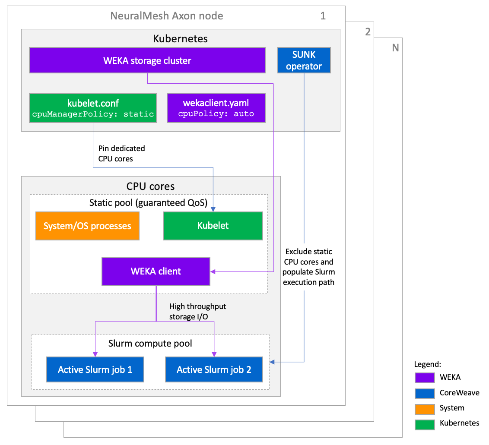

# Configure Kubernetes and WEKA for CoreWeave SUNK

## Overview

This deployment requires strict CPU isolation. Kubernetes reserves CPU IDs for the OS and platform daemons. WEKA requests whole CPUs so the client pod receives Guaranteed QoS and exclusive CPU assignment. SUNK then reflects both CPU sets in Slurm automatically.

Complete these tasks:

1. Configure `kubelet` to use static CPU management and reserve the required CPU IDs.
2. Set `cpuPolicy: auto` in the `wekaClient` definition so SUNK can exclude those CPUs from Slurm scheduling.

For more platform details, see [CoreWeave SUNK Documentation](https://docs.coreweave.com/).


**Qualified versions:** This procedure was validated with CoreWeave SUNK v7.3.0, WEKA Operator v1.11.0, WEKA software v4.4.26, Kubernetes v1.32, and Ubuntu 24.04.


## SUNK node architecture and CPU isolation

The diagram below explains how WEKA and SUNK components interact on a NeuralMesh Axon cluster running Kubernetes.

<div data-with-frame="true"><figure><figcaption><p>SUNK and WEKA architecture and CPU isolation</p></figcaption></figure></div>

**Key components:**

* **WEKA storage cluster:** The WEKA storage cluster provides the backend data path and runs on all Kubernetes nodes. The WEKA client pod connects to it directly over the storage network.
* **NeuralMesh Axon node:** A worker node that can host Kubernetes services, the WEKA client pod, and Slurm jobs on the same server. CPU isolation keeps these workloads from competing for the same CPUs.
* **kubelet:** `kubelet` uses `cpuManagerPolicy: static` to manage dedicated CPUs. `reservedSystemCPUs` removes specific CPU IDs from allocatable capacity for the OS and Kubernetes daemons.
* **WEKA client pod:** The WEKA client pod uses `cpuPolicy: auto`. Kubernetes assigns exclusive CPUs to that pod from the remaining allocatable pool.
* **SUNK Operator:** The SUNK Operator runs as a single deployment in Kubernetes. It reads the system CPU reservation and the CPUs assigned to the WEKA client pod. It excludes those CPU IDs from Slurm and exposes only the remaining CPUs to Slurm.
* **Slurm compute pool:** The Slurm compute pool uses the CPU IDs that remain after the system reservation and the WEKA client allocation. Slurm jobs run only in this pool.

**Data and control flow**

1. `kubelet` removes `reservedSystemCPUs` from allocatable capacity.
2. The WEKA client pod receives exclusive CPUs from the remaining allocatable pool.
3. The SUNK Operator removes both CPU sets from Slurm scheduling.
4. Slurm runs batch jobs on the remaining CPUs only.

## Before you begin

* Confirm the worker nodes use a `kubelet` configuration you can update.
* Identify the CPU IDs reserved for the OS and Kubernetes daemons.
* Decide the whole CPU count required by the WEKA client pod.
* On hyperthreaded servers, identify the sibling CPU IDs for every reserved physical core.
* If the cluster runs Kubernetes v1.32 or later, plan to enable `strict-cpu-reservation`.

**Related topics**

* [WEKA Operator deployments](../../kubernetes/weka-operator-deployments/)
* [NeuralMesh Axon overview](../../neuralmesh-axon/neuralmesh-axon-overview.md)

***

## Configure kubelet CPU management

Configure `kubelet` static CPU management so the OS keeps reserved CPUs and the WEKA client pod receives dedicated CPUs from the allocatable pool.

**Procedure**

1. Identify the active `kubelet` configuration:

```bash
kubectl get cm -A | grep kubelet
```

If multiple configurations exist, modify the ConfigMap that applies to the worker nodes.

2. Edit the ConfigMap:

```bash
kubectl edit cm -n kube-system kubelet-config
```

3. Apply the following settings:

```yaml
cpuManagerPolicy: static
reservedSystemCPUs: "0,1,64,65"
featureGates:
  CPUManagerPolicyOptions: "true"
  CPUManagerPolicyAlphaOptions: "true"
cpuManagerPolicyOptions:
  strict-cpu-reservation: "true"             ##Requires Kubernetes v1.32+
```


`reservedSystemCPUs` takes CPU IDs and not a core count. Reserve at least one physical core for the OS. On hyperthreaded servers, include both sibling threads for each reserved core.



`strict-cpu-reservation` requires Kubernetes v1.32 or later. On earlier versions, omit the `featureGates` and `cpuManagerPolicyOptions` blocks. Without strict reservation, `Burstable` and `BestEffort` pods can still use reserved system CPUs.


4. Apply the updated ConfigMap to the worker nodes by using the CoreWeave SUNK rollout or restart procedure used in your environment.

The CPU reservation does not become active immediately. The worker nodes must reload the updated `kubelet` configuration, and the `kubelet` process must restart before the new reservation takes effect.

***

## Configure WEKA client CPU policy

Set `cpuPolicy: auto` in the `wekaClient` definition.

The `wekaClient` CRD (`weka.weka.io/v1alpha1`) exposes a `cpuPolicy` field. Use `cpuPolicy: auto` for SUNK v6.5.0 or later.

The following table describes the available policy values.

<table><thead><tr><th width="126">Policy</th><th>Description</th></tr></thead><tbody><tr><td><code>auto</code></td><td><p>WEKA or the operator selects the best policy automatically. Sets <code>request == limit</code> (whole CPUs), resulting in Kubernetes Guaranteed QoS.</p><p>Recommended for SUNK environments.</p></td></tr><tr><td><code>manual</code></td><td><p>The caller specifies exact CPU IDs by way of <code>coreIds</code>. Sets <code>request != limit</code>, preventing Kubernetes exclusive core allocation.</p><p>Useful as a temporary workaround.</p></td></tr></tbody></table>

**Procedure**

1. Define the `wekaClient` with `coresNum` set to an explicit CPU count and `cpuPolicy` set to `auto`:

```yaml
spec:
  coresNum: 5
  cpuPolicy: auto
```

## Understand SUNK CPU exclusion

When `cpuPolicy: auto` is used with a whole CPU count in `coresNum`, Kubernetes assigns the pod Guaranteed QoS (`request == limit`). With `cpuManagerPolicy: static`, the WEKA client pod receives exclusive CPUs. SUNK detects that allocation and excludes those CPUs, together with `reservedSystemCPUs`, from the Slurm `cgroup` configuration.

The SUNK Operator reads the CPU IDs reserved for the system and the CPU IDs assigned to the WEKA client pod. It then populates `CPUSpecList` in Slurm accordingly. No manual `slurm.conf` changes are required.

The resulting Slurm node state reflects the combined exclusion set. The exact values vary by CPU topology and the final WEKA client placement.

```
CPUAlloc=0 CPUEfctv=114 CPUTot=128 CPULoad=5.98
CoreSpecCount=7 CPUSpecList=0-1,20-24,64-65,84-88
```
