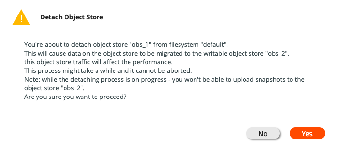
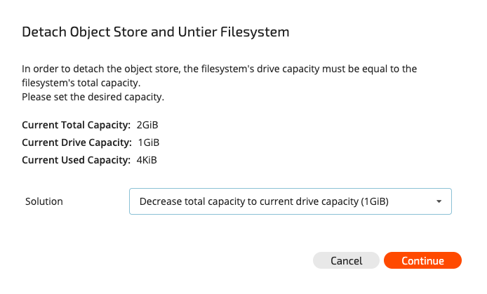

# Attaching/Detaching Object Stores to/from Filesystems

## Overview

### Attaching an Object Store to a Filesystem

Two object stores can be attached to a filesystem, but only one of the object stores will be writable. When attaching a new object store to an already tiered filesystem, the existing object store bucket becomes read-only, and the new object store bucket is read/write. Multiple object stores allow a range of use cases, including migration to different object stores, scaling of object store capacity and increasing the total tiering capacity of filesystems.

When attaching an object store to a non-tiered filesystem, the filesystem becomes tiered.

### Detaching an Object Store from a Filesystem

Detaching an object store from a filesystem migrates the filesystem data residing in the object store bucket either to the writable object-store \(if one exists\) or to the SSD, as described below. When detaching, the background task of detaching the object store begins. Detaching can be a long process, depending on the amount of data and the load on the object stores. For more information, refer to [Background Tasks](../../usage/background-tasks.md).


**Note:** Detaching an object-store bucket is irreversible. Re-attaching the bucket is considered as re-attaching a new bucket regardless of the data that may still be there.


#### Migrating to a Different Object Store

When detaching from a filesystem tiered to two object stores, only the read-only object store can be detached. In such cases, the background task will copy the relevant data to the writable object store.

#### Un-tiering a Filesystem

Detaching from a filesystem tiered to one object store will un-tier the filesystem and copy the data back to the SSD.


**Note:** The SSD must have sufficient capacity, i.e., the allocated SSD capacity should be at least the total capacity used by the filesystem.


On completion of detaching, the object store does not appear under the filesystem when using the `weka fs` _\*\*_command. However, it still appears under the object store and can be removed if it is not being used by any other filesystem. The data in the read-only object store remains in the object store bucket for backup purposes. If this is unnecessary or the reclamation of object store space is required, it is possible to delete the object store bucket.


**Note:** Before deleting an object store bucket, remember to take into account data from another filesystem or data not relevant to the Weka system on the object store bucket.



**Note:** When there are two object stores attached and during the execution of migration, it is not possible to upload new snapshots to the object store.



**Note:** After the migration process is done, while relevant data is migrated, old snapshots \(and old locators\) reside on the old object store bucket. To recreate snapshots locators on the new object store bucket, snapshots should be re-uploaded to the \(new\) object store bucket.


### Migration Considerations

When migrating data \(using the detach operation\) you would like to copy only the necessary data \(to reduce migration time and capacity\), however, you may want to keep snapshots in the old object-store bucket. For that follow these steps:

1. Attach a new object-store \(old object-store becomes read-only\).
2. Delete any snapshot which doesn't need to be migrated - this will keep the snapshot on the old bucket, but will not migrate its data to the new bucket.
3. Detach the old object-store


**Note:** performing these steps in a different order might result in either the snapshots are completely deleted from any of the object-store or are already in the migration process \(and cannot be deleted until migration is done\).


## Attaching/Detaching Object Stores

### Attaching/Detaching Object Stores Using the GUI

To attach a new object store to a filesystem, select the filesystem in the main filesystem/filesystem group view screen and click the Attach Object Store button.

The Attach Object Store to Filesystem dialog box will be displayed.

Select the object store to attach and click Attach.

To detach an object store from a filesystem, select the filesystem in the main filesystem/filesystem group view screen. A list of all attached object stores will be displayed in the Attached Object Stores dialog box.

Click the Detach button next to the relevant object store to be detached. If more than one object store is attached, the Detach Object Store dialog box will be displayed as follows:

Click Yes to detach the object store from the filesystem.

If there is only one object store attached, detaching will un-tier the filesystem and the following Detach Object Store and Untier Filesystem dialog box will be displayed:

Since object stores usually expand the filesystem capacity, the un-tiering of a filesystem requires adjustment of its total capacity. It is possible to increase the SSD capacity to match the current total capacity; reduce the total filesystem capacity to match the SSD capacity or used capacity \(the decrease option depends on the used capacity\); or configure a different value.


**Note:** Used capacity should be taken into account. Since un-tiering takes time to propagate the data from the object store to the SSD, when un-tiering an active filesystem it is recommended to adjust to a higher value than the used capacity, in order to accommodate the additional writes during the detaching process.


The following options are available in the Solution drop-down list:

Select the desired option and click Continue in the Detach Object Store and Untier Filesystem dialog box. A summary dialog box of the system operations will be displayed.

To confirm the operation, click Detach.

### Attaching/Detaching Object Stores Using the CLI

**Command:** `weka fs tier s3 attach`or `weka fs tier s3 detach`

To attach an object store to a filesystem, use the following command:

`weka fs tier s3 attach fs-name obs-name`

To detach an object store from a filesystem, use the following command:

`weka fs tier s3 detach fs-name obs-name`

**Parameters in Command Line**

| **Name** | **Type** | **Value** | **Limitations** | **Mandatory** | **Default** |
| :--- | :--- | :--- | :--- | :--- | :--- |
| `fs-name` | String | Name of the filesystem to be attached to / detached from the object store | Must be a valid name | Yes | ​ |
| `obs-name` | String | Name of the object store to be  attached / detached | Must be a valid name | Yes |  |

