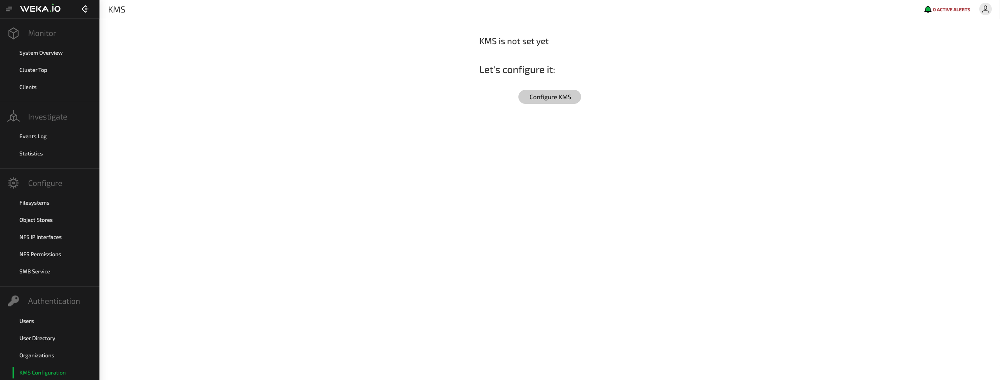
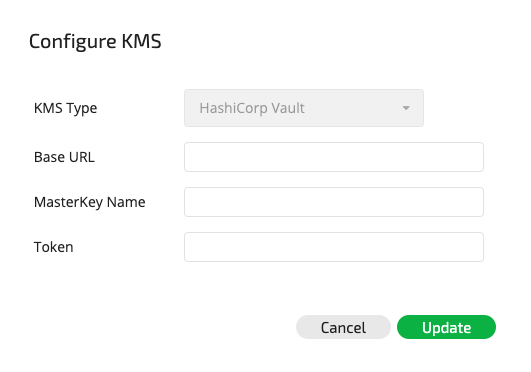
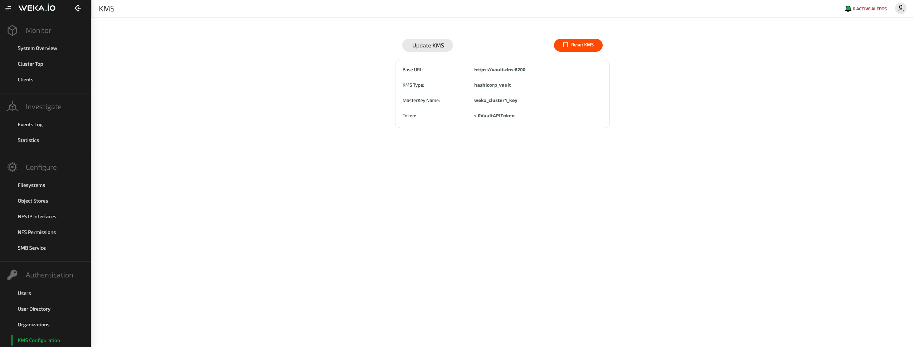
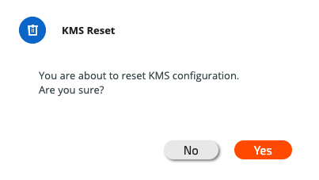

# KMS Management

## Overview

When creating an encrypted filesystem, a KMS must be used to properly secure the encryption keys.

The WEKA system uses the KMS to encrypt filesystem keys. When the WEKA system comes up, it uses the KMS to decrypt the filesystem keys and use its in-memory capabilities for data encrypting/decrypting operations.

When a snapshot is taken using the Snap-To-Object feature, the encrypted filesystem key is saved along with the encrypted data. In the event of rehydrating this snapshot to a different filesystem \(or when recovering from a disaster to the same filesystem in the WEKA cluster\), the KMS is used to decrypt the filesystem key. Consequently, the same KMS data must be present when performing such operations.

For increased security, the WEKA system does not save any information that can reconstruct the KMS encryption keys, which is performed by the KMS configuration alone. Therefore, the following should be considered:

1. If the KMS configuration is lost, the encrypted data may also be lost. Therefore, a proper DR strategy should be set when deploying the KMS in a production environment.
2. The KMS should be available when the WEKA system comes up, when a new filesystem is created, and from time to time when key rotations must be performed. Therefore, it is recommended that the KMS be highly available.

For more information, refer to [KMS Best Practices](kms-management.md#kms-best-practices).

At present, the KMS supported by the WEKA system is [HashiCorp Vault](https://www.hashicorp.com/products/vault/) \(version 1.1.5 and up\). For setting up Vault to work with the WEKA system, refer to [Setting Up Vault Configuration](kms-management.md#setting-up-vault-configuration).

For additional information on KMS support, contact the WEKA Sales or Support Teams.

## Managing KMS Using the GUI

### Adding a KMS

To add a KMS to the WEKA system, go to KMS Configuration screen on the left sidebar and click Configure KMS.



The Configure KMS dialog box will be displayed.



Enter the URL, key name and API token, and click Update to configure the KMS.

### Viewing the KMS

To view the configured KMS, go to the main KMS configuration screen.



### Updating the KMS Configuration

To update the KMS configuration, click Update KMS. The Configure KMS dialog box will be displayed.


Update the URL, master key or API token, and click Update.

### Removing the KMS

To remove a KMS configuration \(an operation that is only possible if no encrypted filesystems exist\), click the Reset KMS button on the main KMS Configuration screen. The KMS Reset dialog box will be displayed.



Click Yes to remove the KMS configuration.

## Managing KMS using the CLI

### Adding/Updating a KMS

**Command:** `weka fs kms set-vault` _\*\*_

Use the following command line to add or update the Vault KMS configuration in the WEKA system:

`weka fs kms set-vault <base-url> <master-key-name> <token>`

**Parameters in Command Line**

<table>
  <thead>
    <tr>
      <th style="text-align:left"><b>Name</b>
      </th>
      <th style="text-align:left"><b>Type</b>
      </th>
      <th style="text-align:left"><b>Value</b>
      </th>
      <th style="text-align:left"><b>Limitations</b>
      </th>
      <th style="text-align:left"><b>Mandatory</b>
      </th>
      <th style="text-align:left"><b>Default</b>
      </th>
    </tr>
  </thead>
  <tbody>
    <tr>
      <td style="text-align:left"><code>base-url</code>
      </td>
      <td style="text-align:left">String</td>
      <td style="text-align:left">URL for Vault KMS</td>
      <td style="text-align:left">Must be a valid URL</td>
      <td style="text-align:left">Yes</td>
      <td style="text-align:left"></td>
    </tr>
    <tr>
      <td style="text-align:left"><code>master-key-name</code>
      </td>
      <td style="text-align:left">String</td>
      <td style="text-align:left">Master key name to be used for encryption-as-a-service in Vault KMS</td>
      <td
      style="text-align:left">Must be a valid key name in Vault</td>
        <td style="text-align:left">Yes</td>
        <td style="text-align:left"></td>
    </tr>
    <tr>
      <td style="text-align:left"><code>token</code>
      </td>
      <td style="text-align:left">String</td>
      <td style="text-align:left">API token to access Vault KMS</td>
      <td style="text-align:left">
        <p>Must have:</p>
        <ul>
          <li>read permissions to <code>transit/keys/&lt;master-key-name&gt;</code>
          </li>
          <li>write permissions to <code>transit/encrypt/&lt;master-key-name&gt;</code> and <code>transit/decrypt/&lt;masterkeyname&gt;</code> 
          </li>
          <li>permissions to <code>/transit/rewrap </code>and <code>auth/token/lookup</code>
          </li>
        </ul>
      </td>
      <td style="text-align:left">Yes</td>
      <td style="text-align:left"></td>
    </tr>
  </tbody>
</table>
**Note:** For the add/update command to succeed, the KMS should be preconfigured and available with the key and a valid token.


### Viewing the KMS

**Command:** `weka fs kms`

Use this command to show the details of the configured KMS.

### Removing the KMS

**Command:** `weka fs kms unset`

Use this command to remove the KMS from the WEKA system. It is only possible to remove a KMS configuration if no encrypted filesystems exist.


**Note:** To force remove a KMS even if encrypted filesystems exist, use the `--allow-downgrade` attribute. In such cases, the encrypted filesystem keys are re-encrypted with local encryption and may be compromised.


### **Re-wrapping Filesystem Keys**

**Command:** `weka fs kms rewrap`

If the KMS key is compromised or requires rotation, the KMS admin can rotate the key in the KMS. In such cases, this command is used to re-encrypt the encrypted filesystem keys with the new KMS master key.


**Note:** Existing filesystem keys that are part of the Snap-To-Object feature will not be automatically re-encrypted with the new KMS key.


## KMS Best Practices

The KMS is the only source holding the key to decrypt WEKA system filesystem keys. For non-disruptive operation, it is highly recommended to follow these guidelines:

* Set-up DR for the KMS \(backup/replication\) to avoid any chance of data loss.
* Ensure that the KMS is highly available \(note that the KMS is represented by a single URL in the WEKA system\).
* Provide access to the KMS from the WEKA system backend hosts.
* Verify the methods used by the KMS being implemented \(each KMS has different methods for securing/unsealing keys and for reconstructing lost keys, e.g., [Vault unsealing methods](https://www.vaultproject.io/docs/concepts/seal.html), which enable the configuration of [auto unsealing using a trusted service](https://learn.hashicorp.com/vault/operations/ops-autounseal-aws-kms)\).
* Refer to [Production Hardening](https://learn.hashicorp.com/vault/operations/production-hardening) for additional best practices suggested by HashiCorp when using Vault.


**Note:** Taking a Snap-To-Object ensures that the \(encrypted\) filesystems keys are backed up to the object store, which is important if total corruption of the WEKA system configuration occurs.


## Setting-Up Vault Configuration

### Enabling 'Transit' Secret Engine in Vault

As described above, the WEKA system uses [encryption-as-a-service](https://learn.hashicorp.com/vault/encryption-as-a-service/eaas-transit) capabilities of the KMS to encrypt/decrypt the filesystem keys. This requires the configuration of Vault with the `transit` secret engine.

```text
$ vault secrets enable transit
Success! Enabled the transit secrets engine at: transit/
```

For more information, refer to [Vault transit secret-engine documentation](https://www.vaultproject.io/docs/secrets/transit/index.html).

### Setting-Up a Master Key for the WEKA System

Once the `transit` \_\_secret engine is set up, a master key for use with the WEKA system must be created.

```text
$ vault write -f transit/keys/wekaio-key
Success! Data written to: transit/keys/wekaio-key
```


**Note:** It is possible to either create a different key for each WEKA cluster or to share the key between different WEKA clusters.


For more information, refer to [Vault transit secret-engine documentation](https://www.vaultproject.io/docs/secrets/transit/index.html).

### Creating a Policy for Master Key Permissions

* Create a `wekaio_policy.hcl` file with the following content:

```text
path "transit/+/wekaio-key" {
  capabilities = ["read", "create", "update"]
}
path "transit/keys/wekaio-key" {
  capabilities = ["read"]
}
```

This limits the capabilities so there is no permission to destroy the key, using this policy. This protection is important when creating an API token.

* Create the policy using the following command:

```text
$ vault policy write wekaio wekaio_policy.hcl
```

### Obtaining an API Token from Vault

Authentication from the WEKA system to Vault relies on an API token. Since the WEKA system must always be able to communicate with the KMS, a [periodic service token](https://www.vaultproject.io/docs/concepts/tokens.html#periodic-tokens) must be used.

* Verify that the`token` authentication method in Vault is enabled. This can be performed using the following command:

```text
$ vault auth list

Path         Type        Description
----         ----        -----------
token/       token       token based credentials
```

* To enable the token authentication method use the following command:

```text
$ vault auth enable token
```

* Log into the KMS system using any of the identity methods supported by Vault. The identity should have permissions to use the previously-set master key. 
* Create a token role for the identity using the following command:

```text
$ vault write auth/token/roles/wekaio allowed_policies="wekaio" period="768h"
```


**Note:** The `period` is the time set for a renewal request. If no renewal is requested during this time period, the token will be revoked and a new token must be retrieved from Vault and set in the WEKA system.


* Generate a token for the logged-in identity using the following command:

```text
$ vault token create -role=wekaio

Key                  Value
---                  -----
token                s.nRucA9Gtb3yNVmLUK22yzVKA
token_accessor       4Nm9BvIVS4HWCgLATc3rIoiW
token_duration       768h
token_renewable      true
token_policies       ["default"]
identity_policies    []
policies             ["default"]
```

For more information on obtaining an API token, refer to [Vault Tokens documentation](https://learn.hashicorp.com/vault/security/tokens).


**Note:** The WEKA system does not automatically renew the API token lease. It can be renewed using the [Vault CLI/API](https://learn.hashicorp.com/vault/security/tokens#step-3-renew-service-tokens). It is also possible to define a higher maximum token value \(`max_lease_ttl)`by changing the [Vault Configuration file](https://www.vaultproject.io/docs/configuration/index.html#max_lease_ttl).


