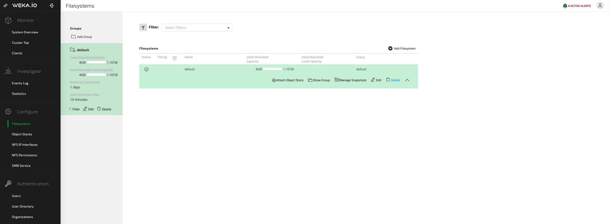
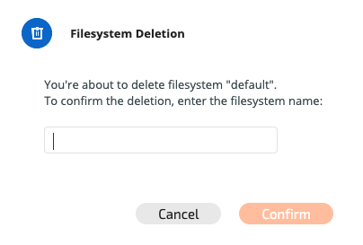

# Managing Filesystems

## Viewing Filesystems

### Viewing Filesystems Using the GUI

The main Filesystems screen in the GUI contains information about the filesystems, including names, tiering status, encryption status, total capacity and used capacity.

### Viewing Filesystems Using the CLI

**Command:** `weka fs` 

Use this commands to view information on the filesystems in the WekaIO system.

## Adding a Filesystem

### Adding a Filesystem Using the GUI

From the main filesystem / filesystem group view screen, click the Add Filesystem button at the top right-hand side of the screen. The Add Filesystem screen will be displayed.

The Create Filesystem dialog box will be displayed.

Enter the relevant parameters and click Create to create the filesystem.

### Adding a Filesystem Using the CLI

**Command:** `weka fs create`

Use the following command line to add a filesystem:

`weka fs create <name> <group-name> <total-capacity> [--ssd-capacity <ssd>] [--max-files <max-files>] [--filesystem-id <id>] [--encrypted] [--obs-name <obs-name>]`

**Parameters in Command Line**

| **Name** | **Type** | **Value** | **Limitations** | **Mandatory** | **Default** |
| :--- | :--- | :--- | :--- | :--- | :--- |
| `name` | String | Name of the filesystem being created | Must be a valid name | Yes | ​ |
| `group-name` | String | Name of the filesystem group to which the new filesystem is to be connected | Must be a valid name | Yes |  |
| `total-capacity` | Number | Total capacity of the new filesystem; options are SSD capacity \(`ssd-capacity <ssd>`\), the filesystem ID \(`filesystem-id <id>`\) or a value that correlates with the percentage of SSD capacity from the total SSD capacity for the cluster \(`max-files <max-files>`\) | Must be a valid number | Yes |  |
| `ssd-capacity` | Number | For tiered filesystems, this is the SSD capacity. If not specified, the filesystem is pinned to SSD | Must be a valid number | No | SSD capacity will be set to total capacity |
| `max-files` | Number | Metadata allocation for this filesystem | Must be a valid number | No | Automatically calculated by the system based on the SSD capacity |
| `encrypted` | Boolean | Encryption of filesystem |  | No | No |
| `obs-name` | String | Object store name for tiering | Must be a valid name | No |  |

## Editing a Filesystem

### Editing an Existing Filesystem Using the GUI

Select the filesystem to be modified in the main filesystem / filesystem group view screen and click the Edit button.

 The Configure Filesystem dialog box will be displayed.

Edit the existing filesystem parameters and click Configure to execute the changes.


**Note:** It is not possible to change the encryption configuration of a filesystem.


### Editing an Existing Filesystem Using the CLI

**Command:** `weka fs update`

Use the following command line to edit an existing filesystem:

`weka fs update <name> [--new-name=<new-name>] [--total-capacity=<total>] [--ssd-capacity=<ssd>] [--max-files=<max-files>]`

**Parameters in Command Line**

| **Name** | **Type** | **Value** | **Limitations** | **Mandatory** | **Default** |
| :--- | :--- | :--- | :--- | :--- | :--- |
| `name` | String | Name of the filesystem being edited | Must be a valid name | Yes | ​ |
| `new-name` | String | New name for the filesystem | Must be a valid name | Optional | Keep unchanged |
| `total` | Number | Total capacity of the edited filesystem | Must be a valid number | Optional | Keep unchanged |
| `ssd` | Number | SSD capacity of the edited filesystem | Must be a valid number | Optional | Keep unchanged |
| `max-files` | Number | Metadata limit for the filesystem | Must be a valid number | Optional | Keep unchanged |

## Deleting a Filesystem

### Deleting a Filesystem Using the GUI

Select the filesystem to be deleted in the main filesystem / filesystem group view screen and click the Delete button.

The Filesystem Deletion dialog box is displayed. 

Confirm the filesystem deletion by typing the name of the filesystem and clicking Confirm.

### Deleting a Filesystem Using the CLI

**Command:** `weka fs delete`

Use the following command line to delete a filesystem:

`weka fs delete <name>`

**Parameters in Command Line**

| **Name** | **Type** | **Value** | **Limitations** | **Mandatory** | **Default** |
| :--- | :--- | :--- | :--- | :--- | :--- |
| `name` | String | Name of the filesystem to be deleted | Must be a valid name | Yes |  |

## 

