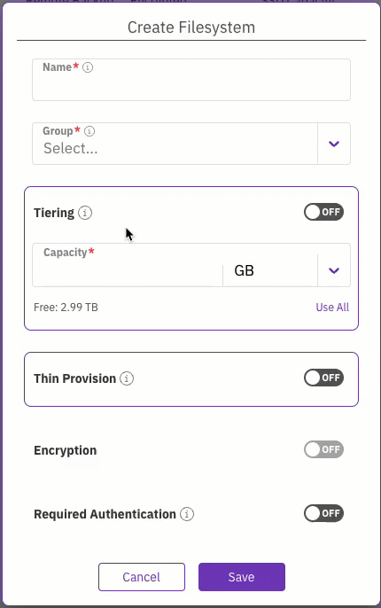

# Manage filesystems using the GUI

Using the GUI, you can perform the following actions:

* [View filesystems](managing-filesystems.md#view-filesystems)
* [Create a filesystem](managing-filesystems.md#add-a-filesystem)
* [Edit a filesystem](managing-filesystems.md#edit-a-filesystem)
* [Delete a filesystem](managing-filesystems.md#delete-a-filesystem)

## View filesystems

The filesystems are displayed on the **Filesystems** page. Each filesystem indicates the status, tiering status, backup status, encryption status, SDD capacity, total capacity, and the filesystem group used.

**Procedure**

1. From the menu, select **Manage > Filesystems**.

## Create a filesystem

When creating a WEKA system on-premises, it does not contain any filesystem. You must create it and set its properties, such as capacity, group, tiering, thin provisioning, encryption, and required authentication during mount.

When creating a WEKA system in AWS using the cloud formation, the WEKA system contains a default filesystem, which is provisioned with the maximum capacity. If your deployment requires more filesystems with different settings, reduce the default filesystem's provisioned capacity and then add a filesystem with the properties that meet your specific needs.

**Before you begin**

* Verify that the system has free capacity.
* Verify that a filesystem group is already set.
* If tiering is required, verify that an object store bucket is set.
* If encryption is required, verify that a KMS is configured.

**Procedure**

1. From the menu, select **Manage > Filesystems**.
2. Select the **+Create** button.

3. In the **Create Filesystem** dialog, set the following:
   * **Name**: Enter a meaningful name for the filesystem.
   * **Group**: Select the filesystem group that fits your filesystem.
   * **Capacity**: Enter the storage size to provision, or select **Use All** to provision all the free capacity.&#x20;

<figure><figcaption>
Create a filesystem
</figcaption></figure>

5. Optional: [**Tiering**](../tiering/advanced-time-based-policies-for-data-storage-location.md#tiering-cue-policy).\
   If tiering is required, and an object store bucket is already defined, select the toggle button and set the details of the object store bucket:
   * **Object Store Bucket:** Select a predefined object store bucket from the list.
   * **Drive Capacity**: Enter the capacity to provision on the SSD, or select **Use All** to use all free capacity.
   * **Total Capacity**: Enter the total capacity of the object store bucket, including the drive capacity.

6. Optional: **Thin Provision**.\
   If Thin Provision is required, select the toggle button, and set the minimum (guaranteed) and the maximum capacity for the thin provisioned filesystem. \
   The minimum capacity must be less or equal to the available SSD capacity.\
   You can set any maximum capacity, but the available capacity depends on the actual free space of the SSD capacity.&#x20;

7. Optional: If **Encryption** is required and your WEKA system is deployed with a KMS, select the toggle button.
8. Optional: **Required Authentication**.\
   When ON, user authentication is required when mounting to the filesystem. This option is only relevant to a filesystem created in the root organization.\
   Enabling authentication is not allowed for a filesystem hosting NFS client permissions or SMB shares.\
   To authenticate during mount, the user must run the `weka user login` command or use `auth_token_path`.
9. Select **Save**.

**Related topics**

[managing-filesystem-groups](../managing-filesystem-groups/ "mention")

[managing-object-stores](../managing-object-stores/ "mention")

[kms-management](../../usage/security/kms-management/ "mention")

## Edit a filesystem

You can modify the filesystem parameters according to your demand changes over time. The parameters you can modify include filesystem name, capacity, tiering, thin provisioning, and required authentication (but not encryption).

**Procedure**

1. From the menu, select **Manage > Filesystems**.
2. Select the three dots on the right of the filesystem you want to modify, and select **Edit**.

3. In the **Edit Filesystem** dialog, modify the parameters according to your requirements. (See the parameter descriptions in the [Add a filesystem](managing-filesystems.md#add-a-filesystem) topic.)

4. Select **Save**.

## Delete a filesystem

You can delete a filesystem if its data is no longer required. Deleting a filesystem does not delete the data in the tiered object store bucket.


If you must also delete the data in the tiered object store bucket, see the [Delete a filesystem](managing-filesystems-1.md#delete-a-filesystem) topic in the CLI section.


**Procedure**

1. From the menu, select **Manage > Filesystems**.
2. Select the three dots on the right of the filesystem you want to delete, and select **Remove**.
3. To confirm the filesystem deletion, enter the filesystem name and select **Confirm**.

