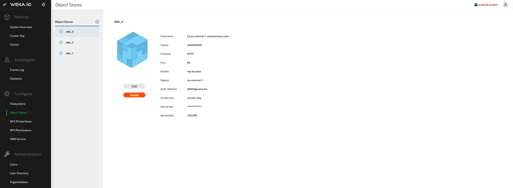
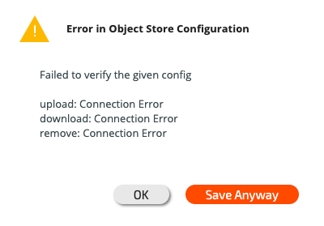
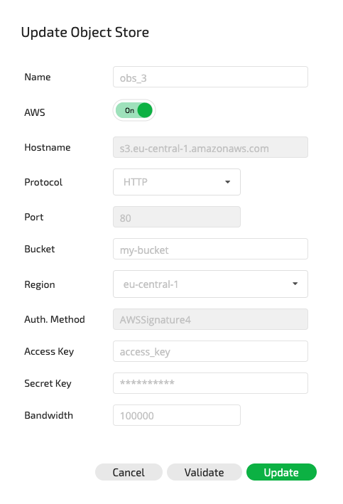
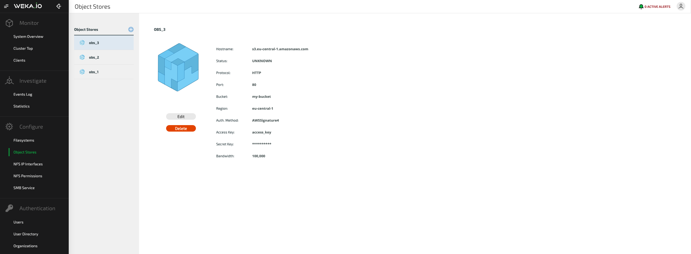

# Managing Object Stores

## Overview

As described in the [Object Stores Overview](../../overview/filesystems.md#about-object-stores) page, Weka utilizes object stores for either tiering or backup when attaching object-store buckets to a filesystem.

Since object-store buckets may reside in different physical object stores, for better QoS between them, Weka requires the mapping between the bucket to the physical object-store.

Object-store in Weka generally represents a physical entity (on-premises or in the cloud), grouping several object-store buckets. An object-store or object-store bucket can be either `local` (used for tiering+snapshots) or `remote` (used for snapshots only). An object-store bucket must be added to an object-store with the same type. 

This grouping under a physical object-store allows:

* Better QoS when more than one physical object-store is involved
* Restrictions on downloading from a remote object-store
  * By default, very low bandwidth is configured for downloading from a remote bucket since this may incur extra charges for on-premises systems where the remote bucket is in the cloud.
* Ease-of adding new buckets
  * It is possible to configure the connection parameters on the object-store level and, if not specified differently, automatically use them for added buckets.


**Note:** Initially, the system comes up with two pre-configured object-stores, one for grouping`local` buckets for tiering and snapshots (named`default`) and one for grouping `remote` buckets for snapshots-only (named `remote_default`).



**Note:** Currently, only one local and one remote object-store are supported in general operation. It is only transiently supported to have more than one local object-store when there is a need to recover from a remote snapshot (this recovery might inccur significant charges when working with a cloud backup). If there is no other way (snapshot is not present locally) it is possible to use this procedure to recover from a remote snapshot.

Support for more than one local/remote object-stores will be rolled out in a future version.


## Viewing Object-Stores

### Viewing Object-Stores Using the CLI

**Command:** `weka fs tier obs`

This command is used to view information on all the object stores configured to the Weka system.


**Note: **Using the GUI only object-store buckets are present. Adding an object-store bucket will add it to the only `local` or `remote` object-store present. If more than one is present (such as during the time [recovering from a remote snapshot](../snap-to-obj.md#recovering-from-a-remote-snapshot)), the CLI should be used.


## Editing Object-Stores

### Editing an Object-Store Using the CLI

**Command:** `weka fs tier obs update`

Use the following command line to edit an object store:

`weka fs tier obs update <name> [--new-name new-name] [--site site] [--hostname=<hostname>] [--port=<port>] [--auth-method=<auth-method>] [--region=<region>] [--access-key-id=<access-key-id>] [--secret-key=<secret-key>] [--protocol=<protocol>] [--bandwidth=<bandwidth>] [--download-bandwidth=<download-bandwidth>] [--upload-bandwidth=<upload-bandwidth>] [--max-concurrent-downloads=<max-concurrent-downloads>] [--max-concurrent-uploads=<max-concurrent-uploads>] [--max-concurrent-removals=<max-concurrent-removals>] [--enable-upload-tags=<enable-upload-tags>]`

**Parameters in Command Line**

| **Name**                   | **Type** | **Value**                                                                                                                                                | **Limitations**                            | **Mandatory** | **Default** |
| -------------------------- | -------- | -------------------------------------------------------------------------------------------------------------------------------------------------------- | ------------------------------------------ | ------------- | ----------- |
| `name`                     | String   | Name of the object store being created                                                                                                                   | Must be a valid name                       | Yes           | ​           |
| `new-name`                 | String   | New name for the object store                                                                                                                            | Must be a valid name                       | No            |             |
| `site`                     | String   | `local` - for tiering+snapshots, `remote` - for snapshots only                                                                                           | `local` or `remote`                        | No            | ``          |
| `hostname`                 | String   | Object store host identifier, to be used as a default for added buckets                                                                                  | Must be a valid name/IP                    | No            |             |
| `port`                     | String   | Object store port, to be used as a default for added buckets                                                                                             | Must be a valid name                       | No            |             |
| `auth-method`              | String   | Authentication method, to be used as a default for added buckets                                                                                         | `None`, `AWSSignature2` or `AWSSignature4` | No            |             |
| `region`                   | String   | Region name, to be used as a default for added buckets                                                                                                   |                                            | No            |             |
| `access-key-id`            | String   | Object store  access key ID, to be used as a default for added buckets                                                                                   |                                            | No            |             |
| `secret-key`               | String   | Object store  secret key, to be used as a default for added buckets                                                                                      |                                            | No            |             |
| `protocol`                 | String   | Protocol type, to be used as a default for added buckets                                                                                                 | `HTTP`, `HTTPS` or `HTTPS_UNVERIFIED`      | No            |             |
| `bandwidth`                | Number   | Bandwidth limitation per core (Mbps)                                                                                                                     |                                            | No            |             |
| `download-bandwidth`       | Number   | Object-store download bandwidth limitation per core (Mbps)                                                                                               |                                            | No            |             |
| `upload-bandwidth`         | Number   | Object-store upload bandwidth limitation per core (Mbps)                                                                                                 |                                            | No            |             |
| `max-concurrent-downloads` | Number   | Maximum number of downloads concurrently performed on this object store in a single IO node                                                              | 1-64                                       | No            |             |
| `max-concurrent-uploads`   | Number   | Maximum number of uploads concurrently performed on this object store in a single IO node                                                                | 1-64                                       | No            |             |
| `max-concurrent-removals`  | Number   | Maximum number of removals concurrently performed on this object store in a single IO node                                                               | 1-64                                       | No            |             |
| `enable-upload-tags`       | String   | Whether to enable [object-tagging](../tiering/data-management-in-tiered-filesystems.md#object-tagging) or not, to be used as a default for added buckets | `true` or `false`                          | No            |             |

## Viewing Object-Store Buckets

### Viewing Object-Store Buckets Using the GUI

The main object store screen in the GUI lists all existing object-store buckets and can also display information about a specific object-store bucket, including the bucket name, status and region.

### Viewing Object-Store Buckets Using the CLI

**Command:** `weka fs tier s3`

This command is used to view information on all the object-store buckets configured to the Weka system.

## Adding an Object-Store Bucket

### Adding an Object-Store Bucket Using the GUI

From the main object store view screen, click the "+" button at the top left-hand side of the screen. The Configure Object Store dialog box will be displayed.

Enter the relevant parameters and click Configure to add the object store bucket.

If the object store is misconfigured, the Error in Object Store Configuration window will be displayed.

Click Save Anyway in order to save the configured object store.

### Adding an Object-Store Bucket Using the CLI

**Command:** `weka fs tier s3 add`

Use the following command line to add an object store:

`weka fs tier s3 add <name> [--site site] [--obs-name obs-name] [--hostname=<hostname>] [--port=<port> [--bucket=<bucket>] [--auth-method=<auth-method>] [--region=<region>] [--access-key-id=<access-key-id>] [--secret-key=<secret-key>] [--protocol=<protocol>] [--bandwidth=<bandwidth>] [--download-bandwidth=<download-bandwidth>] [--upload-bandwidth=<upload-bandwidth>] [--errors-timeout=<errors-timeout>] [--prefetch-mib=<prefetch-mib>] [--enable-upload-tags=<enable-upload-tags>]`

**Parameters in Command Line**

| **Name**             | **Type** | **Value**                                                                                                         | **Limitations**                                                        | **Mandatory**                                                                                  | **Default**                                                                              |
| -------------------- | -------- | ----------------------------------------------------------------------------------------------------------------- | ---------------------------------------------------------------------- | ---------------------------------------------------------------------------------------------- | ---------------------------------------------------------------------------------------- |
| `name`               | String   | Name of the object-store bucket being created                                                                     | Must be a valid name                                                   | Yes                                                                                            | ​                                                                                        |
| `site`               | String   | `local` - for tiering+snapshots, `remote` - for snapshots only                                                    | Must be  the same as the object store site it is added to `(obs-name)` | No                                                                                             | `local`                                                                                  |
| `obs-name`           | String   | Name of the object-store to add  this object-store bucket to                                                      | Must be an existing object-store                                       | No                                                                                             | If there is only one object-store of type mentioned in `site` it is chosen automatically |
| `hostname`           | String   | Object store host identifier                                                                                      | Must be a valid name/IP                                                | Yes, if not specified in the object-store level                                                | The `hostname` specified in `obs-name` if present                                        |
| `port`               | String   | Object store port                                                                                                 | Must be a valid name                                                   | No                                                                                             | The `port` specified in `obs-name` if present,  otherwise 80                             |
| `bucket`             | String   | Object store bucket name                                                                                          | Must be a valid name                                                   | Yes                                                                                            |                                                                                          |
| `auth-method`        | String   | Authentication method                                                                                             | `None`, `AWSSignature2` or `AWSSignature4`                             | Yes, if not specified in the object-store level                                                | The `auth-method` specified in `obs-name` if present                                     |
| `region`             | String   | Region name                                                                                                       |                                                                        | Yes, if not specified in the object-store level                                                | The `region` specified in `obs-name` if present                                          |
| `access-key-id`      | String   | Object store bucket access key ID                                                                                 |                                                                        | Yes, if not specified in the object-store level (can be left empty when using IAM role in AWS) | The `access-key-id` specified in `obs-name` if present                                   |
| `secret-key`         | String   | Object store bucket secret key                                                                                    |                                                                        | Yes, if not specified in the object-store level (can be left empty when using IAM role in AWS) | The `secret-key` specified in `obs-name` if present                                      |
| `protocol`           | String   | Protocol type to be used                                                                                          | `HTTP`, `HTTPS` or `HTTPS_UNVERIFIED`                                  | No                                                                                             | The `protocol` specified in `obs-name` if present, otherwise`HTTP `                      |
| `bandwidth`          | Number   | Bucket bandwidth limitation per core (Mbps)                                                                       |                                                                        | No                                                                                             |                                                                                          |
| `download-bandwidth` | Number   | Bucket download bandwidth limitation per core (Mbps)                                                              |                                                                        | No                                                                                             |                                                                                          |
| `upload-bandwidth`   | Number   | Bucket upload bandwidth limitation per core (Mbps)                                                                |                                                                        | No                                                                                             |                                                                                          |
| `errors-timeout`     | Number   | If the object-store link is down for longer than this timeout period, all IOs that need data return with an error | 1-15 minutes, e.g: 5m or 300s                                          | No                                                                                             | 300                                                                                      |
| `prefetch-mib`       | Number   | How many MiB of data to prefetch when reading a whole MiB on the object store                                     |                                                                        | No                                                                                             | 0                                                                                        |
| `enable-upload-tags` | String   | Whether to enable [object-tagging](../tiering/data-management-in-tiered-filesystems.md#object-tagging) or not     | `true` or `false`                                                      | No                                                                                             | `false`                                                                                  |


**Note:** When using the CLI, by default a misconfigured object store will not be created. To create an object store even when it is misconfigured, use the `--skip-verification`option.



**Note: **The `max-concurrent` settings are applied per Weka compute process and the minimum setting of all object-stores is applied.


## Editing an Object-Store Bucket

### Editing an Object-Store Bucket Using the GUI

From the main object store view screen, click the Edit button of the object store bucket to be edited.

The Update Object Store dialog box (which is similar to the Configure Object Store dialog box) will be displayed with the current specifications for the object store bucket.

Make the relevant changes and click Update to update the object store bucket.

### Editing an Object-Store Bucket Using the CLI

**Command:** `weka fs tier s3 update`

Use the following command line to edit an object-store bucket:

`weka fs tier s3 update <name> [--new-name=<new-name>] [--new-obs-name new-obs-name] [--hostname=<hostname>] [--port=<port> [--bucket=<bucket>] [--auth-method=<auth-method>] [--region=<region>] [--access-key-id=<access-key-id>] [--secret-key=<secret-key>] [--protocol=<protocol>] [--bandwidth=<bandwidth>] [--download-bandwidth=<download-bandwidth>] [--upload-bandwidth=<upload-bandwidth>] [--errors-timeout=<errors-timeout>] [--prefetch-mib=<prefetch-mib>] [--enable-upload-tags=<enable-upload-tags>]`

**Parameters in Command Line**

| **Name**             | **Type** | **Value**                                                                                                         | **Limitations**                                               | **Mandatory** | **Default** |
| -------------------- | -------- | ----------------------------------------------------------------------------------------------------------------- | ------------------------------------------------------------- | ------------- | ----------- |
| `name`               | String   | Name of the object-store bucket being edited                                                                      | Must be a valid name                                          | Yes           | ​           |
| `new-name`           | String   | New name for the object-store bucket                                                                              | Must be a valid name                                          | No            |             |
| `new-obs-name`       | String   | New name of the object-store to add  this object-store bucket to                                                  | Must be an existing object-store, with the same `site` value. | No            |             |
| `hostname`           | String   | Object store host identifier                                                                                      | Must be a valid name/IP                                       | No            |             |
| `port`               | String   | Object store port                                                                                                 | Must be a valid name                                          | No            |             |
| `bucket`             | String   | Object store bucket name                                                                                          | Must be a valid name                                          | No            |             |
| `auth-method`        | String   | Authentication method                                                                                             | `None`, `AWSSignature2` or `AWSSignature4`                    | No            |             |
| `region`             | String   | Region name                                                                                                       |                                                               | No            |             |
| `access-key-id`      | String   | Object-store bucket access key ID                                                                                 |                                                               | No            |             |
| `secret-key`         | String   | Object-store bucket secret key                                                                                    |                                                               | No            |             |
| `protocol`           | String   | Protocol type to be used                                                                                          | `HTTP`, `HTTPS` or `HTTPS_UNVERIFIED`                         | No            |             |
| `bandwidth`          | Number   | Bandwidth limitation per core (Mbps)                                                                              |                                                               | No            |             |
| `download-bandwidth` | Number   | Bucket download bandwidth limitation per core (Mbps)                                                              |                                                               | No            |             |
| `upload-bandwidth`   | Number   | Bucket upload bandwidth limitation per core (Mbps)                                                                |                                                               | No            |             |
| `errors-timeout`     | Number   | If the object-store link is down for longer than this timeout period, all IOs that need data return with an error | 1-15 minutes, e.g: 5m or 300s                                 | No            |             |
| `prefetch-mib`       | Number   | How many MiB of data to prefetch when reading a whole MiB on the object store                                     |                                                               | No            |             |
| `enable-upload-tags` | String   | Whether to enable [object-tagging](../tiering/data-management-in-tiered-filesystems.md#object-tagging) or not     | `true` or `false`                                             | No            |             |

## Deleting an Object-Store Bucket

### Deleting an Object-Store Bucket Using the GUI

From the main object store view screen, click the Delete button of the object-store bucket to be deleted.

The Deletion of Object Store window will be displayed.

Click Yes to delete the object-store bucket.

### Deleting an Object-Store Bucket Using the CLI

**Command:** `weka fs tier s3 delete`

Use the following command line to delete an object-store bucket:

`weka fs tier s3 delete <name>`

**Parameters in Command Line**

| **Name** | **Type** | **Value**                                     | **Limitations**      | **Mandatory** | **Default** |
| -------- | -------- | --------------------------------------------- | -------------------- | ------------- | ----------- |
| `name`   | String   | Name of the object-store bucket being deleted | Must be a valid name | Yes           | ​           |
