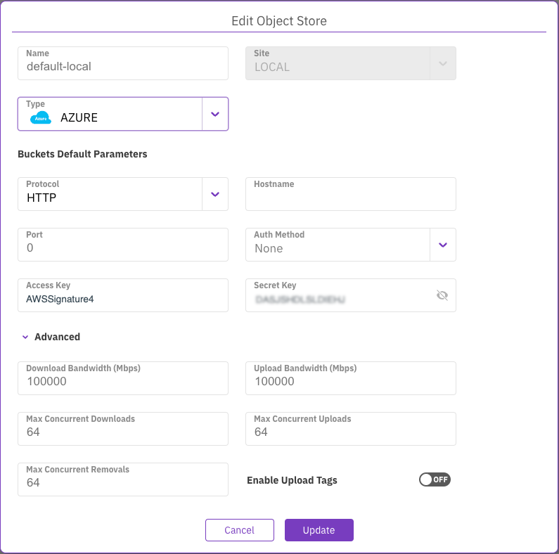

# Manage object stores using the GUI

Using the GUI, you can perform the following actions:

* [Edit the default object stores](managing-object-stores.md#edit-the-default-object-stores)
* [Add an object store bucket](managing-object-stores.md#add-an-object-store-bucket)
* [View object store buckets](managing-object-stores.md#view-object-store-buckets)
* [Edit an object store bucket](managing-object-stores.md#edit-an-object-store-bucket)
* [Show recent operations of an object store bucket](managing-object-stores.md#show-recent-operations-of-an-object-store-bucket)
* [Delete an object store bucket](managing-object-stores.md#delete-an-object-store-bucket)

## Edit the default object stores 

Object store buckets can reside in different physical object stores. To achieve good QoS between the buckets, WEKA requires mapping the buckets to the physical object store.

You can edit the default local and remote object stores to meet your connection demands. When you add an object store bucket, you apply the relevant object store on the bucket.

Editing the default object store provides you with the following additional advantages:

* Set restrictions on downloads from a remote object store.\
  For on-premises systems where the remote bucket is in the cloud, to reduce the cost, you set a very low bandwidth for downloading from a remote bucket.
* Ease of adding new buckets.\
  You can set the connection parameters on the object store level and, if not specified differently, automatically use the default settings for the buckets you add.

**Procedure**

1. From the menu, select **Manage > Object Stores**.
2. On the left, select the pencil icon near the default object store you want to edit.
3. On the **Edit Object Store** dialog, select the type of object store and update the relevant parameters. Select one of the following tabs according to the object store type you choose.\
   For details, see the parameter descriptions in the [Add an object store bucket](managing-object-stores.md#add-an-object-store-bucket) topic.



It is not mandatory to set the Access Key and Secret Key in the **Edit Object Store** dialog in AWS. The AWS object store type is accessed from the WEKA EC2 instances to the object store and granted by the IAM roles assigned to the instances.

If you select **Enable AssumeRole API**, set also the **Role ARN** and **Role Session Name**. For details, see the [Add an object store bucket](managing-object-stores.md#add-an-object-store-bucket) topic.

<figure><figcaption>
Edit local default object store for AWS
</figcaption></figure>



It is not mandatory to set the Access Key and Secret Key in the **Edit Object Store** dialog in GCP. Google Cloud Storage is accessed using a service account attached to each Compute Engine Instance that is running WEKA software, provided that the service account has the required permissions granted by the IAM role (`storage.admin` for creating buckets.  `storage.objectAdmin` for using an existing bucket ).

<figure><figcaption>
Edit local default object store for GCP
</figcaption></figure>



<figure><figcaption>
Edit local default object store for Azure
</figcaption></figure>



## Add an object store bucket 

Add object store buckets to be used for tiering or snapshots.

**Procedure**

1. From the menu, select **Manage > Object Stores**.
2. Select the **+Create** button.

3. In the **Create Object Store Bucket** dialog, set the following:
   * **Name**: Enter a meaningful name for the bucket.
   * **Object Store**: Select the location of the object store. For tiering and snapshots, select the local object store. For snapshots only, select the remote object store.
   * **Type**: Select the type of object store: AWS, AZURE, or OTHER (for GCP and others).
   * **Buckets Default Parameters**: Select one of the following tabs according to the object store type you choose.



WEKA supports the following options for creating AWS S3 buckets:

* AWS S3 bucket creation for WEKA cluster on EC2.
* AWS S3 bucket creation for WEKA cluster not on EC2 using STS[^1].

Set the following:

1. **Protocol and Port:** Select the protocol to use when connecting to the bucket.
2. **Bucket:** Set the name of the bucket to store and access data.
3. **Region:** Set the region assigned to work with.
4. **For AWS S3 bucket creation for WEKA cluster on EC2:**\
   If the WEKA EC2 instances have the required permissions granted by the IAM role, then it is not required to provide the Access Key and Secret Key. Otherwise, set the Access Key and Secret Key of the user granted with read/write access to the bucket.
5. **For AWS S3 bucket creation for WEKA cluster not on EC2 using STS:**
   * Select **Enable AssumeRole API**.
   * **Role ARN:** Set the Amazon Resource Name (ARN) to assume. The ARN must have the equivalent permissions defined in the IAM role for S3 access. See [IAM role created in the template](../../install/aws/weka-installation-on-aws-using-the-cloud-formation/cloudformation.md#iam-role-created-in-the-template).
   * **Role Session Name:** Set a unique identifier[^2] for the assumed role session.
   *   **Session Duration:** Set the duration of the temporary security credentials in seconds.

       Possible values: 900 - 43200 (default 3600).
   * **Access Key and Secret Key:** Set the keys of the user granted with the AssumeRole permissions.


When creating the object store bucket in AWS, to use the storage classes: S3 Intelligent-Tiering, S3 Standard-IA, S3 One Zone-IA, and S3 Glacier Instant Retrieval, do the following:

1. Create the bucket in S3 Standard.
2. Create an AWS lifecycle policy to transition objects to these storage classes.
3. Make the relevant changes and click **Update** to update the object store bucket.


<figure><figcaption>
AWS S3 bucket creation for WEKA cluster on EC2
</figcaption></figure>

<figure><figcaption>
AWS S3 bucket creation for WEKA cluster is not on EC2 using STS
</figcaption></figure>



Set the following:

* **Protocol and Port:** Select the protocol and port to use when connecting to the bucket.
* **Hostname:** Set the DNS name (or IP address) of the bucket entry point.
* **Bucket:** Set the name of the bucket to store and access data.
* **Auth Method:** Select the authentication method to connect to the bucket.
* **Region:** Set the region assigned to work with (usually you can leave it empty).
* **Access Key and Secret Key:** If the service account has the required permissions granted by the IAM role, then it is not required to provide the Access Key and Secret Key. If the WEKA cluster is not running on GCP instances then the Access Key and Secret Key are required.

<figure><figcaption>
GCP S3 bucket creation
</figcaption></figure>



Set the following:

1. **Protocol and Port:** Select the protocol and port to use when connecting to the bucket.
2. **Hostname:** Set the DNS name (or IP address) of the bucket entry point.
3. **Bucket:** Set the name of the bucket to store and access data.
4. **Auth Method:** Select the authentication method to connect to the bucket.
5. **Access Key and Secret Key:** Set the the Access Key and Secret Key of the user granted with read/write access to the bucket.

<figure><figcaption>
Azure S3 bucket creation
</figcaption></figure>



4. Optional**:** If your deployment requires a specific upload and download configuration, select **Advanced**, and set the parameters:
   * **Download Bandwidth**: Object store download bandwidth limitation per core (Mbps).
   * **Upload Bandwidth**: Object store upload bandwidth limitation per core (Mbps).
   * **Max concurrent Downloads**: Maximum number of downloads concurrently performed on this object store in a single IO node.
   * **Max concurrent Uploads**: Maximum number of uploads concurrently performed on this object store in a single IO node.
   * **Max concurrent Removals**: Maximum number of removals concurrently performed on this object store in a single IO node.
   * **Enable Upload Tags**: Whether to enable [object-tagging](../tiering/data-management-in-tiered-filesystems.md#object-tagging) or not.

.png>)

6. To validate the connection to the object store bucket, select **Validate**.
7. Select **Create**.


If an error message about the object store bucket configuration appears, to save the configuration, select **Create Anyway**.


## View object store buckets 

The object store buckets are displayed on the **Object Stores** page. Each object store indicates the status, bucket name, protocol (HTTP/HTTPS), port, region, object store location (local or remote), authentication method, and error information (if it exists).

**Procedure**

1. From the menu, select **Manage > Object Stores**.

The following example shows two object store buckets.

## Edit an object store bucket 

You can modify the object store bucket parameters according to your demand changes.

**Procedure**

1. From the menu, select **Manage > Object Stores**.
2. Select the three dots on the right of the object store you want to modify and select **Edit**.

.png>)

3. In the Edit Object Store Bucket dialog, modify the details, and select **Update**.

.png>)

## Show recent operations of an object store bucket

For active object store buckets connected to filesystems, the system tracks this activity and provides details about each activity on the Bucket Operations page.

The details include the operation type (download or upload), start time, execution time, previous attempts results, cURL errors, and more.&#x20;

**Procedure**

1. From the menu, select **Manage > Object Stores**.
2. Select the three dots on the right of the object store bucket you want to show its recent operation, and select **Show Recent Operations**.

<figure><figcaption>
Show recent operations of an object store bucket
</figcaption></figure>

The recent operations page for the selected object store bucket appears. To focus on specific operations, you can sort the columns and use the filters that appear on the top of the columns.

<figure><figcaption>
Bucket Operations page
</figcaption></figure>

## Delete an object store bucket

You can delete an object store bucket if it is no longer required. The data in the object store remains intact.

**Procedure**

1. From the menu, select **Manage > Object Stores**.
2. Select the three dots on the right of the object store bucket you want to delete, and select **Remove**.
3. To confirm the object store bucket deletion, select **Yes**.

[^1]: WEKA supports the AWS Security Token Service (STS) that enables you to request temporary, limited-privilege credentials for users using the [AssumeRole](https://docs.aws.amazon.com/STS/latest/APIReference/API\_AssumeRole.html) API.

[^2]: The length must be between 2 and 64 characters. Allowed characters include alphanumeric characters (upper and lower case), underscore (\_), equal sign (=), comma (,), period (.), at symbol (@), and hyphen (-). Space is not allowed.
