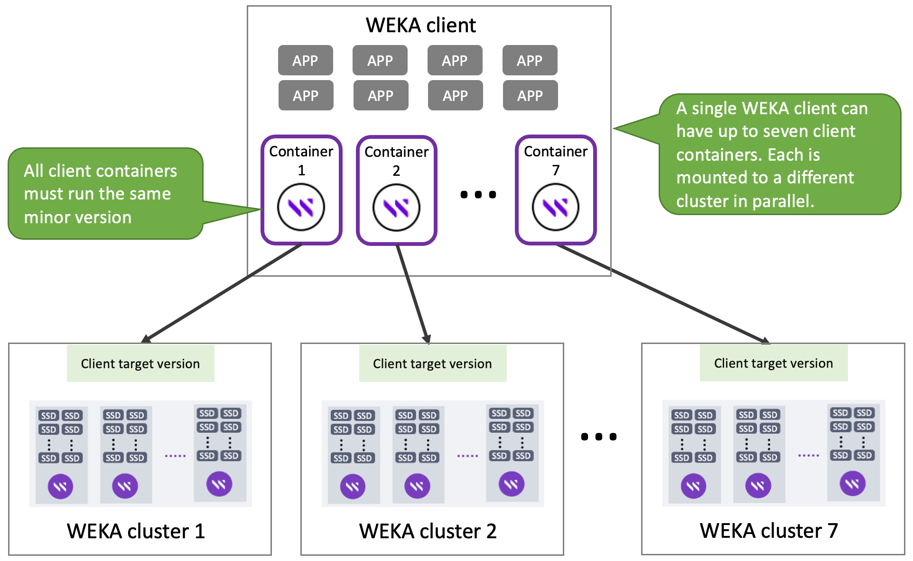

# Mount filesystems from multiple clusters on a single client

You can mount filesystems from up to sever clusters in parallel on a single WEKA client.

This feature provides the following benefits:

* **Expanded cluster connectivity:** WEKA allows a single client to connect to multiple clusters simultaneously, resulting in increased storage capacity and enhanced computational capabilities.
* **Streamlined data access:** The enhanced cluster connectivity offers users a unified view of data across multiple clusters, simplifying data access and management. This allows for improved data availability, increased flexibility, and more efficient resource usage.
* **Efficient workload distribution:** With the ability to connect to multiple clusters, WEKA enables efficient workload distribution across distributed environments. Users can easily scale out their applications, balance workloads across clusters, and optimize performance based on their specific requirements.
* **Seamless integration:** WEKA ensures a seamless integration process for clients leveraging this feature.

<figure><figcaption><p>Mount filesystems from multiple clusters on a single client</p></figcaption></figure>

## Prerequisites

Ensure the following requirements are met:

* All clusters that run in this configuration must be at least version 4.2.
* All client containers in the WEKA client must run the same minor version, at least version 4.2. The client version must be the same as the cluster or one version earlier at most.
* All client containers must be of the same type, stateful or stateless clients. Mixing different client types in a single WEKA client is not allowed.
* Each client container must run on its port. The default ports are 14000, 14101, 14201, 14301, 14401, 14501, and 14601. Ensure these ports allow egress on the client and ingress on the cluster.
* For DPDK, each client container must have 5 GB of free RAM, and it is recommended to have a dedicated CPU core to get optimal performance.

&#x20;Mounting a filesystem without these requirements may fail or overload the WEKA client.


**Notes:**

* Mounting filesystems from multiple clusters from clients with Intel E810 are only supported using UDP mode.
* Mounting a stateful client using **autofs** is only supported on filesystems on a single cluster.


## Set the client target version in the clusters

When a stateless client mounts a filesystem in a cluster, it creates a client container with the same version as provided by the cluster. Because there may be situations where some of the clusters run a different WEKA version than the others, such as during an upgrade, it is required to set the same client target version on all clusters. The client target version is retained regardless of the cluster upgrade.


The client target version must be the same in all clusters. It can be the same as in the cluster or one major version earlier and available in the cluster for download by the client.\
If you need to upgrade the cluster to a higher version than 1 above the client version, you must update the `client-target-version` first in all clusters, upgrade the clients, and only then upgrade the clusters. &#x20;


#### Procedure:

1. Connect to each cluster and run the following command to set the client target version.&#x20;

```
weka cluster client-target-version set <version-string>
```

Where: \<version-string> is the designated client target version, which will be installed on the client container upon the mount command. Ensure this version is installed on the backend servers.

2. To display the existing client target version in the cluster, run the following command:

```
weka cluster client-target-version show
```

3. To reset the client target version to the cluster version, run the following command:

```
weka cluster client-target-version reset
```

## Mount stateless client containers on multiple clusters

Use the same commands as with a single client.

```
mount -t wekafs <backend-name><fs-name> <mount-point>
```

## Mount stateful client containers on multiple clusters

For stateful client containers, the `client-target-version` parameter is not relevant. The version of the client container is determined when creating the container in the WEKA client using the `weka local setup container` command. Therefore, ensure that all client containers in the WEKA client have the same minor version as in the clusters.

To mount a stateful client container to a cluster, specify the container name for that mount.&#x20;

```
mount -t wekafs <fs-name> <mount-point> -o container_name=<container-name>
```

## Mount with a specific port (not default)

If the cluster does not listen to the default port, add `WEKA_PORT=<port number>` before the mount command:

```
WEKA_PORT=<port number> mount -t wekafs <fs-name> <mount-point> -o container_name=<container-name>
```

#### Related topics

[adding-clients-bare-metal.md](../../install/bare-metal/adding-clients-bare-metal.md "mention")

[mounting-filesystems.md](../mounting-filesystems.md "mention")
