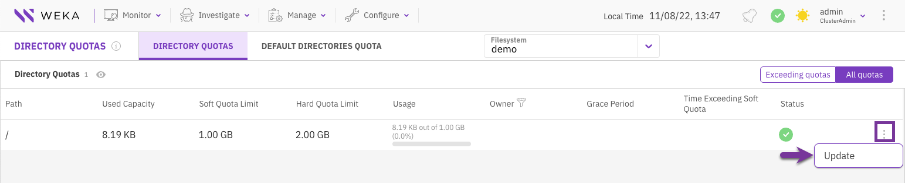
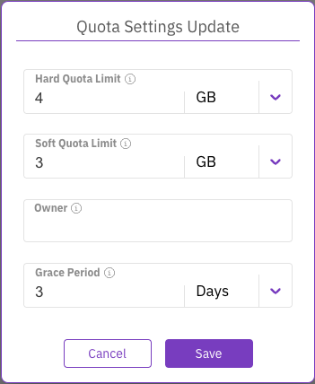
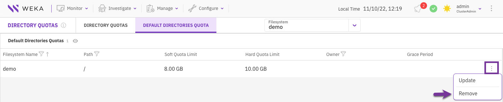

# Manage quotas using the GUI

Directory quotas monitor the filesystem capacity usage by a directory and allow restricting the amount of space used by the directory.

Using the GUI, you can:

* [View directory quotas and default quota](manage-quotas-using-the-gui.md#view-directory-quotas-and-default-quota)
* [Update a directory quota or default quota](manage-quotas-using-the-gui.md#update-a-directory-quota-or-default-quota)
* [Remove the default quota for new directories](manage-quotas-using-the-gui.md#remove-the-default-quota-for-new-directories)

To set a new directory quota or default quota, use the CLI.

## View directory quotas and default quota

You can view existing directory quotas and the default quota that are already set.

**Procedure**

1. From the menu, select **Manage > Directory Quotas**.
2. Select the relevant tab: **Directory Quotas** or **Default Directories Quota**.
3. Select the filesystem in which the directory quotas are already set (through the CLI).
4. To view all quotas or only the exceeding quotas, select the **Exceeding quotas/All quotas** switch.

<figure><figcaption>
View directory quotas
</figcaption></figure>

## Update a directory quota or default quota

You can update an existing directory quota or the default quota for directories. Updating the default quota only applies to new directories.

**Procedure**

1. From the menu, select **Manage > Directory Quotas**.
2. Select the relevant tab: **Directory Quotas** or **Default Directories Quota**.
3. Select the filesystem in which the directory quotas are already set (through the CLI).
4. Select the three dots on the right of the required directory. From the menu, select **Update**.

<figure><figcaption>
Directory Quotas
</figcaption></figure>

3\. In the Quota Settings Update dialog, modify the following settings according to your needs:

* **Hard Quota Limit:** The hard quota limit defines the maximum used capacity above the soft quota limit, which prevents writing to the directory.
* **Soft Quota Limit:** The soft quota limit defines the maximum used capacity that triggers a grace period timer. Data can be written to the directory until the grace period ends or the hard quota limit is reached.
* **Owner:** The directory’s owner, such as user name, email, or slack ID (up to 48 characters).
* **Grace Period:** A grace period starts when the soft quota limit is reached. After this period, data cannot be written to the directory.

4\. Click **Save**.

<figure><figcaption>
Quota Settings Update
</figcaption></figure>

## Remove the default quota for new directories

You can remove the default quota settings for new directories created in a specific filesystem. The quota of existing directories is not affected.

**Procedure**

1. From the menu, select **Manage > Directory Quotas**.
2. Select the **Default Directories Quota** tab.
3. Select the filesystem in which the default quotas are already set (through the CLI).
4. Select the three dots on the right of the required default quota. From the menu, select **Remove**.
5. In the Default Quota Deletion message, select **Yes**.

<figure><figcaption>
Remove a default quota
</figcaption></figure>
