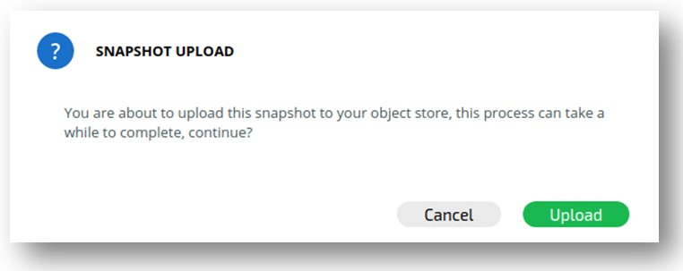
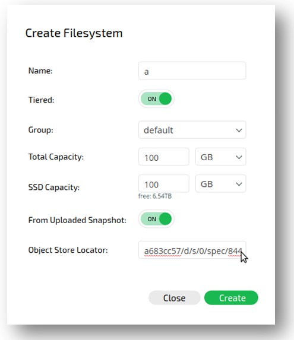

# Snap-To-Obj

## Uploading a Snapshot

#### Uploading a Snapshot Using the UI

To upload a snapshot to its filesystem's configured object store, in the main snapshot view screen, select the filesystem snapshot to be uploaded and click Upload To Object. The Snapshot Upload confirmation window will be displayed.

Click Upload to upload the snapshot to the object store.

#### Uploading a Snapshot Using the CLI

**Command:** TBD

Use the following command line to update an existing snapshot:

TBD

**Parameters in Command Line**

| **Name** | **Type** | **Value** | **Limitations** | **Mandatory** | **Default** |
| --- | --- | --- |
|  |  |  |  |  |  |
|  |  |  |  |  |  |

## Creating a Filesystem from an Uploaded Snapshot

#### Creating a Filesystem from a Snapshot Using the UI

To create a filesystem from an uploaded snapshot, switch the From Uploaded Snapshot field in the Filesystem Creation dialog box to On. The Create Filesystem dialog box is displayed.

Define all the fields and enter the location of the snapshot to be used in the Object Store Locator field.

#### Creating a Filesystem from a Snapshot Using the CLI

**Command:** TBD

Use the following command line to update an existing snapshot:

TBD

**Parameters in Command Line**

| **Name** | **Type** | **Value** | **Limitations** | **Mandatory** | **Default** |
| --- | --- | --- |
|  |  |  |  |  |  |
|  |  |  |  |  |  |

