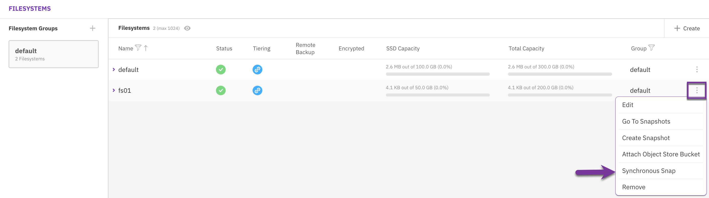
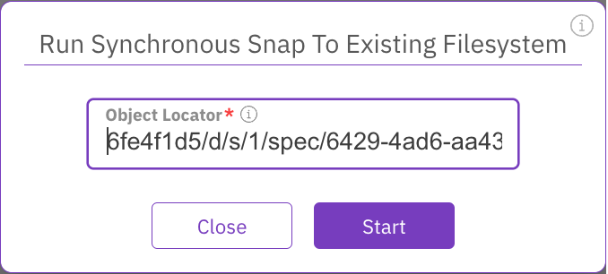

# Manage Snap-To-Object using the GUI

Using the GUI, you can:

* [Upload a snapshot](snap-to-obj.md#upload-a-snapshot)
* [Recover a filesystem from an uploaded snapshot](snap-to-obj.md#recover-a-filesystem-from-an-uploaded-snapshot)
* [Sync a filesystem from a snapshot](snap-to-obj.md#sync-a-filesystem-from-a-snapshot)

**Related topics**

To learn about how to view, create, update, delete, and restore snapshots, see [Manage snapshots using the GUI](../snapshots/snapshots.md).

## Upload a snapshot

You can upload a snapshot to a local, remote, or both object store buckets.

**Procedure**

1. From the menu, select **Manage > Snapshots**.
2. Select the three dots on the right of the required snapshot. From the menu, select **Upload To Object Store**.

3\. If a local or remote object store bucket is not attached to the filesystem, a relevant message\
&#x20;   appears. It enables opening a dialog to select an object store bucket and attach it to the\
&#x20;   filesystem. To add an object store, select **Yes**.

4\. In the Attach Object Store to Filesystem dialog, select the object store bucket to attach the\
&#x20;   snapshot.

4\. Select **Save**.\
&#x20;   The snapshot is uploaded to the target object store bucket.

6\. To copy the snapshot locator, select the three dots on the right of the required snapshot.\
&#x20;    From the menu, select **Copy Locator to Clipboard**. Then, save the locator in a dedicated file for\
&#x20;    a creating a filesystem from the uploaded snapshot.

****

**Related topics**

[#pause-resume-abort-a-background-task](../../usage/background-tasks.md#pause-resume-abort-a-background-task "mention")

## Recover a filesystem from an uploaded snapshot

You can recover (or recreate) a filesystem from an uploaded snapshot, for example, when you need to migrate the filesystem data from one location to another.

When recreating a filesystem from a snapshot, adhere to the following guidelines:

* **Pay attention to upload and download costs**: Due to the bandwidth characteristics and potential costs when interacting with remote object stores it is not allowed to download a filesystem from a remote object store bucket. If a snapshot on a local object store bucket exists, it is advisable to use that one, otherwise, follow the procedure in the [Recover from a remote snapshot](snap-to-obj.md#recover-from-a-remote-snapshot) topic.
* **Use the same KMS master key**: For an encrypted filesystem, to decrypt the snapshot data, use the same KMS master key as used in the encrypted filesystem. See the [KMS Management Overview](../../usage/security/kms-management/#overview) topic.

**Before you begin**

Verify that the locator of the required snapshot is available. If not, see the last step in the [Upload a snapshot](snap-to-obj.md#upload-a-snapshot) procedure for how to copy the locator to the clipboard.&#x20;

**Procedure**

1. From the menu, select **Manage > Filesystems**, and select **+Create**.
2. In the Create Filesystem, do the following:
   * Set the filesystem name, group, and tiering properties.
   * Select **Create From Uploaded Snapshot** (it only appears when you select **Tiering**).\
     In the Object Store Bucket Locator, paste the copied snapshot locator.\
     In the Snapshot Name, set a meaningful snapshot name to override the default (uploaded snapshot name).\
     In the Access Point, set a meaningful access point name to override the default (uploaded access point name) for the directory that serves as the snapshot's access point.
3. Select **Save**.&#x20;

## Sync a filesystem from a snapshot 

You can synchronize a filesystem from a snapshot using the Synchronous Snap feature.  Synchronous Snap downloads only the changes since the last snapshot from the object store bucket.


Only snapshots uploaded from version 4.0 or above can be downloaded using Synchronous Snap.


**Before you begin**

Copy the locator of the snapshot you want to sync with the filesystem.

**Procedure**

1. From the menu, select **Manage > Filesystems**.
2. From the Filesystems page, select the three dots of the filesystem you want to sync, and from the menu, select **Synchronous Snap**.

<figure><figcaption>
Filesystem menu: Synchronous Snap
</figcaption></figure>

3\. In the Run Synchronous Snap to Existing Filesystem dialog, paste the snapshot object locator.

4\. Select **Start**.\
&#x20;   The filesystem starts syncing with the snapshot.

<figure><figcaption>
Run synchronous snap to existing filesystem
</figcaption></figure>

5\. Once the sync is completed, restore the snapshot to update the production filesystem.

**Related topics**

[#add-a-filesystem](../managing-filesystems/managing-filesystems.md#add-a-filesystem "mention")
