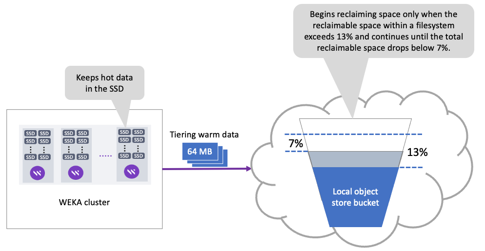

# Data management in tiered filesystems

## Overview

In tiered filesystems, the WEKA system optimizes storage efficiency and manages storage resources effectively by:

* Tiering only infrequently accessed portions of files (warm data), keeping hot data on SSDs.
* Efficiently bundling subsets of different files (to 64 MB objects) and tiering them to object stores, resulting in significant performance enhancements.
* Retrieving only the necessary data from the object store when accessing it, regardless of the entire object it was originally tiered with.
* Reclaiming logically freed data occurs when data is modified or deleted and is not used by any snapshots. Reclamation is a process of freeing up storage space that was previously allocated to data that is no longer needed.


Only data that is not logically freed is considered for licensing purposes.


## SSD space reclamation in tiered filesystems

For logically freed data that resides on the SSD, the WEKA system immediately deletes the data from the SSD, leaving the physical space reclamation for the SSD erasure technique.

## Object store space reclamation in tiered filesystems

Object store space reclamation is an important process that efficiently manages data stored on object storage.


In the WEKA system, object store space reclamation is only relevant for object store buckets used for tiering (`local`) and not for buckets used for backup only (`remote`).


WEKA organizes files into 64 MB objects for tiering. Each object can contain data from multiple files. Files smaller than 1 MB are consolidated into a single 64 MB object. For larger files, their parts are distributed across multiple objects. As a result, when a file is deleted (or updated and is not used by any snapshots), the space within one or more objects is marked as available for reclamation. However, the deletion of these objects only occurs under specific conditions.

Deleting related objects happens when all associated files are deleted, allowing for complete space reclamation within the object or during the reclamation process. Reclamation entails reading an eligible object from object storage and packing the active portions (representing data from undeleted files) with sections from other files that must be written to the object store. The resulting object is then written back to the object store, freeing up reclaimed space.

WEKA automates the reclamation process by monitoring the filesystems. When the reclaimable space within a filesystem exceeds 13%, the reclamation process begins. It continues until the total reclaimable space drops below 7%. This mechanism prevents write amplifications, allows time for higher portions of eligible 64 MB objects to become logically free, and prevents unnecessary object storage workload for small space reclamation. It's important to note that reclamation is only executed for objects with reclaimable space exceeding 5% within that object.


To calculate the amount of space that can be reclaimed, consider the following examples:

1. If we write 1 TB of data, and 15% of that space can be reclaimed, we have 150 GB of reclaimable space.
2. If we write 10 TB of data, and 5% of that space can be reclaimed, we have 500 GB of reclaimable space.

The starting point for the reclamation process differs in each example. In example 1, reclamation begins at 130 GB (13%), while in example 2, it doesn't start. This is important to note because even though there is more total reclaimable space in example 2, the process starts later.


For regular filesystems where files are frequently deleted or updated, this behavior can result in the consumption of 7% to 13% more object store space than initially expected based on the total size of all files written to that filesystem. When planning object storage capacity or configuring usage alerts, it's essential to account for this additional space. Remember that this percentage may increase during periods of high object store usage or when data/snapshots are frequently deleted. Over time, it will return to the normal threshold as the load/burst is reduced.


If the filesystem was created from a snapshot, only the data uploaded to the object store after the new filesystem was created can be reclaimed. Pre-existing data from the original snapshot is unreclaimable. To ensure all data is reclaimable, migrate the restored filesystem to a new bucket. For details, see [attaching-detaching-object-stores-to-from-filesystems](../attaching-detaching-object-stores-to-from-filesystems/ "mention").



If tuning of the system interaction with the object store is required, such as object size, reclamation threshold numbers, or the object store space reclamation is not fast enough for the workload, contact the Customer Success Team.


<figure><figcaption><p>Object store space reclamation</p></figcaption></figure>

### View object store bucket capacity details

Run the `weka fs tier capacity` command to retrieve a comprehensive listing of data capacities associated with object store buckets per filesystem.


If the filesystem was created from an uploaded snapshot, data from the original filesystem is not accounted for in the displayed capacity.


Example:

```
$ weka fs tier capacity
FILESYSTEM  BUCKET               TOTAL CONSUMED CAPACITY   USED CAPACITY   RECLAIMABLE%   RECLAIMABLE THRESHOLD%
bmrb        wekalow-bmrb         0 B                       0 B             0.00           10.00
cam_archive wekalow-archive      20.39 TB                  18.80 TB        7.79           10.00
nmr_backup  wekalow-nmrbackup    519.07 GB                 518.05 GB       0.19           10.00

```

To list the data capacities of a specific filesystem, add the option `--filesystem <filesystem name>`.

Example:

```
$ weka fs tier capacity --filesystem cam_archive
FILESYSTEM  BUCKET               TOTAL CONSUMED CAPACITY   USED CAPACITY   RECLAIMABLE%   RECLAIMABLE THRESHOLD%
cam_archive wekalow-archive      20.39 TB                  18.80 TB        7.79           10.00

```

## Object tagging

When WEKA uploads objects to the object store, it assigns tags to categorize them. These tags are crucial because they enable the customer to implement specific lifecycle management rules in the object store based on the assigned tags.

For example, you can transfer objects of a specific filesystem when interacting with [S3 Glacier Deep Archive](https://aws.amazon.com/s3/storage-classes/glacier/instant-retrieval/).

To enable upload tags, set it when adding or updating the object store bucket. For details, see the following:

* Using the GUI: [#add-an-object-store-bucket](../managing-object-stores/managing-object-stores.md#add-an-object-store-bucket "mention") or [#edit-an-object-store-bucket](../managing-object-stores/managing-object-stores.md#edit-an-object-store-bucket "mention") by selecting **Enable Upload Tags** in the Advanced section.
* Using the CLI: [#add-an-object-store-bucket](../managing-object-stores/managing-object-stores-1.md#add-an-object-store-bucket "mention") or [#edit-an-object-store-bucket](../managing-object-stores/managing-object-stores-1.md#edit-an-object-store-bucket "mention") by setting the `enable-upload-tags` parameter in `weka fs tier s3 add/update` commands.

The following table indicates the additional tags WEKA adds to the object when using object tagging:

<table><thead><tr><th width="212">Tag</th><th>Description</th></tr></thead><tbody><tr><td><code>wekaBlobType</code></td><td><p>The WEKA-internal type representation of the object.</p><p>Possible values:  </p><p><code>DATA</code>, <code>METADATA</code>, <code>METAMETADATA</code>, <code>LOCATOR</code>, <code>RELOCATIONS</code></p></td></tr><tr><td><code>wekaFsId</code></td><td>A unique filesystem ID (a combination of the filesystem ID and the cluster GUID).</td></tr><tr><td><code>wekaGuid</code></td><td>The cluster GUID.</td></tr><tr><td><code>wekaFsName</code></td><td>The filesystem name that uploaded this object. </td></tr></tbody></table>

The object store must support S3 object-tagging and might require additional permissions to use object tagging.

For example, the following extra permissions are required in AWS S3:

* `s3:PutObjectTagging`&#x20;
* `s3:DeleteObjectTagging`


Additional charges may apply by your cloud service provider.

