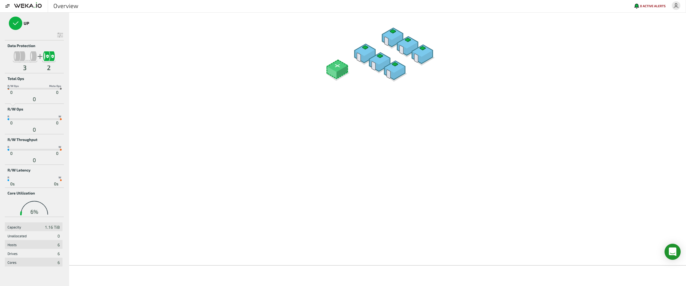
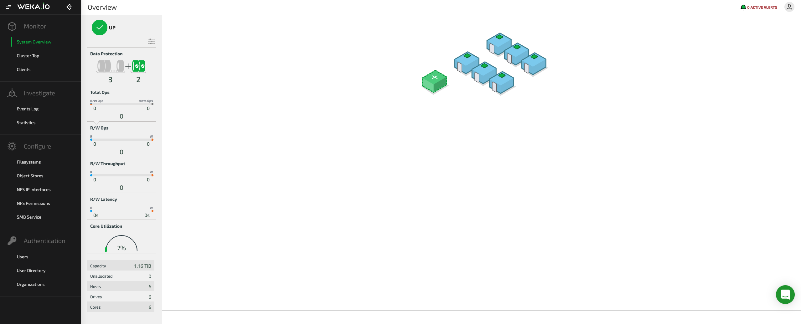

# GUI Overview

The Weka system GUI is accessible through one of the servers on port 14000.

On AWS installations via the self-service portal, the Weka system GUI can be accessed by going to the Outputs tab of the CloudFormation stack and clicking the GUI link.

After logging in, the Weka dashboard is displayed.

The dashboard enables the viewing of information on the backend host configuration and topology, system alerts, and some important statistics.

Clicking the top-left button next to the WEKA.IO logo opens a menu bar containing all possible system operations.

From the menu bar, it is possible to view [statistics](../usage/statistics/) and [events](../usage/events/), manage [filesystems](../fs/managing-filesystems/), configure [NFS](../additional-protocols/nfs-support.md) and [SMB](../additional-protocols/smb-support/smb-management-using-the-gui.md) services, and manage system [security](../usage/user-management.md) aspects.


**Note:** It is highly advised to set HTTPS access only \(the Weka system allows using only TLS 1.2 and higher with at least 128-bit ciphers\).

 Use the `weka security tls set` CLI command. The command receives an unencrypted private key.

For example, you can create a self-signed certificate using the following OpenSSL command:`openssl req -x509 -newkey rsa:1024 -keyout key.pem -out cert.pem -days <days> -nodes`



**Note:** To control which hosts can serve UI, use the `weka security ui` commands. Currently, it is possible to not serve UI from clients.


